# 金融数据分析：P12：2-股票池筛选

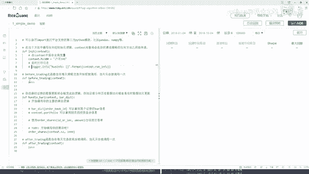

在本节课程中，我们将学习如何使用Python进行股票池的筛选。我们将基于财务指标（如营业收入）对沪深300指数成分股进行排序和筛选，最终选取排名靠前的股票构建一个精简的投资组合。整个过程涉及数据查询、条件过滤和排序等核心操作。

## 策略初始化与股票池设定

上一节我们介绍了量化策略的基本框架，本节中我们来看看如何设定初始的股票池。

在策略的构造函数中，我们需要定义我们感兴趣的股票范围。这里，我们选择沪深300指数作为我们的初始股票池。你可以使用指数名称或代码来指定。

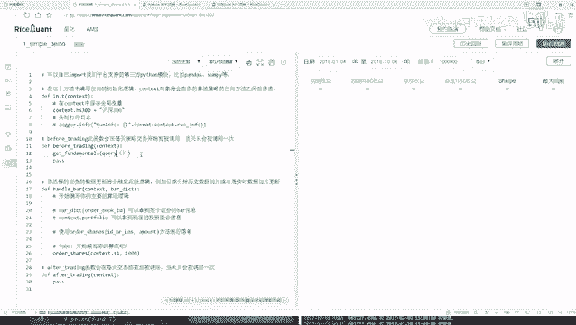

```python
def initialize(context):
    # 设定初始股票池为沪深300指数成分股
    context.stock_pool = index_stocks('沪深300')
```

打印信息的代码可以移除，因为我们后续将通过其他方式查看筛选结果。

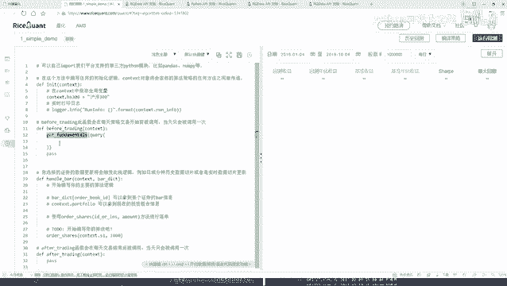

## 数据预处理与财务指标查询

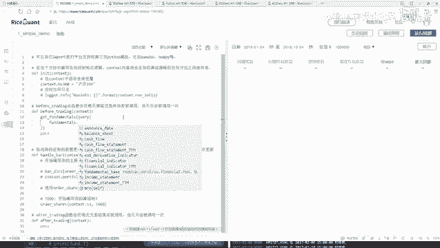

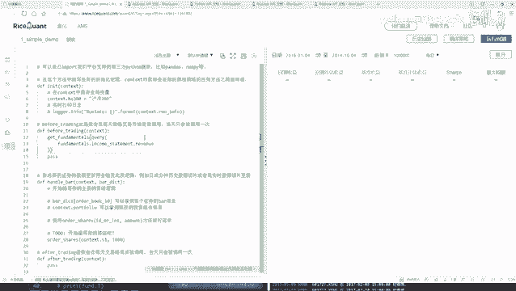

在交易日开始前，我们需要对股票池进行预处理，即根据财务数据筛选出符合条件的股票。这本质上是一个数据挖掘过程。

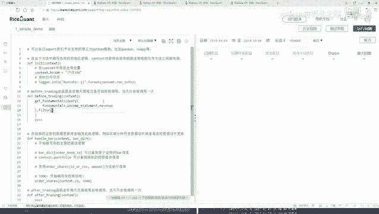

以下是实现这一步骤的关键操作：

首先，我们需要查询所需的财务指标。量化平台通常提供详细的帮助文档，其中列出了所有可用的查询函数和指标字段。对于此例，我们将查询“营业总收入”这一基础财务数据。

我们使用 `get_fundamentals` 函数进行查询。该函数需要一个 `query` 对象来指定查询内容，并可通过 `filter` 进行条件过滤。

```python
def before_trading_start(context):
    # 构建查询：获取营业总收入指标
    q = query(
        fundamentals.financial_indicator.operating_revenue
    ).filter(
        # 过滤条件：股票代码必须在我们的股票池中
        fundamentals.financial_indicator.code.in_(context.stock_pool)
    ).order_by(
        # 按营业总收入降序排列
        fundamentals.financial_indicator.operating_revenue.desc()
    ).limit(
        # 限制只取前10名
        10
    )
    
    # 执行查询，结果是一个DataFrame
    context.filtered_stocks = get_fundamentals(q)
    
    # 打印查看结果（实际运行时可能需注释掉以避免过多日志）
    print(context.filtered_stocks)
```

这段代码的核心逻辑是：从沪深300成分股中，查询每只股票的营业总收入，然后按照收入从高到低排序，最后只保留排名前10的股票。

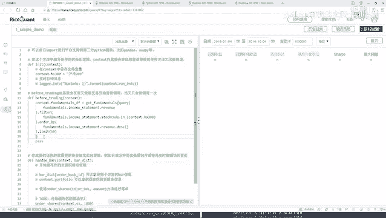

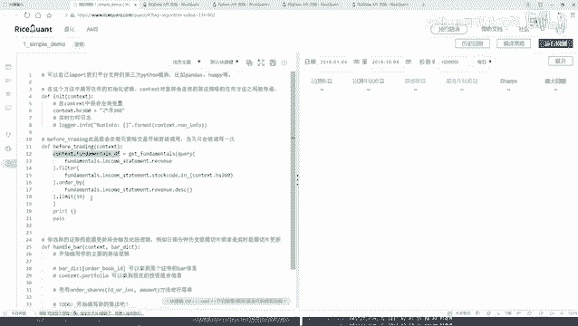

## 代码调试与问题排查

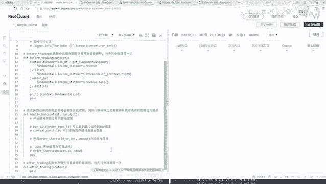

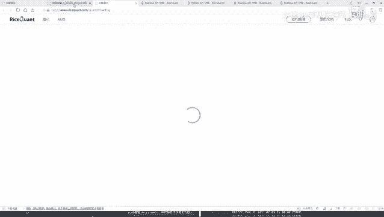

在编写和运行策略时，遇到问题是常见的。关键在于学会查看日志和排查错误。

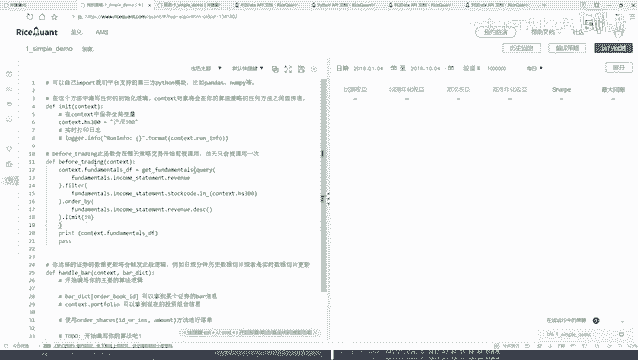

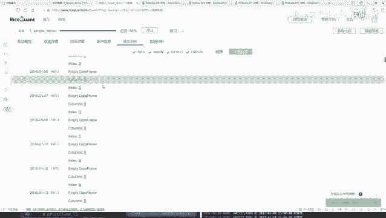

我们首次运行上述代码时，打印出的结果可能是空的。这通常意味着查询条件未能匹配到任何股票。

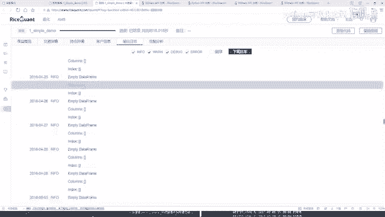

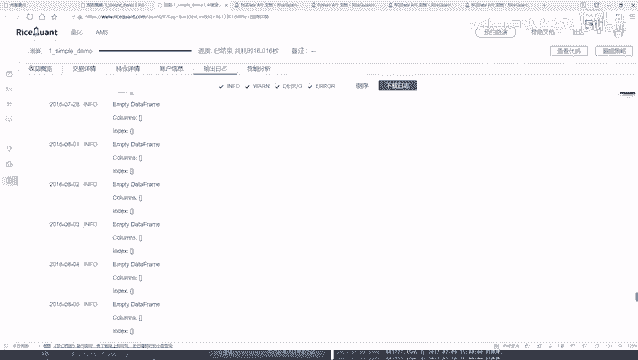

问题可能出在股票池的定义上。我们最初可能错误地在股票列表中查找指数代码。修正方法是使用 `index_stocks(‘沪深300’)` 来正确获取指数成分股列表。

修正后再次回测，观察输出日志。现在，日志中应该会按交易日打印出筛选出的股票DataFrame。DataFrame的索引是日期，列是股票代码，值是对应的营业总收入。

## 总结

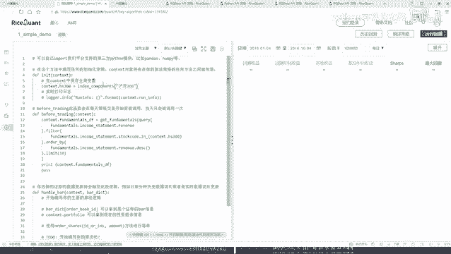

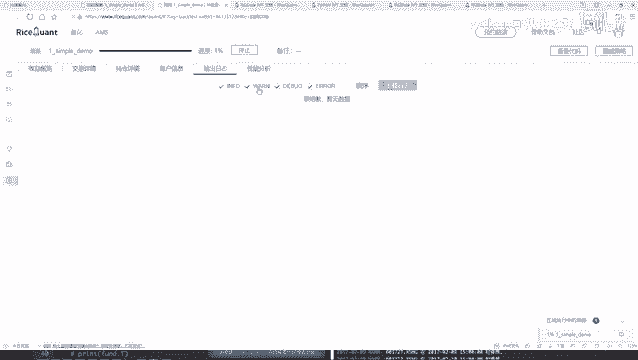

本节课中我们一起学习了股票池筛选的基本流程。

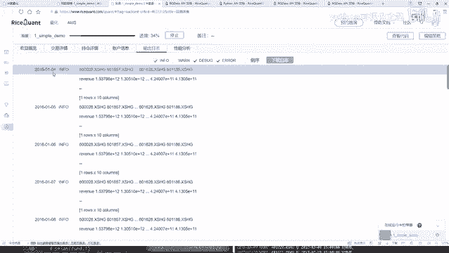

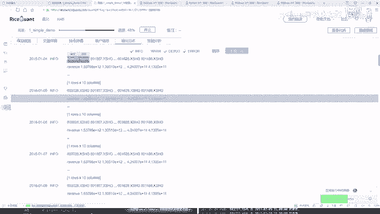

我们首先在策略初始化时设定了基础的股票池（沪深300指数）。然后，在 `before_trading_start` 函数中，我们利用 `get_fundamentals` 接口，通过指定查询指标、设置过滤条件（股票属于池子）、排序（按营收降序）和限制数量（前10名），动态地筛选出了每天需要关注的股票列表。

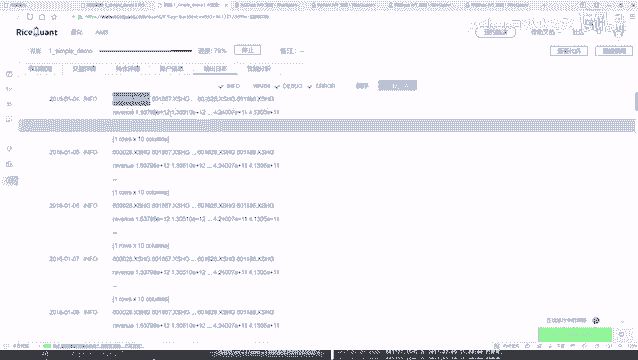

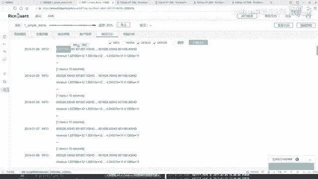

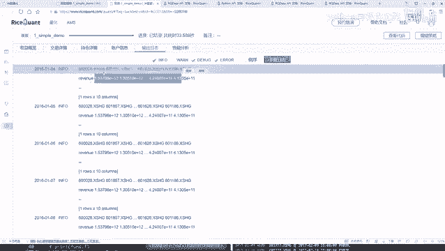

这个过程展示了量化交易中数据驱动的决策方式：从海量数据中，根据明确的规则，高效地提取出关键信息，为后续的交易逻辑提供输入。掌握这种数据查询与处理能力，是构建更复杂策略的基础。