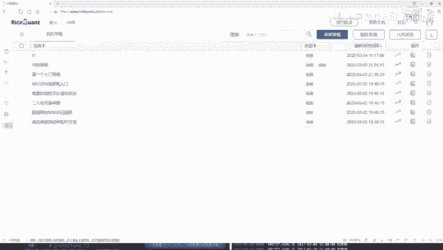
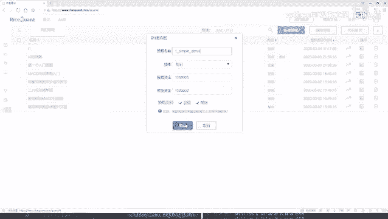
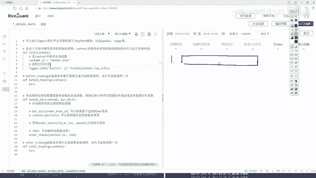
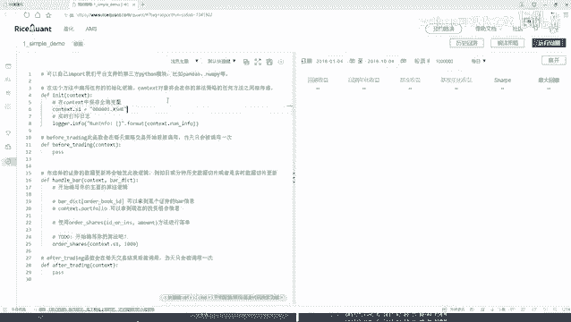

# 金融数据分析：P4：1-策略任务分析 📊



在本节课中，我们将学习如何在一个交易平台上构建一个简单的量化交易策略。我们将通过一个具体的任务来熟悉平台的基本API和策略开发流程。这个任务的核心是：从沪深300指数成分股中，始终持有表现最好的10只股票。



## 策略概述与目标 🎯

我们的目标是构建一个动态选股策略。具体来说，我们希望从沪深300指数的300只成分股中，定期（例如每天）筛选出基于某个财务指标（如盈利能力）表现最好的10只股票，并调整我们的投资组合，使其始终持有这最新的“前十名”股票。

上一节我们介绍了策略的整体目标，本节中我们来看看实现这个目标需要哪些具体的步骤和模块。

## 策略实现步骤分解 🔧



为了实现上述目标，我们需要在交易平台提供的策略框架内完成几个关键步骤。以下是实现该策略的核心流程：

1.  **初始化股票池**：在策略初始化阶段，获取沪深300指数的全部成分股列表。
2.  **每日筛选股票**：在每个交易日开始前，计算所有成分股的特定财务指标，并据此排序，选出排名前十的股票。
3.  **执行交易逻辑**：在交易时段，根据最新的“前十名”股票列表，调整当前持仓，卖出不在新列表中的股票，买入新列表中尚未持有的股票。

接下来，我们将详细探讨每个步骤在代码框架中对应的位置。

## 代码框架与模块分工 💻

交易平台通常为策略提供标准化的函数入口。理解每个函数的作用和调用时机是成功编写策略的关键。

以下是策略代码中三个主要函数模块及其分工：

*   **`initialize` (初始化函数)**：此函数在策略启动时仅运行一次。我们将在这里完成第一步工作：获取并设置沪深300指数的成分股作为我们的初始股票池。
*   **`before_trading` (盘前处理函数)**：此函数在每个交易日开始前自动运行。我们将在这里完成第二步工作：获取股票池中所有股票的财务数据，进行计算和排序，得到当日的“前十名”股票列表。
*   **`handle_bar` (交易处理函数)**：此函数在交易时段的每个时间点（如每分钟或每天）被调用。我们将在这里完成第三步，也是最核心的交易逻辑：比较当前持仓与最新的“前十名”列表，执行买卖操作以调整持仓。

上一节我们明确了各模块的分工，本节中我们来看看每个模块内部具体需要实现哪些逻辑。

## 核心逻辑详解 🧠

让我们深入到每个函数，构思其内部需要编写的具体逻辑。

### 1. 初始化函数 (`initialize`)

在此函数中，我们需要获取策略的“原料”——股票池。这通常通过调用平台API实现。

```python
def initialize(context):
    # 获取沪深300指数成分股，并设置为策略的股票池
    context.stock_pool = get_index_stocks('000300.SH')
```

### 2. 盘前处理函数 (`before_trading`)

此函数负责每日的数据准备。我们需要查询财务数据，进行计算和筛选。

```python
def before_trading(context):
    # 从股票池中获取所有股票的财务数据（例如：净利润）
    fundamental_data = get_fundamentals(query(valuation).filter(valuation.code.in_(context.stock_pool)))
    
    # 按净利润从高到低排序
    sorted_stocks = fundamental_data.sort_values(by='net_profit', ascending=False)
    
    # 选取排名前十的股票代码，并保存到context中供交易函数使用
    context.top_10_stocks = sorted_stocks.head(10)['code'].tolist()
```

### 3. 交易处理函数 (`handle_bar`)

这是策略的大脑。我们需要在这里进行持仓比对并下达交易指令。

```python
def handle_bar(context, bar_dict):
    # 获取当前账户的所有持仓
    current_positions = list(context.portfolio.positions.keys())
    
    # 找出需要卖出的股票：当前持有但不在最新前十名单中的股票
    stocks_to_sell = [s for s in current_positions if s not in context.top_10_stocks]
    for stock in stocks_to_sell:
        # 下达卖出指令（假设全部卖出）
        order_target_value(stock, 0)
    
    # 计算可用于购买新股票的资金（这里简化处理为平均分配）
    available_cash_per_stock = context.portfolio.cash / len(context.top_10_stocks)
    
    # 买入最新的前十名股票
    for stock in context.top_10_stocks:
        # 如果当前未持有该股票，则买入
        if stock not in current_positions:
            # 下达买入指令，购买一定金额的股票
            order_value(stock, available_cash_per_stock)
```

## 总结 📝



本节课中我们一起学习了如何为一个简单的量化交易策略进行任务分析和流程设计。我们定义了一个从沪深300中动态优选Top 10股票的策略，并将其实现分解为三个清晰的步骤：**初始化股票池**、**盘前数据筛选**和**盘中交易执行**。通过对应到策略框架的 `initialize`、`before_trading` 和 `handle_bar` 三个核心函数，我们勾勒出了每一部分需要完成的具体代码逻辑。这个过程是构建任何量化策略的基础：明确目标、分解步骤、对应到平台API。在接下来的课程中，我们将把这里的思路转化为实际可运行的代码。