# 金融数据分析：P6：1-股票数据获取 📈

在本节课中，我们将学习如何获取股票数据，这是进行金融数据分析和量化交易策略构建的第一步。我们将使用Python工具包来获取并初步处理股票数据，为后续的因子选股策略打下基础。

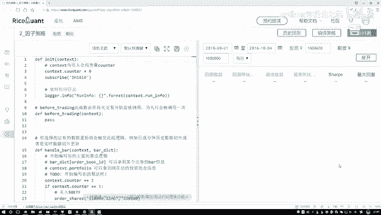

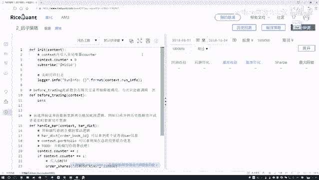

## 导入必要的工具包

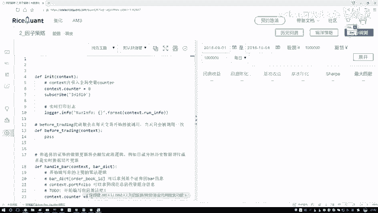

首先，我们需要导入一些在数据处理和分析中必不可少的Python库。这些库将帮助我们高效地获取、处理和分析股票数据。

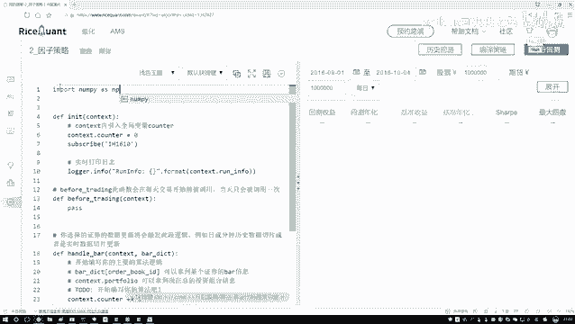

以下是需要导入的库：

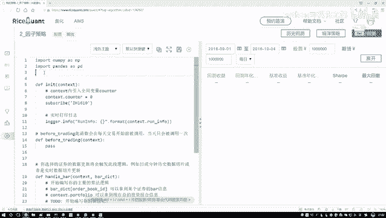

*   **numpy**：用于进行高效的数值计算。
*   **pandas**：用于数据处理和分析，是处理表格数据的核心工具。
*   **statsmodels**：一个用于统计建模和计量经济学的库，我们将使用它来进行回归分析，这在因子中性化处理中非常关键。

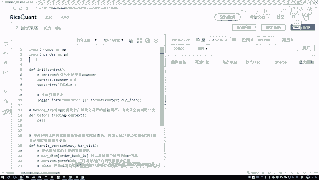

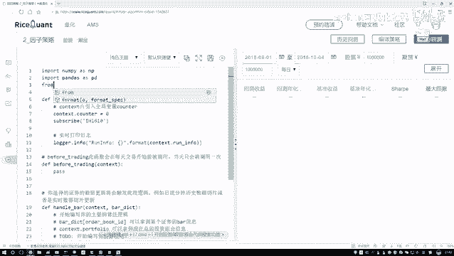

```python
import numpy as np
import pandas as pd
from statsmodels import regression
```

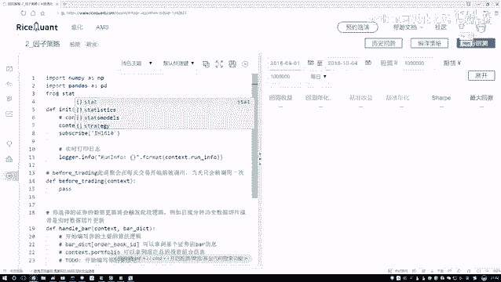

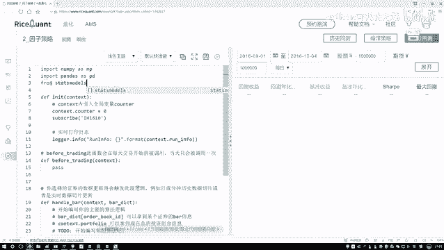

## 初始化策略模块

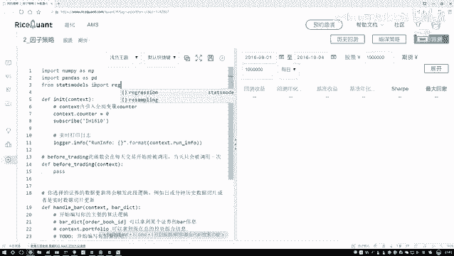

上一节我们介绍了所需的工具包，本节中我们来看看如何构建策略的初始化模块。这个模块将设定策略运行的基本参数和时间框架。

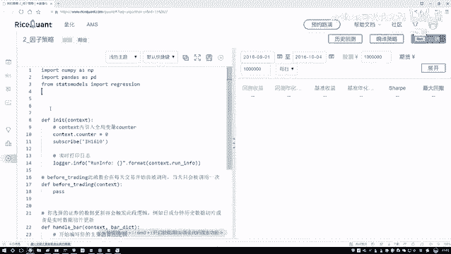

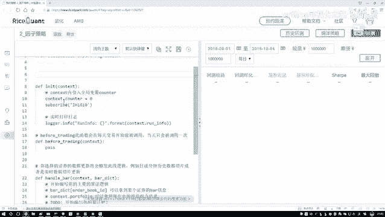

在量化策略中，我们需要设定一个调仓周期，即每隔多久重新评估并调整一次投资组合。过于频繁的调仓会增加交易成本，而周期太长则可能无法及时反映市场变化。因此，按月调仓是一个常见且合理的设定。

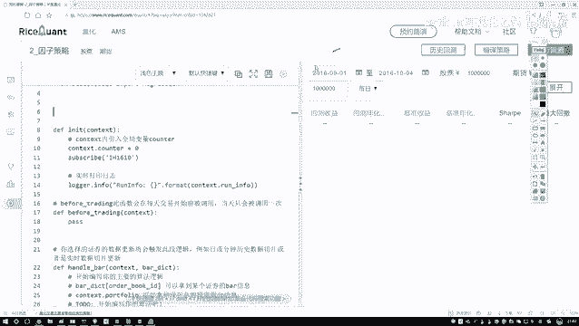

我们将定义一个名为 `REBALANCE` 的函数，它将在每个调仓周期（例如每月）被调用，执行选股和调仓逻辑。这个函数的具体内容我们将在后续步骤中填充。

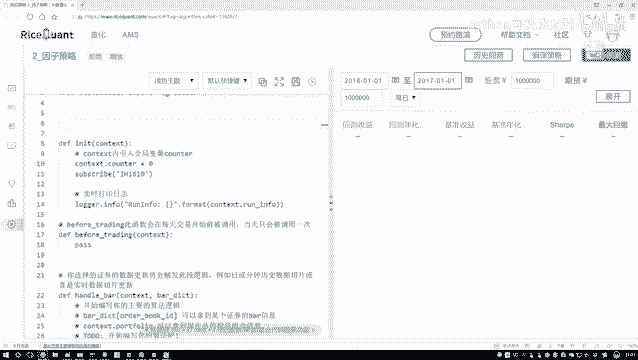

## 获取股票数据

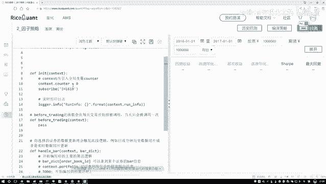

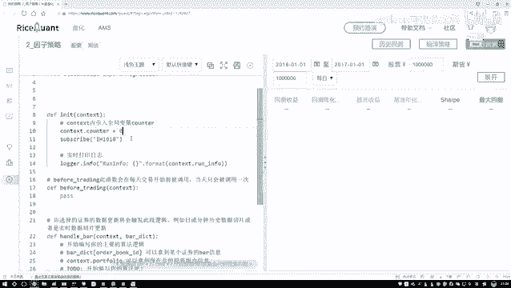

在 `REBALANCE` 函数内部，第一步是获取我们进行分析所需的股票数据。我们需要一个包含所有候选股票的“股票池”。

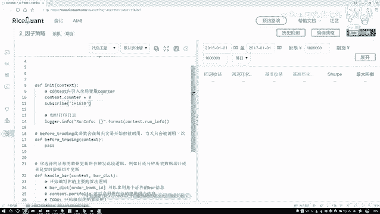


以下是获取股票数据的基本步骤：

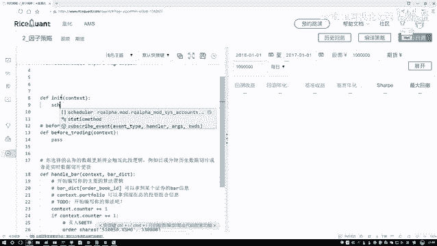

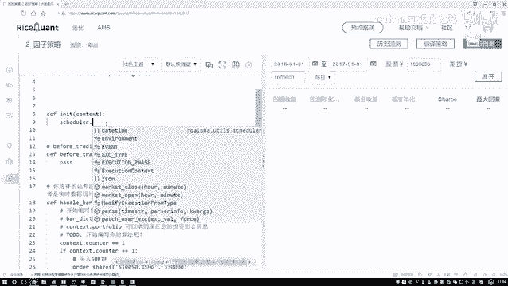

1.  调用数据接口的 `get_all_securities` 函数。
2.  指定参数 `type=‘CS’` 来获取所有普通股票的信息。
3.  该函数会返回一个包含所有股票代码及其基本信息的 `DataFrame`。

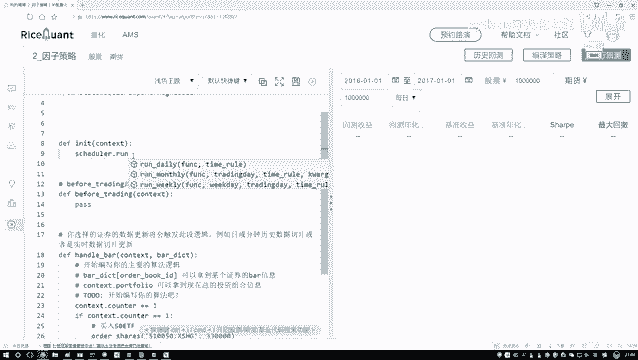

```python
# 示例：获取所有A股股票列表
all_stocks = get_all_securities(types=[‘CS’])
```

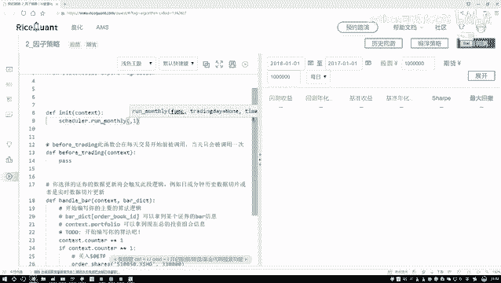


## 数据预处理与筛选


获取到所有股票数据后，我们通常不会直接使用全部股票。因为有些股票可能不符合我们的基本要求，例如上市时间太短、流动性差（交易量小）或者正处于特殊状态（如ST、*ST）。

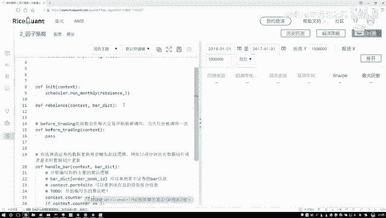

因此，在构建股票池时，我们需要对原始股票列表进行筛选。


以下是常见的筛选条件：

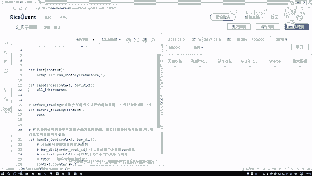

*   **上市时间**：剔除上市未满一定期限（如6个月或1年）的新股，以避免其价格波动的不稳定性。
*   **流动性**：剔除日均交易额过低的股票，确保策略在实际交易中能够顺利买卖。
*   **非ST股票**：剔除被特殊处理（ST）的股票，这类股票通常存在较高风险。

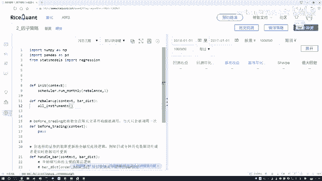

经过这些筛选步骤后，我们就得到了一个初步的、质量更高的候选股票池，可以用于后续的因子计算和选股策略。

## 总结

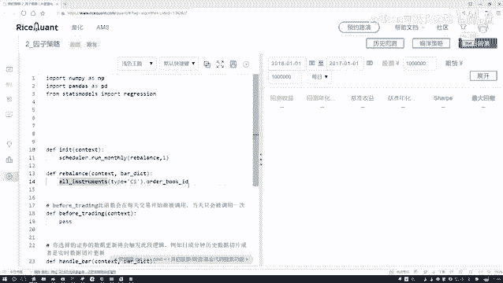

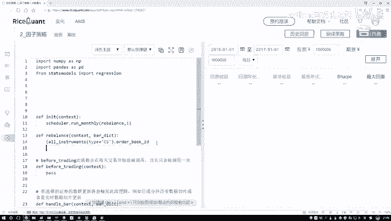

本节课中我们一起学习了量化策略中获取股票数据的基础流程。我们首先导入了 `numpy`、`pandas` 和 `statsmodels` 等核心工具包。然后，我们构建了策略的初始化框架，设定了按月调仓的周期。接着，我们使用 `get_all_securities` 函数获取了全市场的股票列表。最后，我们讨论了如何对原始股票列表进行预处理和筛选，以构建一个高质量的初始股票池，为下一阶段的因子分析和策略构建做好准备。