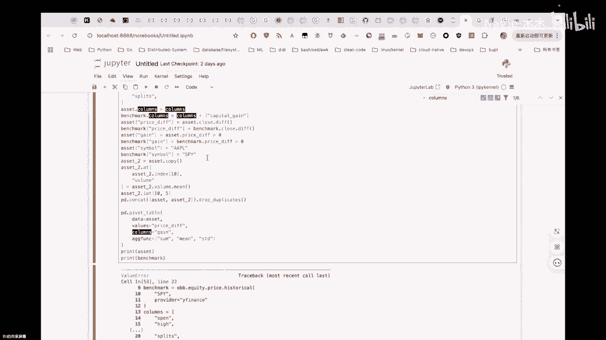
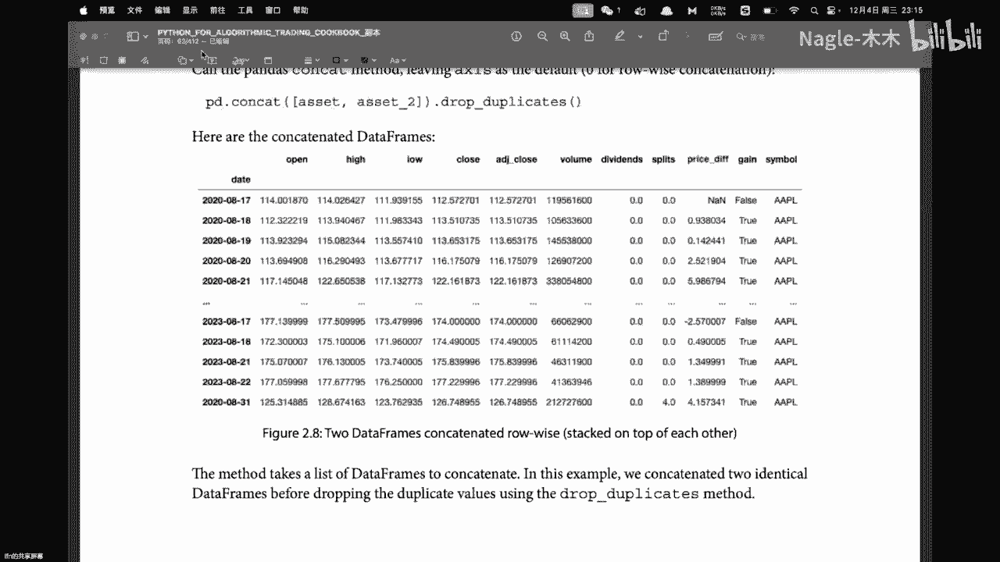
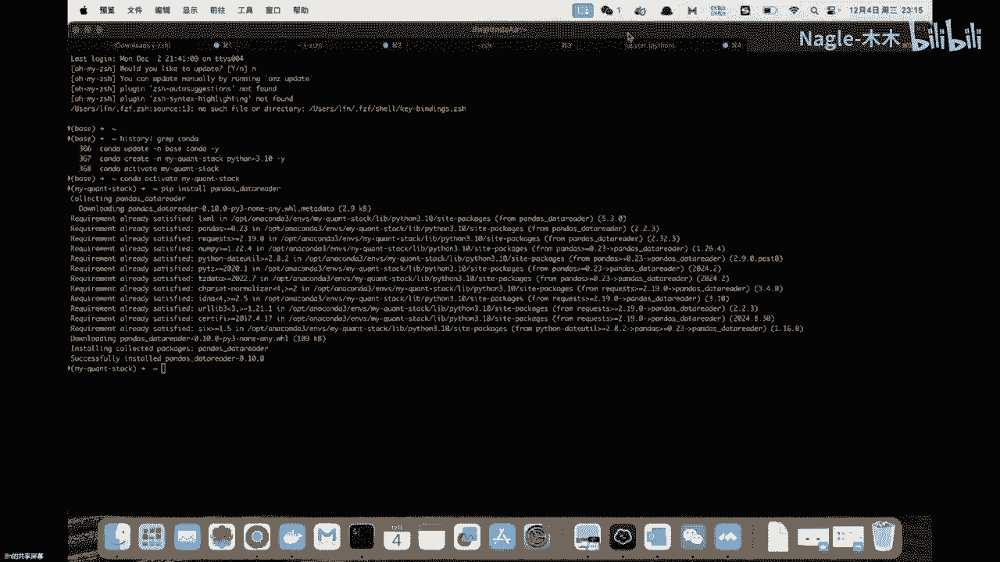
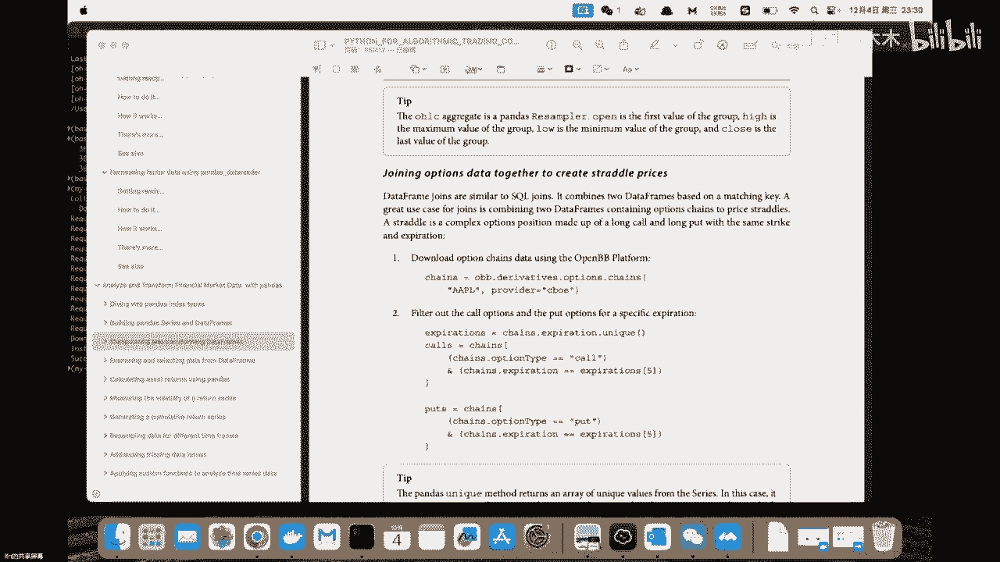
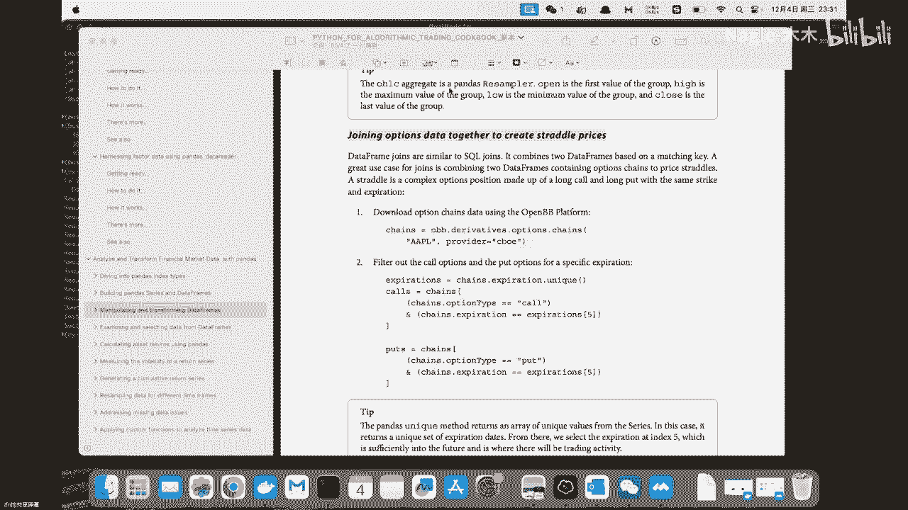

# Python for Trading：1：Pandas 数据处理基础


在本节课中，我们将学习如何使用 Pandas 库进行基础的金融数据处理。我们将涵盖数据读取、列的重命名与新增、数据聚合、数据透视以及数据合并等核心操作。这些技能是构建交易策略和分析市场数据的基础。

---

## 数据读取与列操作




首先，我们需要从数据源获取数据。在实际操作中，可能会遇到不同数据源列名或列数不一致的问题，因此需要进行标准化处理。

以下是处理数据列的基本步骤：

1.  **数据读取与列重命名**：从数据源（如 Yahoo Finance 或 CBOE）读取数据后，为了统一接口，我们可能需要将列名重命名为一套标准名称。例如，将 `‘Open’`, `‘High’`, `‘Low’`, `‘Close’` 等列进行标准化命名。这可以通过一个预定义的列名列表来实现。
    ```python
    standard_columns = [‘open’, ‘high’, ‘low’, ‘close’, ‘volume’, ‘dividend’]
    df = df.rename(columns=dict(zip(df.columns, standard_columns)))
    ```
    如果原始数据的列数与标准列数不匹配，此操作可能会失败，需要根据实际情况调整数据源或列名列表。

2.  **新增数据列**：我们可以基于现有列计算新列，或直接添加一个空列。例如，新增一列 `‘capital_gain’` 用于记录资本收益。
    ```python
    # 方法一：先添加空列，再赋值
    df[‘capital_gain’] = None
    # 方法二：直接计算并添加新列
    df[‘gain’] = df[‘close’] - df[‘open’]
    ```

上一节我们介绍了如何读取和重命名数据列，本节中我们来看看如何对数据进行更细致的修改和计算。

---

## 数据修改与聚合

在数据处理中，经常需要修改特定位置的值，或对整列数据进行聚合计算。

以下是修改与聚合数据的常用方法：

1.  **修改单个值**：使用 `.at` 方法可以根据行索引和列名定位并修改 DataFrame 中的单个值。例如，将 `‘volume’` 列第10行的值替换为该列的平均值。
    ```python
    mean_volume = df[‘volume’].mean()
    df.at[10, ‘volume’] = mean_volume
    ```

2.  **数据聚合**：Pandas 提供了多种聚合函数，如 `sum()`, `mean()`, `min()`, `max()`。这些函数可以对单列或多列数据进行计算，返回一个标量值或新的 Series。
    ```python
    total_volume = df[‘volume’].sum()
    average_close = df[‘close’].mean()
    ```

掌握了单个值的修改和简单聚合后，我们进一步学习如何按照特定条件对数据进行分组和透视分析。

---





## 数据透视与分组

数据透视和分组是强大的分析工具，可以帮助我们从不同维度观察数据。

以下是数据透视与分组的关键操作：

1.  **数据透视表**：`pivot_table` 函数可以根据一列的值作为行分类，另一列的值作为列分类，并对指定的数值列进行聚合计算。例如，我们有一个布尔列 `‘gain’`（表示当日是否盈利），我们可以基于它为 `True` 或 `False` 来分别计算 `‘price’` 列的统计值。
    ```python
    pivot_result = pd.pivot_table(df, values=‘price’, index=‘gain’, aggfunc=[‘sum’, ‘mean’, ‘std’])
    ```
    参数说明：
    *   `values`：指定要进行聚合计算的数值列。
    *   `index`：指定作为行分类的列（本例中是布尔列 `‘gain’`）。
    *   `aggfunc`：指定一个或多个聚合函数。

2.  **数据分组**：`groupby` 方法用于根据一个或多个键将数据拆分成组，然后对每个组应用函数。例如，根据股票代码 `‘symbol’` 进行分组，然后查看每只股票的收盘价序列。
    ```python
    grouped = df.groupby(‘symbol’)[‘close’]
    ```
    分组后，我们可以对每个组应用聚合函数（如 `mean()`）或进行其他转换。

数据透视和分组让我们能从整体数据中提取出有意义的模式。接下来，我们将学习如何将多个数据集合并在一起。

---

## 数据合并与连接

在分析中，经常需要将来自不同来源或不同条件的数据合并在一起。

以下是合并数据的主要方式：

1.  **连接重复数据**：`pd.concat` 函数可以沿行（axis=0）或列（axis=1）方向拼接多个 DataFrame。配合 `drop_duplicates` 方法可以去除完全重复的行。
    ```python
    combined_df = pd.concat([df1, df2], axis=0)
    unique_df = combined_df.drop_duplicates()
    ```

2.  **表连接**：类似于 SQL 的 JOIN 操作，Pandas 提供了 `merge` 函数。例如，将看涨期权（call）和看跌期权（put）的数据表，通过行权价（strike）进行左连接（left join）。
    ```python
    # 假设 call_df 和 put_df 都有 ‘strike_price’ 和 ‘last_trade_price’ 列
    merged_options = pd.merge(call_df, put_df, on=‘strike_price’, how=‘left’, suffixes=(‘_call’, ‘_put’))
    ```
    连接后，同名的列会通过后缀加以区分，例如 `‘last_trade_price_call’` 和 `‘last_trade_price_put’`。

---






本节课中我们一起学习了 Pandas 处理金融数据的基础操作。我们从数据读取和列操作开始，逐步深入到数据的修改、聚合、透视分组以及合并连接。理解这些操作是后续进行更复杂的金融数据分析和策略回测的基石。在实际应用中，务必注意数据源的差异，并灵活运用这些方法来清洗和转换数据，以满足分析需求。