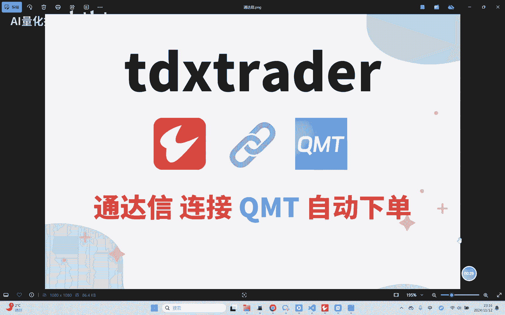
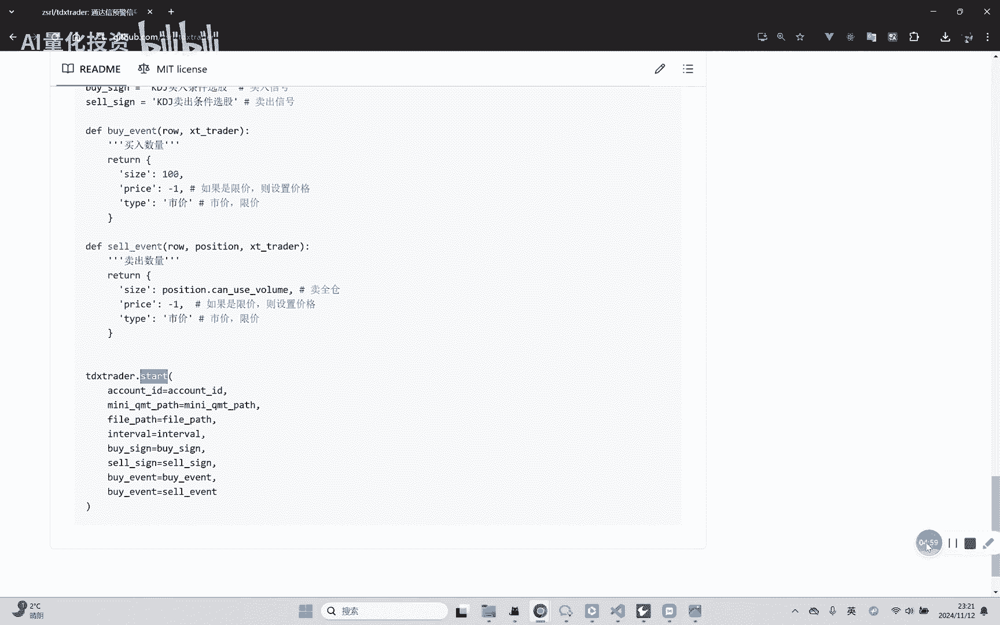
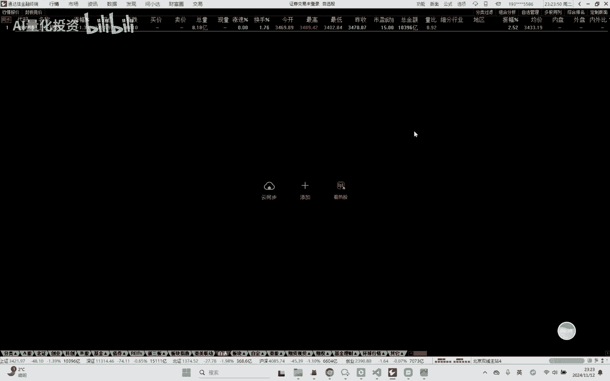
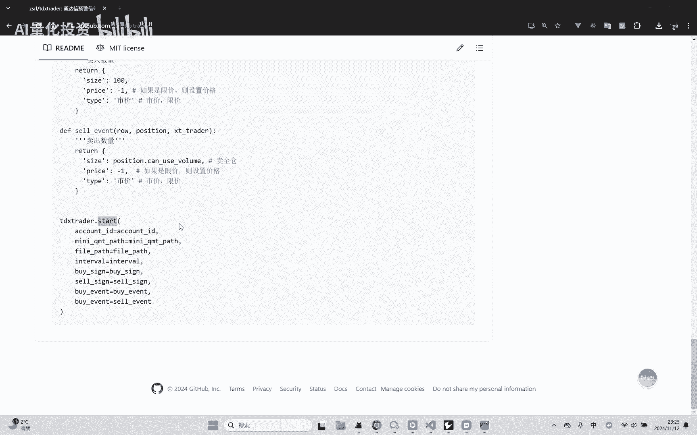
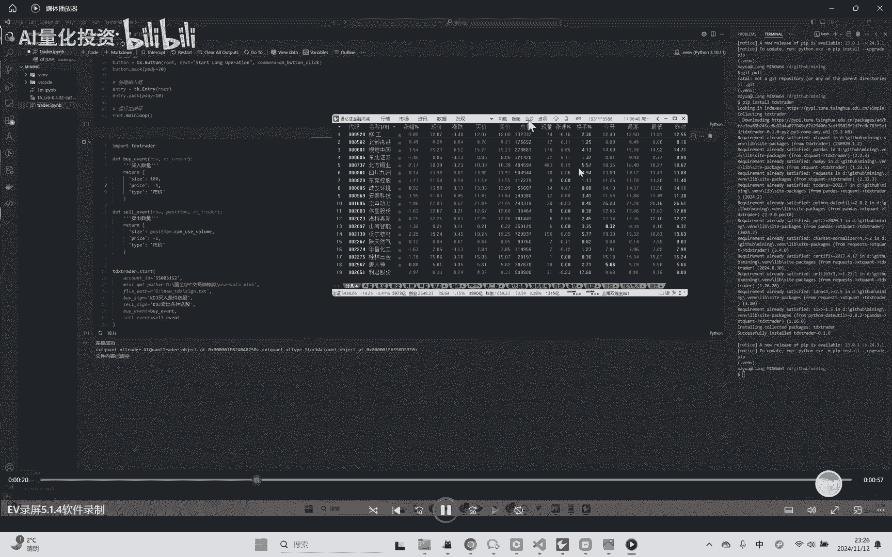
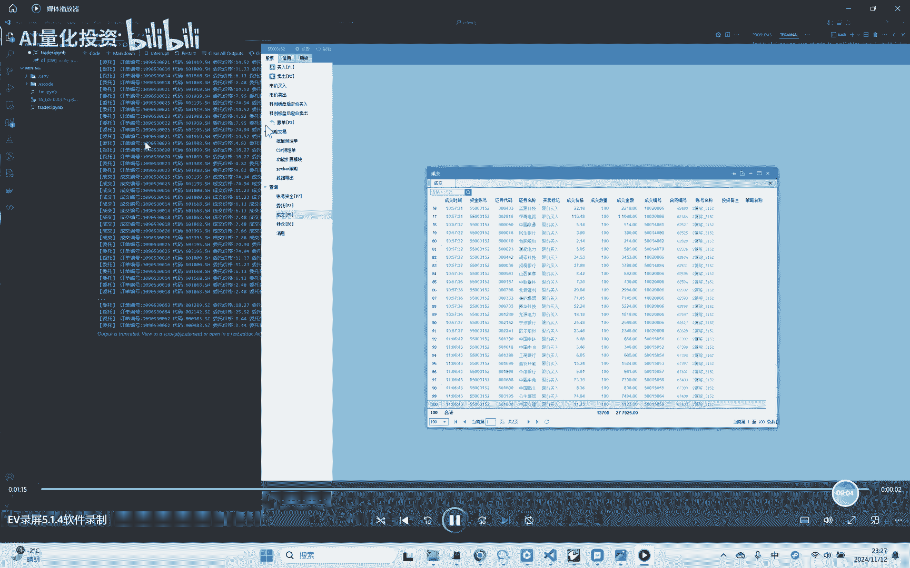
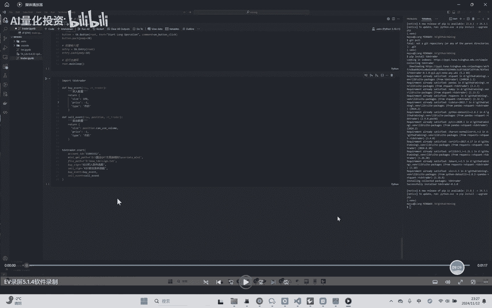
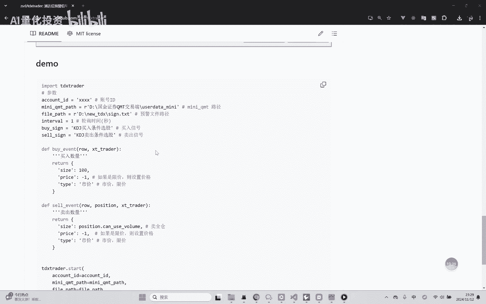

# 量化交易教程：P1：通达信连接QMT自动化下单 🚀



在本节课中，我们将学习如何使用一个名为 `tdxtrader` 的开源库，实现将通达信的预警信号与QMT交易终端连接，从而完成自动化下单。整个过程基于通达信的“条件预警”功能，通过监听预警文件的变化来触发QMT的委托操作。

## 原理概述 📖

上一节我们介绍了课程目标，本节中我们来看看其实现原理。核心思路是利用通达信软件内置的“条件预警”功能。该功能可以根据用户设定的公式，在满足条件时生成预警信号。关键点在于，通达信可以将这些预警结果输出到一个指定的文本文件中。

因此，我们的程序只需要持续监听这个文本文件的变化，读取新出现的预警信号，并将其解析为具体的交易指令（如买入或卖出），然后调用QMT的接口执行下单操作。`tdxtrader` 库封装了文件监听、信号解析以及与QMT交互的复杂过程。

## 环境准备与库安装 ⚙️

在开始使用之前，需要完成一些准备工作。首先，你需要在电脑上安装并配置好通达信和QMT终端。

以下是安装 `tdxtrader` 库的步骤：
*   打开命令行工具（如CMD或终端）。
*   使用 pip 命令进行安装：`pip install tdxtrader`

## 通达信端设置 🔧

程序运行依赖于通达信的正确配置。我们需要在通达信软件中进行一系列设置。

以下是具体的设置步骤：
1.  **设置预警公式**：在通达信软件中，你需要创建两个预警公式。一个用于模拟**买入信号**，另一个用于模拟**卖出信号**。这通常是你自己的交易策略转化成的选股公式。
2.  **启用文件输出**：
    *   进入 `功能` -> `预警与复盘` -> `条件预警设置`。
    *   在 `其它设置` 选项卡中，勾选 **“将预警结果输出到文件”**。
    *   系统会弹出一个文件路径，你需要在此路径下**手动创建一个文本文件**（例如 `signals.txt`），这个文件路径将在后续程序中使用。
3.  **添加预警品种与公式**：在条件预警设置中，添加你想要监控的股票品种，并将第1步设置好的买入和卖出公式添加到预警列表中。

## `tdxtrader` 库使用教程 💻



完成环境配置后，就可以编写Python程序来使用 `tdxtrader` 库了。库的核心是 `Trader` 类，它负责连接所有环节。

以下是核心代码框架与参数说明：

```python
from tdxtrader import Trader

# 1. 初始化交易器，设置必要参数
trader = Trader(
    qmt_account='你的QMT账号',      # 你的QMT资金账号
    qmt_path='D:/国金QMT交易端/bin', # 你的QMT安装路径下的bin目录
    file_path='D:/signals.txt',      # 通达信预警输出文件的路径
    poll_time=1,                     # 监听文件变化的轮询时间（秒），默认为1
    buy_signal='买入信号',           # 通达信中设置的买入预警公式名称
    sell_signal='卖出信号'           # 通达信中设置的卖出预警公式名称
)

# 2. 定义买入事件的处理函数
def on_buy_signal(stock_code):
    """
    当监听到买入信号时，此函数被调用。
    :param stock_code: 股票代码，例如 ‘300750.SZ’
    :return: (交易数量, 报价类型, 价格)
    """
    size = 100  # 交易数量，必须是100的整数倍
    order_type = ‘市价’  # 报价类型，可选 ‘市价’ 或 ‘现价’
    price = 1    # 如果order_type是‘市价’，此价格可设为1；若是‘现价’，则需填写具体价格
    return size, order_type, price



# 3. 定义卖出事件的处理函数
def on_sell_signal(position):
    """
    当监听到卖出信号时，此函数被调用。
    :param position: 持仓对象，包含股票代码、当前持仓数量等信息
    :return: (交易数量, 报价类型, 价格)
    """
    # 例如，卖出该股票的全部持仓
    size = position.volume
    order_type = ‘市价’
    price = 1
    return size, order_type, price



# 4. 绑定事件处理函数并启动监听
trader.on_buy = on_buy_signal
trader.on_sell = on_sell_signal
trader.start()  # 启动监听，程序将持续运行
```

**关键参数解释**：
*   `poll_time`: 程序检查预警文件是否更新的频率，单位是秒。数值越小，响应越快，但消耗资源也稍多。
*   `on_buy` / `on_sell`: 这两个是**回调函数**。当程序在预警文件中读到对应的信号时，会自动调用你定义的这两个函数。你可以在函数内部实现复杂的仓位计算和风控逻辑。
*   `size`: 委托数量，A股市场必须是 **100股** 的整数倍。
*   `order_type`: 委托类型。`‘市价’` 表示以当前市场最优价格成交；`‘现价’` 表示以你指定的 `price` 价格挂单。



## 操作流程演示与测试 🧪

程序编写完成后，需要按照正确的顺序启动各个组件，并进行充分测试。



以下是推荐的操作流程和测试建议：
1.  **启动顺序**：首先确保 **QMT终端** 已登录并正常运行。然后运行你的Python监听程序。最后，在通达信中**启动条件预警**功能。
2.  **模拟测试**：在投入实盘前，**务必使用QMT的模拟盘进行充分测试**。你可以在通达信中手动触发预警条件，观察程序是否能正确监听、解析并提交模拟委托。
3.  **监控日志**：关注程序运行日志、QMT的委托记录和成交记录，确保整个链路畅通无误。



## 风险提示与总结 ⚠️

本节课中我们一起学习了如何利用 `tdxtrader` 库桥接通达信与QMT，实现基于预警信号的自动化交易。

**重要总结与风险提示**：
*   **核心价值**：该库将复杂的通信和解析过程封装成简单API，使用者只需关注交易信号逻辑和风险控制。
*   **充分测试**：自动化交易系统必须经过严格的模拟盘测试，确保在各种市场情况下行为符合预期。
*   **风险自担**：本教程及 `tdxtrader` 库仅为技术分享，不构成任何投资建议。程序化交易风险极高，请谨慎评估并使用。
*   **开源反馈**：该库已在GitHub开源。使用中遇到问题，欢迎通过相关平台提交反馈。



投资有风险，入市需谨慎。请务必在完全理解系统运作机制并做好风控的前提下，审慎使用自动化交易工具。