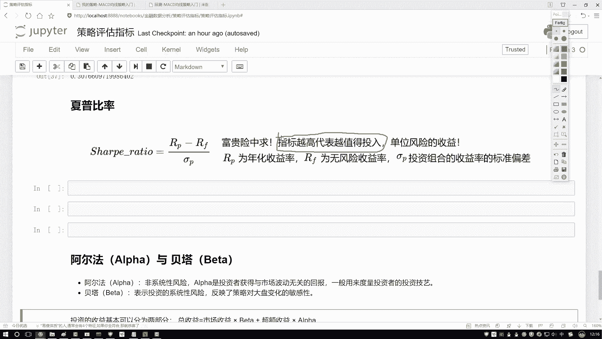
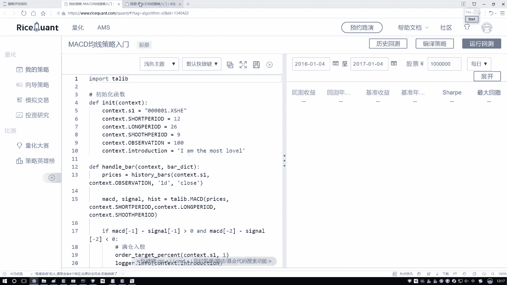
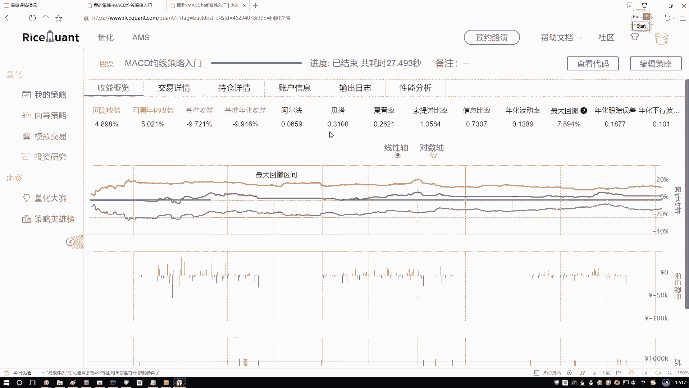
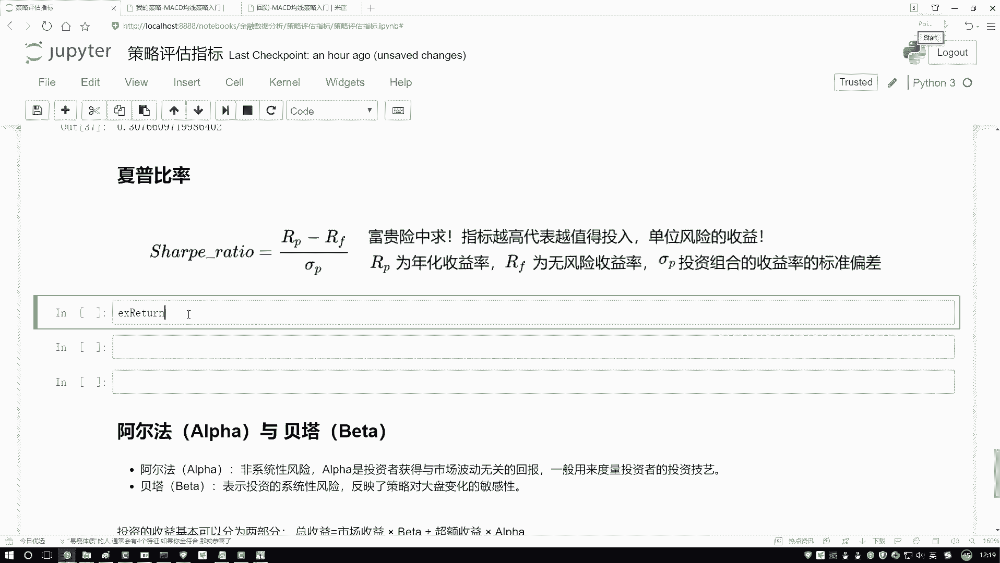
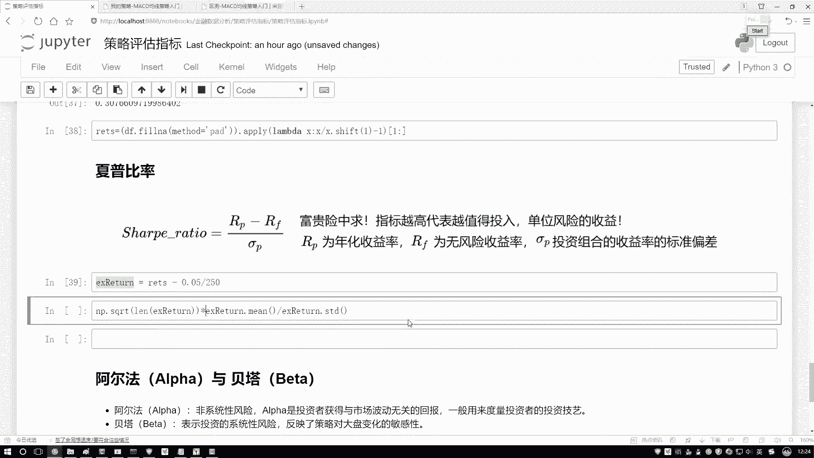
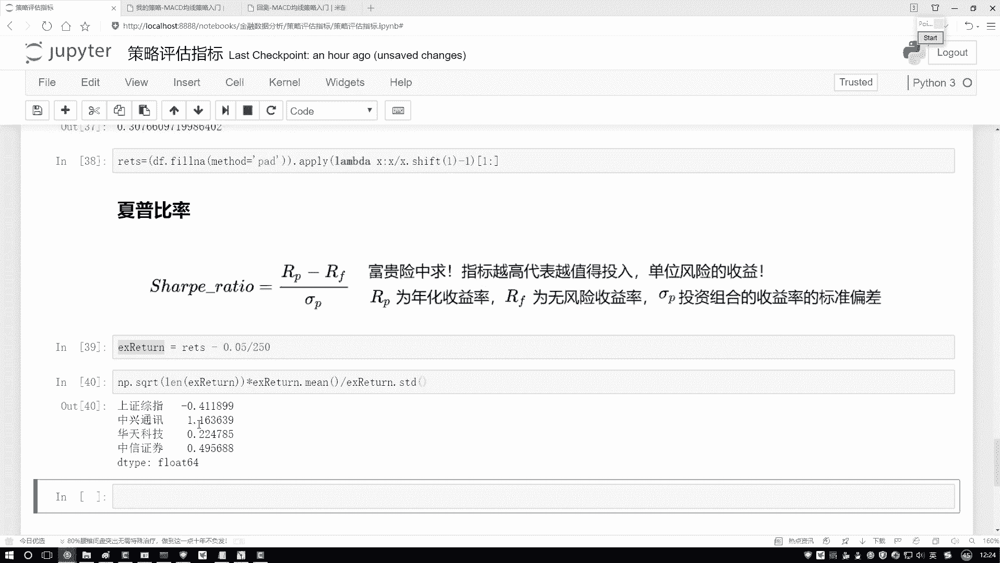
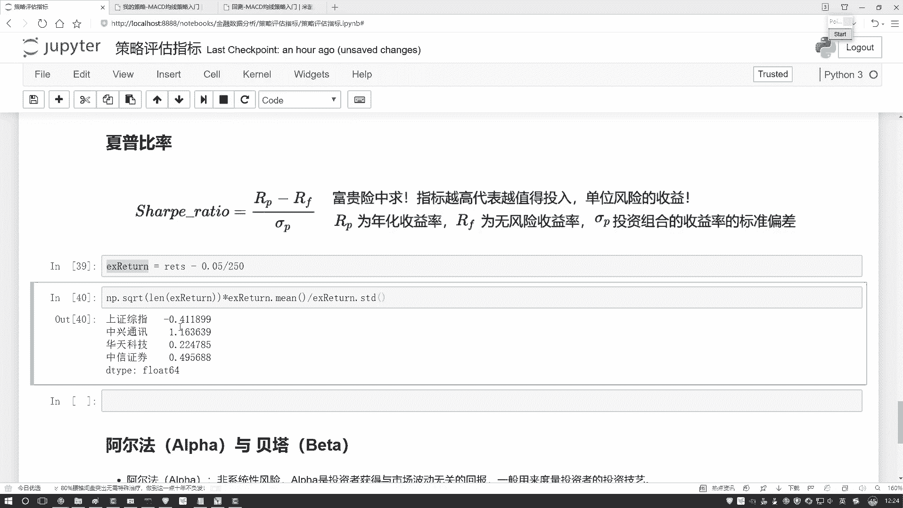
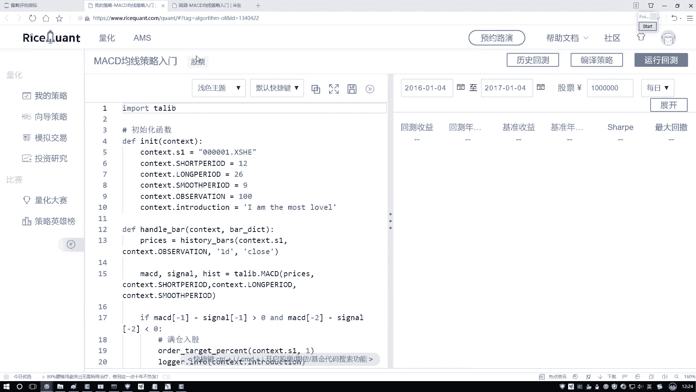
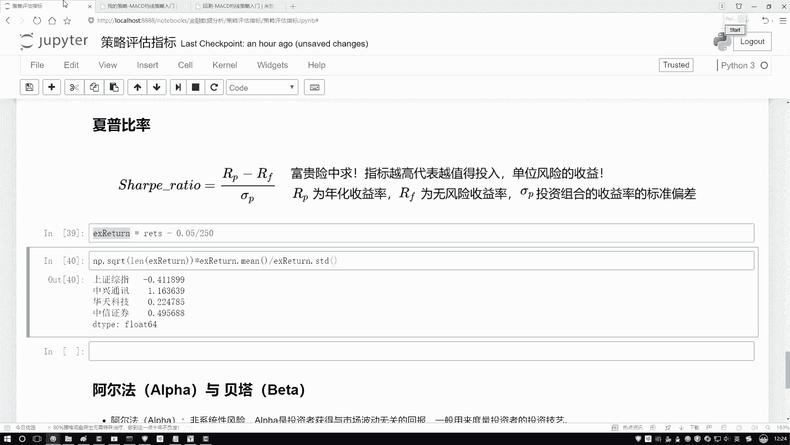

# Python金融量化实战：P15：04-4-夏普比率的作用 📈

在本节课中，我们将要学习一个在金融投资中至关重要的评估指标——夏普比率。我们将理解它的核心含义，并通过Python代码实际计算它，从而学会如何用它来比较不同投资策略或资产的优劣。

## 夏普比率的含义

上一节我们介绍了投资回报率，但高回报往往伴随着高风险。本节中我们来看看如何衡量“性价比”，即单位风险能带来多少超额收益。

夏普比率描述的就是这样一个指标：对于投资者承担的每一单位风险，能够获得多少超额回报。指标越高，意味着在承担相同风险的情况下，获得的补偿（收益）越高，投资“性价比”越好。

我们可以用一个生活中的例子来理解：一份在战乱地区日薪数万的工作，报酬虽高，但风险巨大。夏普比率就是用来评估，为了获得高收益，所承担的高风险是否“值得”。



## 夏普比率的计算公式



理解了其含义后，我们来看看夏普比率具体如何计算。它的核心思想是比较投资组合的收益与无风险收益的差异，再除以投资组合的风险（波动）。



其标准公式如下：

**Sharpe Ratio = (Rp - Rf) / σp**

其中：
*   **Rp**：投资组合的平均收益率。
*   **Rf**：无风险收益率（例如国债利率、银行定期存款利率）。
*   **σp**：投资组合收益率的标准差（代表风险或波动性）。

这个公式计算的是**每承担一单位风险（波动）所获得的超额收益（超过无风险收益的部分）**。

## 使用Python计算夏普比率

接下来，我们将在Python环境中，基于股票数据实际计算夏普比率。假设我们已经有了股票的历史日收益率数据。

以下是计算夏普比率的关键步骤：

1.  **准备数据**：确保收益率数据是完整的，对缺失值进行填充（例如用前一天的收益率填充）。
2.  **设定参数**：确定无风险收益率（例如年化5%）和年化交易日数（通常为250天）。
3.  **执行计算**：按照公式，计算超额收益的均值，再除以收益率的标准差，并进行年化处理。

```python
import numpy as np
import pandas as pd

# 假设 returns 是一个Pandas Series，包含了投资组合的日收益率序列
# 例如：returns = data['每日收益率']

# 步骤1: 填充缺失值（前向填充）
returns_filled = returns.fillna(method='ffill')



# 步骤2: 设定参数
risk_free_rate = 0.05  # 年化无风险收益率，设为5%
trading_days_per_year = 250  # 年化交易日数

# 步骤3: 计算夏普比率
# 计算日超额收益率（日收益率 - 日化无风险利率）
excess_daily_returns = returns_filled - risk_free_rate / trading_days_per_year

# 计算夏普比率（年化）
sharpe_ratio = np.sqrt(trading_days_per_year) * (excess_daily_returns.mean() / excess_daily_returns.std())

print(f"计算出的夏普比率为: {sharpe_ratio:.4f}")
```

运行以上代码后，我们可以得到一个具体的夏普比率数值。

## 如何解读夏普比率

计算完成后，我们需要知道如何解读这个数字。



*   **夏普比率 > 0**：表示投资组合的收益超过了无风险收益，数值越大越好。
*   **夏普比率 = 0**：表示投资组合的收益仅等于无风险收益。
*   **夏普比率 < 0**：表示投资组合的收益还不如无风险收益，承担风险没有获得正回报。



在实际选股或评估策略时，我们通常会计算多个股票或策略的夏普比率并进行比较。**夏普比率更高的股票或策略，意味着其风险调整后的收益更优，是更理想的选择**。



例如，假设我们计算了A、B、C三只股票的夏普比率分别为1.2、0.8和-0.3。那么，仅从该指标看，A股票是最佳选择，因为它为每单位风险提供了最高的回报补偿；C股票则最差，其风险未能带来正收益。



## 总结



本节课中我们一起学习了夏普比率这一核心金融指标。我们首先理解了它衡量“风险调整后收益”的本质，然后掌握了其计算公式 **`Sharpe Ratio = (Rp - Rf) / σp`**。最后，我们通过Python代码实战，学会了如何计算并解读夏普比率，从而能够用它来科学地比较不同投资选项的优劣。记住，在追求高收益的同时，用夏普比率评估一下背后的风险成本，是进行理性投资决策的关键一步。