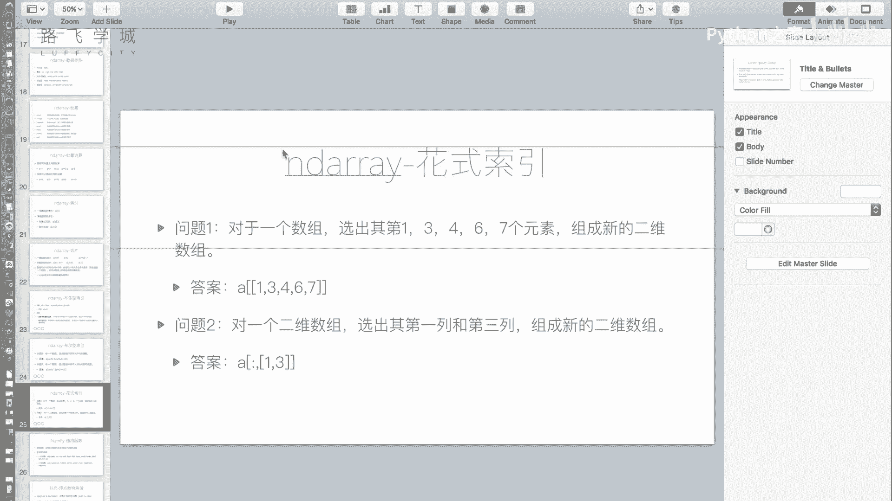
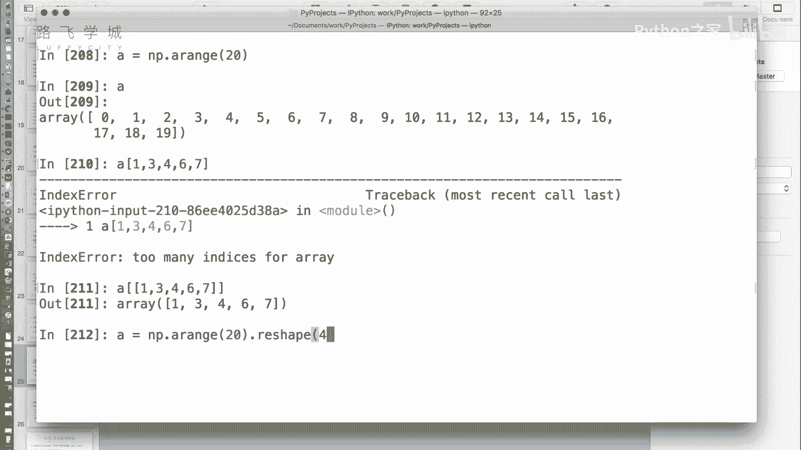

# 金融量化分析：P14：13 金融量化分析-numpy-array花式索引 🎯

在本节课中，我们将要学习NumPy数组的“花式索引”。这是一种非常灵活的数据选取方式，允许我们根据一个整数数组来选取数据，即使这些索引位置没有规律。我们将通过简单的例子，帮助你理解并掌握这种索引方法。




上一节我们介绍了布尔型索引，本节中我们来看看另一种强大的索引方式——花式索引。

## 什么是花式索引？ 🤔

花式索引的核心是：**使用一个整数数组来指定要选取的元素位置**。这与布尔型索引不同，后者使用布尔值数组进行筛选。

例如，对于一个数组，如果我们想选取第1、3、4、6、7号元素（注意：索引通常从0开始），这些位置没有特定的规律。使用花式索引，我们可以直接将这些索引号放入一个列表中来完成选取。

```python
import numpy as np
A = np.arange(20)  # 创建一个0到19的数组
indices = [1, 3, 4, 6, 7]  # 指定要选取的索引位置
result = A[indices]
print(result)  # 输出：[1 3 4 6 7]
```



## 花式索引在二维数组中的应用 📊

对于二维数组，索引规则同样适用。NumPy数组的索引可以通过逗号`,`分隔行和列，我们可以在逗号两侧灵活组合使用普通索引、切片、布尔索引和花式索引。


以下是几种常见的组合方式示例：

### 1. 常规索引 + 切片
选取第0行，第2到第4列（不包含第4列）的数据。
```python
A_2d = np.arange(20).reshape(4, 5)
# A_2d 是一个4行5列的数组
result = A_2d[0, 2:4]
```

### 2. 常规索引 + 布尔索引
选取第0行中，所有大于2的元素。
```python
row_0 = A_2d[0]  # 获取第0行
bool_mask = row_0 > 2  # 创建布尔掩码
result = A_2d[0, bool_mask]
```

### 3. 花式索引的注意事项 ⚠️
**一个重要限制是：逗号两侧不能同时使用花式索引。** 这种写法不会得到我们期望的行列组合，而是会解释为选取坐标`(1,1)`和`(3,3)`位置的值。

例如，我们想选取第1行&第3行 与 第1列&第3列 交叉的四个值（即位置(1,1), (1,3), (3,1), (3,3)）。
```python
# 错误的写法：这只会取出(1,1)和(3,3)两个值
wrong_result = A_2d[[1, 3], [1, 3]]
```

## 如何实现行列组合的花式选取？ 🛠️

如果需要同时按花式索引选取行和列，我们需要分步操作。

以下是实现选取第1、3行与第1、3列交叉值的正确步骤：

1.  **第一步：用花式索引选取指定的行，并选取所有列。**
    ```python
    step1 = A_2d[[1, 3], :]  # 选取第1行和第3行，所有列
    ```

2.  **第二步：在第一步结果的基础上，选取指定的列。**
    ```python
    final_result = step1[:, [1, 3]]  # 选取所有行，第1列和第3列
    ```
    也可以合并写成：
    ```python
    final_result = A_2d[[1, 3], :][:, [1, 3]]
    ```

## 总结 📝

本节课中我们一起学习了NumPy数组的“花式索引”。我们了解到：


*   **花式索引**允许我们使用一个整数列表来无规律地选取数组元素。
*   在二维数组中，可以通过逗号`,`分隔行和列的索引方式，并**混合使用**普通索引、切片、布尔索引和花式索引。
*   一个关键的注意事项是**避免在逗号两侧同时使用花式索引**，否则会产生非预期的结果。正确的做法是分步进行选取。


掌握花式索引能让你更灵活、更精确地操控数组中的数据，是进行复杂数据分析和处理的重要工具。