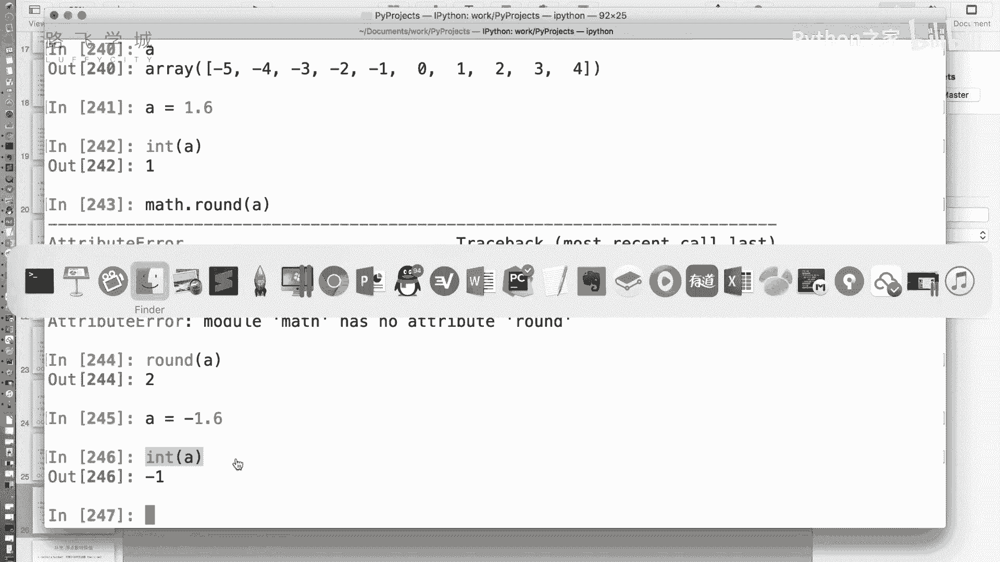
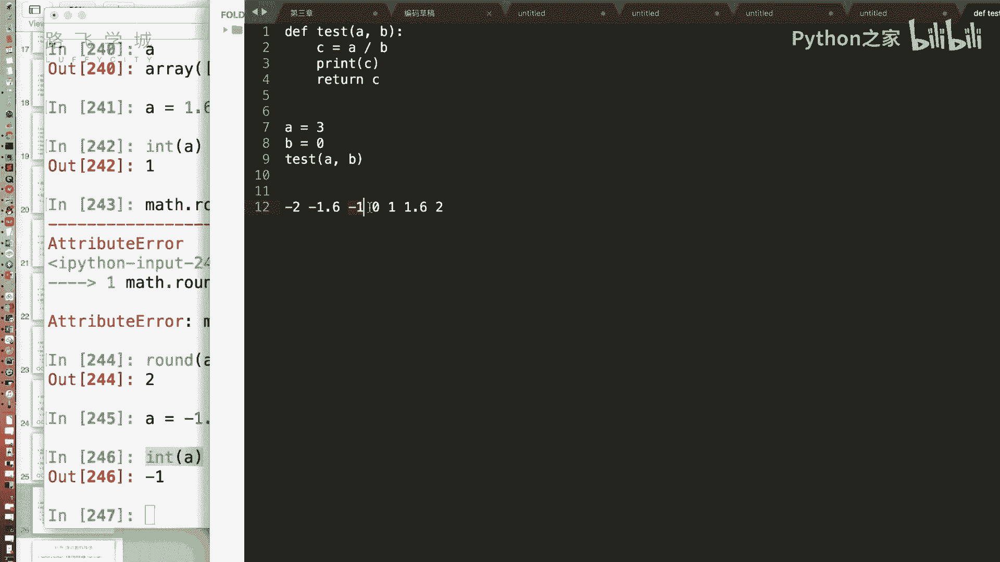
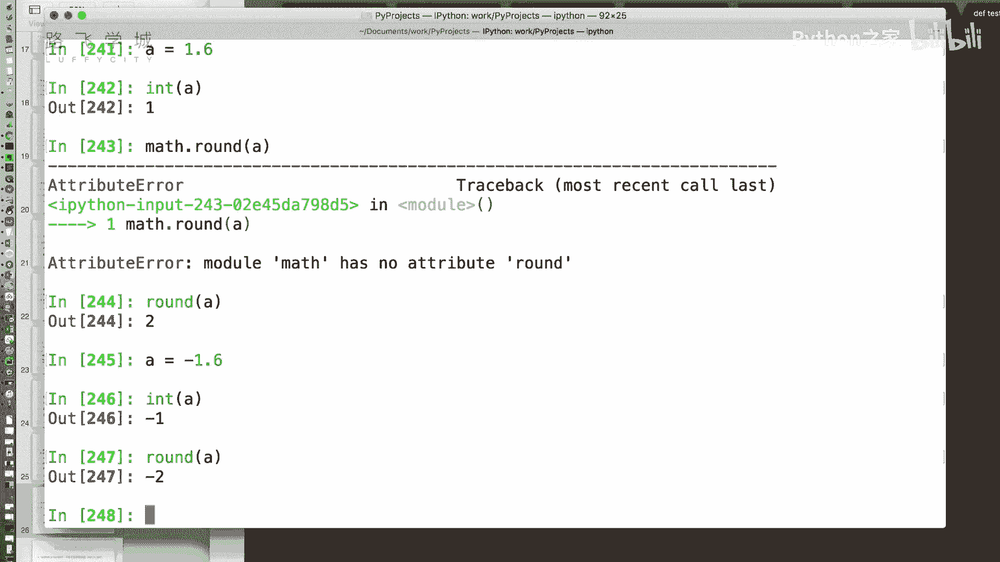
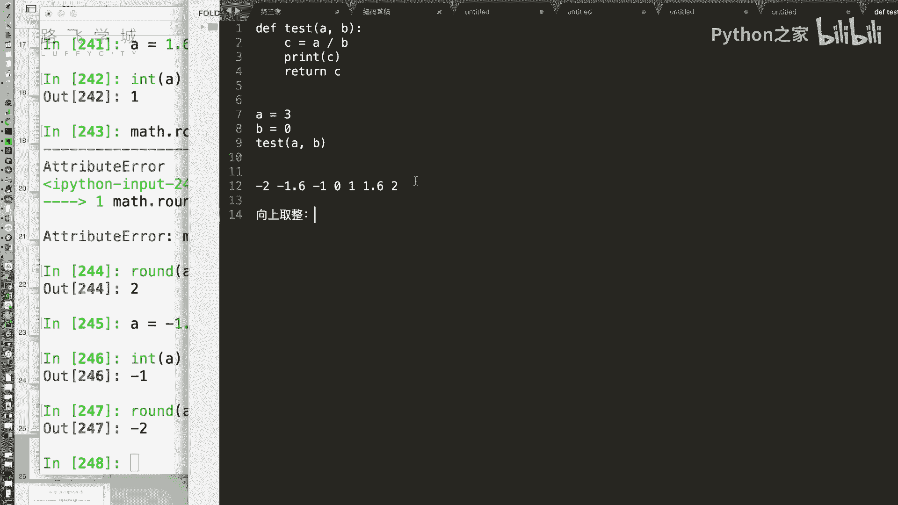
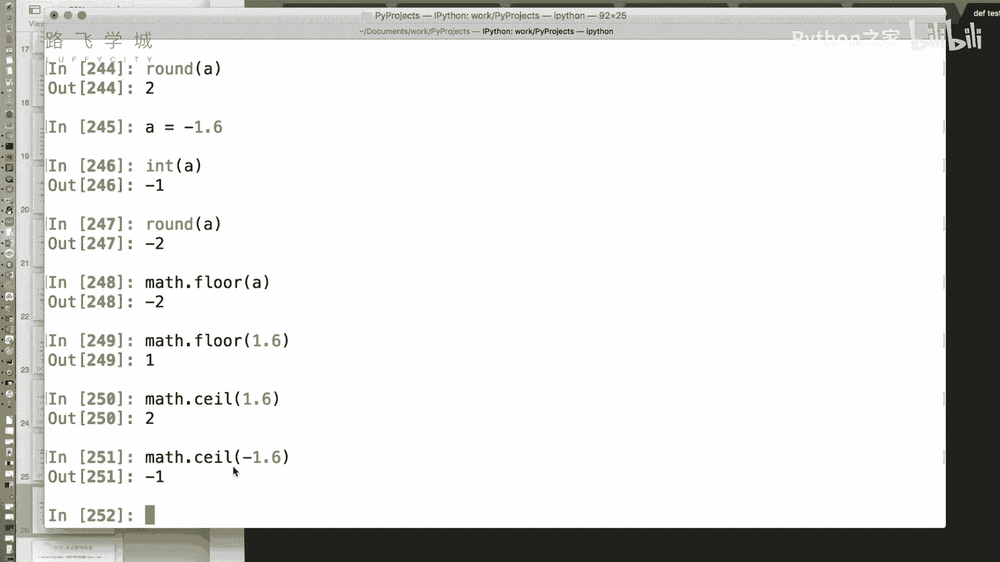
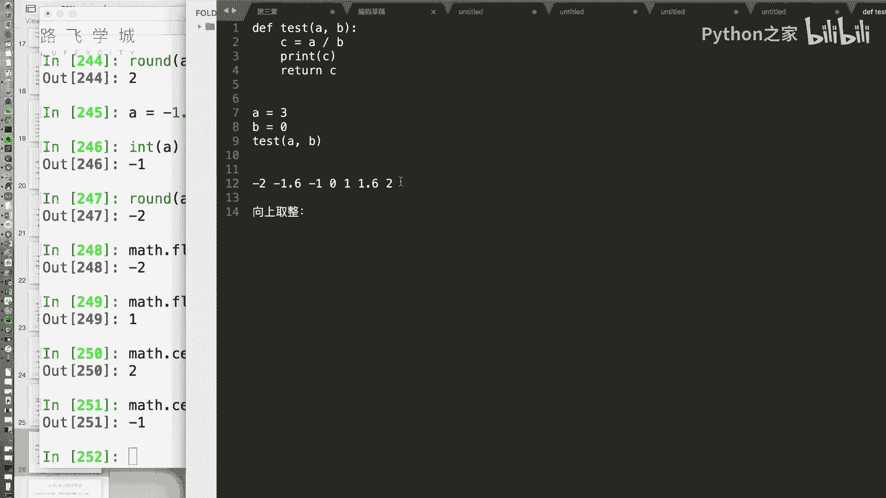

# 金融量化分析：P15：NumPy数组通用函数 🧮

## 概述
在本节课程中，我们将学习NumPy库中的“通用函数”。这些函数可以对数组进行快速的、元素级的数学运算，是进行高效数值计算的基础。我们将了解如何对数组进行取绝对值、开方、取整等操作，并认识两个特殊的数值：`NaN`和`Inf`。

---

## 通用函数简介
上一节我们介绍了数组的索引功能。本节中，我们来看看NumPy提供的“通用函数”。这些函数可以对数组中的每个元素执行相同的数学运算，实现“向量化”操作，效率远高于Python原生的循环。

例如，数组可以直接进行加减乘除运算。那么，对于更复杂的数学运算，如取绝对值或开方，NumPy也提供了相应的通用函数。

## 一元通用函数
一元通用函数是指只接受一个数组作为参数的函数。以下是一些常用的一元函数及其用法。



### 绝对值运算
`abs`函数用于计算数组中每个元素的绝对值。虽然Python内置的`abs`函数可能也能处理NumPy数组，但建议使用NumPy提供的版本以确保兼容性和性能。



```python
import numpy as np
A = np.array([-5, -2, 0, 3, 5])
result = np.abs(A)  # 输出：[5 2 0 3 5]
```



### 平方根运算
`sqrt`函数用于计算数组中每个元素的平方根。需要注意的是，负数无法进行实数范围内的开方运算，此时结果会返回一个特殊值`NaN`。



```python
import numpy as np
A = np.array([4, 9, 16])
result = np.sqrt(A)  # 输出：[2. 3. 4.]
```





### 取整运算
将小数转换为整数有多种方式，NumPy提供了四种主要的取整函数。

以下是四种取整方式的说明：
*   **向零取整 (`trunc`)**: 直接舍弃小数部分。例如，`1.6` 变为 `1`，`-1.6` 变为 `-1`。
*   **向下取整 (`floor`)**: 取不大于原数的最大整数。例如，`1.6` 变为 `1`，`-1.6` 变为 `-2`。
*   **向上取整 (`ceil`)**: 取不小于原数的最小整数。例如，`1.6` 变为 `2`，`-1.6` 变为 `-1`。
*   **四舍五入 (`round`)**: 根据小数部分进行四舍五入。例如，`1.6` 变为 `2`，`-1.6` 变为 `-2`。

```python
import numpy as np
A = np.array([1.6, -1.6, 2.5, -2.5])
print(np.trunc(A))   # 向零取整: [ 1. -1.  2. -2.]
print(np.floor(A))   # 向下取整: [ 1. -2.  2. -3.]
print(np.ceil(A))    # 向上取整: [ 2. -1.  3. -2.]
print(np.round(A))   # 四舍五入: [ 2. -2.  2. -2.]
```

### 分离整数与小数部分
`modf`函数可以将数组中每个元素的整数部分和小数部分分离，并分别返回两个数组。

```python
import numpy as np
A = np.array([1.6, -1.6, 3.0])
integer_part, fractional_part = np.modf(A)
# integer_part: [ 0.6 -0.6  0. ]
# fractional_part: [ 1. -1.  3.]
```

## 特殊数值：NaN与Inf
在数值计算中，会遇到一些“未定义”或“无穷”的情况。NumPy使用两个特殊的浮点数值来表示它们。

### NaN (Not a Number)
`NaN`表示“不是一个数字”，通常出现在无效的数学运算中，例如：
*   0除以0
*   负数的平方根
*   无穷大减无穷大

一个关键特性是：**`NaN`不等于任何值，包括它自己**。因此，不能使用 `==` 来判断一个值是否为 `NaN`。

```python
import numpy as np
# 产生NaN的运算
A = np.array([0, 1, 2])
result = A / A  # 0/0 会产生 NaN
print(result)  # 输出：[nan  1.  1.]

# 错误的判断方式
print(result == np.nan)  # 输出：[False False False]

# 正确的判断方式：使用 np.isnan
print(np.isnan(result))  # 输出：[ True False False]

# 过滤掉NaN值
filtered_result = result[~np.isnan(result)]  # 输出：[1. 1.]
```

### Inf (Infinity)
`Inf`表示“无穷大”，通常出现在一个非零数除以零的情况下。`-Inf`则表示负无穷大。

```python
import numpy as np
# 产生Inf的运算
A = np.array([1, 2, 3])
B = np.array([0, 1, 0])
result = A / B  # 1/0 和 3/0 会产生 Inf
print(result)  # 输出：[inf  2. inf]

# 判断Inf
print(np.isinf(result))  # 输出：[ True False  True]

# 过滤掉Inf值
filtered_result = result[~np.isinf(result)]  # 输出：[2.]
```

## 二元通用函数
二元通用函数是指接受两个数组作为参数的函数，并对它们对应位置的元素进行计算。

### 最大值与最小值
`maximum`和`minimum`函数用于逐元素比较两个数组，返回对应位置上的最大值或最小值。

```python
import numpy as np
A = np.array([3, 4, 1])
B = np.array([2, 5, 0])

max_result = np.maximum(A, B)  # 逐元素取最大值: [3 5 1]
min_result = np.minimum(A, B)  # 逐元素取最小值: [2 4 0]
```

这与求整个数组最大值的`A.max()`方法是不同的。

---


## 总结
本节课我们一起学习了NumPy的核心功能之一：通用函数。
*   我们了解了**一元通用函数**（如`abs`, `sqrt`, 各种取整函数）和**二元通用函数**（如`maximum`, `minimum`）的用法。
*   我们认识了两个在数据处理中至关重要的特殊数值：**`NaN`（非数字）**和**`Inf`（无穷大）**，并学会了如何使用`np.isnan()`和`np.isinf()`来识别和过滤它们。
*   掌握这些通用函数是进行高效数组计算和后续金融数据分析的基础。