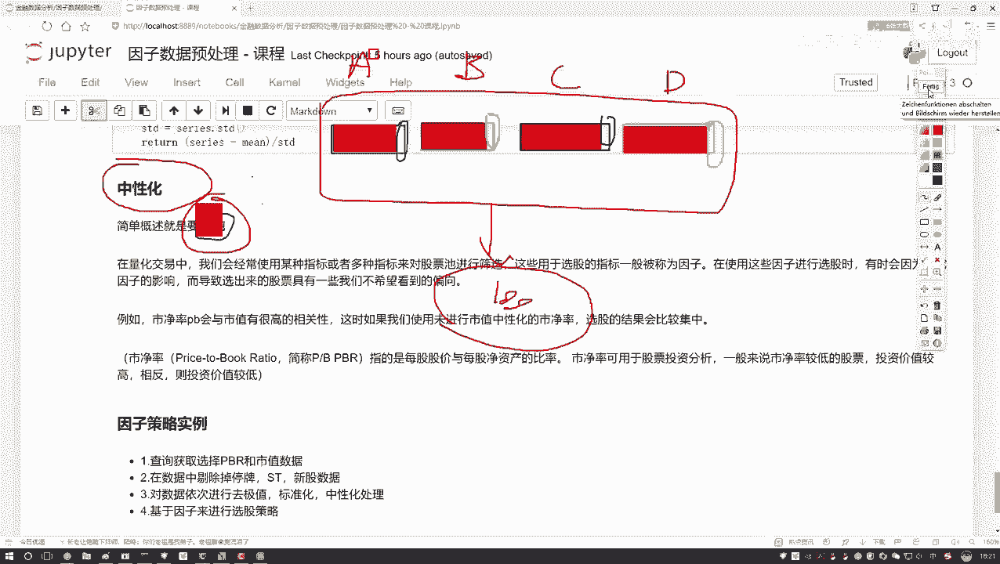
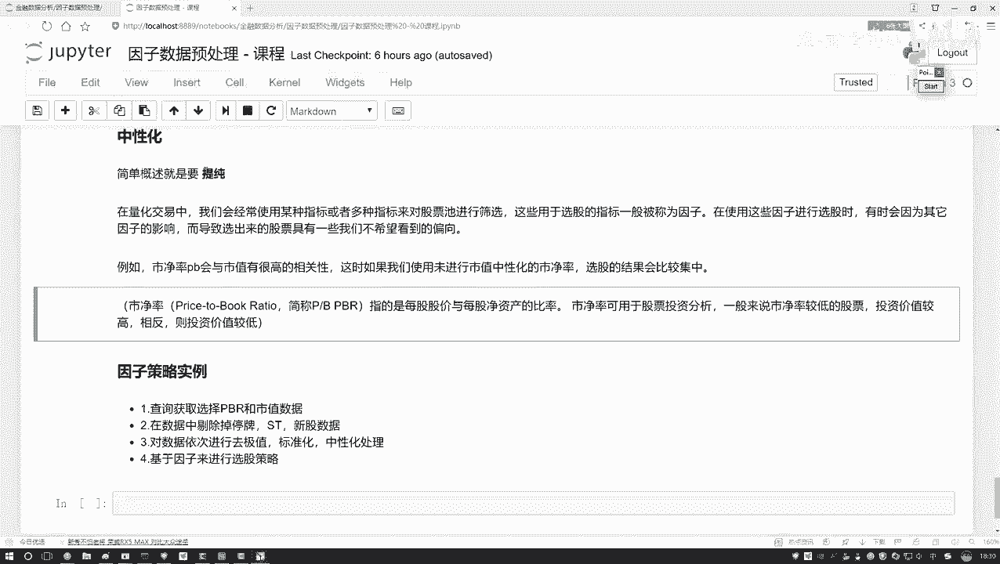

# Python量化交易：P33：中性化处理方法通俗解释

## 概述
在本节课中，我们将要学习量化交易中的一个重要概念——**中性化**。我们将解释中性化的目的、作用以及其背后的逻辑，并通过一个简单的例子帮助初学者理解为什么在因子选股中需要进行中性化处理。

## 什么是中性化？
上一节我们介绍了量化交易中因子的概念，本节中我们来看看中性化。中性化的核心目的是**提纯**。

### 提纯的含义
提纯是指从一个因子中提取出其独特、有价值的信息，去除与其他因子共有的、可能对选股结果产生主导性影响的成分。

为了理解这一点，我们先看一个例子。

### 一个例子：四个因子的困境
假设我们设计一个选股策略，使用了四个不同的因子：A、B、C、D。

*   A因子（例如市净率）
*   B因子（例如市盈率）
*   C因子（例如营收增长率）
*   D因子（例如净利润率）

理论上，这四个因子应该从不同角度帮助我们筛选股票。但实际操作中，你可能会发现，无论策略如何调整，最终选出的股票池总是高度相似。

为什么会这样？

原因可能在于，这四个因子内部都**高度包含了一个共同的影响因素**，比如**市值**。
*   因子A（市净率）的数值很大程度上受公司市值影响。
*   因子B、C、D也可能与市值有很强的相关性。

结果就是，虽然你使用了四个不同的“瓶子”（因子），但里面装的“水”（有效信息）绝大部分都是同一种（市值影响）。最终，选股结果实际上主要由“市值”这一个因素决定，其他因子的独特作用被掩盖了。

### 中性化的作用
中性化要做的，就是进行“提纯”：
1.  对于因子A，我们剔除其中与市值相关的部分，保留其独特的、与市值无关的信息。
2.  对因子B、C、D进行同样的操作。

以下是中性化过程的通俗理解：
> 我们希望比较四位同学的“个性”，而不是他们“都穿校服”这个共性。中性化就是帮我们脱掉校服，看清每个人独特的穿着。

经过中性化处理后的因子，更能代表其自身的特性，从而在组合选股时提供真正多样化的视角，避免选股结果过度集中于某一类股票（例如全是大盘股或小盘股）。

## 量化交易中的中性化
在量化交易实践中，我们经常使用多个指标（因子）对股票池进行筛选和调仓。

在使用因子选股的过程中，有时会因为因子间存在强相关性（如都受市值影响），导致选出的股票具有我们不希望的倾向性，使得策略无法获得预期的多样化收益。

例如，直接使用市净率因子选股，可能会选出大量低市值股票，因为市净率与市值通常存在相关性。这并非市净率因子本身的选股逻辑，而是市值因素在“喧宾夺主”。

### 关于市净率
市净率（P/B）是一个常用因子，其计算公式为：
`市净率(P/B) = 每股股价 / 每股净资产`
其中，**每股净资产** = (公司总资产 - 公司总负债) / 总股本。

在投资中，通常认为较低的市净率可能意味着股票被低估，潜在投资回报空间更大。中性化处理可以帮助我们得到更“纯净”的、反映估值水平的市净率因子，而不是一个混杂了市值大小影响的指标。

## 总结
本节课中我们一起学习了中性化处理方法。
1.  **中性化的核心**是**提纯**，即从因子中剔除共性影响（如市值），提取其独特信息。
2.  **中性化的目的**是确保每个因子在选股时能独立发挥作用，避免单一共性因素主导选股结果，从而提升策略的多样性和有效性。
3.  未经中性化的因子可能包含大量冗余信息，导致选股结果出现非预期的倾向性。

下一节，我们将在量化平台中，演示如何具体计算和使用中性化后的因子。