# Python金融分析与量化交易实战：P26：02-2-Alphalens工具包介绍 📊

在本节课中，我们将要学习一个在量化金融分析中至关重要的工具包——Alphalens。我们将了解它的作用、如何安装，并介绍如何在量化平台上使用它进行因子分析。

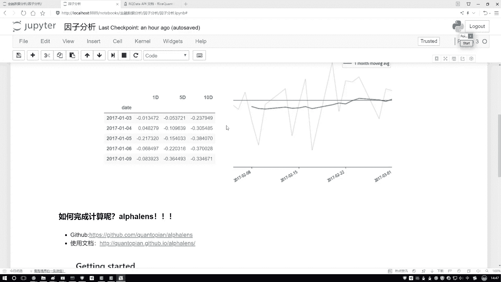

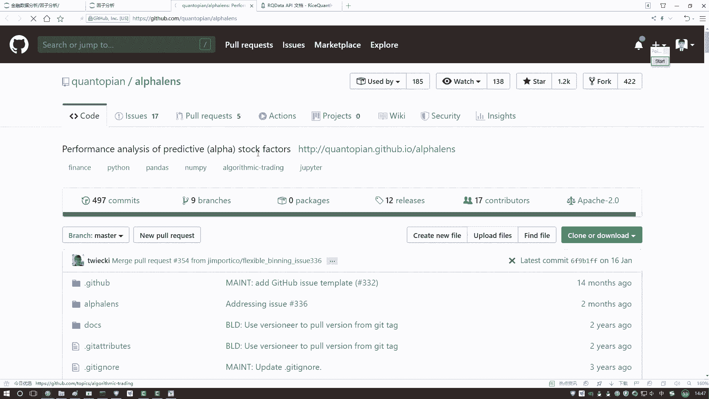

上一节我们介绍了因子分析的基本概念，本节中我们来看看如何利用现成的工具来高效地完成这些分析。

## Alphalens工具包简介

Alphalens是一个专门用于金融因子分析的Python工具包。它的核心功能是帮助我们计算与因子相关的各项指标（如IC值）并自动生成分析图表。使用Alphalens可以省去大量手动计算和绘图的工作。

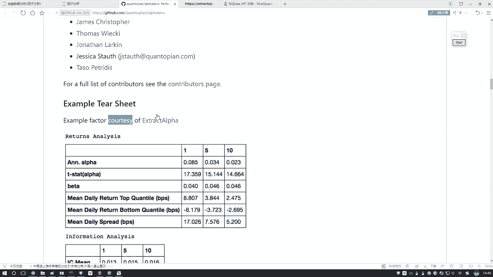

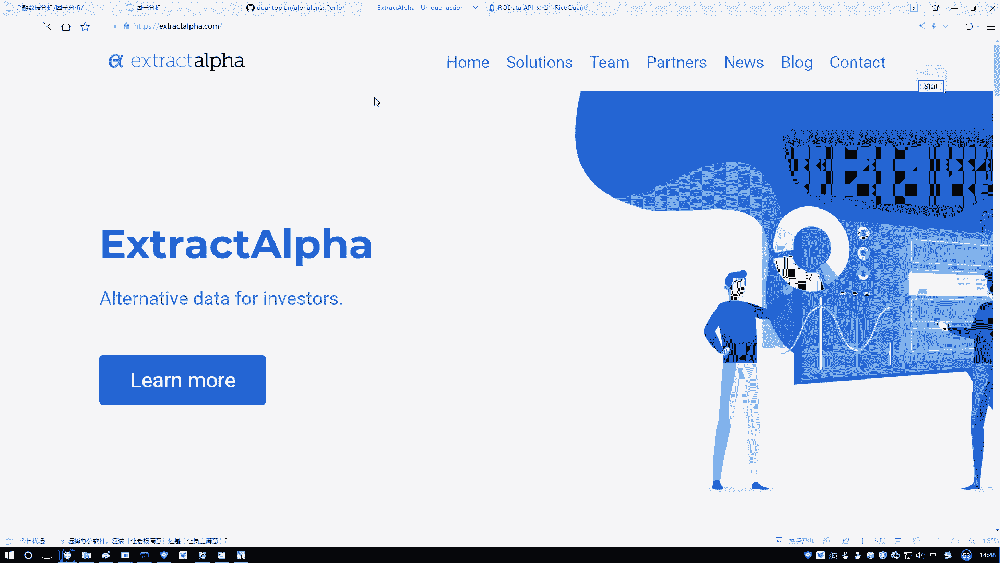

## 安装与资源

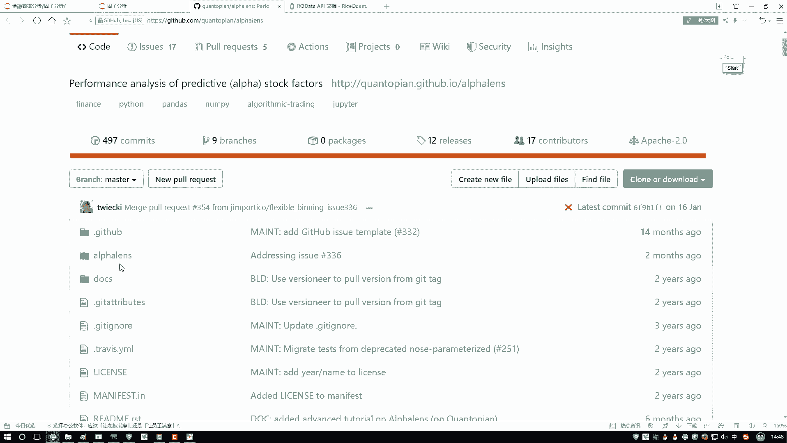

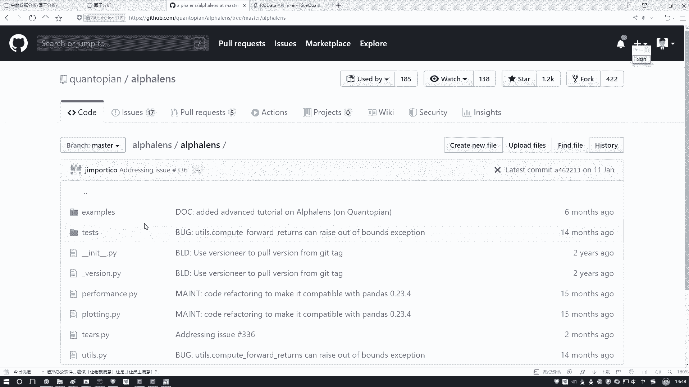

如果你想在本地环境使用Alphalens，安装过程非常简单。

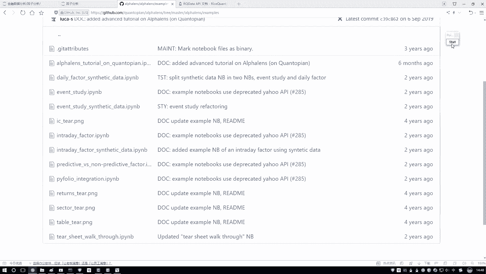

以下是安装步骤：
*   通过pip命令安装：`pip install alphalens`

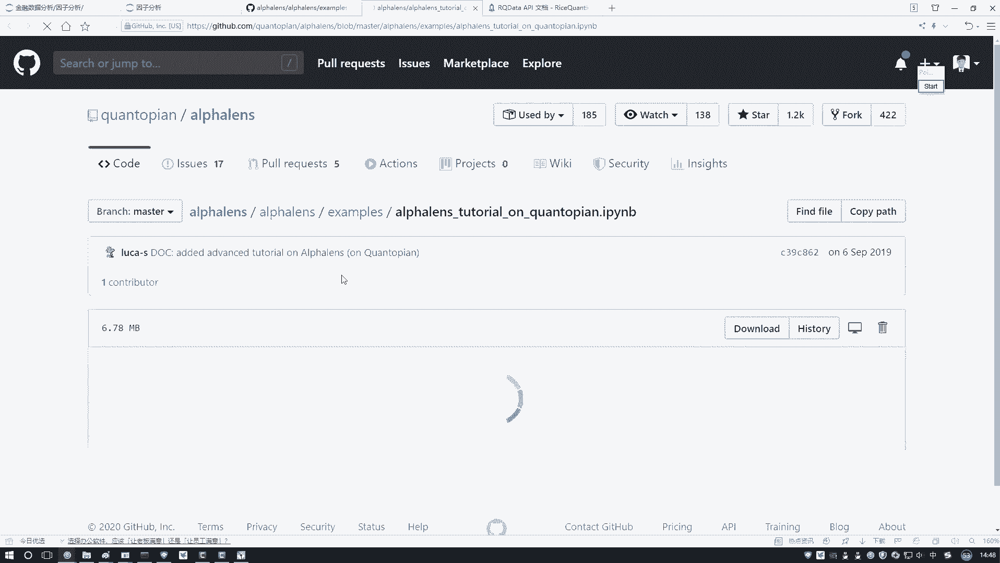

以下是主要的学习资源：
*   **GitHub仓库**：查看源代码和基础信息。
*   **官方文档**：包含详细的API说明和使用指南。
*   **示例（Examples）**：官方提供的一系列小例子，是学习如何使用该工具包的最佳途径。

本节课的内容主要参考了官方的示例文档，我们会将其中核心的部分总结并演示给大家。

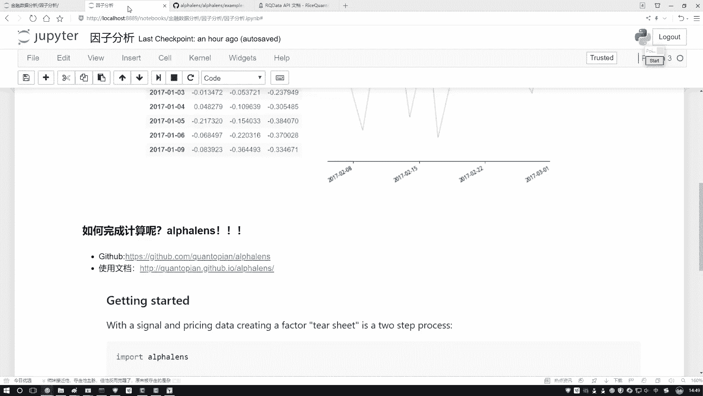

## 在量化平台中使用

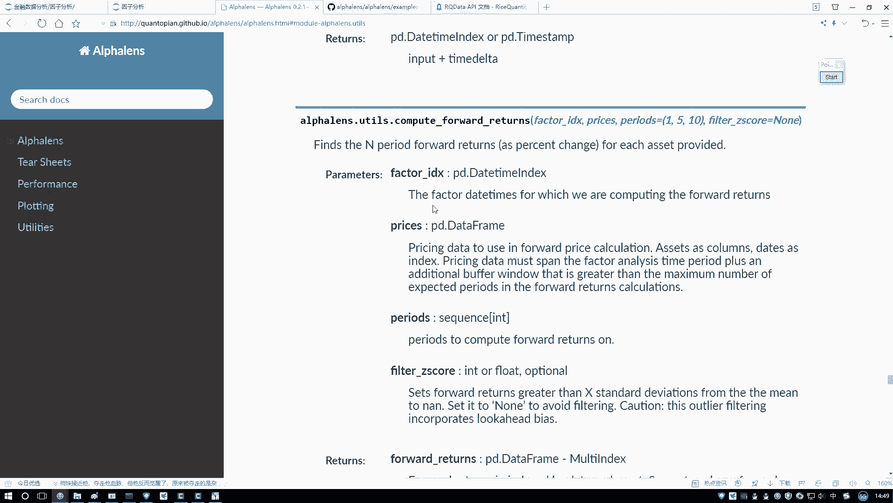

由于在本地环境中获取金融数据较为麻烦，本节课我们将在量化交易平台中编写和运行代码。平台已经预装了所有必要的工具包（包括Alphalens），方便我们直接进行分析。

在平台中，我们需要使用“投资研究”模块（而非“回测”模块）来编写分析代码。这个模块提供了一个类似Jupyter Notebook的交互式环境，允许我们在平台的服务器上执行代码。

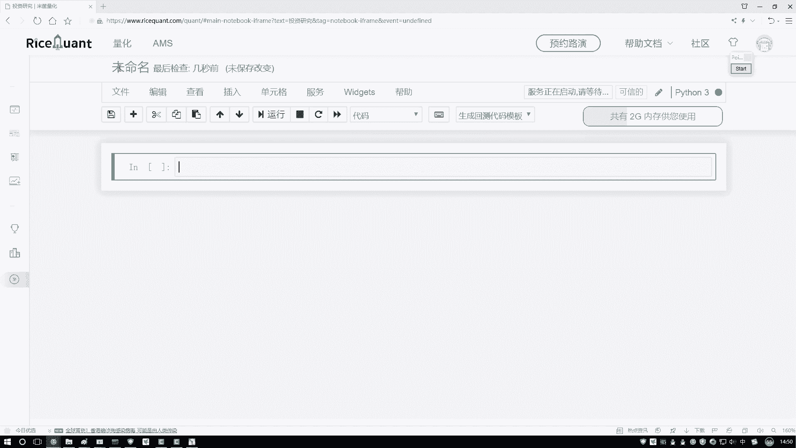

以下是进入分析环境的步骤：
1.  登录量化交易平台。
2.  在左侧导航栏找到并点击“投资研究”。
3.  新建一个Python 3笔记文件，并将其重命名为“因子分析”。

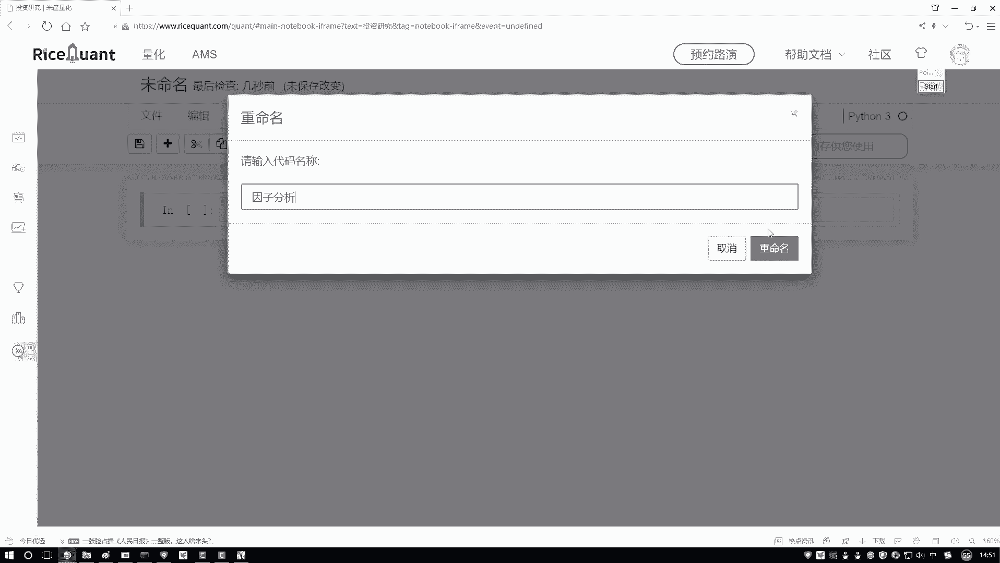

接下来，我们就可以在这个环境中编写和运行本节课的代码了。课程中会提供完整的代码，你可以直接复制到平台中使用，也可以跟随视频一步步编写。

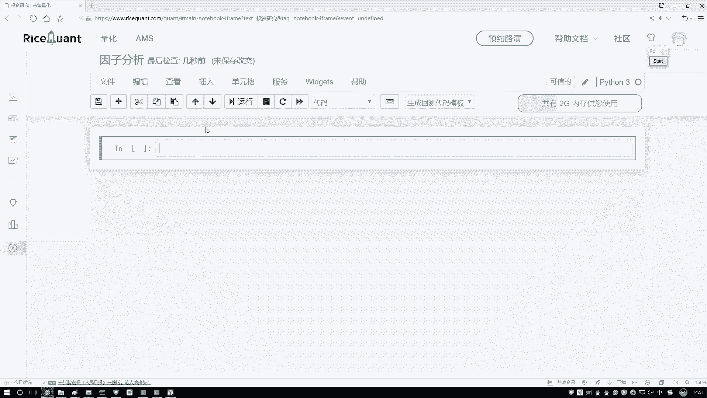

本节课中我们一起学习了Alphalens工具包的作用和获取方式，并熟悉了在量化平台中进行分析编码的环境。接下来，我们就可以开始利用这个强大的工具进行实际的因子分析操作了。