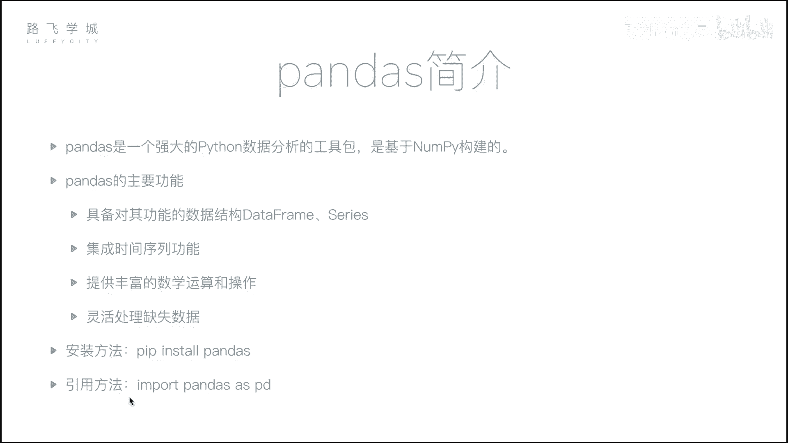
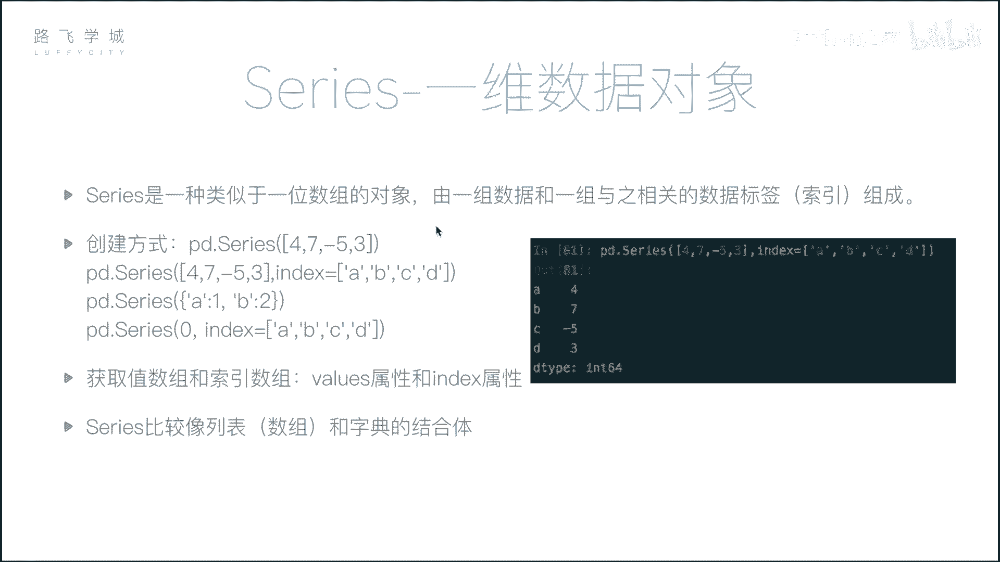
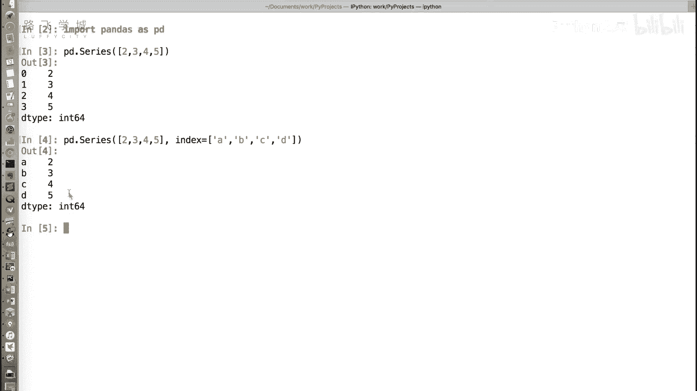
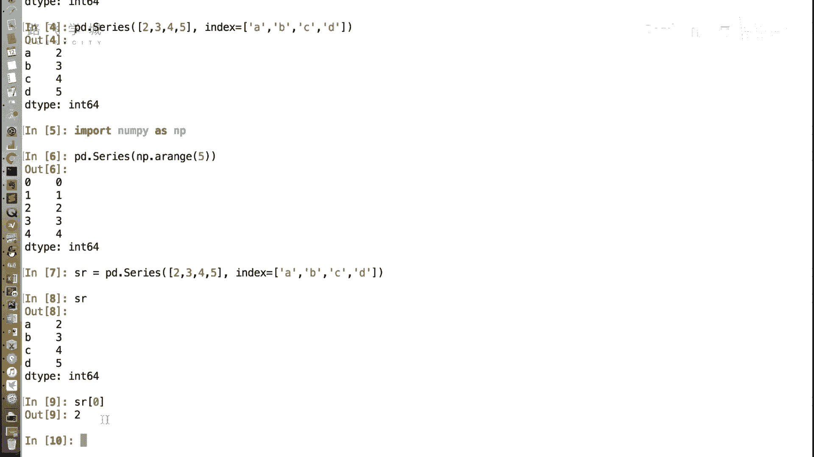
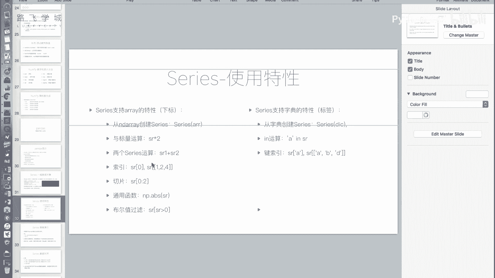
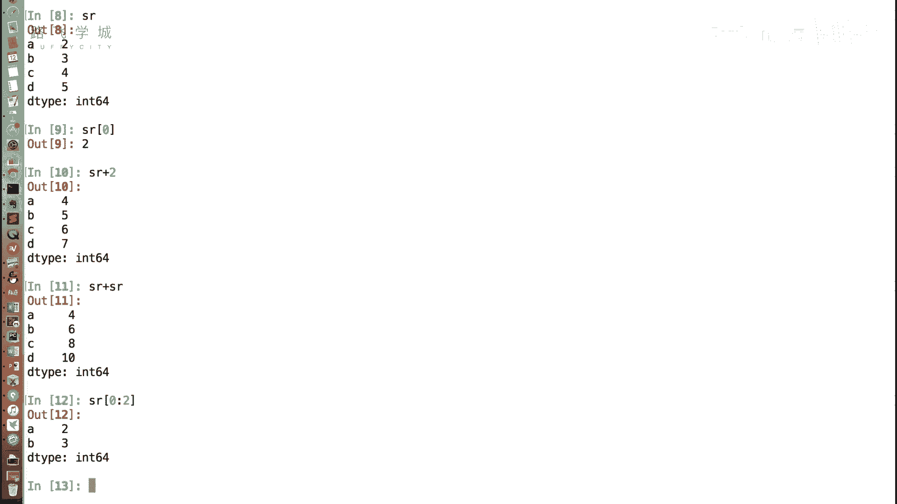
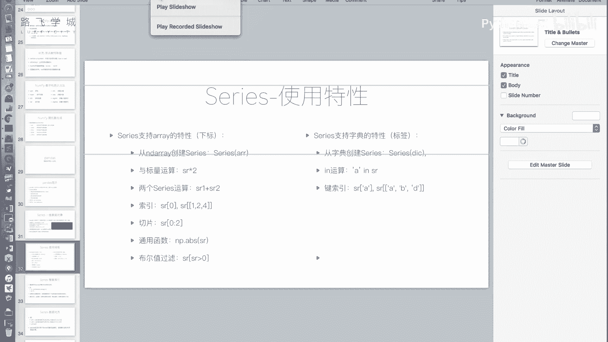
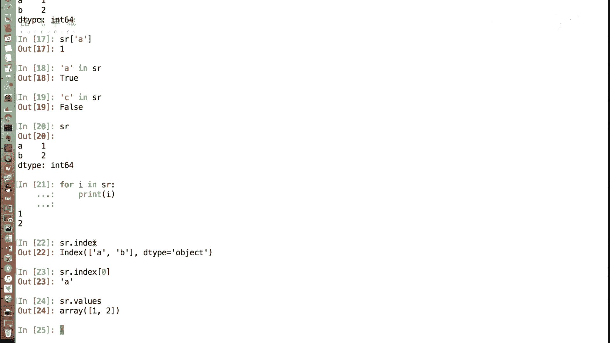
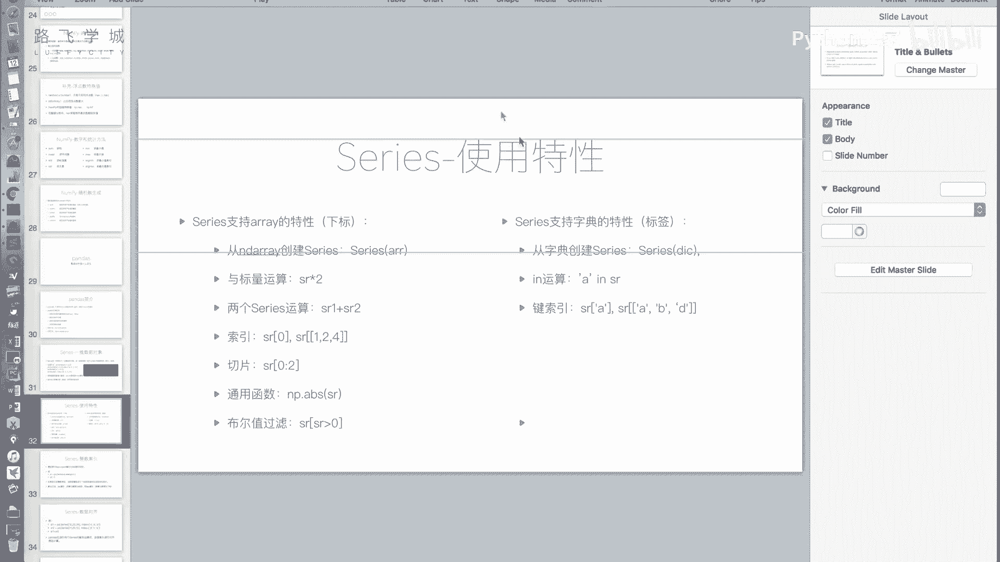
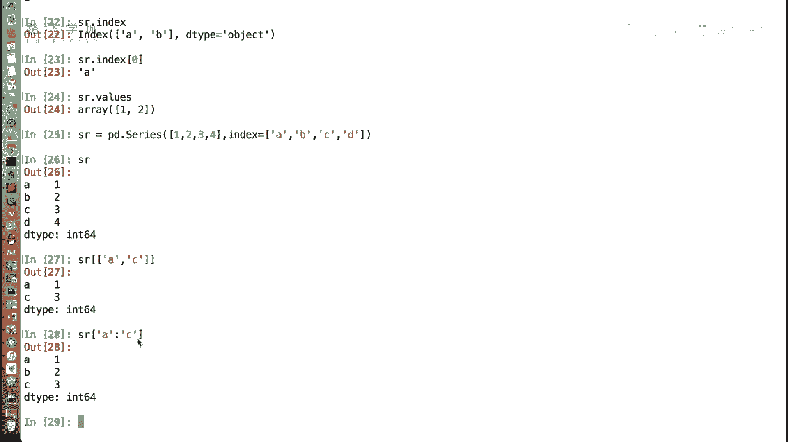

# 金融量化分析：P17：Series介绍 📊

## 概述
在本节课中，我们将要学习Pandas库中的核心数据结构之一：**Series**。我们将了解它如何结合了列表（数组）和字典的特性，并掌握其创建、访问和基本操作的方法。

---

## 从NumPy到Pandas
上一节我们介绍了数据分析的基础包NumPy。接下来我们来看看Pandas这个包。Pandas在数据分析领域应用广泛，它构建在NumPy之上，封装层级更高，是数据分析的核心工具。无论进行金融数据分析还是其他领域的数据分析，只要使用Python，Pandas都是不可或缺的。



Pandas的主要功能包括：
*   提供两种核心数据结构：**DataFrame**和**Series**。
*   集成了时间序列功能。
*   提供了丰富的数学运算和操作。
*   能灵活处理缺失数据。



其安装方法简单，使用`pip`即可安装。官方建议的引用方式如下：

```python
import pandas as pd
```




---

## 认识Series对象
Series是Pandas中的第一种核心数据对象。它是一种类似于一维数组的对象，可以看作是数组和字典的结合体。

### 创建Series
创建Series需要使用`pd.Series()`方法。

以下是创建Series的几种方式：





**1. 从列表创建**
传入一个列表，会生成默认的整数索引（0, 1, 2...）。
```python
import pandas as pd
s = pd.Series([2, 3, 4, 5])
```

**2. 指定索引创建**
通过`index`参数可以自定义索引标签，使其看起来像字典的键值对。
```python
s = pd.Series([2, 3, 4, 5], index=['A', 'B', 'C', 'D'])
```

**3. 从字典创建**
直接传入一个字典，字典的键（key）会自动成为Series的索引。
```python
s = pd.Series({'A': 2, 'B': 3, 'C': 4, 'D': 5})
```





---

## Series的数组（列表）特性
Series继承了许多NumPy数组或Python列表的特性，使其能进行高效的数值运算。

以下是Series支持的数组类操作：

*   **下标访问**：即使指定了自定义索引（如‘A’, ‘B’），依然可以通过原始整数下标进行访问。例如`s[0]`。
*   **标量运算**：Series可以与一个数字进行运算，结果会作用到每个元素上。例如 `s + 10`。
*   **相同大小Series间的运算**：两个长度相同的Series可以进行逐元素的加减乘除等运算。例如 `s1 + s2`。
*   **切片操作**：可以使用整数位置进行切片，遵循“前包后不包”的原则。例如 `s[0:2]`。
*   **通用函数**：支持NumPy的通用函数，如取绝对值、最大值、最小值等。
*   **布尔型索引**：可以通过条件表达式筛选数据。例如 `s[s > 4]` 会筛选出值大于4的元素。

---

## Series的字典特性
Series也融合了字典的一些便捷特性，使其能通过标签灵活地访问数据。



以下是Series支持的字典类操作：



*   **标签访问**：可以通过自定义的索引标签来获取值。例如 `s['A']`。
*   **`in`操作**：可以判断一个标签是否存在于Series的索引中。例如 `'A' in s` 返回 `True`。
*   **花式索引**：可以传入一个标签列表，一次性获取多个值。例如 `s[['A', 'C']]`。
*   **标签切片**：使用标签进行切片时，切片范围是“前包后也包”的。例如 `s['A':'C']` 会包含标签A、B、C对应的值。
    > **注意**：这与整数位置切片“前包后不包”的规则不同。
*   **获取索引和值**：
    *   通过 `.index` 属性获取索引对象。
    *   通过 `.values` 属性获取值数组（NumPy数组格式）。

> **一个重要区别**：对Series进行`for`循环迭代时，输出的是它的**值**，而不是索引（键）。这与字典的迭代行为不同。

---

## Series的应用场景
Series结合了有序列表和键值对字典的优点，在实际工作中非常有用。

**典型场景示例**：
假设我们有一支股票的历史每日收盘价数据。使用Series存储时，可以将日期作为索引标签，收盘价作为值。
*   **按标签查询**：可以快速查询特定日期（如‘2023-10-01’）的收盘价。
*   **按位置切片**：可以方便地获取前N天（如前5天）的数据进行分析。
*   **保持顺序**：数据在Series中是有序存储的，这对于时间序列分析至关重要。

这种方式比单纯使用列表（需要额外存储时间）或字典（无法保证顺序且切片不便）要高效和直观得多。



---

## 总结
本节课我们一起学习了Pandas库的核心数据结构**Series**。
*   我们了解了Series是**数组和字典的结合体**，兼具两者的优势。
*   我们掌握了创建Series的三种主要方式：**从列表、指定索引、从字典创建**。
*   我们详细探讨了Series继承自数组的特性，如**下标访问、运算、切片和布尔索引**。
*   我们也学习了Series继承自字典的特性，如**标签访问、`in`操作和标签切片**，并注意了其与字典的一些区别。
*   最后，我们通过股票价格示例，理解了Series在**处理带标签的有序数据**（尤其是时间序列数据）时的实用价值。

理解Series是学习更复杂的DataFrame结构的基础。在下一节中，我们将介绍功能更强大的二维数据结构——DataFrame。