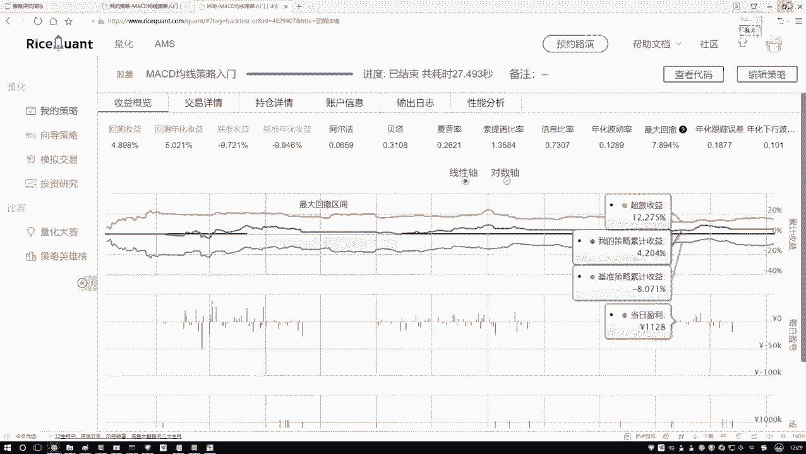
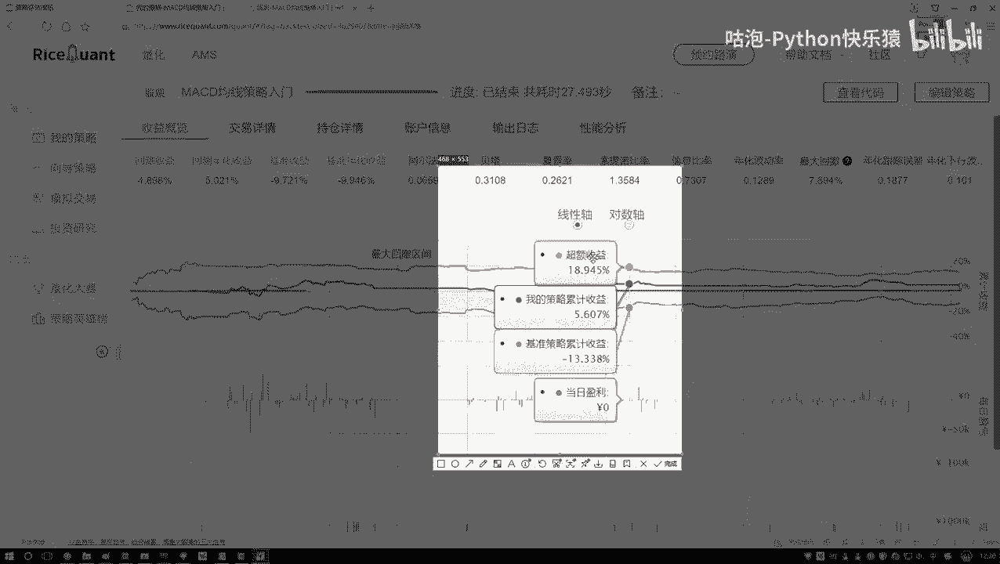
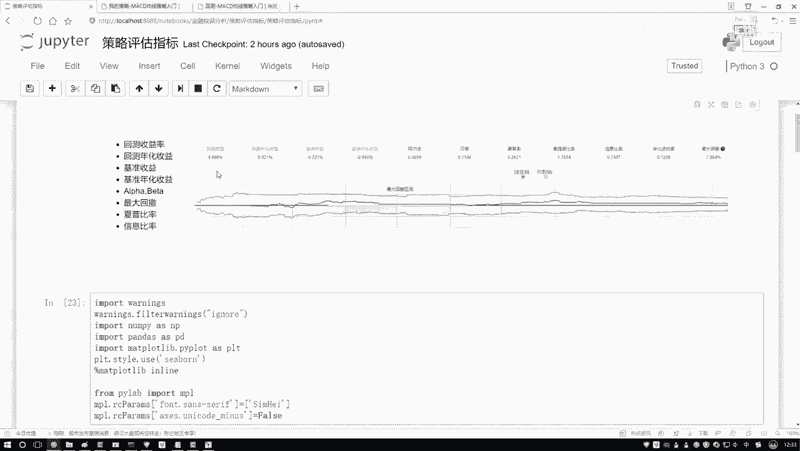

# Python机器学习与量化交易：P19：20.20.5-阿尔法与贝塔概述 📈

在本节课中，我们将要学习量化交易策略评估中的两个核心概念：阿尔法（α）和贝塔（β）。理解这两个指标，有助于我们区分策略收益的来源，并明确我们的优化目标。

## 收益的构成

上一节我们介绍了多种策略评估指标，本节中我们来看看收益是如何构成的。一项投资或策略的总收益，可以分解为两个部分。

以下是收益的两个组成部分：
*   **市场收益**：这部分收益与整体市场环境的好坏直接相关。当市场大环境向好时，大部分投资都能获得这部分收益。它反映了“随大流”也能赚到的钱。
*   **超额收益**：这部分收益与市场整体波动关系不大，主要来源于策略本身的独特性、投资者的敏锐观察或主动管理能力。它反映了通过“个人努力”和“策略优势”所赚取的、超越市场平均水平的钱。

## 阿尔法（α）与贝塔（β）的定义

理解了收益的构成，我们就可以引入阿尔法和贝塔这两个指标来分别衡量它们。

*   **贝塔（β）**：衡量策略收益对市场波动的敏感性。**β** 值反映了你的策略与“大盘”同涨同跌的程度。**β = 1** 表示策略与市场波动完全同步；**β > 1** 表示策略波动比市场更剧烈；**β < 1** 则表示策略波动比市场平缓。它主要关联**市场收益**。
*   **阿尔法（α）**：衡量策略所获得的**超额收益**。**α** 值代表了超越市场基准的那部分收益，是评价策略本身优劣和投资技能的关键指标。一个正的、较大的 **α** 通常意味着策略非常有效。

## 如何理解阿尔法与贝塔

我们可以通过一个回归方程来形象地理解这两个概念。策略的总收益（Y）与市场基准收益（X）之间的关系，常常可以用以下线性模型表示：

**Y = α + β * X + ε**

其中：
*   **Y** 代表策略的总收益。
*   **X** 代表市场基准收益（如沪深300指数收益）。
*   **β** 是斜率，表示市场收益变化时，策略收益变化的幅度。
*   **α** 是截距，代表当市场收益为零时，策略所能获得的收益，即**超额收益**。
*   **ε** 是随机误差项。

通过历史数据拟合这个方程，我们就可以求解出 **α** 和 **β** 的具体数值。

## 我们的关注重点

作为策略开发者，我们需要明确目标。市场环境（**β** 部分）是我们无法控制或改变的。因此，我们的核心关注点应该是如何通过优化策略来获取稳定且可观的**超额收益**，即追求更高的正**阿尔法（α）**。

本节课中我们一起学习了阿尔法（α）和贝塔（β）的概念。总结如下：
1.  总收益由**市场收益**和**超额收益**两部分构成。
2.  **贝塔（β）** 衡量策略与市场波动的关联性，对应市场收益。
3.  **阿尔法（α）** 衡量策略超越市场的部分，对应超额收益，是策略评估的核心。
4.  我们的优化目标是最大化策略的**阿尔法（α）**，以获取持续的超额回报。

理解这两个概念，为我们后续深入进行因子分析和策略优化打下了重要的基础。