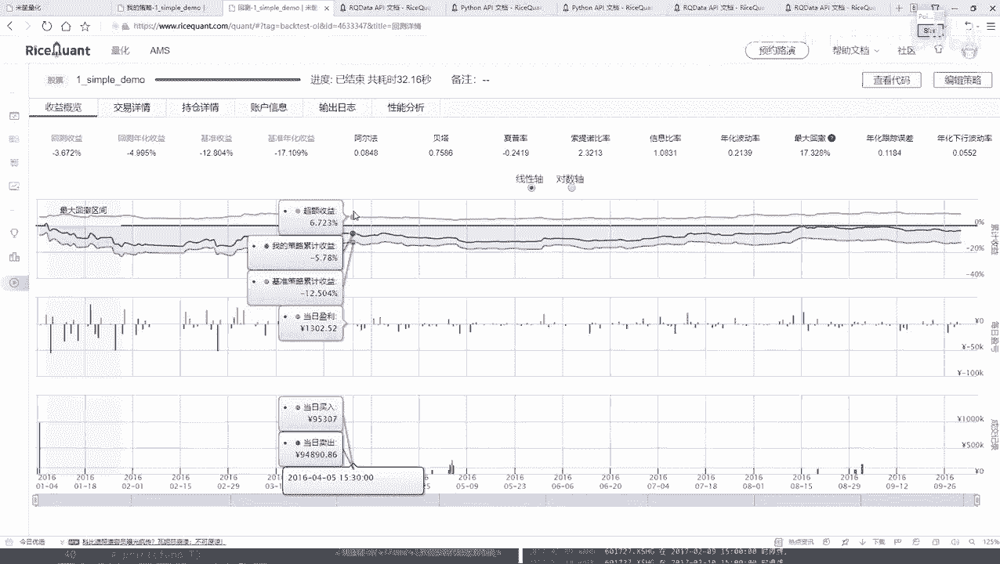
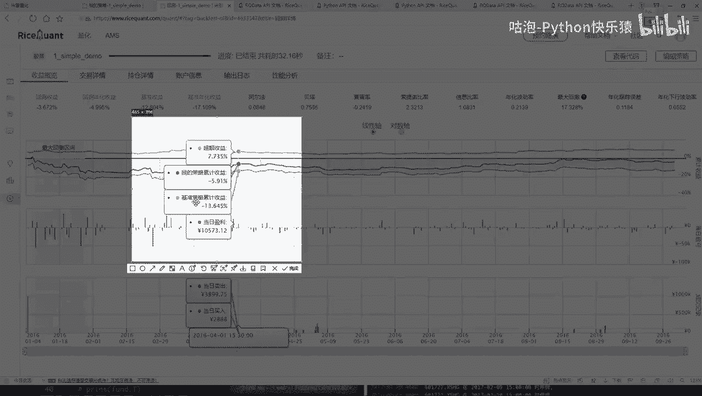
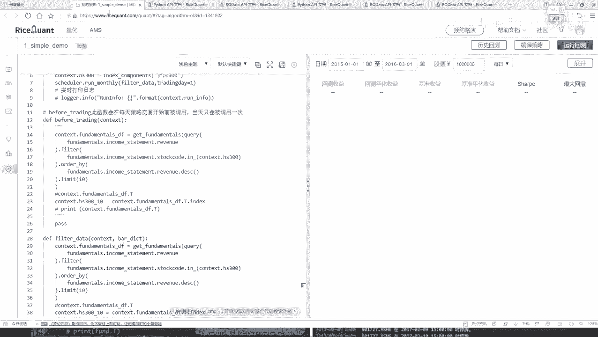

# Python机器学习与量化交易：P27：定时器功能与作用 ⏰

## 概述
在本节课中，我们将学习如何在量化交易策略中使用定时器功能。定时器允许我们自定义执行特定操作的频率，例如，将每日选股调整为每月选股，从而优化策略的执行逻辑。

上一节我们介绍了策略回测的基本流程和结果分析，本节中我们来看看如何通过定时器来调整策略的执行频率。

## 交易详情分析
交易详情展示了从2016年1月4日到2016年10月4日期间每一天的交易记录。在之前的策略中，`handle_data`和`before_trading`函数每天都会执行，因此每天都会产生交易。

以下是交易详情中的关键信息：
*   **第一天操作**：由于初始仓位为空，策略执行买入操作。我们设定了平均买入，即10万资金平均分配到10只股票，每只股票买入约1万元。
*   **后续操作**：从第二天开始，策略会根据新的选股结果进行买卖操作，以调整仓位，确保资金充分利用。
*   **交易记录**：记录包括股票名称、买卖方向、成交量、成交价以及交易费用（如印花税、佣金等）。
*   **持仓与盈亏**：可以查看每日的持仓市值和每只股票的盈亏情况。策略初期可能经历连续亏损，这与之前看到的“最大回撤”区间相对应。
*   **账户信息**：展示了每日账户总市值的变化，最终可以评估初始10万资金的变化结果。



## 引入定时器功能
在当前的策略中，选股操作每天都会执行。但在实际交易中，可能不需要如此频繁地调仓，例如可以设定每十天或每月进行一次选股。



为此，平台提供了定时器API，允许我们按照设定的时间间隔执行特定函数。

以下是定时器的核心概念：
*   **功能**：按照指定的时间间隔（如每日、每周、每月）执行某个自定义函数。
*   **使用位置**：只能在策略的初始化函数 `__init__` 中使用。
*   **关键参数**：需要传入一个自定义的函数，并指定执行的具体时间点（例如，每月的第几个交易日）。

## 实践：将每日选股改为每月选股
我们将修改策略，将选股逻辑从每日执行改为每月第一个交易日执行。

**步骤1：注释原有逻辑**
首先，注释掉原来在 `before_trading` 函数中的每日选股代码。

**步骤2：创建自定义函数**
创建一个名为 `filter_data` 的函数，并将原来的选股逻辑代码移入此函数中。

```python
def filter_data(context):
    # 原有的选股逻辑代码
    # query(...).filter(...).order_by(...).limit(...)
    pass
```

**步骤3：在初始化函数中设置定时器**
在 `__init__` 函数中，使用 `run_monthly` 定时器，指定在每月第一个交易日执行 `filter_data` 函数。

```python
def __init__(self):
    # ... 其他初始化代码 ...
    # 设置定时器，每月第一个交易日执行 filter_data 函数
    self.run_monthly(self.filter_data, 1)
```

**步骤4：回测验证**
修改完成后，使用相同或不同的时间区间进行回测。策略的表现可能会因为调仓频率的改变而发生变化，可能变好，也可能变差，这需要通过历史数据回测来验证。



## 总结
本节课中我们一起学习了量化交易策略中定时器的功能与作用。我们了解到，通过使用 `run_daily`、`run_weekly`、`run_monthly` 等定时器API，可以灵活控制策略中关键逻辑（如选股）的执行频率，而不必拘泥于每日执行。这为策略优化提供了更多可能性。同时，我们再次强调，学习量化交易平台的最佳方法是勤查官方API文档，并基于文档进行实践和实验。