# Python机器学习与量化交易：P27：28.28.1-百分位去极值方法 🧮

在本节课中，我们将要学习如何对量化交易中的因子数据进行预处理。因子是影响我们投资决策的指标，例如市净率或营收增长率。处理这些数据是构建有效交易策略的关键第一步。

## 概述
因子数据预处理通常遵循三个核心步骤：去极值、标准化和中性化。本节课我们将重点讲解第一步——去极值，特别是如何使用**百分位法**来处理数据中的异常值。

## 因子数据预处理三步走
上一节我们介绍了因子数据预处理的重要性，本节中我们来看看具体的三个步骤。

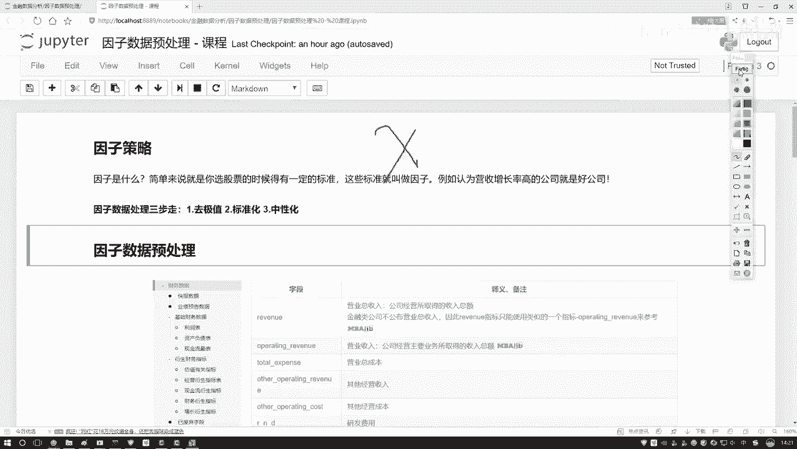

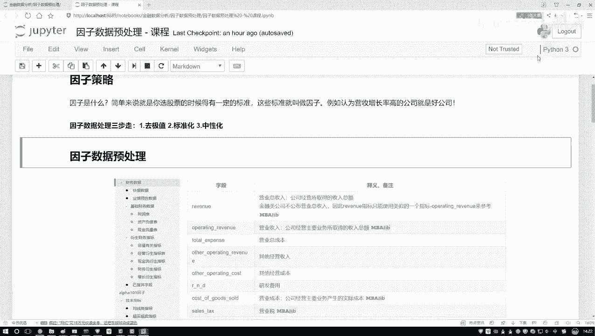

以下是因子数据预处理的三个核心步骤：
1.  **去极值**：处理数据中的离群点或异常值。
2.  **标准化**：将不同量纲和范围的因子数据转换到统一的尺度。
3.  **中性化**：消除因子数据中与某些特定风格（如行业、市值）的相关性。

## 去极值方法：百分位法
在数据挖掘中，直接使用原始数据建模可能效果不佳，因为异常值会严重影响模型。一种常见的处理思路不是直接删除异常值，而是将其“拉回”到合理的边界内。百分位法就是实现这一目标的方法之一。

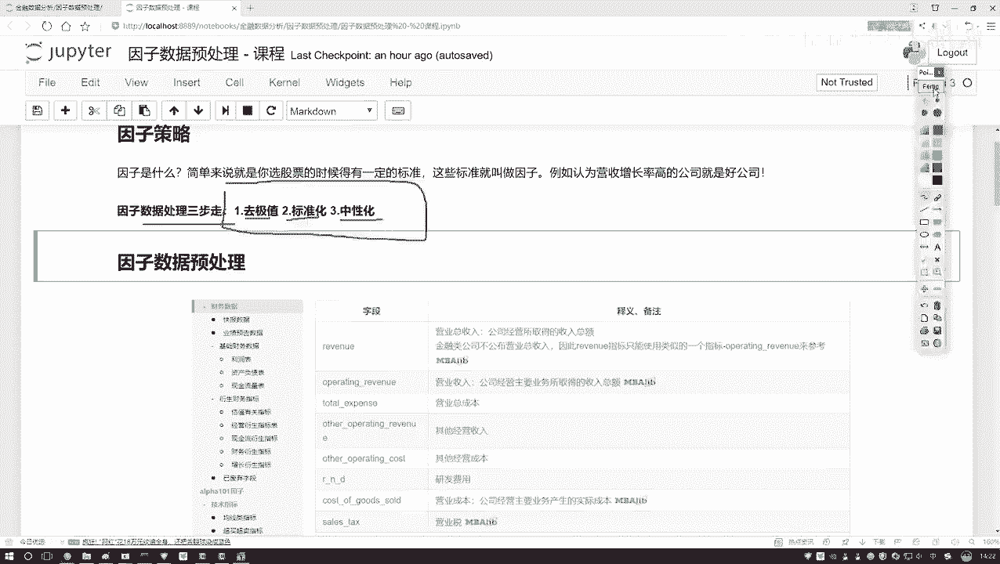

### 理解分位数
要理解百分位法，首先需要了解分位数的概念。分位数是将数据按比例划分的点。

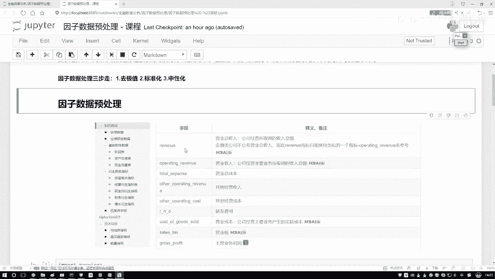

以下是几个关键的分位数：
*   **中位数 (Q2)**：将数据从小到大排列后，处于中间位置的值。它比平均值更能代表数据的“中心”，因为它不受极端值影响。
*   **下四分位数 (Q1)**：数据中所有数值由小到大排列后，处于25%位置的值。
*   **上四分位数 (Q3)**：数据中所有数值由小到大排列后，处于75%位置的值。

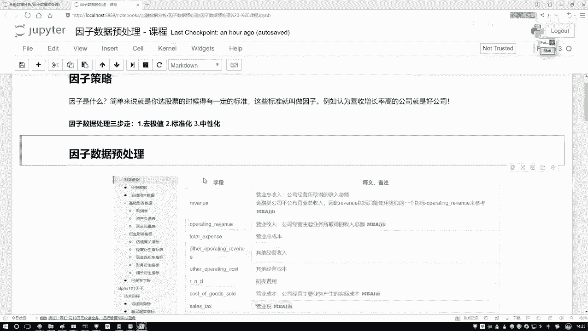

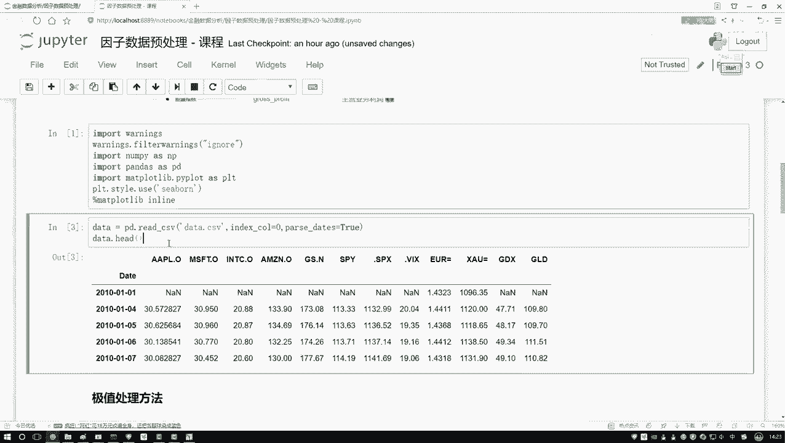

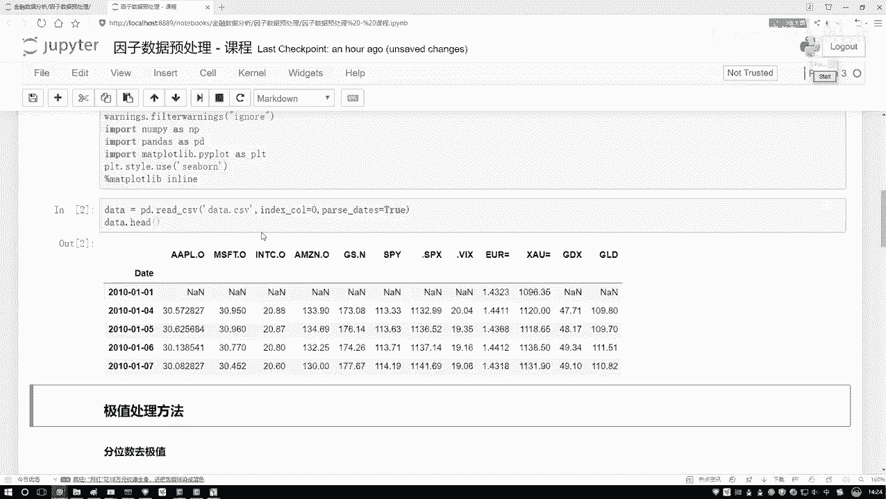

### 百分位去极值原理
百分位去极值法的核心思想是：设定一个合理的上下限，将所有超出界限的数值替换为边界值。

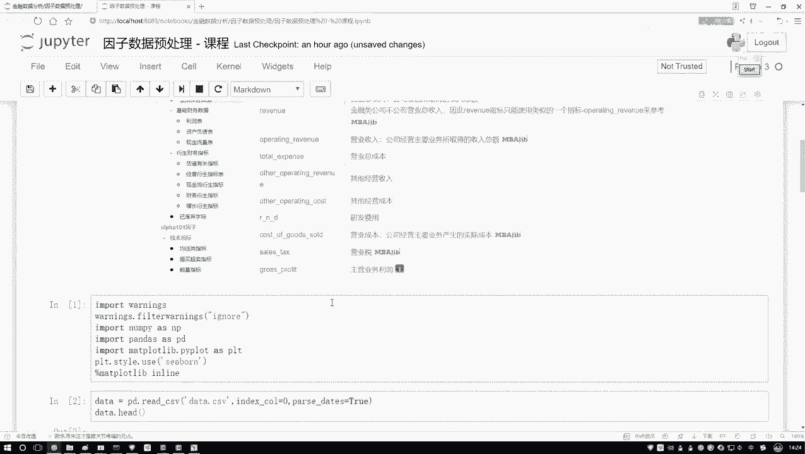

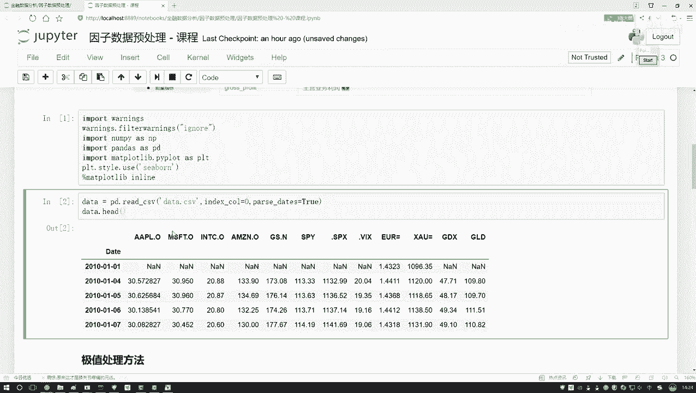

具体操作如下：
1.  计算因子数据的**下分位数**（如5%分位数）作为下限。
2.  计算因子数据的**上分位数**（如95%分位数）作为上限。
3.  遍历所有数据点：
    *   如果数值小于下限，则将其**替换为下限值**。
    *   如果数值大于上限，则将其**替换为上限值**。
    *   如果数值在上下限之间，则**保持不变**。

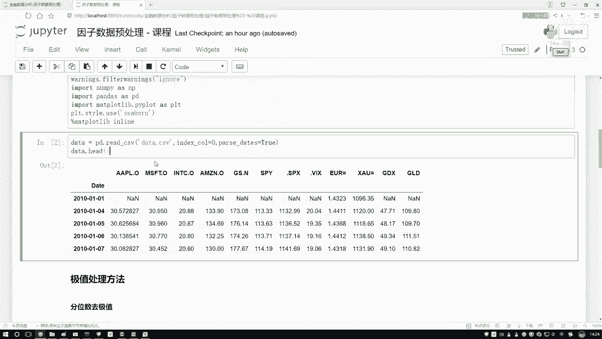

这种方法可以有效“修剪”掉分布两端的极端值，同时保留了大部分数据的信息。

### 代码示例
以下是一个使用Python和pandas实现百分位去极值的简单示例。我们将以苹果公司股价数据为例进行演示。

```python
import pandas as pd
import numpy as np

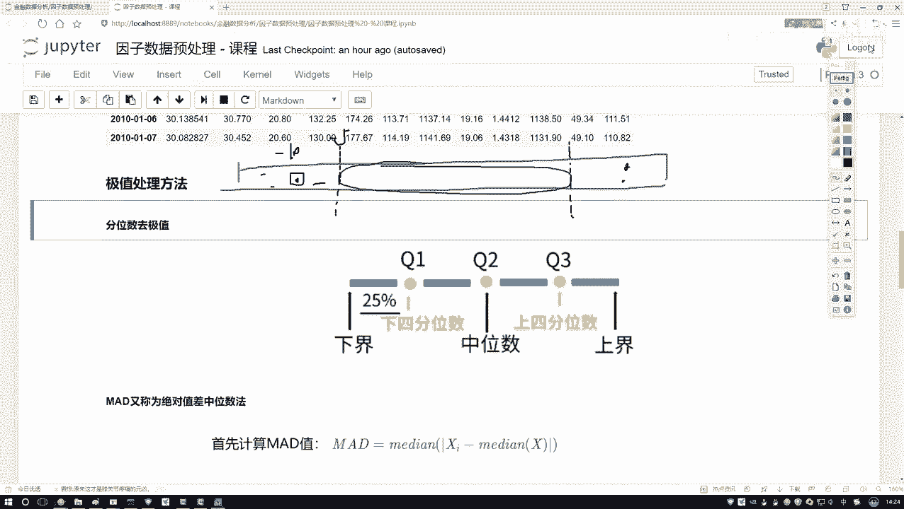

# 1. 读取示例数据（这里用股价代替因子数据）
data = pd.read_csv(‘apple_stock_price.csv‘) # 假设有‘close‘列代表收盘价
factor_data = data[‘close‘]

# 2. 定义百分位去极值函数
def winsorize_percentile(series, lower_percentile=5, upper_percentile=95):
    """
    使用百分位法对序列进行去极值处理。
    参数:
        series: pandas Series, 待处理的数据序列。
        lower_percentile: int, 下限百分位，默认5%。
        upper_percentile: int, 上限百分位，默认95%。
    返回:
        处理后的pandas Series。
    """
    # 计算上下限
    lower_bound = np.percentile(series, lower_percentile)
    upper_bound = np.percentile(series, upper_percentile)
    
    # 将超出边界的值替换为边界值
    series_winsorized = series.copy()
    series_winsorized[series_winsorized < lower_bound] = lower_bound
    series_winsorized[series_winsorized > upper_bound] = upper_bound
    
    return series_winsorized

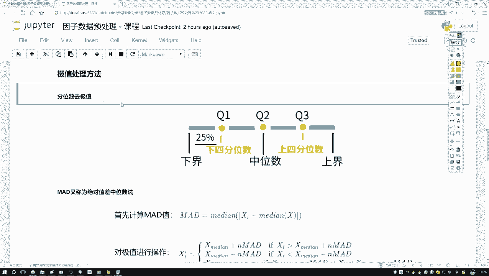

# 3. 应用函数处理数据
processed_data = winsorize_percentile(factor_data)
print(“原始数据描述：\n“, factor_data.describe())
print(“\n去极值后数据描述：\n“, processed_data.describe())
```

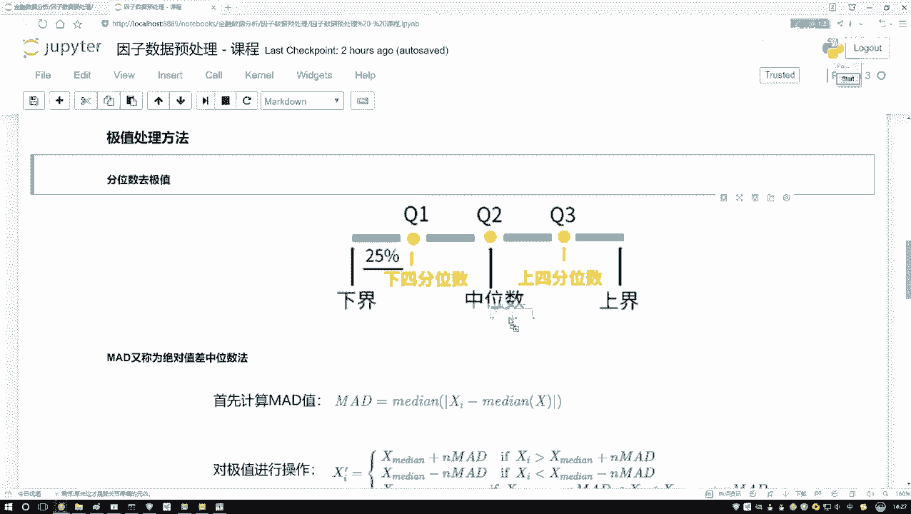

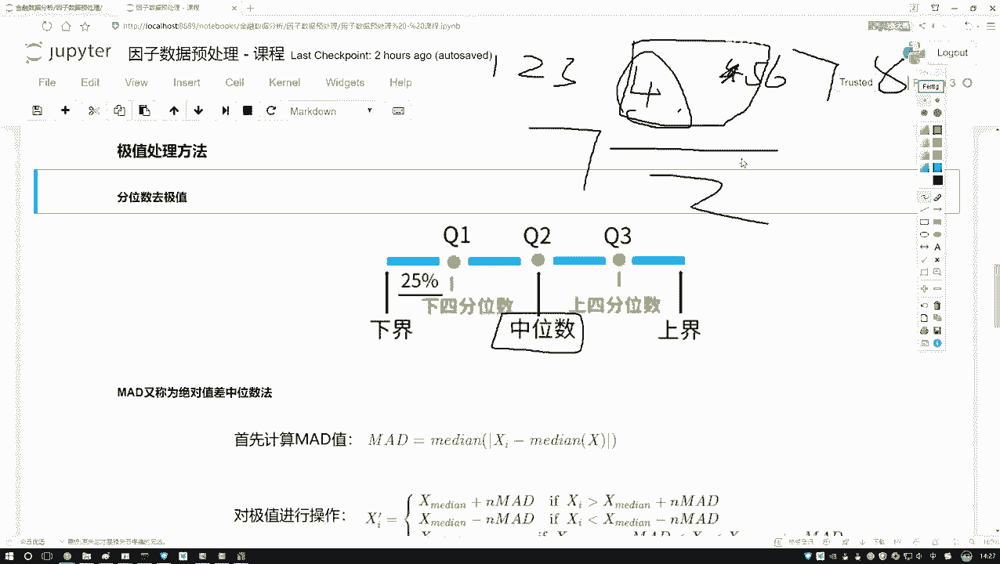

在这段代码中，`winsorize_percentile` 函数计算了数据的第5百分位数和第95百分位数作为边界，然后将所有小于下限的值设为下限，大于上限的值设为上限。

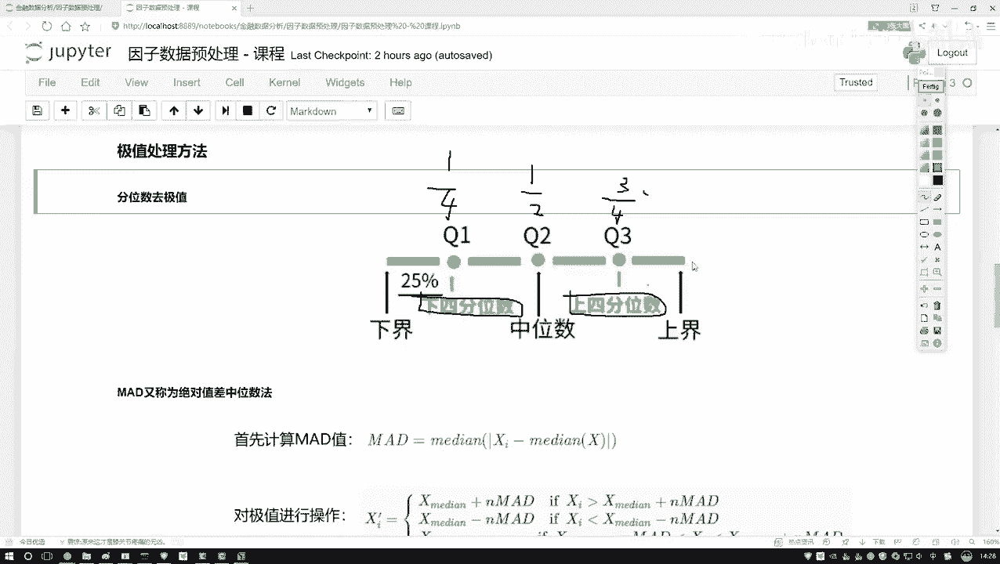

## 总结
本节课中我们一起学习了量化交易中因子预处理的第一步——去极值。我们重点介绍了**百分位去极值法**，理解了其通过设定分位数边界来“拉回”异常值的原理，并通过代码示例演示了如何用Python实现这一过程。处理后的数据将更稳定，为后续的标准化、中性化以及建模分析打下良好基础。下一节，我们将继续学习因子标准化的方法。