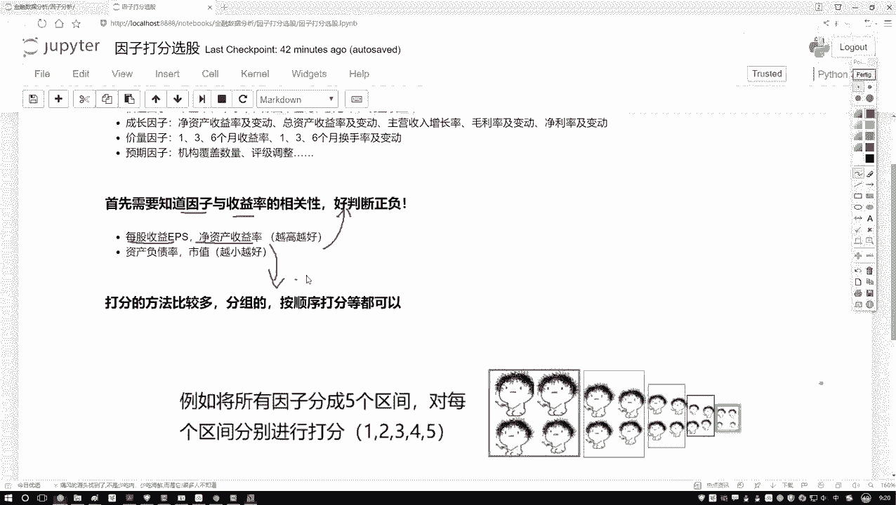
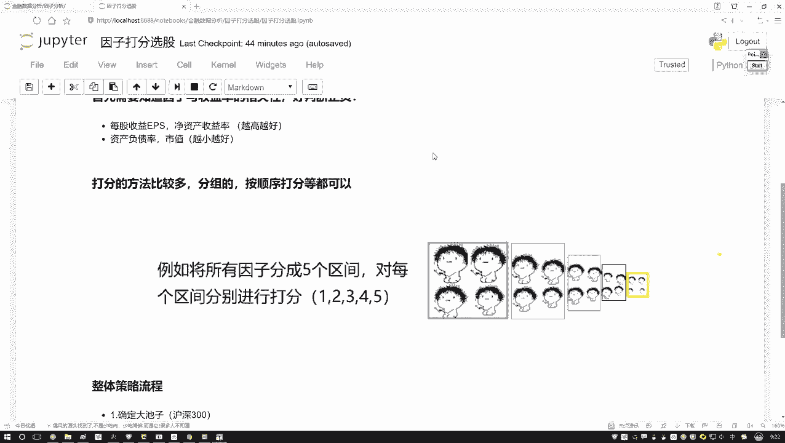
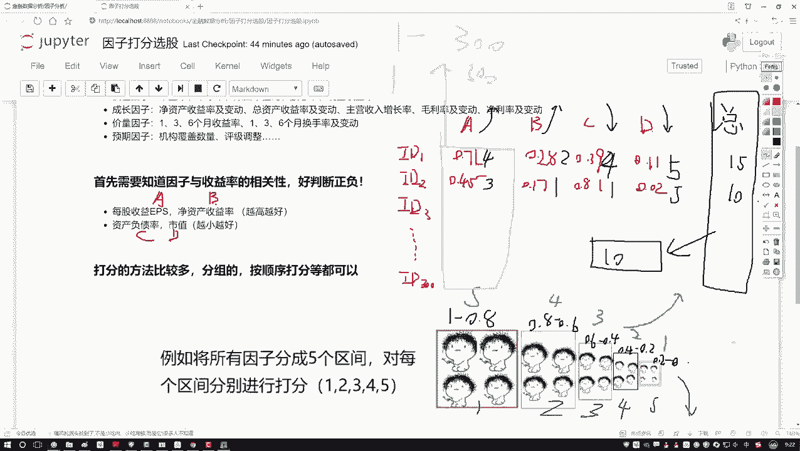
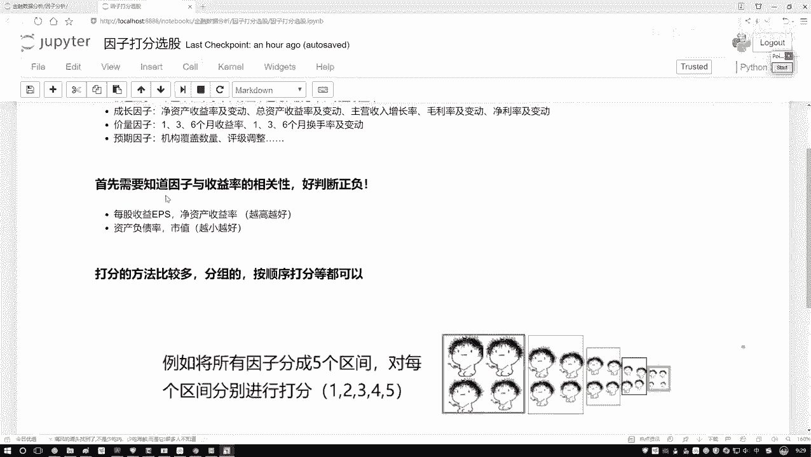
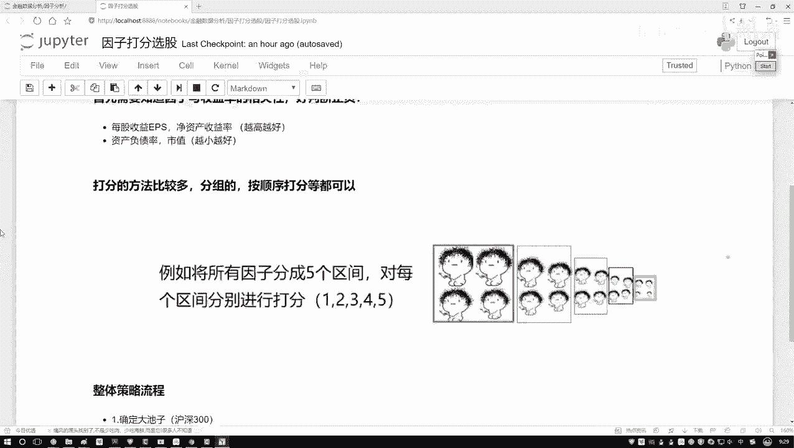
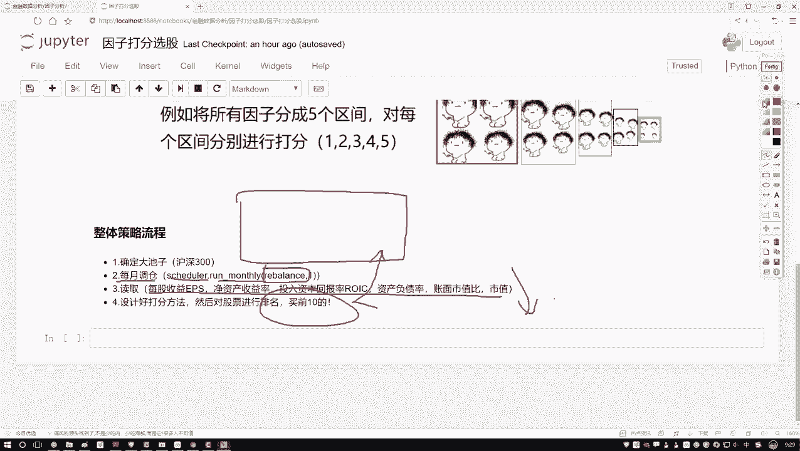
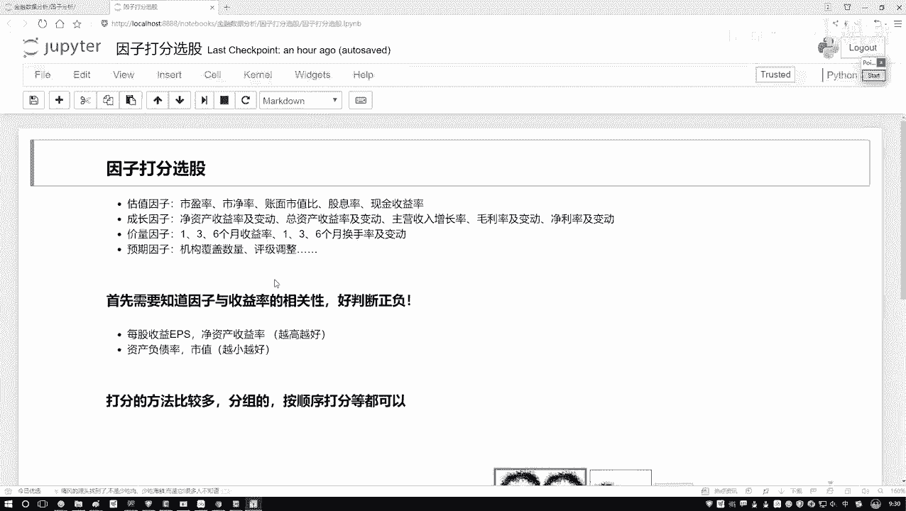

# Python机器学习与量化交易：P48：49.49.2-整体任务流程梳理 📊



在本节课中，我们将学习量化交易策略中的一个核心环节——**因子打分法**。我们将详细拆解如何根据已知的财务或技术指标，对股票池中的每一只股票进行评分，并基于总分进行排序和选股，最终构建一个可执行的月度调仓策略。



---

## 因子打分法详解

上一节我们介绍了如何获取和预处理因子数据。本节中，我们来看看如何利用这些数据对股票进行打分和排序。

打分法的核心思想是：为每个对股票未来收益有预测作用的因子（指标）赋予一个分数，然后将所有因子的分数汇总，得到每只股票的总分。最后，根据总分排名，选择排名靠前的股票构成投资组合。

以下是两种常见的打分方法：

### 方法一：区间划分法

此方法将每个因子的数值范围划分为若干个区间，并为每个区间设定一个固定的分数。

1.  **确定因子方向**：首先明确每个因子是“越大越好”还是“越小越好”。
    *   **越大越好**：例如净资产收益率(ROE)、营业收入增长率。
    *   **越小越好**：例如资产负债率、市盈率(PE)。

2.  **划分区间并赋值**：将因子数值（或归一化后的数值、百分位）按大小排序，并划分为N个区间（例如5个）。根据因子方向，为不同区间赋予分数。
    *   **对于“越大越好”的因子**：数值最大的区间得分最高。
    *   **对于“越小越好”的因子**：数值最小的区间得分最高。

**示例**：
假设因子A（越大越好）的归一化数值在0到1之间。我们将其划分为5个区间并打分：

| 数值区间 | 得分 |
| :--- | :--- |
| [0.8, 1.0] | 5 |
| [0.6, 0.8) | 4 |
| [0.4, 0.6) | 3 |
| [0.2, 0.4) | 2 |
| [0.0, 0.2) | 1 |

假设因子C（越小越好）也进行区间划分，则打分方向相反：

| 数值区间 | 得分 |
| :--- | :--- |
| [0.0, 0.2) | 5 |
| [0.2, 0.4) | 4 |
| [0.4, 0.6) | 3 |
| [0.6, 0.8) | 2 |
| [0.8, 1.0] | 1 |

3.  **计算单因子得分**：根据每只股票在该因子上的实际数值，找到其所属区间，获得对应分数。
4.  **计算总分**：将所有因子的得分相加，得到该股票的总分。
5.  **排序选股**：对所有股票按总分从高到低排序，选择排名前K的股票。

### 方法二：直接排序法

此方法更为直接，无需划分区间。

1.  **确定因子方向**：同上，明确每个因子的好坏方向。
2.  **排序赋值**：在每个调仓时点，对股票池中所有股票按单个因子进行排序。
    *   **对于“越大越好”的因子**：排序第1名（最大）得N分（N为股票总数），最后一名得1分。
    *   **对于“越小越好”的因子**：排序第1名（最小）得N分，最后一名得1分。
3.  **计算总分与排序选股**：将各因子的排序得分相加得到总分，再根据总分进行最终排序，选取前K名。

**代码描述（直接排序法思路）**：
```python
# 假设 df 是包含多只股票、多个因子列的数据框
# ‘factor_a’ 越大越好，‘factor_c’ 越小越好

# 对‘越大越好’的因子排序赋值
df[‘score_a‘] = df[‘factor_a‘].rank(ascending=False) # 降序排名，值越大排名越靠前（分数越高）
# 对‘越小越好’的因子排序赋值
df[‘score_c‘] = df[‘factor_c‘].rank(ascending=True)  # 升序排名，值越小排名越靠前（分数越高）

# 计算总分
df[‘total_score‘] = df[[‘score_a‘, ‘score_c‘]].sum(axis=1)

# 按总分降序排序，选取前10名
selected_stocks = df.nlargest(10, ‘total_score‘)
```



---





## 整体策略流程梳理 🚀

了解了打分法的原理后，我们来看一个完整的月度调仓策略流程。这个流程将指导我们后续的代码实现。

以下是策略执行的步骤：

1.  **确定股票池**：首先，定义我们的选股范围。例如，选择**沪深300指数**成分股作为初选股票池。
2.  **设置调仓周期**：设定策略的调仓频率，例如**每月调仓一次**。这需要通过定时器函数来实现。
3.  **实现调仓函数**：这是策略的核心。在每个调仓日，执行以下操作：
    *   **数据获取与预处理**：获取股票池中所有股票在调仓日的最新因子数据（如ROE、资产负债率等），并进行必要的清洗和标准化。
    *   **因子打分**：应用上述打分法（区间划分法或直接排序法），为每只股票的每个因子计算得分。
    *   **汇总与排序**：将所有因子的得分相加，计算每只股票的总分，并按总分从高到低排序。
    *   **生成交易清单**：选择总分排名前N（例如前10）的股票，作为本期要买入或持有的标的。同时，卖出不在这个名单中的现有持仓。
4.  **回测与评估**：将上述逻辑在历史数据中运行，评估策略的收益、风险等表现。

---



## 总结



本节课中我们一起学习了量化交易中的**因子打分法**。我们掌握了两种具体的实现方式：**区间划分法**和**直接排序法**，并梳理了一个完整的**月度调仓策略**的工作流程。这个方法逻辑清晰、计算简单，是构建多因子选股模型的基础。在接下来的实践中，我们将运用这些知识，尝试构建一个简单的打分策略，并观察其历史表现。