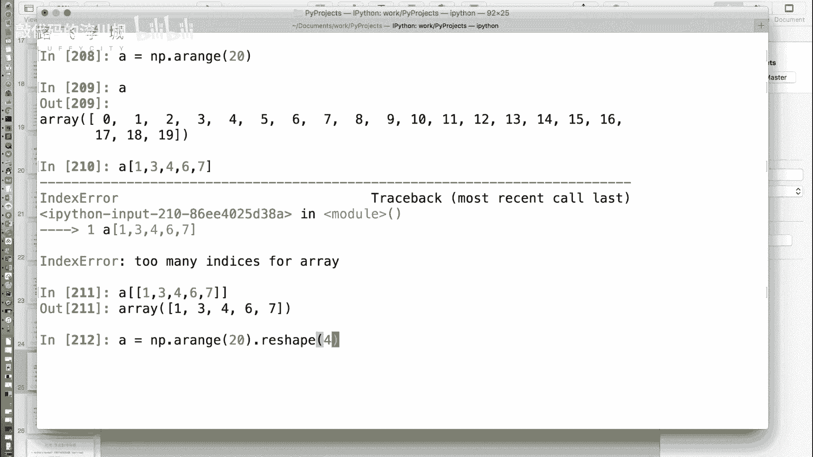
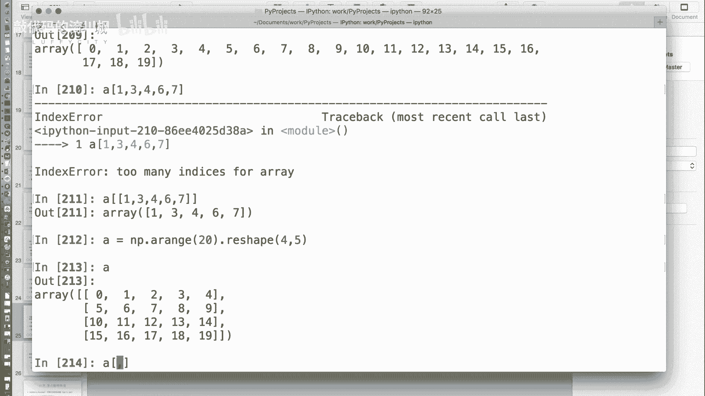
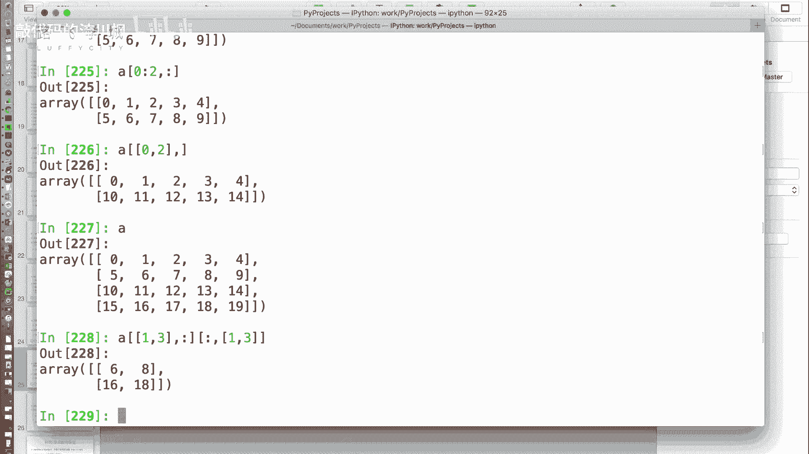

# 金融量化分析：P12：NumPy数组的花式索引 🎯

在本节课中，我们将要学习NumPy数组的另一种高级索引方式——花式索引。我们将了解如何使用它来选取数组中任意、无规律位置的元素，并探讨如何将其与其他索引方式结合使用。


上一节我们介绍了布尔型索引，本节中我们来看看花式索引。

## 什么是花式索引？ 🤔

花式索引允许我们通过传递一个整数数组来选取数组中任意位置的元素。这与切片不同，切片选取的是连续区域，而花式索引可以选取无规律分布的元素。

例如，对于一个数组，我们想选取其第1、3、4、6、7号元素（注意：索引从0开始）。这些位置没有规律，无法用简单的切片完成。

## 一维数组的花式索引



对于一维数组，花式索引的用法非常直接。以下是具体步骤：

1.  首先，创建一个NumPy数组。
2.  然后，定义一个包含目标索引位置的列表或数组。
3.  最后，将这个索引数组传递给原数组。



以下是代码示例：
```python
import numpy as np

# 创建一个一维数组
a = np.arange(20)  # 生成0到19的数组
print("原始数组 a:")
print(a)

# 使用花式索引选取第1、3、4、6、7号元素（索引为 1, 3, 4, 6, 7）
indices = [1, 3, 4, 6, 7]
selected_elements = a[indices]
print("\n选取索引为 [1, 3, 4, 6, 7] 的元素:")
print(selected_elements)
```
运行上述代码，`selected_elements` 将是一个包含 `[1, 3, 4, 6, 7]` 的新数组。这正是原数组在对应索引位置的值。

## 二维数组的花式索引

对于二维数组，索引方式变得更加灵活。我们可以将不同的索引方法（普通索引、切片、布尔索引、花式索引）组合在逗号两侧，分别用于选择行和列。

以下是几种常见的组合方式：

*   **行用普通索引，列用切片**：选取指定行的连续列。
    ```python
    arr_2d = np.arange(20).reshape(4, 5) # 创建一个4行5列的二维数组
    # 选取第0行，第2到第4列（不包含第4列）
    result = arr_2d[0, 2:4]
    ```
*   **行用普通索引，列用布尔索引**：选取指定行中满足条件的列。
    ```python
    # 选取第0行中所有大于2的元素
    result = arr_2d[0, arr_2d[0] > 2]
    ```
*   **行和列都使用花式索引（注意陷阱）**：如果直接在逗号两边都使用花式索引列表，NumPy会将其解释为选取坐标对 `(row[i], col[i])` 的元素，而不是选取所有行和列的组合。
    ```python
    # 这会选取位置 (1,1) 和 (3,3) 的元素，而不是第1、3行与第1、3列的交集。
    result = arr_2d[[1, 3], [1, 3]] # 结果为 [6, 18]
    ```

## 如何正确选取二维数组的行列子集？ 🧩

如果我们想选取一个二维数组中，特定行和特定列交叉的所有元素（例如第1、3行与第1、3列的交集，共4个元素），需要分两步进行。

以下是分步选取的方法：

1.  **第一步：用花式索引选取目标行，同时选取所有列。**
    ```python
    # 选取第1行和第3行（索引为1和3），所有列（用冒号:表示）
    rows_selected = arr_2d[[1, 3], :]
    ```
2.  **第二步：在第一步的结果上，再选取目标列。**
    ```python
    # 在 rows_selected 的基础上，选取所有行，第1列和第3列
    final_result = rows_selected[:, [1, 3]]
    ```
    也可以将两步合并为一行代码：
    ```python
    final_result = arr_2d[[1, 3], :][:, [1, 3]]
    ```
    这样就能正确得到由第1、3行与第1、3列交叉点元素组成的新二维数组。

## 总结 📝

本节课中我们一起学习了NumPy数组的**花式索引**。




*   **核心概念**：花式索引通过传递一个整数数组，可以灵活地选取数组中任意、无规律位置的元素。
*   **一维数组**：直接使用索引列表，如 `a[[1,3,4]]`。
*   **二维数组**：索引方法可以灵活组合。使用逗号分隔行和列的索引方式。
*   **重要注意点**：在二维数组中，逗号两侧**不能同时直接使用两个花式索引列表**来选取行列子集，否则会得到坐标对元素。正确的方法是分步选取：先选行再选列，或先选列再选行。


通过掌握普通索引、切片、布尔索引和花式索引，你已经能够非常灵活地操作NumPy数组，提取所需的任何数据片段，这是进行金融数据分析和处理的基础。