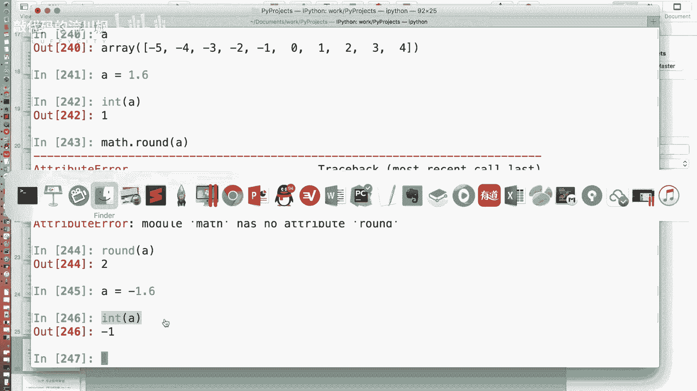
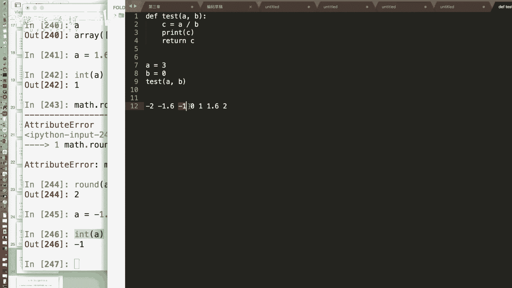
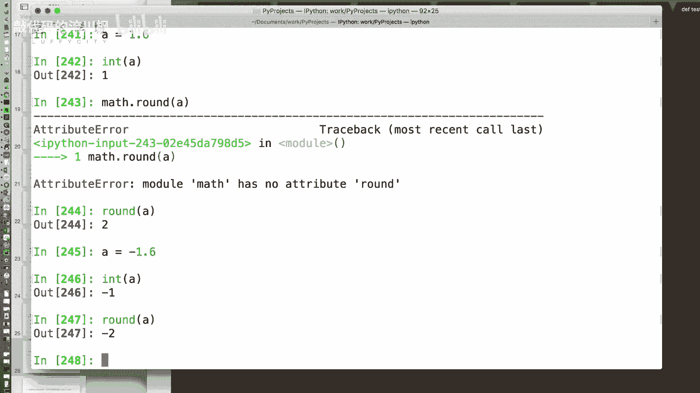
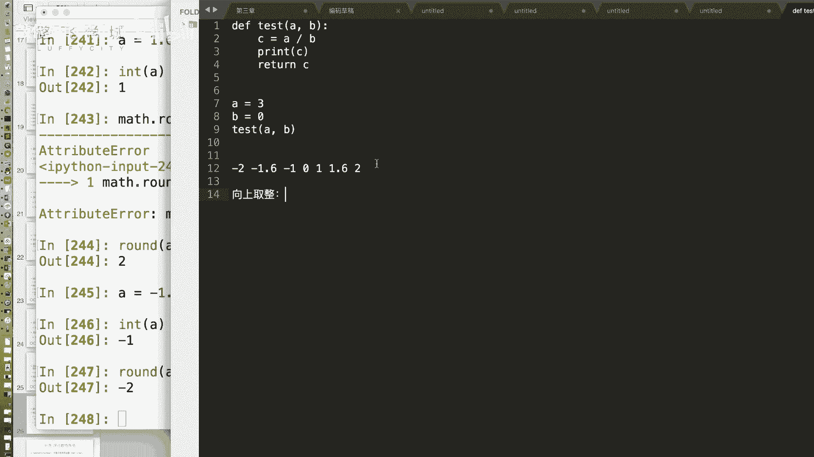
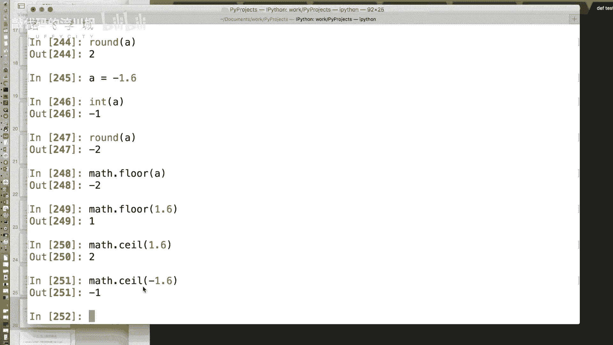
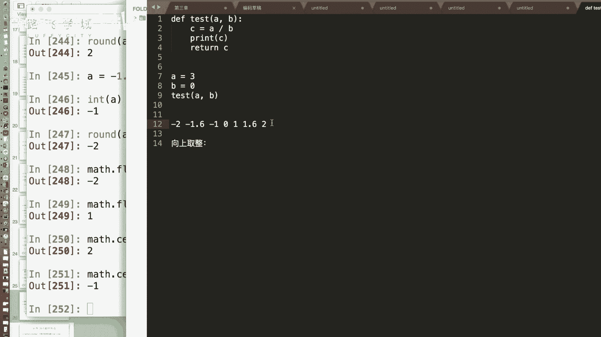

# 金融量化分析：13：NumPy数组通用函数 🧮

在本节课中，我们将学习NumPy库中的“通用函数”。这些函数可以对数组进行快速的、元素级的数学运算，是进行高效数值计算的基础。

上一节我们介绍了数组的索引功能，本节中我们来看看NumPy提供的这些强大的数学运算工具。

## 通用函数概述

NumPy的通用函数可以对数组进行批量运算。除了基本的加减乘除，NumPy还提供了许多其他数学函数。



### 一元通用函数





一元函数是指只接受一个数组作为参数的函数。以下是几个常用的一元函数示例：



**绝对值运算**
标准库中的`abs`函数可以取绝对值。对于数组，我们可以使用NumPy的版本。
```python
import numpy as np
A = np.array([-5, -2, 0, 2, 5])
# 使用NumPy的abs函数
result = np.abs(A)
```



**平方根运算**
对数组中的每个元素进行开方运算。
```python
A = np.array([4, 9, 16])
# 使用np.sqrt进行开方
result = np.sqrt(A)
# 注意：对负数开方会产生NaN（非数字）
```



### 四种取整方式

将小数转换为整数有四种不同的方法，它们代表不同的“取整方向”。

以下是四种取整方式的对比：
*   **向零取整**：直接去掉小数部分。`int()`函数或`np.trunc()`实现此功能。
    *   公式：`trunc(x) = sign(x) * floor(|x|)`
*   **向下取整**：取不大于原数的最大整数。使用`np.floor()`函数。
    *   公式：`floor(x) = max{n ∈ Z | n ≤ x}`
*   **向上取整**：取不小于原数的最小整数。使用`np.ceil()`函数。
    *   公式：`ceil(x) = min{n ∈ Z | n ≥ x}`
*   **四舍五入**：根据小数部分进行四舍五入。使用`np.round()`或`np.rint()`函数。

```python
A = np.array([1.6, -1.6])
print(np.trunc(A))   # 输出：[ 1. -1.]
print(np.floor(A))   # 输出：[ 1. -2.]
print(np.ceil(A))    # 输出：[ 2. -1.]
print(np.round(A))   # 输出：[ 2. -2.]
```

**分离整数与小数部分**
`np.modf`函数可以将一个数组的整数部分和小数部分分开，并返回两个独立的数组。
```python
A = np.array([1.2, 3.7, 5.0])
integer_part, fractional_part = np.modf(A)
```

### 特殊值：NaN与Inf

在数值计算中，会遇到两种特殊的浮点数值。

**NaN**
NaN代表“Not a Number”（非数字）。它出现在数学上未定义的运算中，例如：
*   0除以0
*   负数的平方根
*   无穷大减无穷大

**重要特性**：NaN不等于任何值，甚至不等于它自己。因此，判断一个值是否为NaN必须使用专门的函数`np.isnan()`。
```python
# 错误判断方式
value = np.nan
print(value == np.nan)  # 输出：False

# 正确判断方式
print(np.isnan(value))  # 输出：True

# 过滤数组中的NaN值
arr = np.array([1, 2, np.nan, 4, np.nan])
filtered_arr = arr[~np.isnan(arr)]  # 使用布尔索引和取反操作符 ~
```

**Inf**
Inf代表“Infinity”（无穷大）。它出现在一个非零数除以零的运算中。
```python
# 判断无穷大
arr = np.array([1, 2, np.inf, 4])
is_inf_arr = np.isinf(arr)

# 过滤数组中的Inf值
filtered_arr = arr[~np.isinf(arr)]
```

### 二元通用函数

二元函数是指接受两个数组作为参数的函数。除了基本的加(`+`)、减(`-`)、乘(`*`)、除(`/`)，还有两个有用的函数：

**逐元素最大值/最小值**
`np.maximum`和`np.minimum`函数会逐元素地比较两个数组，并返回一个由每个位置上较大值或较小值组成的新数组。
```python
A = np.array([3, 4, 1])
B = np.array([2, 5, 0])

max_result = np.maximum(A, B)  # 输出：[3 5 1]
min_result = np.minimum(A, B)  # 输出：[2 4 0]
```

---


本节课中我们一起学习了NumPy的通用函数。我们了解了如何对数组进行批量数学运算，掌握了四种不同的取整方法及其应用场景，认识了计算中可能出现的特殊值NaN和Inf以及如何处理它们，最后还学习了逐元素比较数组的二元函数。这些工具是进行高效数据分析和科学计算的基石。