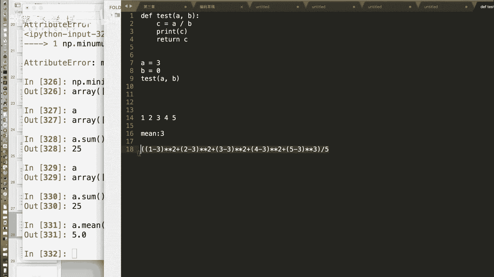
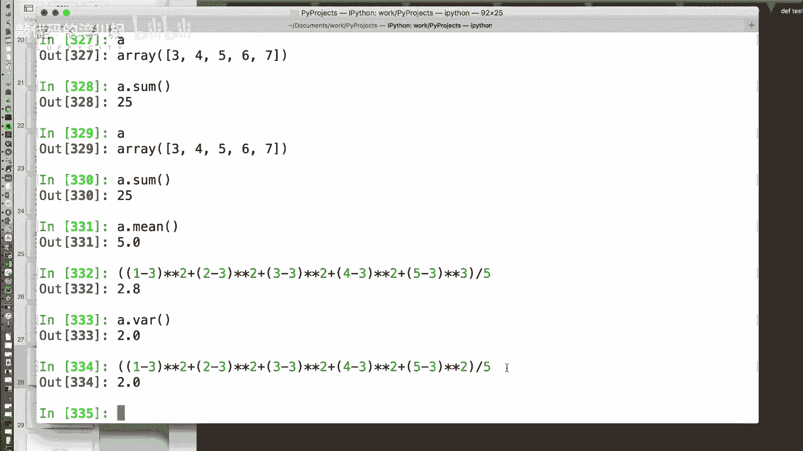
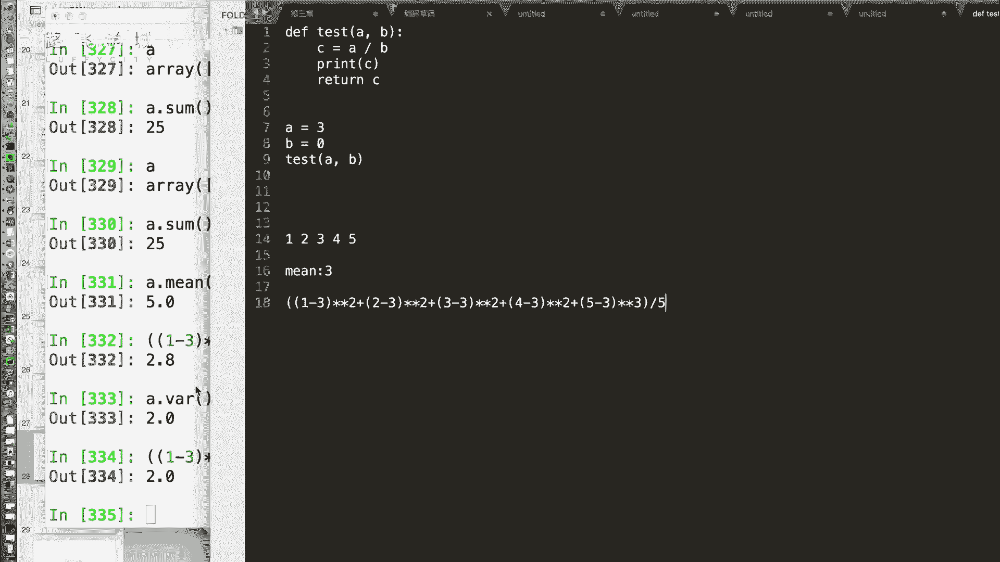
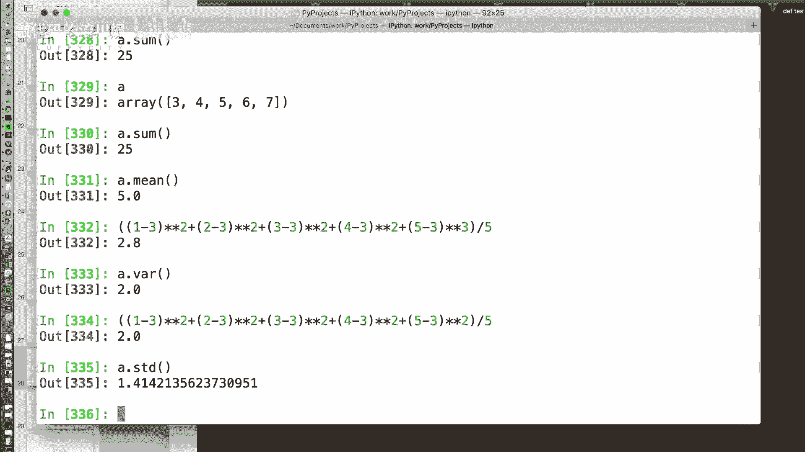
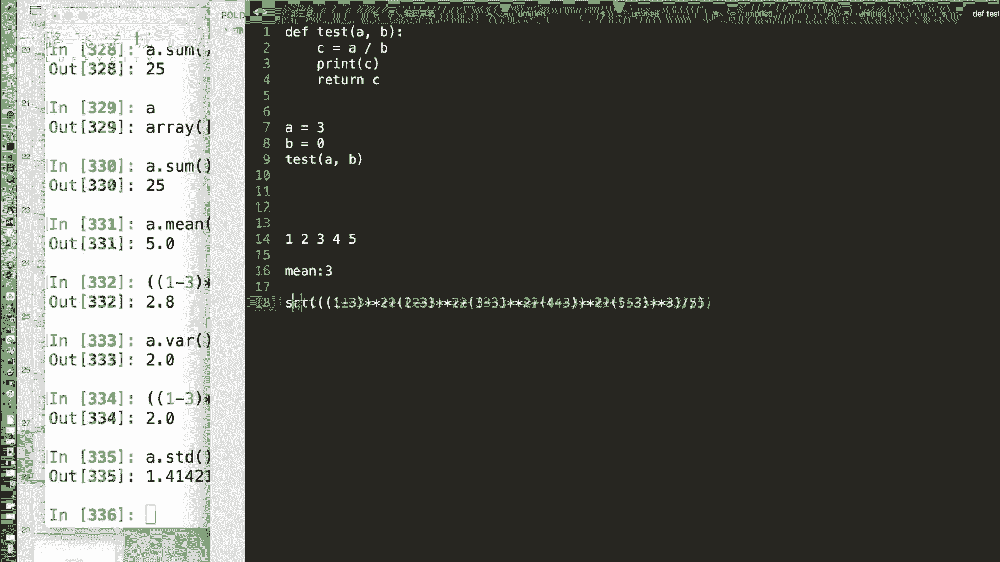
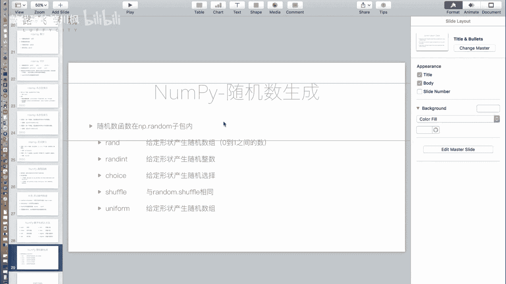

# 金融量化分析：P14：NumPy统计方法与随机数生成 📊

在本节课中，我们将学习NumPy库提供的数学统计方法和随机数生成功能。这些功能是金融量化分析中进行数据处理和模拟的基础。


## 概述

上一节我们介绍了NumPy数组的索引和切片操作。本节中，我们来看看NumPy提供的核心数学统计函数，以及如何生成随机数数组，这些在模拟金融数据和计算指标时至关重要。



## 统计方法

NumPy提供了一系列用于计算数组统计量的方法。



### 求和与平均值

`sum`方法用于计算数组中所有元素的总和。`mean`方法用于计算算术平均值。





以下是相关方法的代码示例：
```python
import numpy as np
A = np.array([1, 2, 3, 4, 5])
total = A.sum()      # 计算总和
average = A.mean()   # 计算平均值
```



### 方差与标准差

方差和标准差是衡量数据离散程度的重要指标。

方差的计算公式为：
**方差 = Σ(每个数据 - 平均值)² / 数据个数**

以数组 `[1, 2, 3, 4, 5]` 为例，其平均值为3。方差计算过程为：`((1-3)² + (2-3)² + (3-3)² + (4-3)² + (5-3)²) / 5 = 2.0`。

标准差是方差的平方根，其计算公式为：
**标准差 = √方差**

对于同一个数组，标准差为 `√2.0 ≈ 1.414`。

在NumPy中，`var`方法用于计算方差，`std`方法用于计算标准差。

以下是计算方差和标准差的代码：
```python
variance = A.var()   # 计算方差
std_dev = A.std()    # 计算标准差
```

### 最大值与最小值

`max`和`min`方法分别用于查找数组中的最大值和最小值。`argmax`和`argmin`方法则返回最大值和最小值所在位置的索引。

以下是查找极值及其索引的示例：
```python
max_value = A.max()        # 最大值
min_value = A.min()        # 最小值
max_index = A.argmax()     # 最大值索引
min_index = A.argmin()     # 最小值索引
```

## 随机数生成

NumPy的随机数模块`np.random`功能强大，它扩展了Python内置`random`模块的功能，支持直接生成数组形式的随机数。

以下是`np.random`中一些常用函数的介绍：

*   `np.random.rand()`: 生成一个[0,1)区间内的随机浮点数。
*   `np.random.randint(low, high, size)`: 生成指定范围内的随机整数。`size`参数可以指定输出数组的形状。
*   `np.random.choice(a, size)`: 从给定数组`a`中随机抽取元素。`size`参数指定抽取次数，返回一个数组。
*   `np.random.shuffle(x)`: 将数组`x`的元素顺序随机打乱。
*   `np.random.uniform(low, high, size)`: 生成指定区间内均匀分布的随机浮点数数组。

以下是一些生成随机数数组的代码示例：
```python
# 生成一个10个元素的0-1随机数数组
random_array = np.random.rand(10)

# 生成一个3行5列的、元素在0到10之间的随机整数数组
int_matrix = np.random.randint(0, 10, size=(3, 5))



# 从[1,3,5,7,9]中随机抽取10次，形成数组
choices = np.random.choice([1, 3, 5, 7, 9], size=10)

# 生成10个在2.0到4.0之间的均匀分布随机数
uniform_nums = np.random.uniform(2.0, 4.0, 10)
```

## 总结

本节课中我们一起学习了NumPy的统计与随机功能。我们掌握了计算数据总和、平均值、方差和标准差的方法，理解了这些统计量在衡量数据特征时的意义。同时，我们重点学习了使用`np.random`模块生成各种随机数数组的技巧，这是进行数据模拟和蒙特卡洛分析的基础。NumPy作为底层计算库，为我们后续学习更高级的金融数据分析工具（如Pandas）奠定了坚实的数学基础。