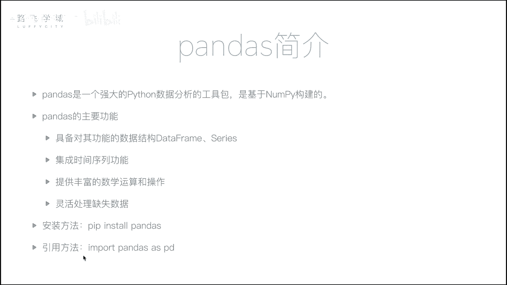
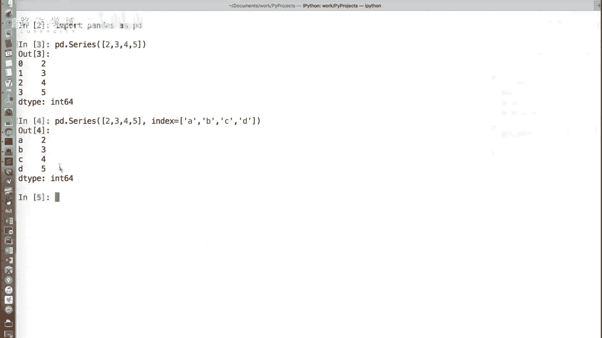
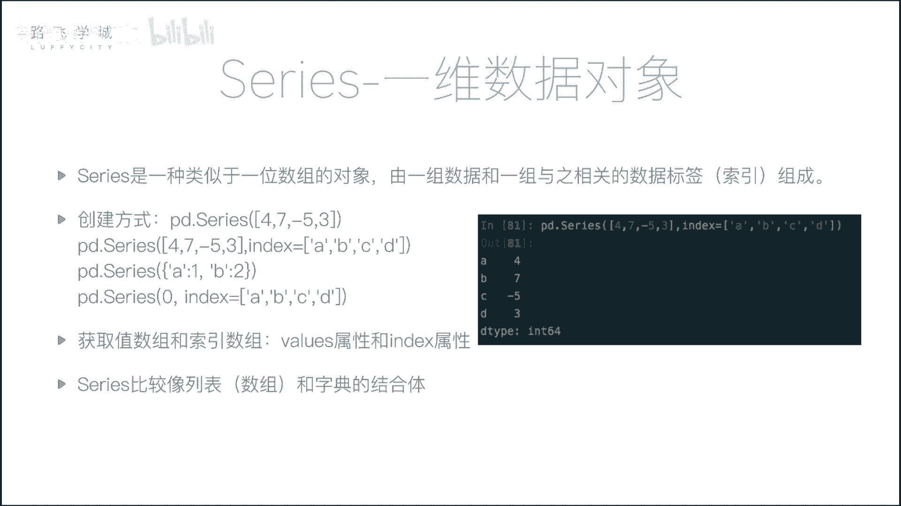
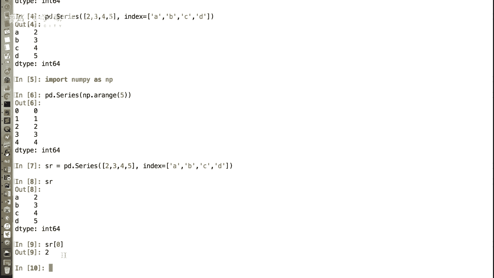
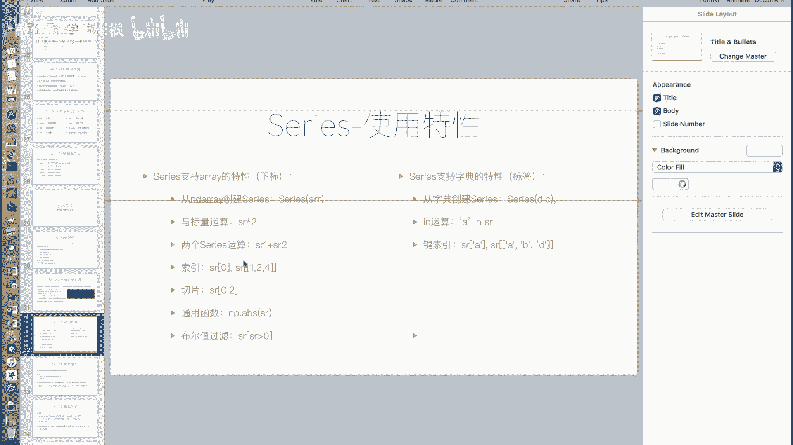
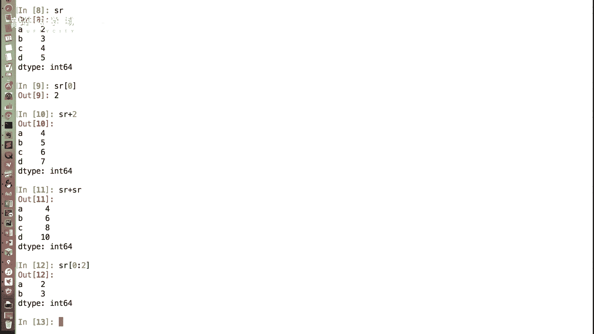
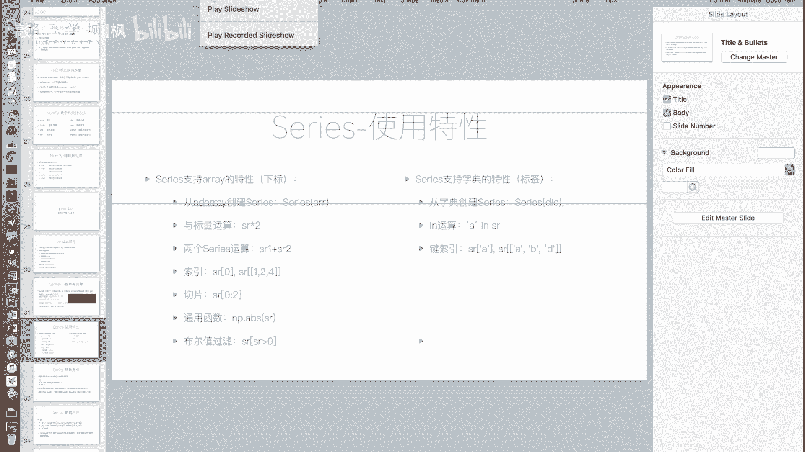
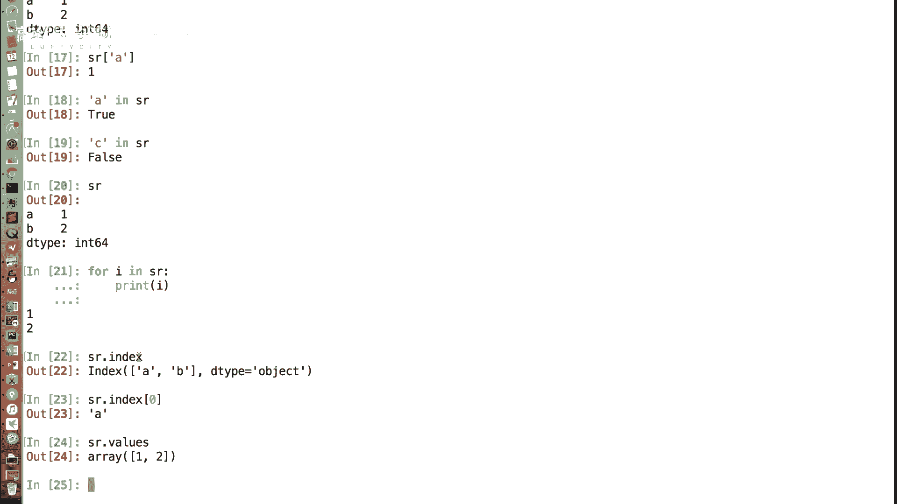
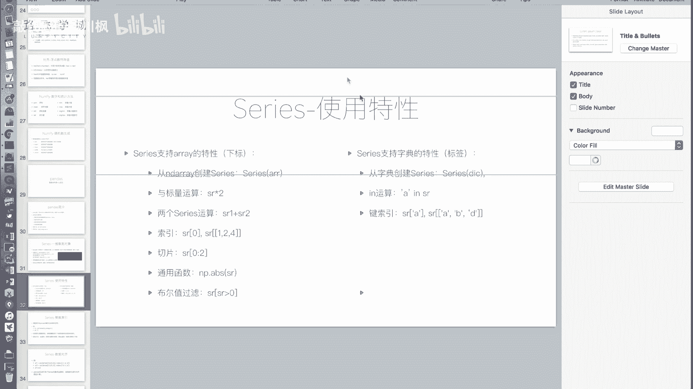
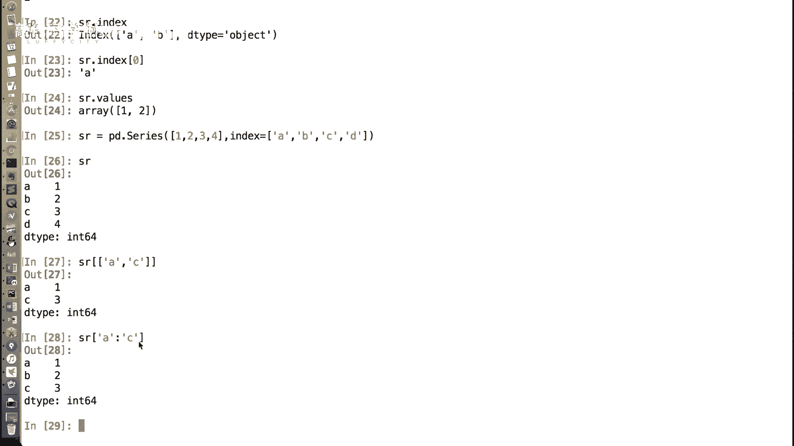

# 金融量化分析：P15：Series介绍 📊

在本节课中，我们将要学习Pandas库中的第一个核心数据结构——**Series**。Series是构建Pandas数据分析能力的基础，理解它对于后续学习DataFrame至关重要。

上一节我们介绍了NumPy，它是一个强大的数值计算基础包。本节中我们来看看基于NumPy构建的、在数据分析领域应用更广泛的Pandas库。Pandas封装层级更高，功能更聚焦于数据处理与分析，是使用Python进行数据分析不可或缺的工具。

Pandas的核心功能包括提供`DataFrame`和`Series`两种数据结构、集成时间序列功能、提供丰富的数学运算以及灵活处理缺失数据等。其安装方法简单，使用`pip install pandas`即可。官方建议的导入方式为：
```python
import pandas as pd
```

---



## 什么是Series？ 🤔

Series是Pandas中的一种核心数据对象，它是一个**带标签的一维数组**。你可以将其理解为**列表（或数组）与字典的结合体**：它像列表一样有序且可通过位置访问，又像字典一样可以通过自定义的标签（索引）来访问值。


以下是创建Series的基本方法：

```python
import pandas as pd

# 从列表创建Series，默认使用整数索引（0, 1, 2...）
s1 = pd.Series([2, 3, 4, 5])
print(s1)
# 输出：
# 0    2
# 1    3
# 2    4
# 3    5
# dtype: int64





# 从列表创建Series，并指定自定义索引（标签）
s2 = pd.Series([2, 3, 4, 5], index=[‘A‘, ‘B‘, ‘C‘, ‘D‘])
print(s2)
# 输出：
# A    2
# B    3
# C    4
# D    5
# dtype: int64
```

从以上示例可以看出，第一种创建方式类似列表，第二种方式则为每个值关联了一个标签，类似字典的键值对。

---

## Series的数组（列表）特性 📋

Series继承了许多来自NumPy数组或Python列表的特性，使其能进行高效的数值操作。





以下是Series支持的数组类操作：

1.  **从数组创建**：不仅可以从列表，也可以从NumPy数组创建Series。
    ```python
    import numpy as np
    arr = np.array([1, 2, 3])
    s = pd.Series(arr)
    ```

2.  **通过位置（下标）访问**：即使指定了自定义标签，依然可以通过整数位置进行访问。
    ```python
    s2 = pd.Series([2, 3, 4, 5], index=[‘A‘, ‘B‘, ‘C‘, ‘D‘])
    print(s2[0])  # 输出：2
    ```

3.  **向量化运算**：支持与标量进行运算，也支持两个相同大小的Series之间进行逐元素运算（加、减、乘、除、比较等）。
    ```python
    print(s2 * 2)          # 每个值乘以2
    print(s2 + s2)         # 两个相同Series相加
    ```





4.  **切片操作**：和列表一样，可以使用切片语法。
    ```python
    print(s2[0:2])  # 输出索引0和1对应的元素（A和B）
    ```

5.  **支持通用函数与布尔索引**：兼容NumPy的通用函数，并支持通过布尔条件进行筛选。
    ```python
    print(s2[s2 > 3])  # 输出值大于3的元素（C和D）
    ```

---

## Series的字典特性 📖

除了数组特性，Series也融合了字典的一些实用功能。

以下是Series支持的字典类操作：

1.  **从字典创建**：可以直接使用字典来创建Series，字典的键（key）会自动成为Series的索引（标签）。
    ```python
    data = {‘A‘: 2, ‘B‘: 3, ‘C‘: 4}
    s3 = pd.Series(data)
    print(s3)
    ```

2.  **通过标签访问**：这是Series区别于普通数组的核心功能，可以通过自定义的索引标签来获取值。
    ```python
    print(s3[‘A‘])  # 输出：2
    ```

3.  **`in`操作**：可以检查某个标签是否存在于Series的索引中。
    ```python
    print(‘A‘ in s3)   # 输出：True
    print(‘X‘ in s3)   # 输出：False
    ```
    **注意**：对Series进行`for`循环迭代时，默认输出的是**值**，而非索引（键）。这与字典的迭代行为不同。



4.  **花式索引与标签切片**：可以通过标签列表一次性获取多个值，也可以使用标签进行切片。**标签切片是包含结束位置的**。
    ```python
    # 花式索引
    print(s3[[‘A‘, ‘C‘]])
    # 标签切片 (包含‘B‘和‘C‘)
    print(s3[‘B‘:‘C‘])
    ```



---

## 获取索引与值 🔍

我们经常需要分别获取Series的索引部分和值部分，这可以通过以下两个属性实现：

*   **`index`属性**：获取Series的索引对象。
*   **`values`属性**：获取Series的值（通常是一个NumPy数组）。

```python
s = pd.Series([10, 20, 30], index=[‘x‘, ‘y‘, ‘z‘])
print(s.index)   # 输出：Index([‘x‘, ‘y‘, ‘z‘], dtype=‘object‘)
print(s.values)  # 输出：[10 20 30]
```

---

## Series的应用场景 💡

Series结合了有序性和键值对查询能力，使其非常适合处理**带标签的一维序列数据**。例如：



*   **股票日收盘价**：索引是日期（标签），值是当日的收盘价。你可以方便地通过日期（`s[‘2023-10-01‘]`）或位置（`s[0]`获取第一天）来查询。
*   **传感器按时间戳记录的数据**：索引是时间点，值是传感器读数。既保持了时间顺序，又能快速定位特定时刻的数据。
*   **任何需要同时通过顺序和特定键来访问的数据集合**。

这解决了传统上可能需要同时维护一个列表（保证顺序）和一个字典（快速查找）的复杂性问题。

---

本节课中我们一起学习了Pandas库的**Series**对象。我们了解到Series是一个带标签的一维数组，它巧妙地融合了列表（数组）的**有序性、切片和向量化运算**能力，以及字典的**键值对访问和查询**能力。通过`index`和`values`属性可以分别获取其索引和值。理解Series是后续学习更复杂的DataFrame结构的坚实基础。在下一节中，我们将介绍Pandas的另一个核心数据结构——DataFrame。