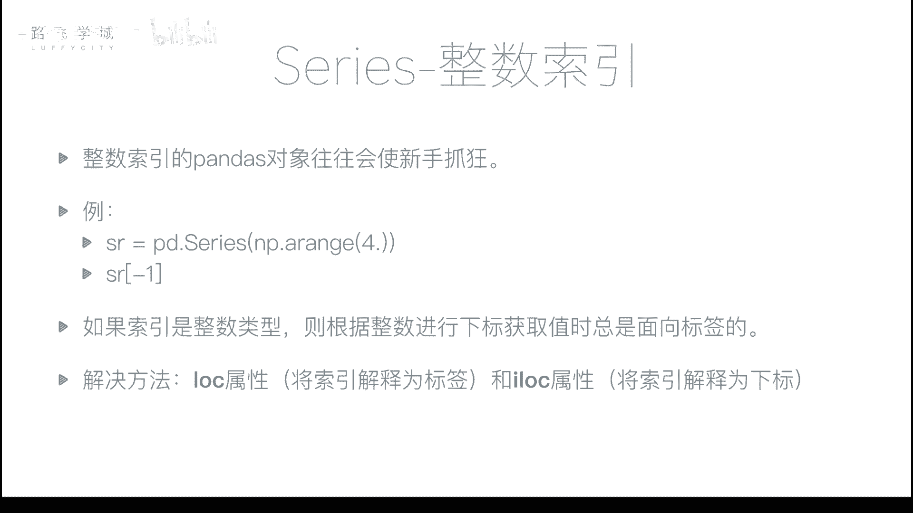
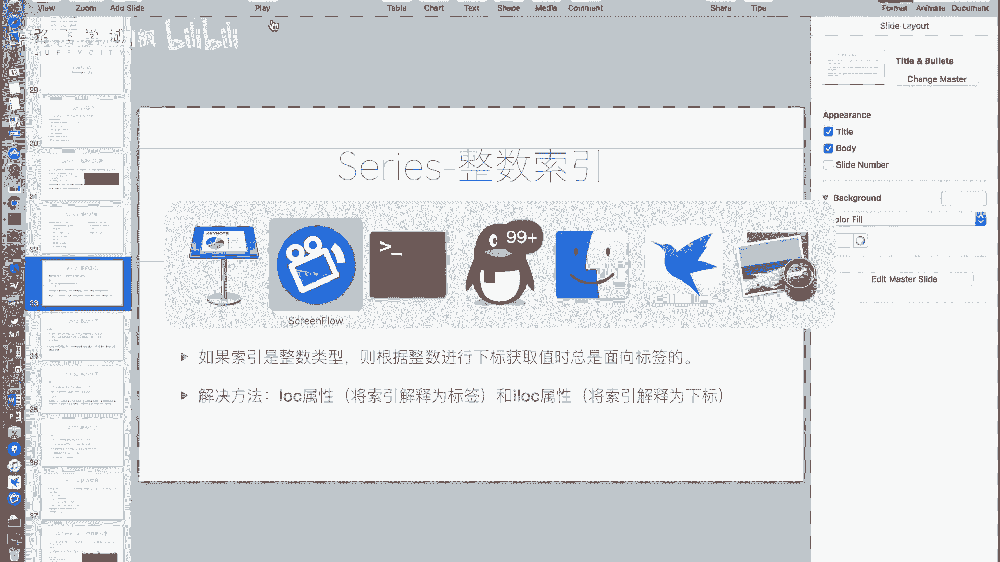
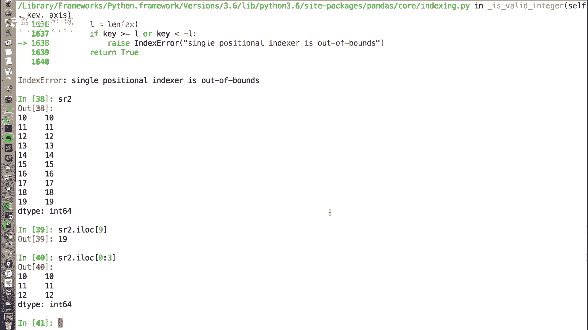
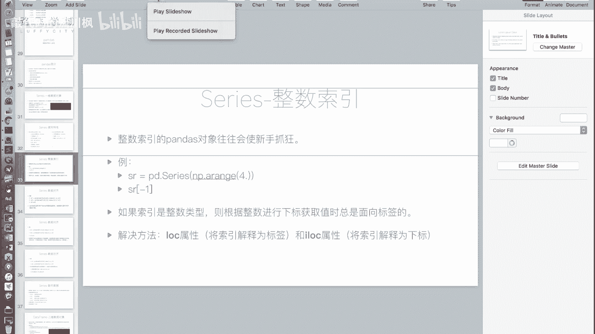

# 金融量化分析：P16：Series整数索引问题



在本节课中，我们将要学习Pandas Series对象在使用整数索引时可能遇到的歧义问题，并掌握解决这一问题的两个关键属性：`.loc`和`.iloc`。



上一节我们介绍了Series的一些基本特性，本节中我们来看看一个使用Series对象时非常重要的注意事项。当你使用整数索引的Pandas对象时，可能会产生混淆。

## 整数索引的歧义问题

整数索引是指索引值为数字的情况。例如，我们创建一个Series对象。

```python
import pandas as pd
import numpy as np

s = pd.Series(np.arange(20))
```
这个`s`对象会自动生成从0到19的整数索引。

如果我们通过切片创建一个新的Series对象。
```python
s2 = s[10:].copy()
```
这个`s2`对象的索引是从10开始的整数。此时，如果我们输入`s2[10]`，它代表什么呢？它可能被解释为“标签为10的那一行”，输出值`10`；也可能被解释为“下标为10的位置”，输出值`19`。实际上，Pandas规定，当索引是整数时，中括号`[]`内的值**总是被解释为标签**。因此，`s2[10]`会输出`10`。

然而，如果我们想获取`s2`的最后一个值（即下标为9的位置），输入`s2[19]`，程序会报错，因为标签`19`并不存在于`s2`的索引中。这种歧义很容易让初学者困惑。

## 解决方案：`.loc`与`.iloc`

为了解决整数索引的歧义问题，Pandas提供了两个明确的属性：`.loc`和`.iloc`。

以下是这两个属性的核心区别：
*   **`.loc[]`**：此属性明确指出，中括号`[]`内的值**必须解释为标签**。
*   **`.iloc[]`**：此属性明确指出，中括号`[]`内的值**必须解释为基于0的整数下标**。

使用这两个属性，我们可以清晰地表达我们的意图。

```python
# 使用 .loc，解释为标签
value_by_label = s2.loc[10]  # 输出：10

# 使用 .iloc，解释为下标
value_by_index = s2.iloc[9]  # 输出：19
```
`.loc`和`.iloc`不仅支持单个值的选取，也完全支持切片、布尔索引和花式索引等操作。它们只是明确了索引的解读方式。



例如，使用`.iloc`进行切片：
```python
# 使用 .iloc 获取前3行（基于下标）
first_three = s2.iloc[0:3]
```
因为整数索引容易产生歧义，所以只要涉及到整数索引的操作，建议都明确使用`.loc`或`.iloc`来避免混淆。



本节课中我们一起学习了Pandas Series整数索引的潜在歧义及其解决方案。核心要点是：当Series的索引为整数时，直接使用中括号`[]`会按标签解释，这可能与基于下标的直觉不符。通过使用`.loc[]`（用于标签）和`.iloc[]`（用于下标）这两个属性，可以清晰、无歧义地访问数据，这是进行有效数据分析的重要基础。