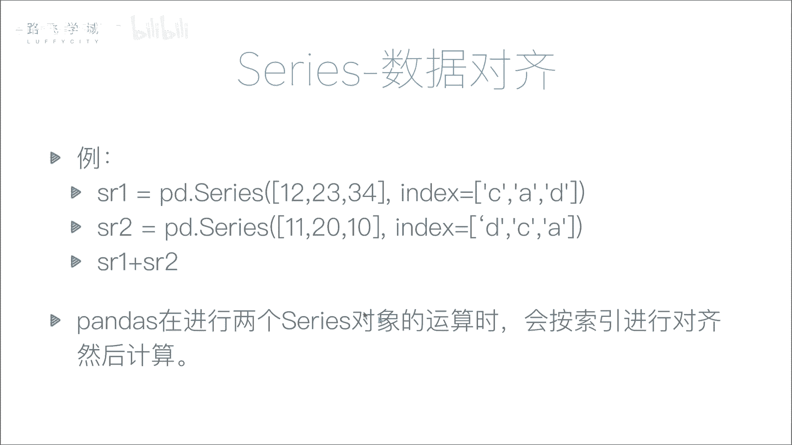
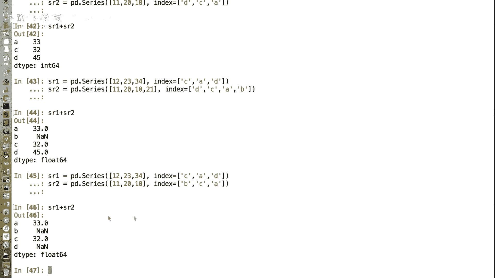
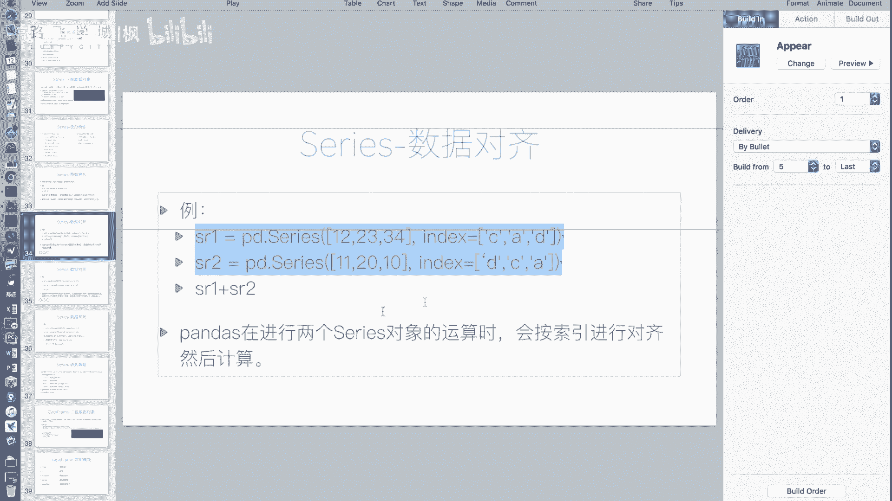
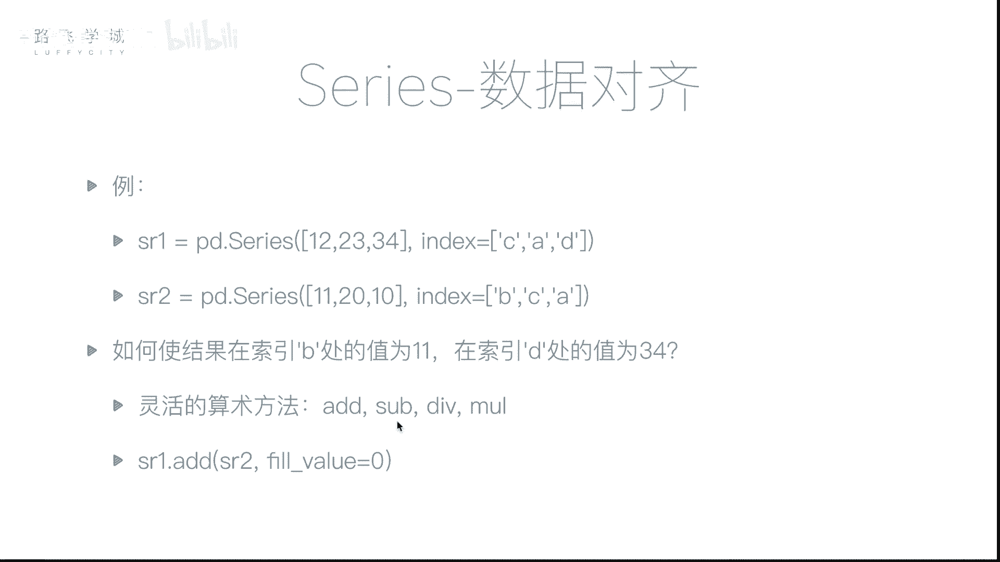
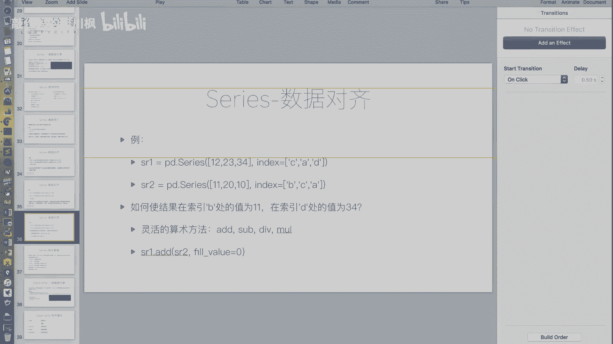
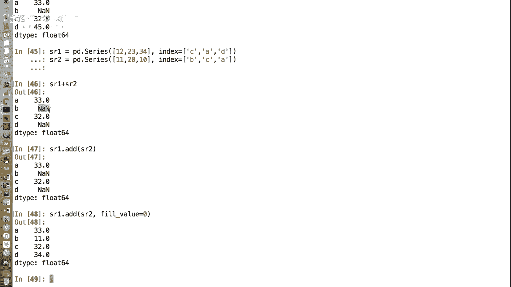

# 金融量化分析：P17：Series数据对齐 📊


在本节课中，我们将要学习Pandas Series对象的一个重要特性：**数据对齐**。我们将了解当对两个Series进行运算时，Pandas如何根据索引标签自动对齐数据，以及如何处理由此可能产生的数据缺失问题。

---

## 数据对齐的核心概念

上一节我们介绍了Series的基本操作，本节中我们来看看当两个Series进行算术运算时会发生什么。

与NumPy数组按位置（下标）进行运算不同，Pandas Series在进行运算时，会**按照索引标签进行对齐**。这意味着，运算结果由两个Series中具有相同标签的值计算得出，而**不考虑它们在Series中的顺序**。

让我们通过一个简单的例子来理解这个概念。假设我们有两个Series对象：

```python
import pandas as pd




sr1 = pd.Series([12, 23, 34], index=[‘C‘, ‘A‘, ‘D‘])
sr2 = pd.Series([11, 20, 10], index=[‘D‘, ‘C‘, ‘A‘])
```

如果执行 `sr1 + sr2`，结果会如何？

*   在NumPy数组中，会按位置相加：12+11, 23+20, 34+10。
*   在Pandas Series中，会按标签对齐后相加：
    *   标签 `‘A‘`: `23 (来自sr1) + 10 (来自sr2) = 33`
    *   标签 `‘C‘`: `12 (来自sr1) + 20 (来自sr2) = 32`
    *   标签 `‘D‘`: `34 (来自sr1) + 11 (来自sr2) = 45`

这个功能非常强大，例如在合并不同年份但日期标签相同的数据时，无需手动排序，Pandas会自动完成对齐和计算。

---

## 索引长度不一致与缺失值

在实际数据分析中，我们经常遇到两个Series索引不完全一致的情况。Pandas如何处理这种场景呢？

当两个Series的索引标签不完全相同时，Pandas依然会执行运算。对于**只在其中一个Series中存在的标签**，其运算结果会被标记为缺失值 `NaN` (Not a Number)。

例如：
```python
sr1 = pd.Series([12, 23, 34], index=[‘A‘, ‘C‘, ‘D‘])
sr2 = pd.Series([11, 20, 10, 5], index=[‘A‘, ‘B‘, ‘C‘, ‘D‘])

result = sr1 + sr2
print(result)
```
输出可能类似于：
```
A    23.0
B     NaN
C    43.0
D    39.0
dtype: float64
```
可以看到，标签 `‘B‘` 只在 `sr2` 中存在，在 `sr1` 中不存在，因此结果为 `NaN`。

---

## 灵活处理缺失值的算术方法

有时，我们并不希望缺失值出现为 `NaN`。例如，在计算员工两个月出勤总天数时，如果某员工第二个月才入职，我们希望他第一个月的出勤天数按0计算，而不是`NaN`。

Pandas提供了一系列灵活的算术方法，允许我们指定一个填充值（`fill_value`）来处理缺失情况。

以下是这些方法：
*   **`.add()`**: 加法，对应 `+`
*   **`.sub()`**: 减法，对应 `-`
*   **`.mul()`**: 乘法，对应 `*`
*   **`.div()`**: 除法，对应 `/`

使用这些方法时，可以通过 `fill_value` 参数指定一个值，用于填充某个Series中缺失的索引标签对应的值。

例如，我们希望将缺失的值视为0进行加法运算：
```python
sr1 = pd.Series([12, 23, 34], index=[‘A‘, ‘C‘, ‘D‘])
sr2 = pd.Series([11, 20, 10, 5], index=[‘A‘, ‘B‘, ‘C‘, ‘D‘])





result_filled = sr1.add(sr2, fill_value=0)
print(result_filled)
```
输出：
```
A    23.0
B    20.0  # sr1中无‘B‘，用0填充：0 + 20 = 20
C    43.0
D    39.0
dtype: float64
```
这样，标签 `‘B‘` 的结果就不再是 `NaN`，而是 `20`。



---



## 总结

本节课中我们一起学习了Pandas Series的**数据对齐**特性。我们了解到：

1.  Series运算基于**索引标签**而非位置，这使数据合并计算更加灵活和强大。
2.  当参与运算的Series索引不一致时，会产生缺失值 `NaN`。
3.  可以使用 `.add()`, `.sub()` 等灵活的算术方法，并通过 `fill_value` 参数控制缺失值的填充方式，从而得到符合业务逻辑的计算结果。



数据对齐是Pandas处理结构化数据的核心优势之一，而由此产生的缺失值则是数据分析中需要谨慎处理的常见问题。在接下来的课程中，我们将专门探讨如何处理这些缺失值。