# 金融量化分析：P18：Series缺失值处理 🧹

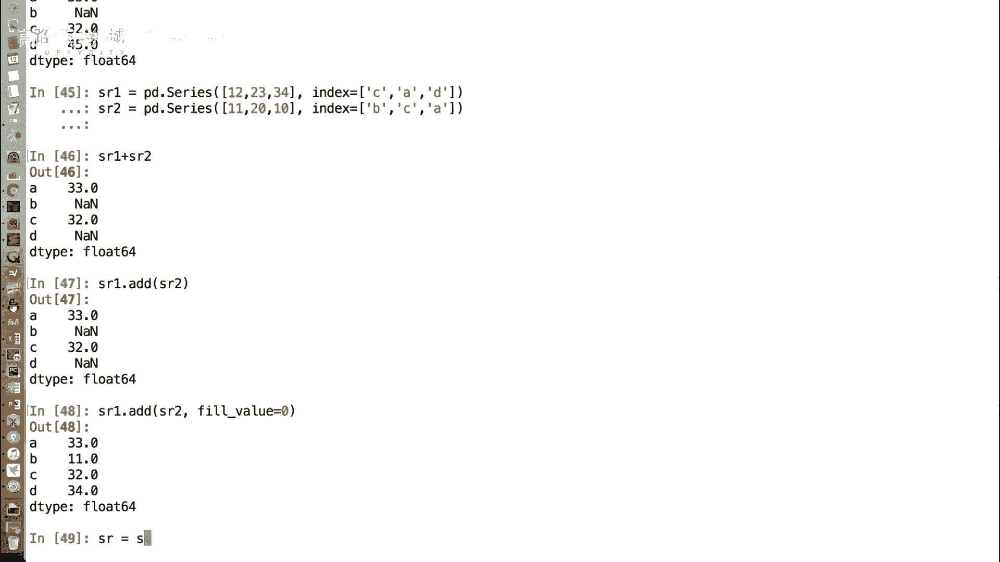

在本节课中，我们将要学习如何处理Pandas Series数据结构中的缺失值。缺失值是数据分析中常见的问题，学会正确处理它们对于后续的计算和可视化至关重要。

上一节我们介绍了Series的基本概念和创建方法，本节中我们来看看如何处理Series中可能出现的缺失数据。

## 什么是缺失值？

在Series中，缺失数据通常以`NaN`（Not a Number）值的形式出现。有时我们可以忽略这些缺失值，但在进行数学运算或生成图表时，它们可能会带来问题或影响视觉效果，因此需要处理。

## 处理缺失值的两种主要方法

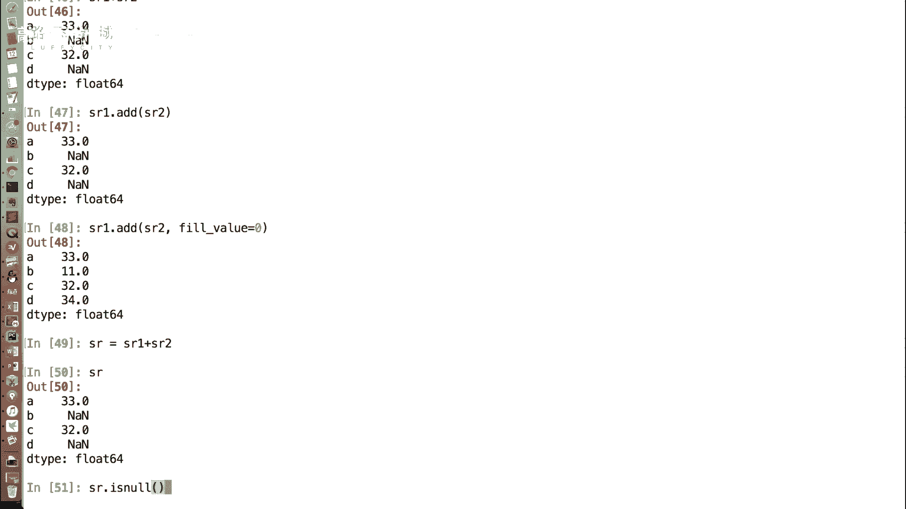

处理缺失值主要有两种思路：一是直接删除含有缺失值的行；二是用某个特定的值来填充这些缺失的位置。

### 方法一：删除缺失值 🗑️

首先，我们需要判断哪些位置是缺失值。Pandas提供了相关的函数。

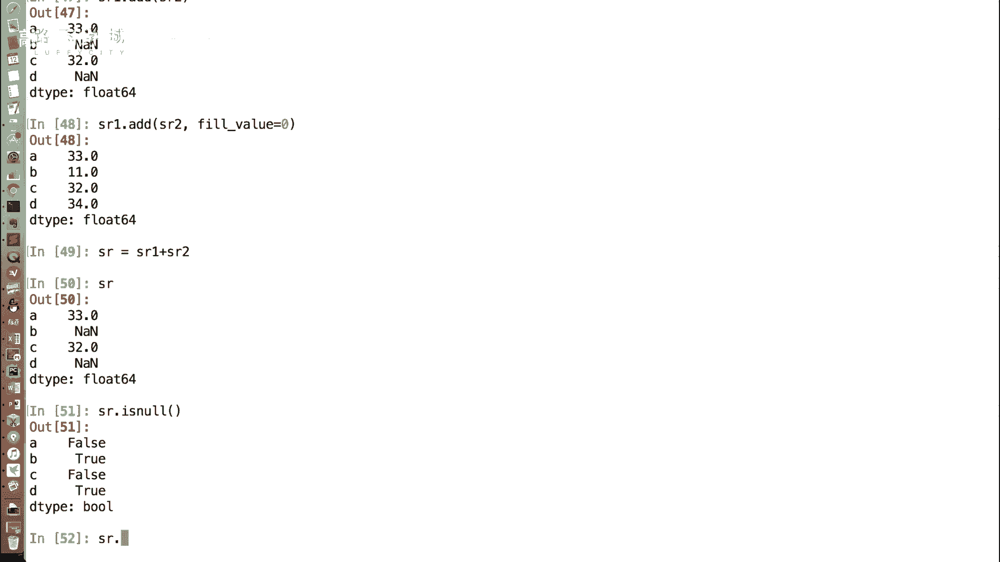

**1. 判断缺失值**

使用`isnull()`函数可以判断Series中的每个元素是否为缺失值。它返回一个布尔型的Series，其中`True`表示该位置是缺失值（NaN），`False`表示不是。

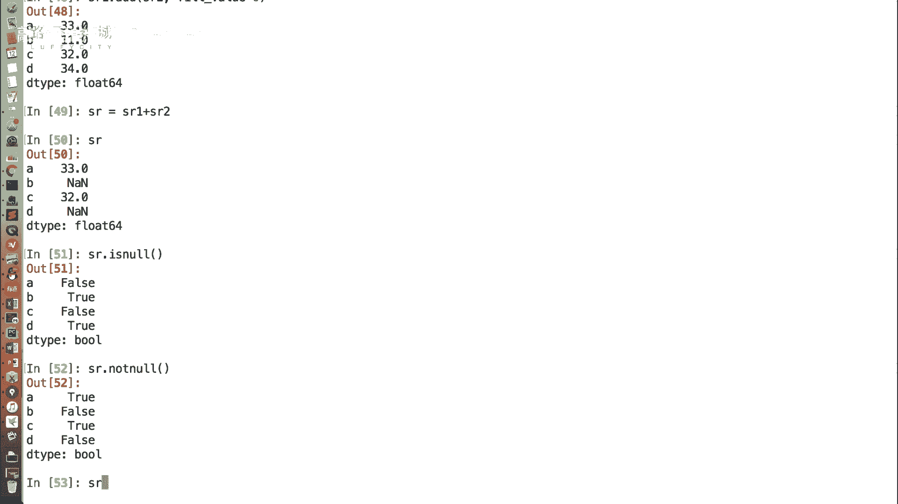

```python
SR.isnull()
```

与之对应的还有一个`notnull()`函数，它的逻辑与`isnull()`相反，即非缺失值的位置返回`True`。

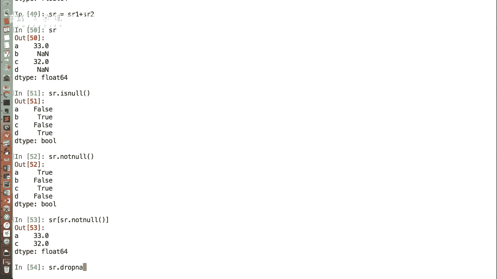

```python
SR.notnull()
```

**2. 利用布尔索引过滤**

我们可以利用`notnull()`函数返回的布尔Series作为索引，来过滤掉所有缺失值，只保留有效数据。

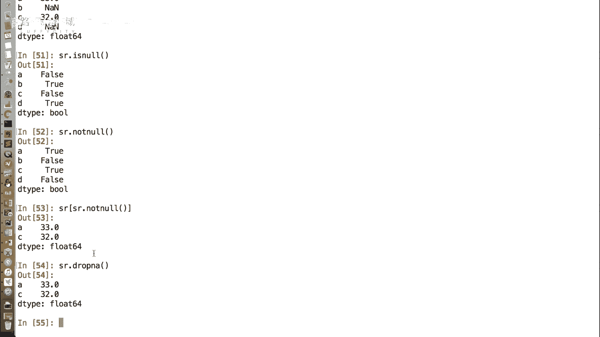

```python
SR[SR.notnull()]
```

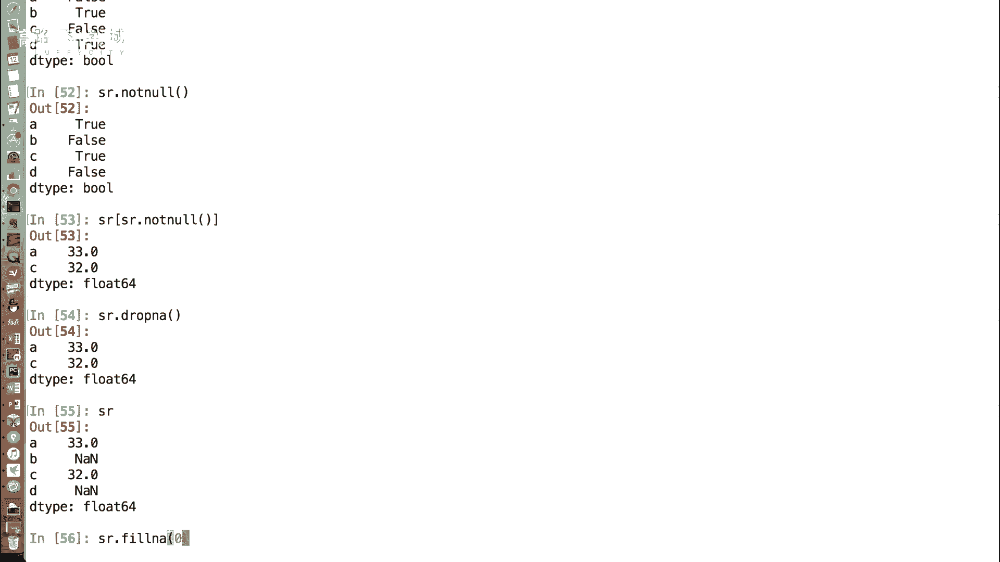

**3. 使用`dropna()`函数直接删除**

Pandas提供了一个更直接的方法`dropna()`，它可以删除Series中所有包含缺失值的条目。

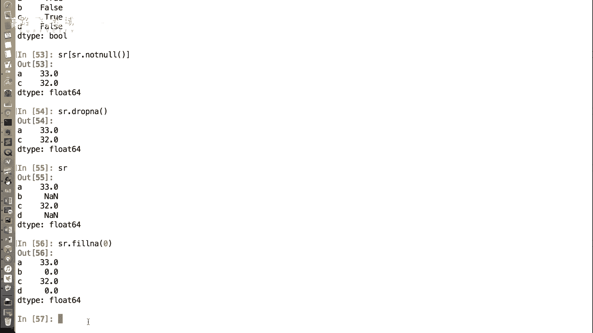

```python
SR.dropna()
```

需要注意的是，无论是布尔索引过滤还是`dropna()`函数，默认都不会修改原始的Series对象，而是返回一个新的处理后的Series。如果需要保存结果，必须进行赋值操作。

### 方法二：填充缺失值 🔧

另一种思路是不删除数据，而是为缺失值赋予一个合理的值，使其能够参与后续计算。

**1. 使用`fillna()`函数填充**

`fillna()`函数可以将所有的缺失值替换为指定的值。例如，我们可以将所有NaN填充为0。

```python
SR.fillna(0)
```

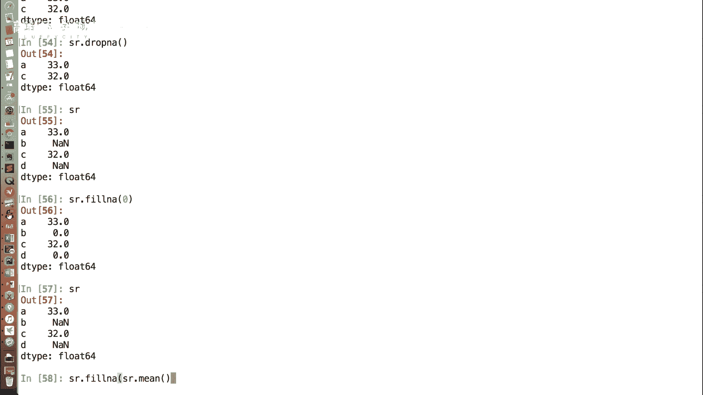

**2. 填充为统计值（如平均值）**

在实际分析中，填充为0可能并不合理。一种更常见的做法是使用该列数据的统计值（如平均值、中位数）进行填充，这样可以减少对数据整体趋势的影响。

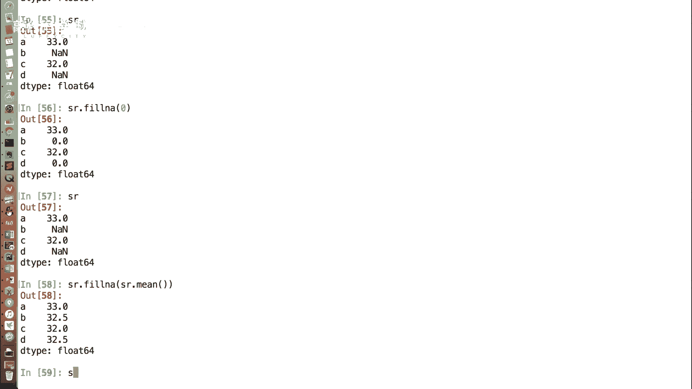

我们可以先计算整个Series的平均值（`mean()`函数会自动忽略NaN值），然后用这个平均值去填充缺失部分。

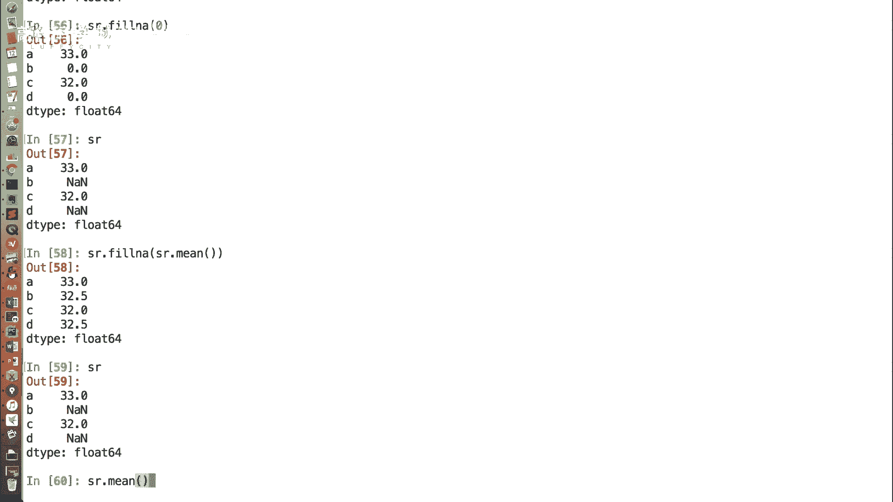

```python
mean_value = SR.mean()  # 计算非缺失值的平均值
SR.fillna(mean_value)   # 用平均值填充缺失值
```

Pandas的`mean()`等统计函数在计算时会自动跳过NaN值，这为数据处理带来了极大的便利。相比之下，使用纯Python列表或字典处理包含缺失值的数据会复杂得多。

## 总结

本节课中我们一起学习了Pandas Series缺失值处理的两种核心方法：
1.  **删除**：通过`isnull()`/`notnull()`判断，结合布尔索引或直接使用`dropna()`函数删除含有缺失值的行。
2.  **填充**：使用`fillna()`函数，可以用固定值（如0）或统计值（如平均值）来替换缺失值。

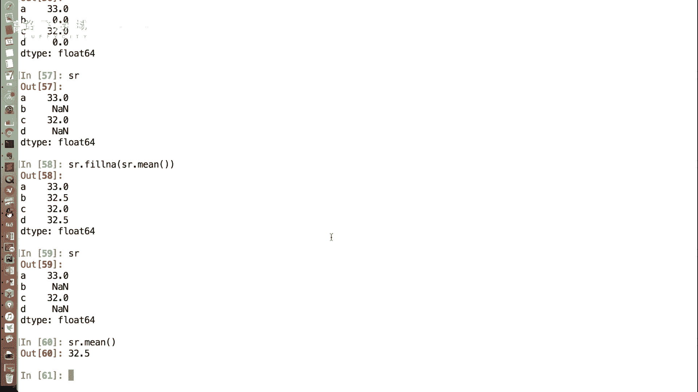

掌握这些方法，能帮助你清理数据，为后续的金融量化分析和建模打下坚实的基础。记住，这些操作通常返回新的Series对象，如需保留结果，别忘了赋值。