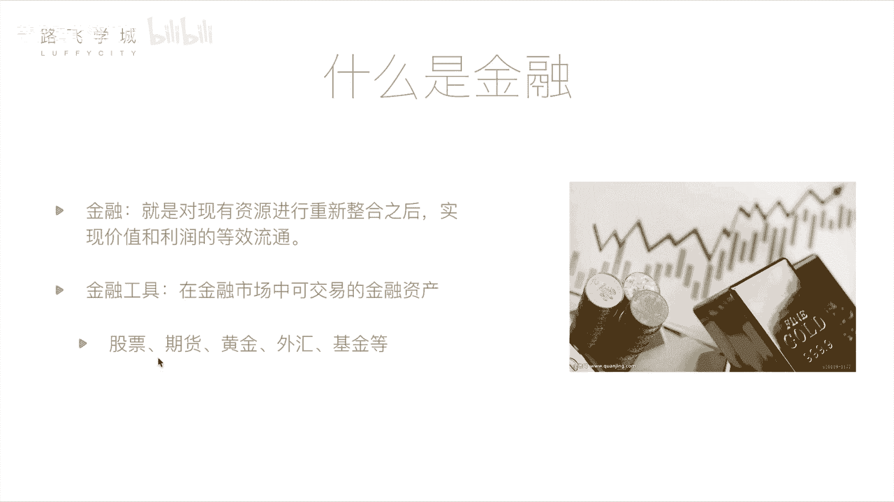

# 金融量化分析：01：基本金融知识介绍 🧠

在本节课中，我们将要学习金融与量化分析的基础知识。我们会介绍金融的基本概念、常见的金融工具，并重点讲解股票这一核心概念，为后续的量化分析学习打下基础。

## 什么是金融？

上一节我们介绍了课程的整体目标，本节中我们来看看什么是金融。

从定义上来说，金融是对现有资源进行重新整合之后，实现价值和利润的等效流通。这个概念可能比较抽象。在日常生活中，金融常被理解为与钱相关的活动，例如投资或投机。但金融行业并非完全是不劳而获的投机行为，它对国家经济和个人都有积极作用。

举个例子：假设一位拥有闲置资金的投资者，遇到一位有优秀创业想法但缺乏资金的创业者。投资者通过购买创业者公司的股票，将资金提供给对方。几年后公司成功上市，价值增长，创业者实现了理想，投资者也获得了回报。这个过程促进了经济发展，让资金流向了需要的地方，实现了双赢。这就是金融活动的一个典型例子。

## 常见的金融工具

理解了金融的基本概念后，我们来看看金融市场中一些具体的、可交易的金融资产，也就是金融工具。以下是几种常见的金融工具：

*   **股票**：代表对一家公司的部分所有权。购买股票即成为该公司的股东，可以分享公司成长的收益（也可能承担亏损）。这是我们本课程后续重点讲解的内容。
*   **期货**：一种标准化合约，约定在未来某一特定时间和地点，以特定价格交割一定数量的某种商品或金融资产。其核心是交易双方对资产未来价格走势的判断不同。
    *   **公式/概念**：`期货合约 = 约定未来交易（标的物、数量、价格、时间）`
    *   例如，发电厂（买方）预计煤炭价格未来会上涨，而煤矿主（卖方）预计价格会下跌。双方可以签订一份期货合约，约定半年后以当前市价交易煤炭。到期时，无论市场价格如何变化，都必须按合约价格执行。期货的杠杆特性使其风险和收益都远高于股票。
*   **黄金**：一种传统的贵金属，常被视为避险和保值资产。其价格相对稳定，波动通常小于股票。价格主要受全球供应量（如新矿发掘）、市场需求以及货币通胀水平等因素影响。
*   **外汇**：指不同国家货币之间的兑换交易，其价格表现为汇率（例如，1美元=6.5人民币）。大型投资机构会利用汇率的微小波动进行套利。对于个人投资者而言，由于汇率波动相对较小，交易意义不大。
*   **基金**：由基金公司收集众多投资者的资金，交由专业的基金经理进行统一管理和投资（可能投资于股票、债券、期货等多种资产）。对于不懂金融的个人而言，购买基金是一种间接参与投资的方式。基金的风险和收益通常介于储蓄和股票之间。

## 核心聚焦：股票

在介绍了多种金融工具后，我们将聚焦于本课程最核心的工具——股票。

股票是股份有限公司为筹集资金而发行给股东的所有权凭证。股东凭此凭证可以分享公司利润（分红），同时也承担公司经营的风险。股票市场是量化分析最主要的应用场景之一，我们后续的编程和数据分析都将围绕股票展开。

本节课中我们一起学习了金融的基本定义，了解了股票、期货、黄金、外汇和基金这几种主要金融工具的特点，并明确了股票作为量化分析核心对象的地位。这些基础知识是进入金融量化世界的第一步。