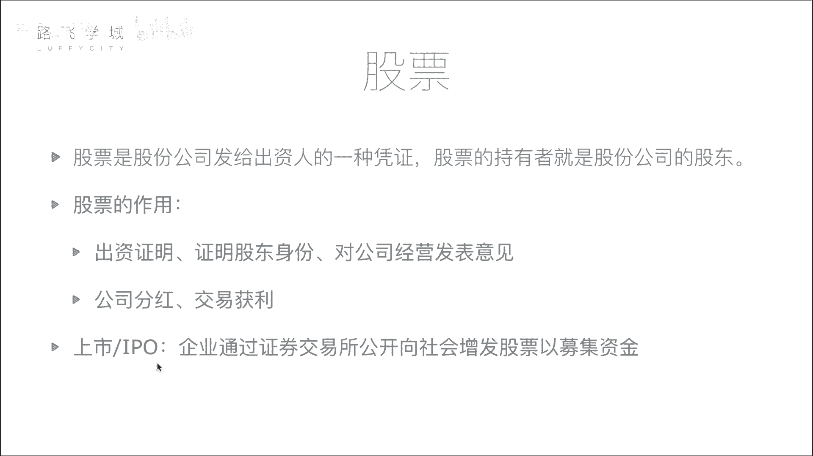
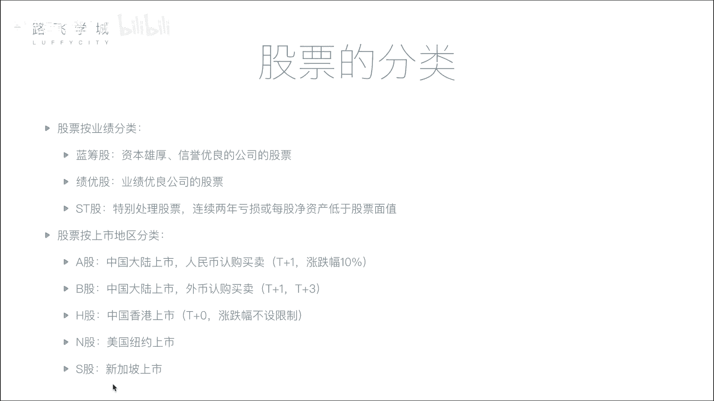

# 金融量化分析：P3：02：股票基本知识与分类 📈

在本节课中，我们将要学习股票的基础概念、核心作用以及常见的分类方式。理解这些内容是进行金融量化分析的基石。

## 股票的定义

股票是股份公司发给出资人的一种凭证。股票的持有者就是股份公司的股东。

为了更形象地解释，我们可以设想一个场景：一位创业者需要资金，而投资者（如亿万富翁）愿意提供资金。投资者将钱给创业者，创业者则给予投资者公司的股票。这张股票就是投资者出资的证明，代表了投资者在公司中的所有权份额。

例如，一个公司初始市值为5亿，由五位出资人（包括创业者本人）各出资1亿建立。那么，每位出资人将获得公司20%的股票。计算公式可以表示为：
**个人持股比例 = 个人出资额 / 公司总市值**

## 股票的作用

股票主要有两个核心作用：证明股东身份与实现财务收益。

上一节我们介绍了股票作为所有权凭证的定义，本节中我们来看看它具体能带来什么。

以下是股票的两个主要作用：

1.  **证明股东身份与权利**：持有股票意味着你是公司的股东。作为出资人，你拥有参与公司重大决策的权利，例如在股东大会上投票。
2.  **获取财务收益**：投资者可以通过两种主要方式从股票中获利：
    *   **公司分红**：当公司盈利时，可能会将部分利润按持股比例分配给股东。例如，若公司年净利润为5000万，持有20%股份的股东可获得1000万的分红。
    *   **交易获利**：投资者可以在证券交易所买卖股票，通过“低买高卖”赚取差价。例如，初始以1亿购入20%股份，当公司市值从5亿增长到50亿时，该部分股份价值变为10亿。此时卖出部分股份即可实现收益。

对于资金量较小的普通股民而言，虽然持股比例低，分红的绝对数额可能较小，但通过股票交易获利的原理与大型投资者是相同的。

## 什么是上市

所谓上市，就是企业通过证券交易所，首次公开向全社会投资者增发股票，以募集资金的过程。

一个公司不能随意向公众募集资金。它需要达到一定体量，并向证监会提交申请，经过严格的审核（如审查财务报表、经营状况等），确保公司具备持续盈利能力和较低的风险后，才能获准上市。

上市后，公司的股票可以在证券交易所公开挂牌交易，所有符合条件的投资者都可以自由买卖该股票。这使得公司能够从更广泛的公众投资者那里募集大量资金。首次公开募股的行为就称为 **IPO**。

## 股票的分类

股票可以按照不同的标准进行分类，这里我们介绍两种常见的分类方式。

### 按业绩分类

根据公司的经营业绩，股票通常被分为以下三类：

*   **蓝筹股**：指资本雄厚、信誉优良的巨型公司发行的股票。例如中国的石油、石化、大型银行等企业。它们通常规模大、市值高，像“大胖子”一样体量庞大。
*   **绩优股**：指业绩优良公司的股票。这类公司可能规模不及蓝筹股，但盈利能力突出且稳定增长。例如一些持续高盈利的消费或科技公司。
*   **ST股**：中文称为“特别处理股票”。如果公司连续两年亏损，或每股净资产低于股票面值，其股票名称前会被加上“ST”标记，以警示投资者该公司存在较高风险。

### 按上市地区分类

根据股票上市交易的地点和结算货币，可以分为：

*   **A股**：在中国大陆（上海、深圳证券交易所）上市，以人民币认购和交易的股票。
*   **B股**：同样在中国大陆上市，但以外币（如美元、港币）认购和交易的股票。
*   **H股**：在中国香港上市的公司发行的股票。
*   **N股/S股等**：分别指在纽约、新加坡等地上市的股票。

不同的股市有不同的交易规则。这里简要介绍A股的两项核心规则：

1.  **涨跌幅限制**：A股设有每日涨跌幅限制，通常为**10%**。即一只股票当日的价格波动幅度不得超过前一日收盘价的10%。此规则旨在平抑市场剧烈波动，保护投资者。
2.  **T+1交割制度**：“T”代表交易日。在A股中，投资者**当天（T日）买入的股票，必须等到下一个交易日（T+1日）才能卖出**。这被称为交割日制度，目的是减少市场过度投机。相比之下，港股、美股等多实行T+0制度，即当天买入可当天卖出。

本节课中我们一起学习了股票的基础知识。我们明确了股票是股东权的凭证，其核心作用在于确权和获利。我们了解了公司通过IPO上市向公众融资的过程。最后，我们学习了按业绩和上市地区对股票进行分类的方法，并掌握了A股市场关键的涨跌幅限制和T+1交易规则。这些概念是进一步学习股票分析和量化交易的重要基础。