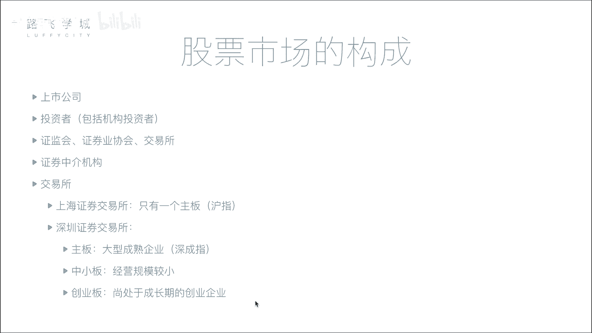
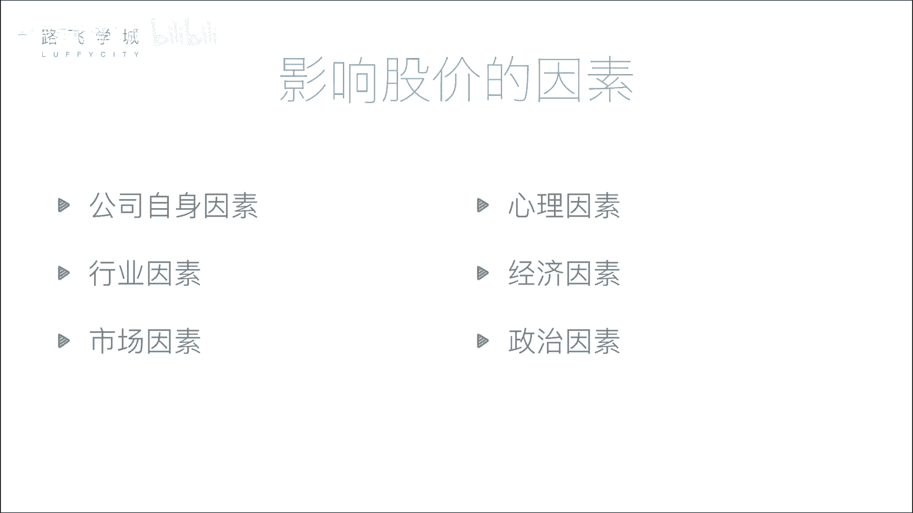

# 金融量化分析：P4：03：股票市场构成 🏛️

在本节课中，我们将要学习股票市场的构成。了解市场中有哪些参与者以及他们各自扮演的角色，是理解股票交易如何运作的基础。

上一节我们介绍了股票的分类，本节中我们来看看股票市场是由哪些部分构成的。

## 市场参与者

股票市场并非只有买卖双方，它是一个由多个角色共同组成的复杂系统。以下是市场中的主要参与者：

### 1. 公司与投资者
公司是融资方，需要资金来发展业务。投资者是出资方，提供资金以换取公司的部分所有权（即股票）。但公司和投资者通常不直接进行交易。

### 2. 监管机构
为了确保市场公平、防止暗箱操作，需要强有力的监管机构。
*   **证监会**：全称中国证券监督管理委员会，是证券行业的核心监管机构。它拥有极大的行政权力，负责审核公司上市申请、监督公司行为（如是否涉及欺诈、洗钱等违法行为），并有权决定公司能否上市或将其退市。
*   **证券业协会**：这是一个行业自律组织，作用相对较弱。例如，证券从业资格考试通常由其主办。

### 3. 交易所
交易所是提供集中、公开交易场所的机构。在中国，主要有上海证券交易所和深圳证券交易所。在电子化交易普及前，投资者需要亲自到交易所“抢座位”进行交易。如今，交易所的核心功能是处理来自全国各地的电子化交易请求。

### 4. 证券中介机构（券商）
个人投资者通常不能直接在交易所买卖股票，这主要是由于成本过高和历史原因。在早期，交易所通过出售价格高昂的“交易席位”来限制直接参与者。拥有席位的机构（如大型券商）为了赚回席位费，便代理众多小投资者进行交易，从而形成了券商模式。

**核心运作模式**：
投资者通过券商（如中信证券、中金公司等）提供的软件（如同花顺）下单，指令先传至券商服务器，再由券商通过其在交易所的席位，将指令送达交易所执行。简单来说，券商是连接普通投资者和交易所的桥梁。

## 中国交易所与板块

中国有两个主要证券交易所，每个交易所下又设有不同的板块，以适应不同规模和发展阶段的企业。

### 上海证券交易所
*   **板块**：主要为主板。
*   **大盘指数**：**沪指**（上证综合指数），反映了上海证券交易所所有上市股票的综合表现。

### 深圳证券交易所
*   **板块**：分为主板、中小板和创业板。
    *   **主板**：对上市公司的规模、盈利等要求最严格。
    *   **中小板与创业板**：旨在鼓励和支持中小型、创业型公司发展。它们对盈利等要求相对主板较低（例如，创业板可能要求连续几年达到一定净利润即可），让有成长性但体量尚小的公司也能融资上市。
*   **大盘指数**：
    *   主板对应 **深成指**（深证成份指数）。
    *   中小板对应 **中小板指**。
    *   创业板对应 **创业板指**。

## 什么是大盘指数？📈

理解了板块，我们再来看看常说的“大盘”是什么。大盘指数（如沪指、深成指）是反映某个市场或板块整体走势的指标。

**核心概念**：
它并非单只股票的价格，而是将众多股票的价格通过特定公式进行加权平均计算后，得出的一个综合数值。这个数值随时间变化形成的曲线，就代表了市场的整体“情绪”和趋势。

**简单解释**：
假设一个市场有3000只股票。即使其中有些股票下跌，但如果大多数重要股票都在上涨，那么计算出来的大盘指数很可能也是上涨的，表明市场整体向好。反之，则表明市场整体疲软。因此，人们常通过观察大盘指数来判断整体市场行情的好坏。

---

本节课中我们一起学习了股票市场的核心构成。我们了解了市场的四大关键参与者：融资的公司与投资的个人、负责监管的证监会与证券业协会、提供交易场所的交易所、以及连接投资者与交易所的券商。同时，我们也熟悉了中国两大交易所（上海和深圳）及其不同的板块（主板、中小板、创业板），并明白了大盘指数是反映市场整体走势的重要风向标。理解这些基础概念，是进一步学习股票交易和量化分析的第一步。