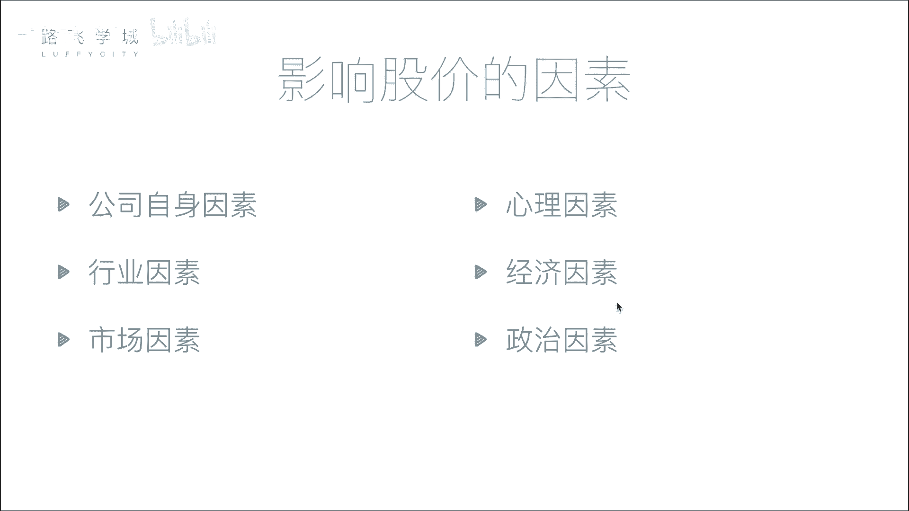
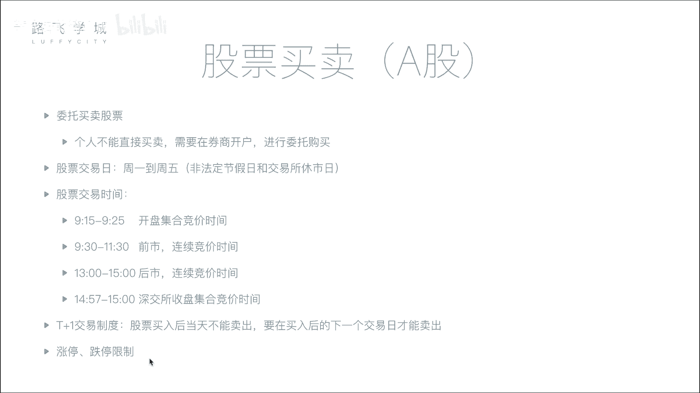

# 金融量化分析：04：影响股价因素与股票买卖知识 📈

在本节课中，我们将学习影响股票价格的主要因素，并了解股票买卖的基本流程与规则。理解这些基础知识是进行量化分析的第一步。

## 影响股价的六大因素

上一节我们介绍了股票的基本概念，本节中我们来看看哪些因素会驱动股票价格的波动。影响股价的因素可以归纳为以下六点。

### 1. 公司自身因素
这是影响股价最根本的因素。公司的经营状况直接决定了其长期价值。如果公司发展良好，未来预期收益高，其股价通常会上涨；反之，若公司出现重大负面事件或经营不善，股价则会下跌。

### 2. 市场因素
这是影响股价最直接的因素。股价的短期波动由买卖双方的供需关系决定。其基本原理如下：
*   **买盘 > 卖盘**：供不应求，股价上涨。
*   **卖盘 > 买盘**：供过于求，股价下跌。

### 3. 行业因素
整个行业的发展前景会影响行业内所有公司的股价。例如，一个处于上升期的热门行业（如人工智能），其相关公司的股票可能普遍受到追捧；而一个衰退的行业，其公司股价则可能承压。

### 4. 心理因素
投资者的情绪和非理性行为会影响股价。例如，**从众心理**可能导致投资者在恐慌时集体抛售，或在狂热时盲目追高，从而加剧市场波动。

### 5. 经济因素
国家层面的宏观经济政策和指标会对股市产生广泛影响。例如：
*   **利率上升**：可能导致市场资金流向银行存款，股市资金减少，从而对股价产生下行压力。
*   **其他政策**：如外汇政策、存款准备金率调整等也可能影响市场流动性。

### 6. 政治因素
国际或国内的政治局势、军事冲突风险等事件会影响市场稳定性和投资者信心。例如，地缘政治紧张局势可能引发市场恐慌性抛售，而与国防相关的“军工股”则可能因事件驱动而上涨。

## 股票买卖流程与规则

了解了影响价格的因素后，我们来看看实际买卖股票需要遵循的流程和规则。

### 开户与委托
个人投资者不能直接进入交易所交易，必须通过**证券公司（券商）** 开户。开户后，投资者通过券商系统提交买卖指令，这个过程称为**委托**。

### 交易日与交易时间
股票交易并非随时可以进行，它有固定的时间安排。
*   **交易日**：通常为每周一至周五（非法定节假日）。
*   **交易时间**：以下为A股主要交易时段（以上海证券交易所为例）：

以下是交易时段的详细划分：
1.  **开盘集合竞价** (09:15 - 09:25)：此期间接受委托，但不立即成交。交易所会在09:25一次性对之前所有委托进行**撮合**，以产生当天的**开盘价**。撮合的核心原则是**最大化成交量**。
2.  **连续竞价** (09:30 - 11:30, 13:00 - 15:00)：这是主要的交易时段。交易所系统会按照“价格优先、时间优先”的原则，对买卖委托进行几乎连续的撮合成交。
3.  **收盘集合竞价** (深圳：14:57 - 15:00)：仅深圳交易所有此环节。此期间提交的委托在15:00一次性撮合，产生**收盘价**。上海证券交易所的收盘价为当日最后一笔交易的成交价。

### 交易制度
最后，我们回顾两个重要的基础交易制度：
*   **T+1制度**：当日买入的股票，需等到下一个交易日才能卖出。
*   **涨跌停板限制**：为防止股价过度波动，A股市场设有每日价格涨跌幅限制（通常为±10%）。

---

本节课中我们一起学习了影响股票价格的六大核心因素（公司、市场、行业、心理、经济、政治），并掌握了股票买卖的基本流程、交易时间划分以及T+1、涨跌停板等关键规则。这些知识是构建量化分析策略的重要基石。