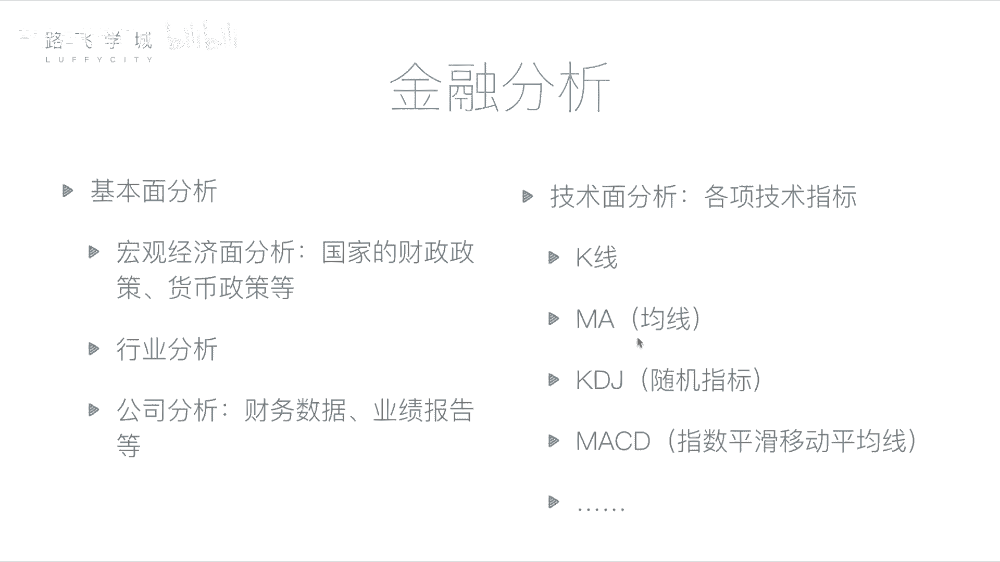
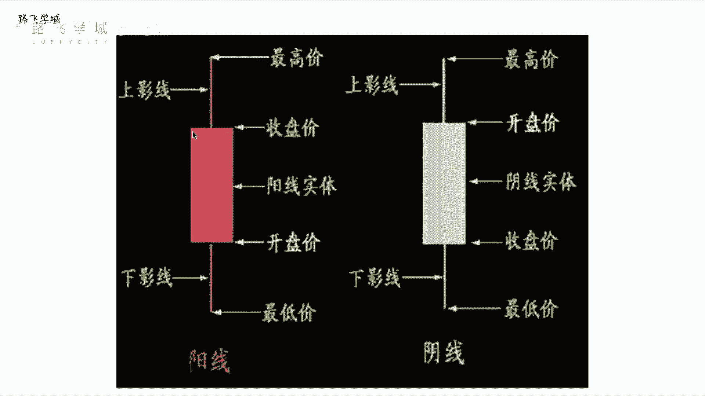
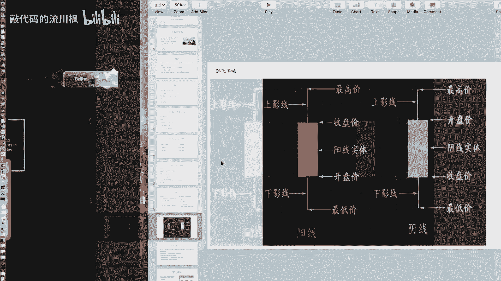
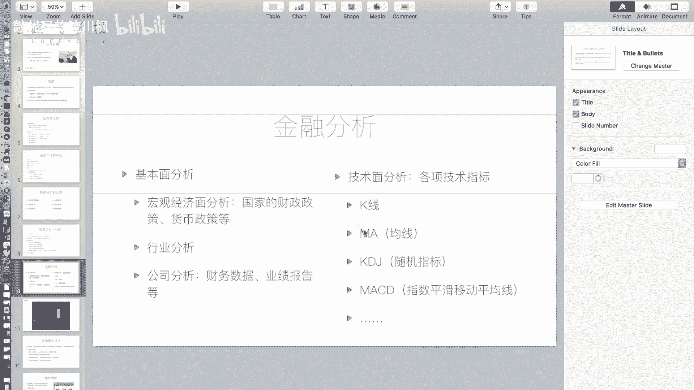
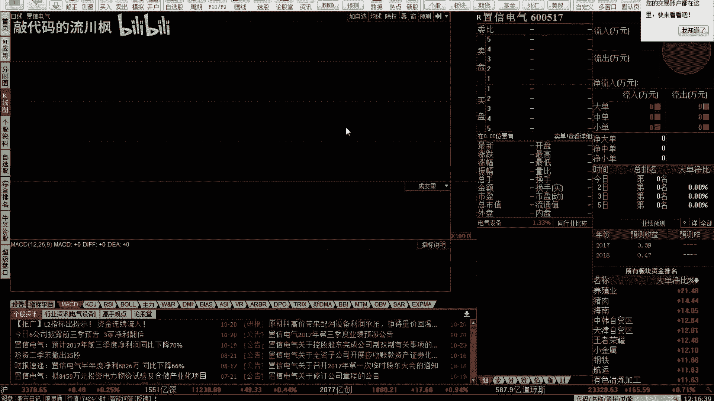
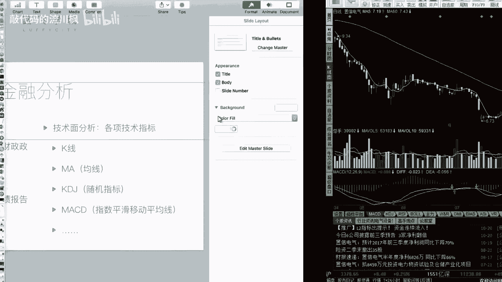

# 金融量化分析：05：金融分析 📊

在本节课中，我们将学习金融分析的核心方法。金融分析是判断股票买卖时机、预测价格走势的关键手段，它帮助我们避免盲目投资，做出更理性的决策。

上一节我们介绍了金融和股票的基础知识，本节中我们来看看如何进行具体的金融分析。

## 基本面分析

基本面分析的核心是评估公司的内在价值。它关注影响股价的公司自身因素、行业状况以及宏观经济环境。通过分析这些信息，投资者可以判断一家公司是否值得投资。

以下是基本面分析的三个主要方面：

1.  **宏观经济面分析**：分析国家的财政政策、货币政策等宏观因素，判断整体经济环境对股市的影响。例如，判断政策是鼓励资金流入股市还是鼓励储蓄。
2.  **行业分析**：评估特定行业（如教育、IT、能源）的整体发展前景和趋势。可以通过观察该行业内代表性股票的走势来辅助判断。
3.  **公司分析**：这是最具体的层面。投资者需要深入研究目标公司的运营和财务状况。上市公司会定期发布经过审计的财务报表（如年报、季报），这些公开数据是分析公司盈利能力、偿债能力等的重要依据。如果判断公司运营良好、前景乐观，则可以考虑买入其股票。

## 技术面分析

上一节我们介绍了基本面分析，本节中我们来看看技术面分析。技术面分析的核心观点是：所有影响市场的已知和未知信息都已反映在价格和交易量等市场数据中。因此，它主要通过研究历史市场数据（如价格、成交量）的图表和指标来预测未来价格走势。

以下是两个基础且重要的技术指标：

1.  **K线**：K线是记录单个交易周期（如一天）内四个关键价格（开盘价、收盘价、最高价、最低价）的图形化工具。
    *   **阳线**（通常为红色或空心）：表示该周期内价格上涨，即收盘价高于开盘价。其实体的下边缘代表开盘价，上边缘代表收盘价。
    *   **阴线**（通常为绿色或实心）：表示该周期内价格下跌，即收盘价低于开盘价。其实体的上边缘代表开盘价，下边缘代表收盘价。
    *   无论阳线还是阴线，从实体向上延伸的细线（上影线）顶端代表最高价，向下延伸的细线（下影线）底端代表最低价。

    K线的不同形态组合（如十字星、光头光脚线等）常被用于分析市场多空力量的对比。

2.  **移动平均线 (MA)**：移动平均线是通过计算过去一定周期内价格的平均值，并将这些平均值连成线而形成的趋势指标。它有助于平滑价格波动，显示价格的中长期趋势。
    *   **计算公式（以收盘价为例）**：`MA(N) = (P1 + P2 + ... + PN) / N`，其中 `P` 代表过去第 `N` 个周期的收盘价。
    *   **常见类型**：例如，`MA5` 表示5日均线，即过去5个交易日收盘价的平均值；`MA60` 表示60日均线。短期均线对价格变化更敏感，长期均线趋势性更强。

    在后续的量化策略中，我们会用到基于不同周期均线关系的策略，例如“双均线交叉策略”。

## 总结

本节课中我们一起学习了金融分析的两种主要方法：基本面分析和技术面分析。基本面分析侧重于研究公司的内在价值和宏观环境，而技术面分析则专注于解读市场历史数据形成的图表和指标。理解这两种分析方法，是进行理性股票投资和后续量化交易策略开发的重要基础。