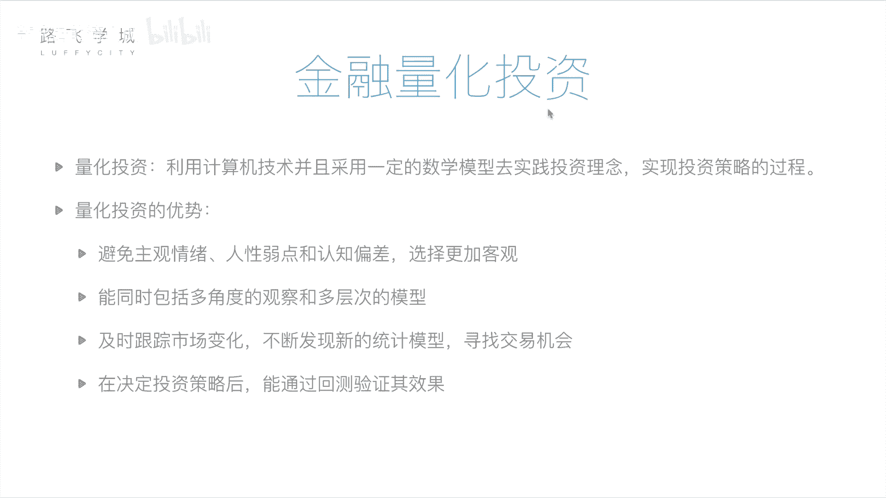
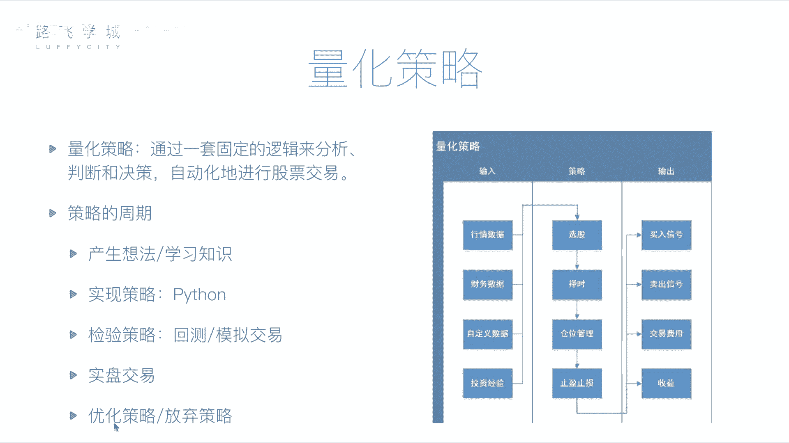

# 金融量化分析：01：金融量化投资介绍 📈

在本节课中，我们将要学习金融量化投资的核心概念、基本流程以及量化策略的构成。我们将了解如何将投资理念转化为计算机可执行的数学模型，并探讨量化投资相较于传统人工投资的优势。

## 量化投资的概念

上一节我们介绍了金融分析可以通过基本面或技术面进行。这个分析判断的过程，实际上可以交给计算机来完成。

因为无论是基本面分析所需的财务报表，还是技术面分析所需的历史价格与交易记录，我们都可以获取到。将这些分析过程交由计算机处理，就称为量化投资或量化分析。

所谓量化投资，是指**利用计算机技术，并采用一定的数学模型，去实践投资理念，实现投资策略的过程**。它包含三个重要部分：
1.  **计算机技术**：即使用计算机编程的方式。
2.  **数学模型**：即具体的投资策略和套路，例如均线指标就是一个数学模型。
3.  **实践**：用编写好的计算机程序去执行投资，或预先进行尝试以检验策略的可靠性。

## 量化投资的优势

相较于传统的人工投资，量化投资具有以下优势：

以下是量化投资的四个主要优点：

1.  **避免主观情绪干扰**：人类投资者容易受到情感、人性弱点和认知偏差的影响。例如，可能因持有某支股票时间过长而产生感情，即使各种迹象表明应该卖出也舍不得；或者因为股票连续几天下跌而产生恐慌，做出非理性的抛售决定。量化投资基于数据和模型，选择更加客观。

2.  **处理信息能力更强**：计算机能够同时从多角度观察，并运行多层次的复杂模型。它可以快速分析大量股票，并综合考量技术指标、财务报表、行业数据等多个维度的信息，而人类难以同时处理如此海量且复杂的信息。

3.  **及时跟踪与发现机会**：市场每时每刻都在变化。计算机程序可以7x24小时不间断地监控市场，一旦出现符合策略的交易机会，其反应和执行速度远快于人工盯盘。此外，程序也更容易尝试和集成新的投资方法或机器学习模型。

4.  **可进行回测验证**：在将策略投入真实交易前，可以通过“回测”来检验其历史表现。回测是指用历史数据模拟策略在过去一段时间内的运行效果。例如，可以测试一个策略从2012年到2017年的收益情况。通过多次回测和调整参数，可以在相当程度上验证策略的有效性，降低实盘交易的风险。

## 量化策略的核心构成

量化交易的核心是量化策略，即具体的投资“套路”。一个完整的量化策略主要包括输入、处理逻辑和输出三部分。

以下是量化策略需要处理的三类核心数据输入：

*   **行情数据**：股票的历史交易数据，如每日的开盘价、收盘价、最高价、最低价、成交量等。
*   **财务数据**：上市公司的财务报表数据，如利润表、资产负债表等。
*   **自定义数据**：投资者根据需要加入的其他数据，例如通过自然语言处理分析的新闻舆情数据，甚至是个人总结的一些投资经验规则。

策略的处理逻辑主要围绕投资的四个关键环节展开：

以下是量化策略需要完成的四件核心任务：

1.  **选股**：从数千只股票中，筛选出符合投资标准的股票。
2.  **择时**：决定买卖的具体时机，目标是实现“低买高卖”。
3.  **仓位管理**：决定资金在不同股票之间的分配比例。对于看涨概率更高的股票，可以分配更多资金。
4.  **止盈止损**：设置必要的风险控制规则。例如，当亏损达到10%时自动卖出以“止损”；当盈利达到30%时卖出以“止盈”，锁定利润。

策略执行后会产生相应的输出：

以下是量化策略的主要输出结果：

*   **交易信号**：程序生成的买入或卖出指令。可以提示给投资者，或直接连接到券商系统进行自动交易。
*   **交易费用与收益**：计算每次交易产生的手续费、佣金等成本，并统计最终的盈亏结果及各项收益指标。

## 量化策略的开发周期

一个量化策略从构思到应用，通常会经历一个完整的生命周期。

以下是量化策略从开发到应用的典型流程：

1.  **产生想法**：基于投资经验、新学的指标或灵感，形成初步的策略思路。
2.  **程序实现**：使用编程语言（如Python）将想法转化为可执行的计算机程序。
3.  **回测检验**：使用历史数据运行策略，检验其在过去一段时间内的表现。
4.  **模拟交易**：使用当前开始的实时市场数据进行模拟交易，进一步验证策略在当下环境中的有效性，此过程不涉及真实资金。
5.  **实盘交易/优化迭代**：经过充分验证后，将策略投入实盘交易。同时，根据回测或实盘中的表现，持续对策略进行优化调整，或决定是否放弃并开发新策略。

本节课中我们一起学习了金融量化投资的基础知识，包括其定义、优势、策略的核心构成以及开发流程。从下一节课开始，我们将进入实践环节，学习如何使用Python及其相关数据分析工具来构建我们自己的量化交易策略。