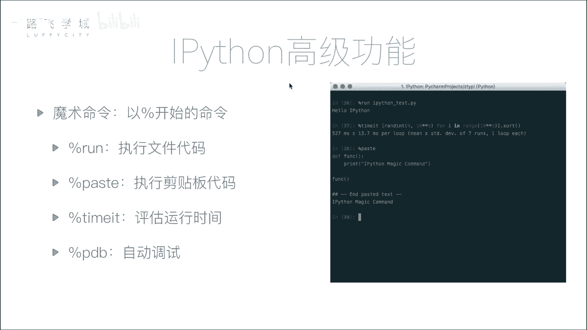
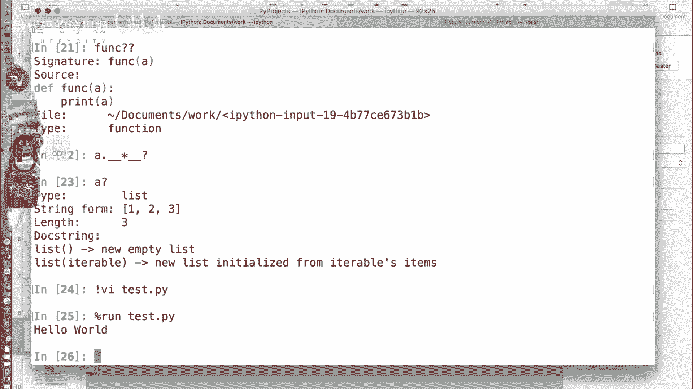
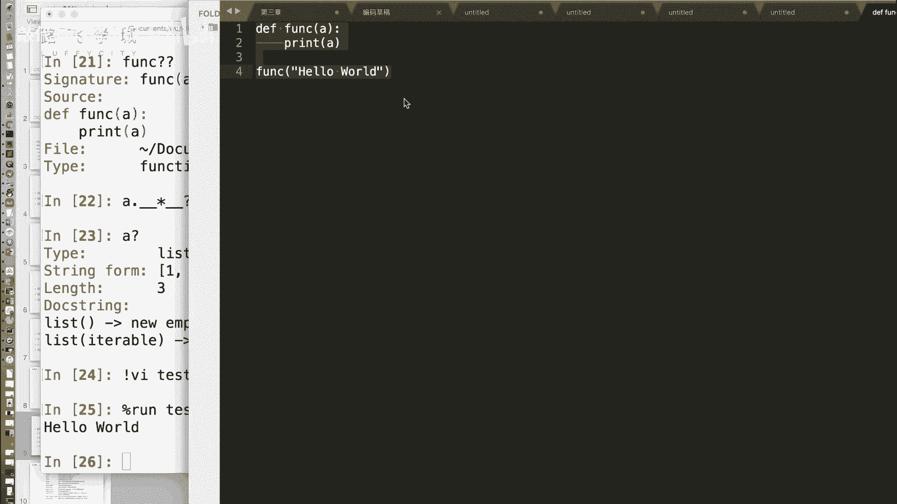
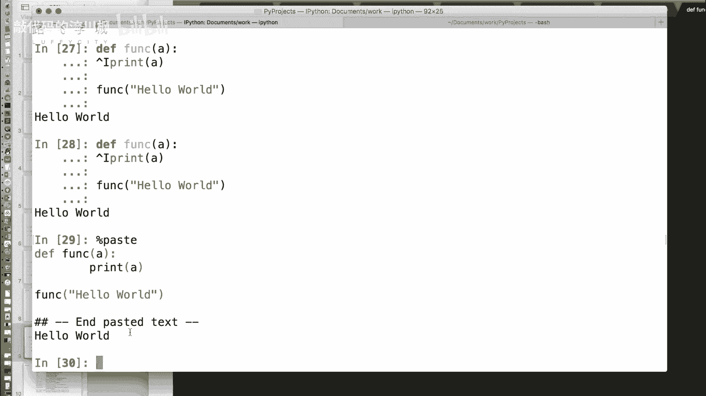
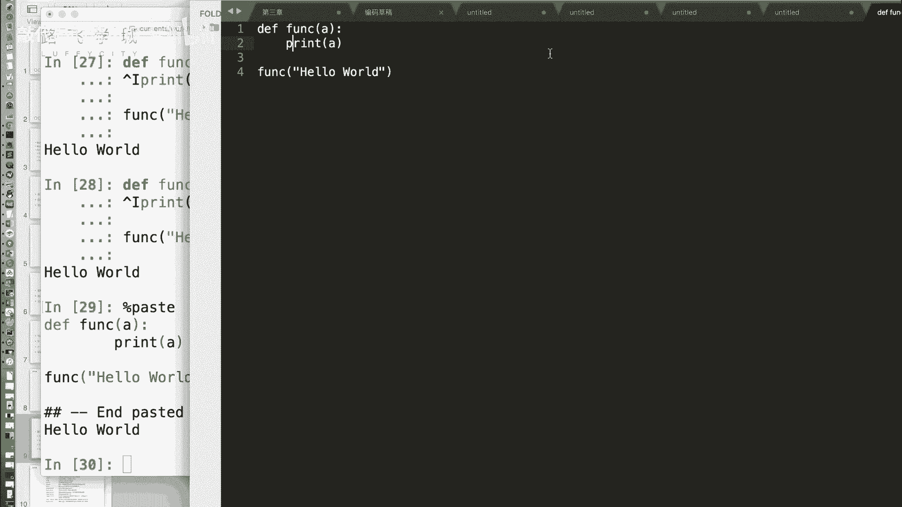
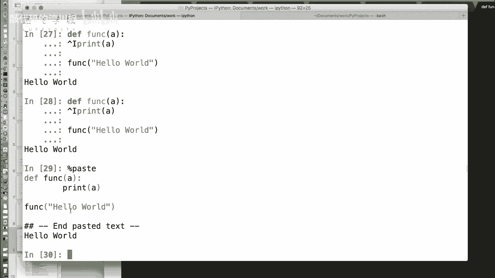
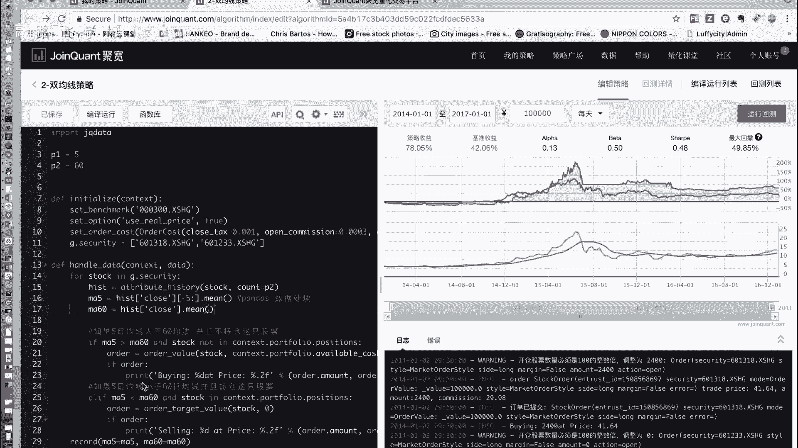
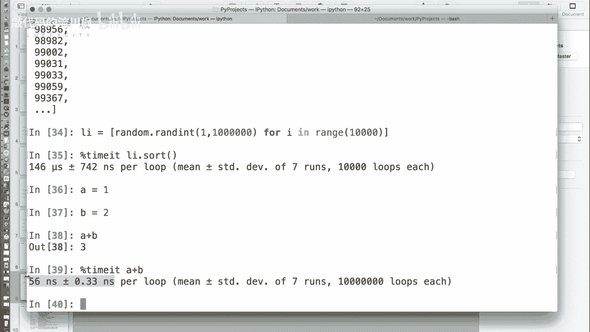

# 金融量化分析：P8：IPython魔术命令 🪄



在本节课中，我们将学习IPython中一个非常实用且有趣的高级功能——魔术命令。这些命令以百分号开头，能够极大地提升我们在交互式环境中编写和测试代码的效率。

---

上一节我们介绍了IPython的基本使用，本节中我们来看看如何利用魔术命令来运行外部脚本、粘贴代码以及精确测量代码执行时间。



## 运行外部Python脚本



在标准的Python命令行中，要运行一个外部`.py`文件，通常需要退出交互模式。但在IPython中，我们可以使用 `%run` 魔术命令直接运行脚本，无需退出。

**代码示例**：
```python
%run hello_world.py
```
执行上述命令后，`hello_world.py` 文件中的代码将在当前IPython会话中运行，其定义的变量和函数也会被导入到当前命名空间。

## 粘贴并执行剪贴板中的代码



有时我们需要测试一段较长的代码片段，但不想为此单独创建一个文件。IPython提供了 `%paste` 魔术命令来解决这个问题。



以下是 `%paste` 命令的使用步骤：
1.  将你想要执行的代码复制到系统剪贴板。
2.  在IPython中输入 `%paste` 并回车。
3.  IPython会先打印出剪贴板中的代码，然后执行它。





这个功能对于快速测试从编辑器或网页上复制的代码块非常方便。

## 精确测量代码执行时间

在性能优化时，我们需要精确测量代码的执行时间。虽然可以使用Python的 `time` 模块，但对于执行时间极短的代码，测量结果可能不准确（例如显示为0秒）。IPython的 `%timeit` 魔术命令通过多次运行代码并计算平均时间来解决这个问题。

**公式/原理**：
`%timeit` 命令会自动决定运行次数（N），执行代码N次，然后计算单次执行的平均时间。其输出格式通常为：
`平均时间 ± 标准差 per loop (mean ± std. dev. of N runs, M loops each)`

**代码示例**：
假设我们想测量对一个包含10,000个随机数的列表进行排序所需的时间。
```python
import random
lst = [random.random() for _ in range(10000)]

%timeit sorted(lst)
```
执行后，你可能会看到类似 `1.46 ms ± 7.42 µs per loop` 的输出。这表示排序操作平均耗时约1.46毫秒，并且测量结果非常稳定（标准差很小）。

对于极其微小的操作，例如一个简单的加法，`%timeit` 会运行数百万次来获得一个可靠的测量结果。
```python
%timeit 1 + 2
```
输出可能类似于 `56 ns ± 0.366 ns per loop`，这能帮助我们精确了解基础操作的性能开销。

---



本节课中我们一起学习了三个核心的IPython魔术命令：`%run` 用于运行外部脚本，`%paste` 用于执行剪贴板代码，以及 `%timeit` 用于精确测量代码执行时间。掌握这些命令将显著提升你在交互式环境中进行数据分析、代码测试和性能优化的效率。