# 金融量化分析：P9：IPython高级功能 🚀

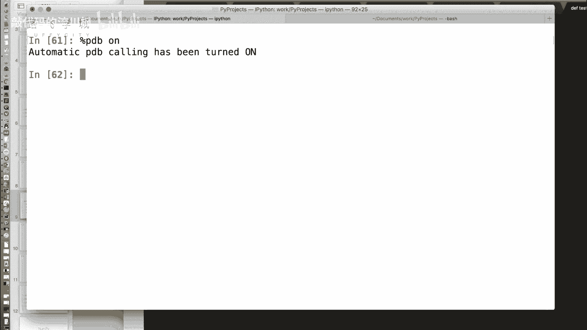

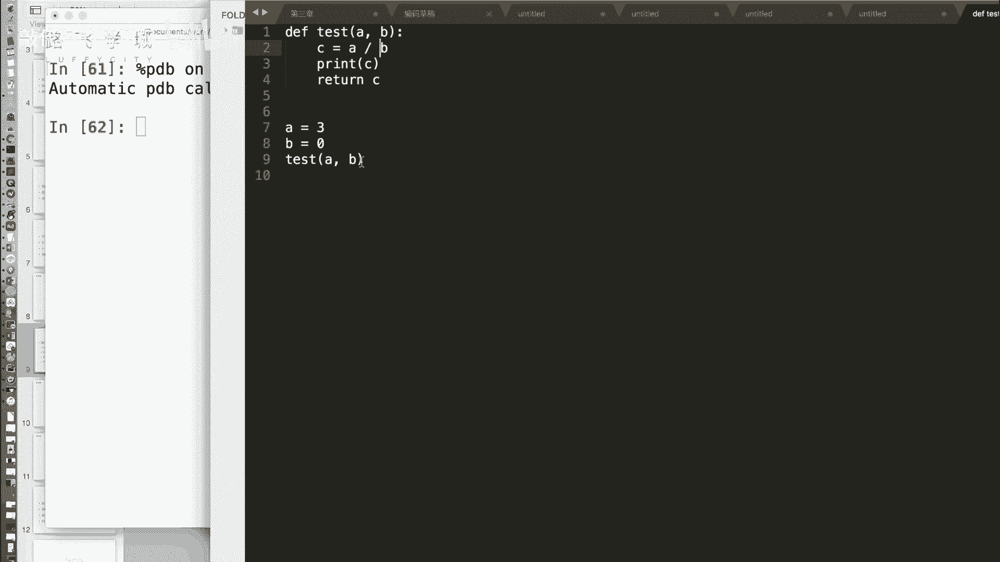

在本节课中，我们将学习IPython的几个高级功能，包括调试命令、历史记录、输入输出获取、目录标签系统以及Notebook。这些工具能显著提升代码编写和调试的效率。

## 调试利器：PDB命令 🔍

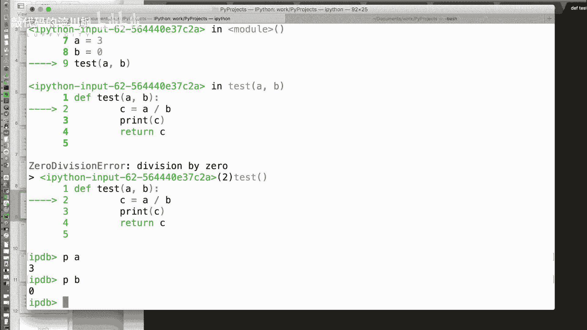

上一节我们介绍了IPython的魔术命令。本节中，我们来看看一个用于调试的强大工具：`%pdb`命令。在编写代码时，我们经常会遇到错误，但难以定位具体是哪一行出了问题。`%pdb`命令可以自动进入调试模式，帮助我们快速找到错误。

`%pdb`是一个开关命令。使用`%pdb on`开启后，当代码运行到报错行时，执行会自动停止在出错的前一行，并进入交互式调试器。

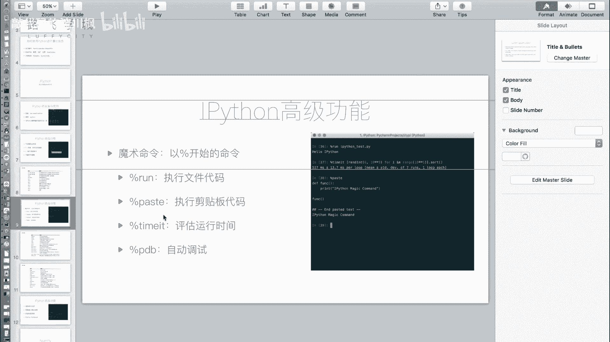

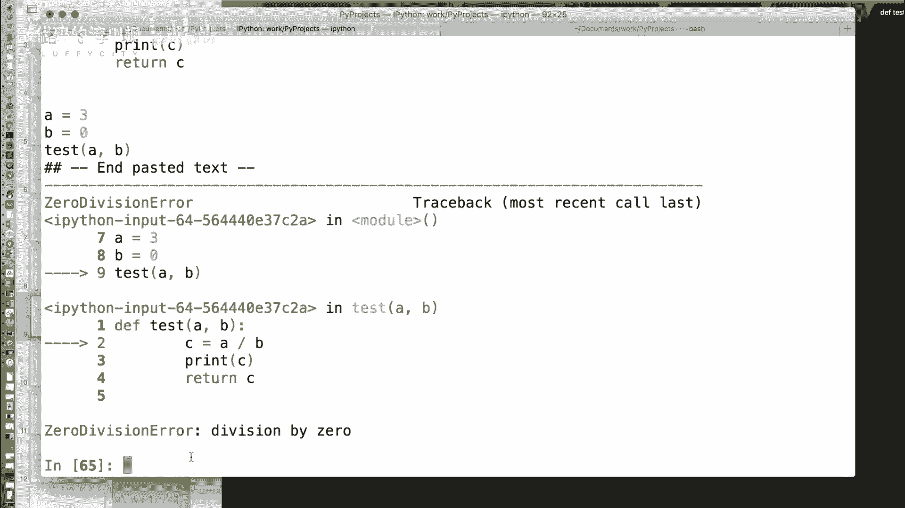

以下是一个示例函数，它会导致除零错误：
```python
def test(a, b):
    c = a / b
    return c
test(3, 0)
```
开启`%pdb`后运行上述代码，调试器会在执行`c = a / b`之前暂停。此时，我们可以使用`p`命令打印变量的当前值来检查问题，例如`p a`和`p b`。

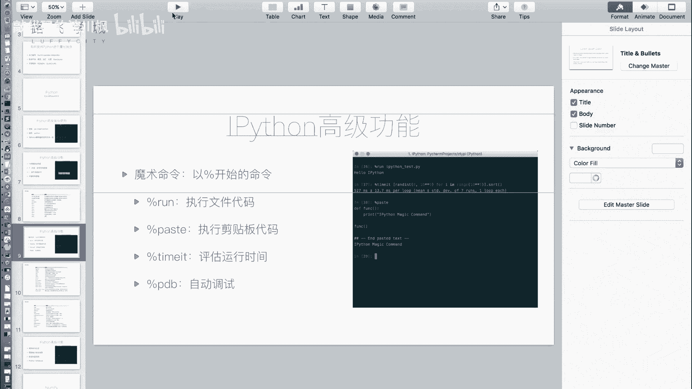

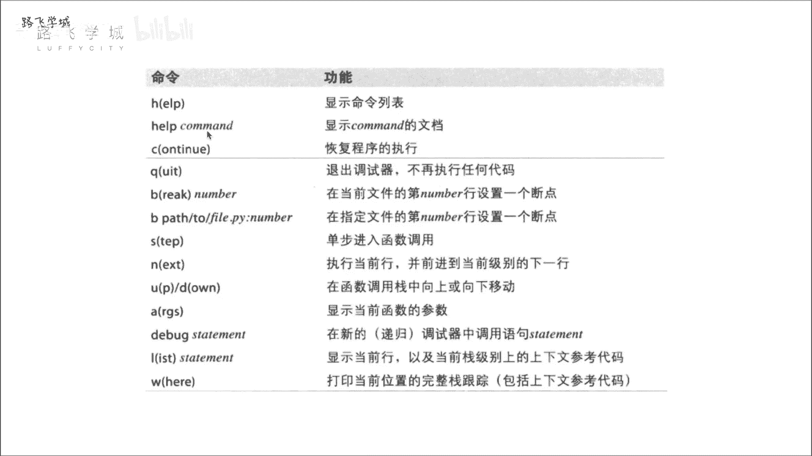

以下是PDB调试器的常用命令列表：
*   **h**： 打印帮助文档。
*   **q**： 退出调试器。
*   **break**： 设置断点。
*   **n**： 执行下一行代码。
*   **p**： 打印表达式的值。

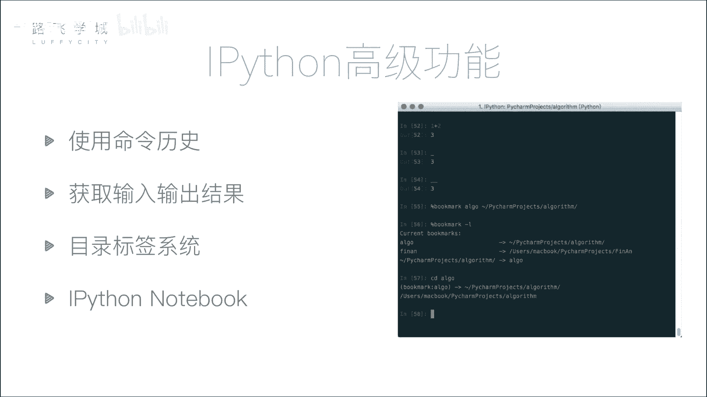

调试完成后，使用`%pdb off`可以关闭此功能。之后代码报错将直接显示错误信息，而不会进入调试模式。

## 便捷操作：命令历史与输入输出 📜

除了调试，IPython还提供了许多便捷的交互功能。接下来，我们看看如何高效地使用命令历史以及获取之前的输入和输出结果。

### 使用命令历史
在IPython中，按**上箭头键**可以调出上一条命令。更强大的是，你可以输入命令的开头几个字符，再按上箭头，IPython会自动搜索并匹配以这些字符开头的历史命令，这能极大提升操作效率。

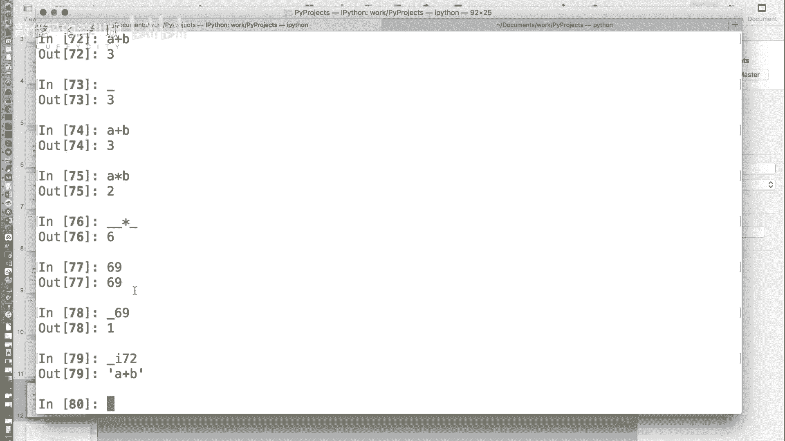

### 获取输入输出结果
有时我们运行了代码但忘记保存结果。IPython提供了特殊变量来获取这些信息：
*   **`_`** （一个下划线）： 代表上一个输出结果。
*   **`__`** （两个下划线）： 代表上上个输出结果。
*   **`_iN`**： 代表第N行的输入内容（N为行号）。

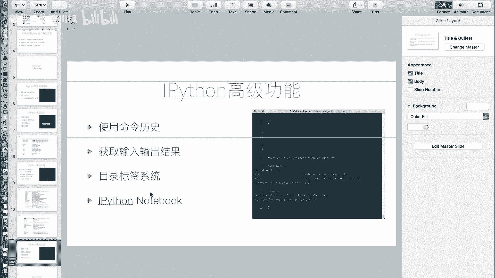

例如，执行`a + b`得到结果`3`后，即使没有赋值，也可以通过`_ * 2`来使用这个结果进行计算。

## 高效导航：目录标签系统 📂

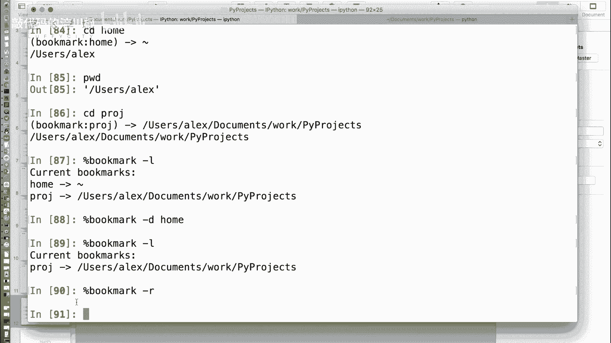

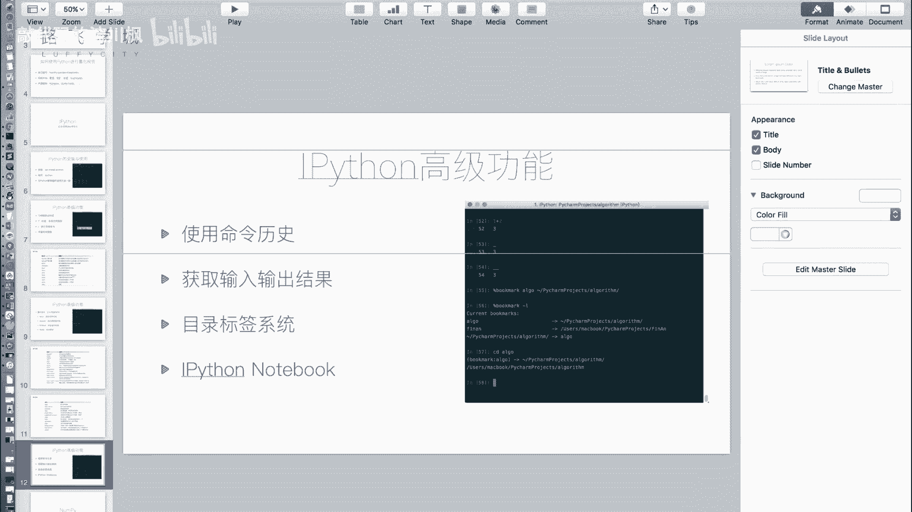

当需要在多个项目目录间频繁切换时，反复输入`cd`命令和长路径会很麻烦。IPython的`%bookmark`命令可以创建目录的快捷方式（书签）。

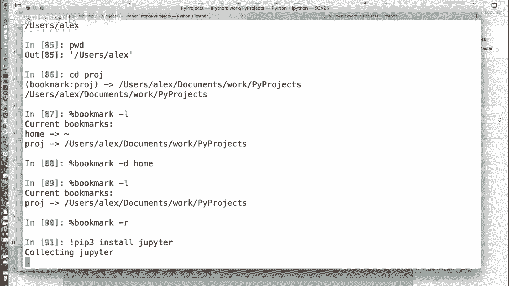

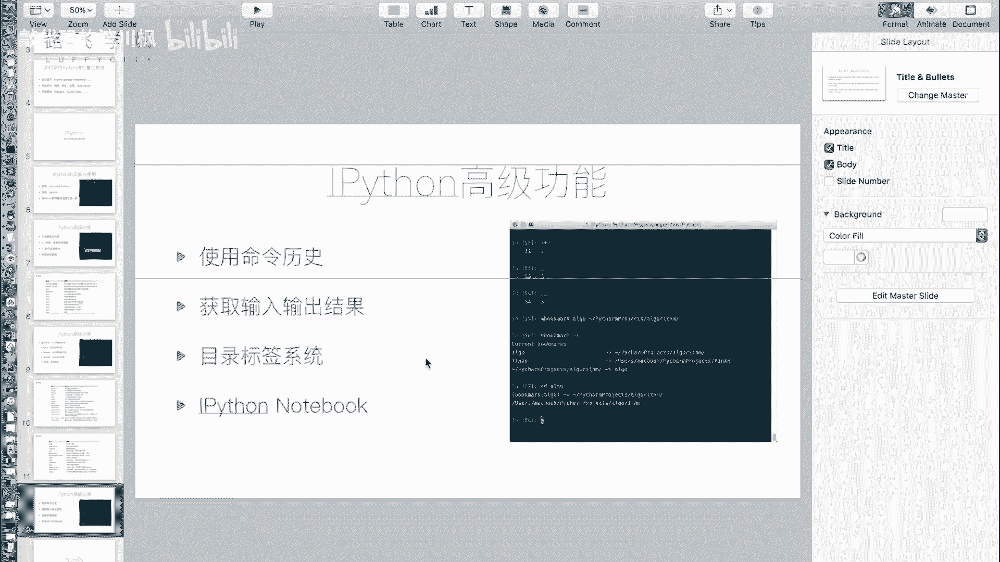

以下是书签功能的常用操作列表：
*   **`%bookmark 书签名 目录路径`**： 创建一个书签。
*   **`%bookmark -l`**： 列出所有已保存的书签。
*   **`cd 书签名`**： 快速切换到书签对应的目录。
*   **`%bookmark -d 书签名`**： 删除指定书签。
*   **`%bookmark -r`**： 删除所有书签。

## 交互式笔记本：Jupyter Notebook 📓

最后，我们介绍一个基于Web的、更强大的交互式环境——Jupyter Notebook。它由IPython项目发展而来，特别适合用于数据分析、教学和撰写技术博客。

首先需要安装`jupyter`模块：
```bash
pip install jupyter
```
安装后，在系统命令行输入`jupyter notebook`，它会在浏览器中打开一个文件管理界面。在这里，你可以创建新的Notebook文件。

在Notebook中，你可以创建“代码单元格”来编写和运行Python代码，并立即看到输出（包括图表）。你也可以创建“Markdown单元格”来编写格式化的文本说明。这使得Notebook能够将代码、运行结果和图文说明完美地结合在一起，并且可以导出为HTML、PDF等多种格式，非常适合制作可重复的分析报告或教程。

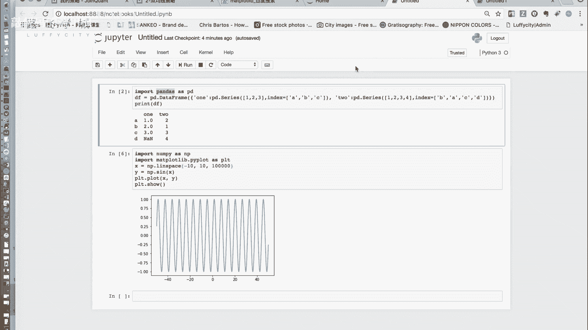


本节课中我们一起学习了IPython的多个高级功能：使用`%pdb`命令进行快速调试；利用命令历史和`_`、`_iN`变量高效回顾操作；通过`%bookmark`管理常用目录路径；以及使用Jupyter Notebook创建交互式文档。掌握这些工具，能让你的数据分析和代码探索工作更加流畅高效。