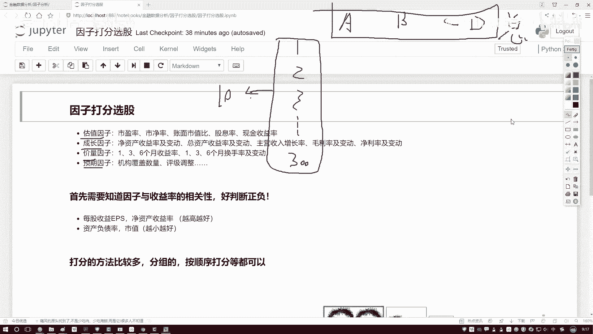
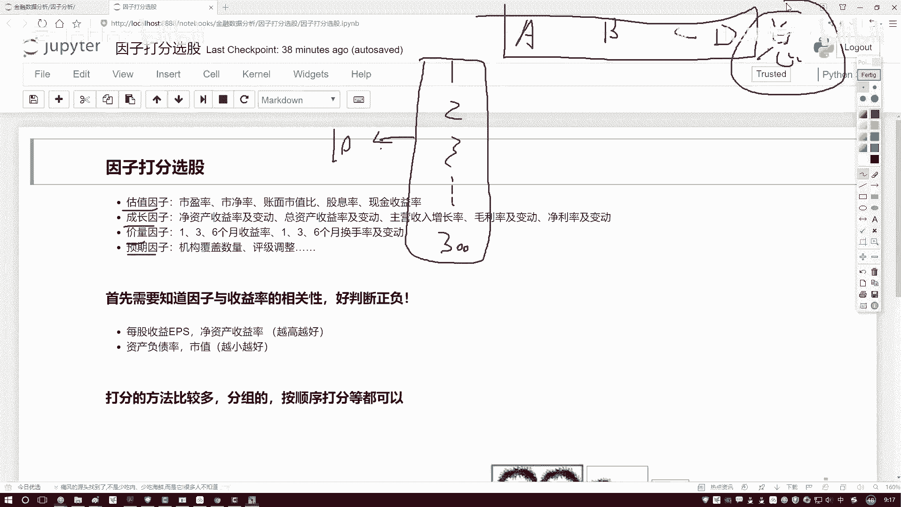
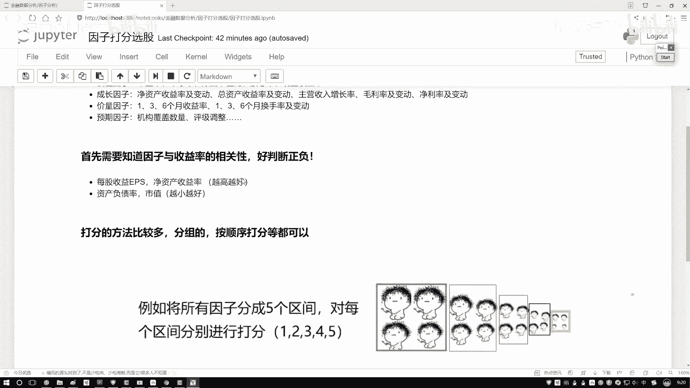
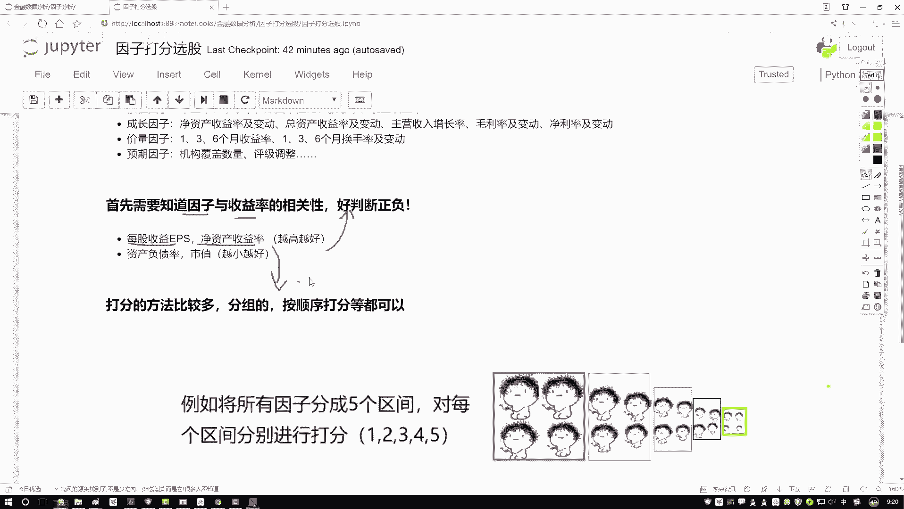

# 量化交易教程：P48：因子打分法选股策略概述 📊

在本节课中，我们将要学习一种在量化选股中常用的策略——因子打分法。我们将了解其核心思想、实施前提以及基本流程，为后续的代码实践打下基础。

## 策略核心思想

上一节我们介绍了如何通过单一因子（如IC值）来评估股票。本节中我们来看看如何综合多个因子进行更全面的评估。

因子打分选股策略的核心思想是：**为每只股票的各个因子进行评分，然后计算总分，最后根据总分排名来筛选股票**。

这类似于学生的总成绩由各科成绩加总而成。假设我们有300只股票（`stock_1`, `stock_2`, ..., `stock_300`）和四个因子（`factor_A`, `factor_B`, `factor_C`, `factor_D`）。我们的目标是为每只股票计算一个**总分**。


**公式表示如下：**
`总分(stock_i) = 评分(factor_A_i) + 评分(factor_B_i) + 评分(factor_C_i) + 评分(factor_D_i)`

计算出所有股票的总分后，进行排序，选取排名靠前的股票（如前10名）作为投资组合。在每次调仓周期（如每月）重复此过程。

## 策略实施前提

在开始打分之前，我们必须明确一个关键的先验知识：**每个因子与预期收益率的相关性是正向还是负向**。



以下是理解这一点的关键说明：
*   **正向因子**：因子值**越大**，通常预期收益越好。例如，每股收益（EPS）、净资产收益率（ROE）。
*   **负向因子**：因子值**越小**，通常预期收益越好。例如，市盈率（PE）、市净率（PB）。



我们需要这个信息，因为打分依赖于对因子数值的评判标准。例如，对于正向因子，数值越大，得分应越高；对于负向因子，数值越小，得分应越高。



获取这一知识有两种主要途径：
1.  查阅券商的研究报告，其中通常会总结因子的经验规律。
2.  通过我们之前学习的因子分析（如计算IC值）方法，自己进行验证。

在后续的实战中，我们将选择一组已知特性的因子（一部分越高越好，一部分越低越好）作为已知条件进行演示。

## 策略基本流程

以下是实施因子打分法选股策略的基本步骤：

1.  **因子选择与预处理**：选择一组对股票收益有预测能力的因子，并确保数据已经过清洗（处理缺失值、异常值等）。
2.  **因子方向确认**：确定每个因子是正向因子还是负向因子。
3.  **因子标准化**：为了消除不同因子量纲和范围的影响，需要将每个因子的值标准化到同一尺度（如Z-score标准化）。
    **代码示例（Z-score标准化）：**
    ```python
    # 假设 factor_series 是某个因子的原始数据序列
    factor_normalized = (factor_series - factor_series.mean()) / factor_series.std()
    ```
4.  **因子打分**：根据标准化后的数值和因子方向，为每只股票的每个因子打分。对于正向因子，值越大得分越高；对于负向因子，值越小得分越高。
5.  **计算总分**：将每只股票在所有因子上的得分相加，得到该股票的综合总分。
6.  **排序与选股**：根据总分对所有股票进行降序排序，选取排名最靠前的N只股票构成投资组合。
7.  **定期调仓**：在设定的调仓周期（如月末）重复上述步骤，更新投资组合。



本节课中我们一起学习了因子打分法选股策略的核心理念。我们明白了该策略旨在通过综合多个因子的评分来更全面地评估股票，并了解了实施该策略所必需的前提条件——明确因子的方向性。在下一节中，我们将进入实战环节，在量化平台上用Python代码完整实现这一策略。