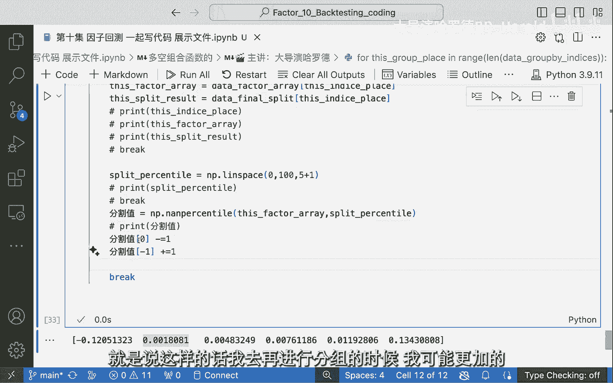
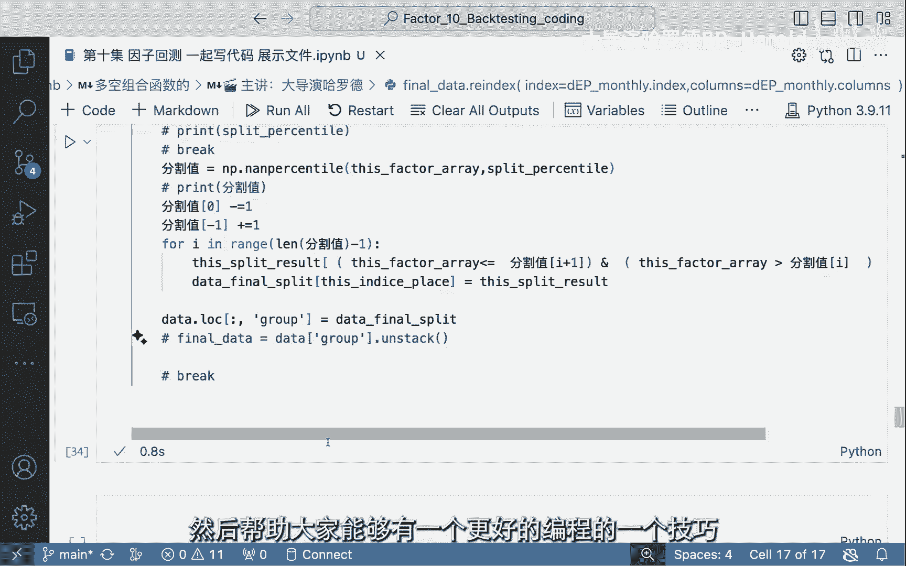

# 因子实战：10：Python代码实现因子分组

在本节课中，我们将学习如何使用Python代码，将原始的月度因子值数据，转换为按月份进行分组（例如分为5组）的标签数据。我们将从数据准备开始，逐步讲解如何利用`pandas`和`numpy`库中的函数，最终实现一个完整的因子分组函数。

## 概述

我们的目标是：输入一个数据集，其中包含每个股票在每个月的因子值。我们需要对每个月的数据，根据因子值的大小进行排序并分成N组（例如5组），最终输出一个新的数据集，其中的值不再是原始因子值，而是代表其所属组别的标签（例如1, 2, 3, 4, 5）。这样处理后的数据，将便于后续计算各组的收益率。

## 数据准备与初步处理

首先，我们来看一下输入数据的结构。它是一个`DataFrame`，行索引是日期（月度），列索引是股票代码，单元格内是因子值。

为了便于逐月处理，我们需要先将这个“矩阵”形式的数据“摊平”。这里会用到`stack()`函数。

```python
import pandas as pd
import numpy as np

# 假设 df_monthly 是原始的月度因子值 DataFrame
# 使用 stack() 将数据从宽格式转换为长格式
stacked_data = df_monthly.stack()
```

`stack()`函数会将数据的列索引（股票代码）变成行索引的一部分，从而形成一个多层索引（`MultiIndex`）的`Series`。第一层索引是日期，第二层索引是股票代码。

接下来，我们基于这个结构，构建一个目标`DataFrame`，用于存放最终的分组结果。

```python
# 获取摊平后数据的索引
multi_index = stacked_data.index

# 构建一个空的 DataFrame，索引与摊平后的数据一致，用于存放分组结果
result_df = pd.DataFrame(index=multi_index, columns=['group'])
```

同时，我们需要将原始的因子值作为一列数据加入这个`DataFrame`。

```python
# 将因子值作为新的一列加入
result_df['factor'] = stacked_data.values

# 删除因子值为空（NaN）的行
result_df = result_df.dropna(subset=['factor'])
```

现在，`result_df`包含了日期、股票代码、因子值三列信息，并且没有缺失值。我们的目标是在此基础上，新增一列`group`，用于存放每个股票在每个月的分组标签。

## 核心分组逻辑实现

上一节我们准备好了数据，本节中我们来看看如何实现按月分组的核心逻辑。思路是：按日期（`date`）分组，对每个组内的因子值进行排序，并根据分位数划分为N组。

首先，我们需要获取所有唯一的日期，以便进行循环处理。同时，为了高效地定位和更新数据，我们预先准备好一些数组。

```python
# 获取所有因子值，保存为一个数组，但注意这会丢失其与（日期，股票）的对应关系
all_factor_values = result_df['factor'].values

# 获取结果DataFrame的索引位置数组，用于后续精确定位
all_index_positions = np.arange(len(result_df))

# 初始化一个与结果DataFrame等长的空数组，用于存放最终的分组标签
final_groups = np.full(len(result_df), np.nan)
```

接下来，我们按日期进行分组。`pandas`的`groupby`功能非常适合这个任务。

```python
# 按日期进行分组
grouped = result_df.groupby(level=0) # level=0 表示按多层索引的第一层（日期）分组
```

我们将遍历每个日期组，对组内的因子值进行分组。以下是处理单个日期组的步骤：

1.  **获取当前组的索引和因子值**：利用`groupby`对象的`get_group`方法。
2.  **计算分位点**：使用`np.linspace`生成等间距的分位点（例如，分成5组需要6个分位点：0%, 20%, 40%, 60%, 80%, 100%）。
3.  **确定分割阈值**：使用`np.percentile`函数，根据当前组的因子值计算对应分位点的具体数值。
4.  **分配组别标签**：遍历每个因子值，判断其落在哪个分割区间，并赋予相应的组别标签（从0开始或从1开始）。
5.  **更新结果数组**：将当前组的标签填回`final_groups`数组的对应位置。

以下是实现这些步骤的代码框架：

```python
# 定义要分成的组数
num_groups = 5

# 遍历每个日期组
for date, group_indices in grouped.groups.items():
    # 1. 获取当前组的因子值
    current_factors = result_df.loc[group_indices, 'factor'].values
    
    # 2. 计算分位点（例如，对于5组，生成[0, 20, 40, 60, 80, 100]）
    percentiles = np.linspace(0, 100, num_groups + 1)
    
    # 3. 计算分割阈值
    # 使用 np.percentile 找到对应分位数的因子值
    split_values = np.percentile(current_factors, percentiles)
    # 对边界值进行微调，确保所有值都能被正确分类
    split_values[0] -= 1e-6  # 让最小值也能被大于“第0分位点”
    split_values[-1] += 1e-6 # 让最大值也能被小于“第100分位点”
    
    # 4. 初始化当前组的分组标签数组
    current_group_labels = np.zeros(len(current_factors))
    
    # 5. 为每个因子值分配组别
    for i in range(num_groups):
        # 判断条件：因子值 > 下界 且 因子值 <= 上界
        lower_bound = split_values[i]
        upper_bound = split_values[i + 1]
        mask = (current_factors > lower_bound) & (current_factors <= upper_bound)
        current_group_labels[mask] = i  # 分配组标签，例如 0, 1, 2, 3, 4
    
    # 6. 将当前组的标签存放到最终数组的对应位置
    # group_indices 是当前组在 result_df 中的位置
    final_groups[group_indices] = current_group_labels
```

## 整理与输出最终结果

核心的分组逻辑已经完成，`final_groups`数组中已经存放了所有数据对应的分组标签。现在，我们需要将这些标签整合回最初的`DataFrame`结构，并输出最终结果。

首先，将计算好的分组标签赋值给`result_df`。

```python
result_df['group'] = final_groups
```

现在，`result_df`是一个包含`factor`和`group`两列的长格式数据。为了得到与输入数据形状类似（行是日期，列是股票）的“分组标签矩阵”，我们可以使用`unstack()`函数。




```python
# 将‘group’列作为值，unstack第二层索引（股票代码），变回宽格式
final_output = result_df['group'].unstack()
```

`final_output`就是一个`DataFrame`，其行索引是日期，列索引是股票代码，单元格内的值就是该股票在该月的分组标签（例如0-4）。这个结果可以直接用于后续的分组收益率计算。

## 函数封装

为了方便重复使用，我们可以将上述所有步骤封装成一个函数。

```python
def create_factor_groups(factor_df, n_groups=5):
    """
    将月度因子值DataFrame转换为分组标签DataFrame。
    
    参数:
    factor_df (pd.DataFrame): 索引为日期，列为股票代码的因子值矩阵。
    n_groups (int): 要分成的组数，默认为5。
    
    返回:
    pd.DataFrame: 索引为日期，列为股票代码的分组标签矩阵。
    """
    # 1. 摊平数据
    stacked = factor_df.stack()
    result_df = pd.DataFrame({'factor': stacked.values}, index=stacked.index)
    result_df = result_df.dropna(subset=['factor'])
    
    # 2. 初始化数组
    all_factors = result_df['factor'].values
    final_labels = np.full(len(result_df), np.nan)
    
    # 3. 按日期分组处理
    grouped = result_df.groupby(level=0)
    for date, group_idx in grouped.groups.items():
        current_factors = result_df.loc[group_idx, 'factor'].values
        
        # 计算分位数分割点
        percentiles = np.linspace(0, 100, n_groups + 1)
        split_vals = np.percentile(current_factors, percentiles)
        split_vals[0] -= 1e-6
        split_vals[-1] += 1e-6
        
        current_labels = np.zeros(len(current_factors))
        for i in range(n_groups):
            mask = (current_factors > split_vals[i]) & (current_factors <= split_vals[i+1])
            current_labels[mask] = i
            
        final_labels[group_idx] = current_labels
    
    # 4. 赋值并转换格式
    result_df['group'] = final_labels
    grouped_matrix = result_df['group'].unstack()
    
    return grouped_matrix

# 使用函数
grouped_factor_matrix = create_factor_groups(df_monthly, n_groups=5)
```

## 总结



本节课中我们一起学习了如何用Python实现因子分组。我们从原始的月度因子值矩阵出发，通过`stack()`将其转换为长格式以便处理。然后，核心步骤是**按日期分组**，并在每个组内**根据因子值的分位数划分组别**。我们使用了`np.percentile`计算分割点，并通过逻辑判断为每个因子值分配组标签。最后，通过`unstack()`将结果恢复为矩阵格式，并封装成了可复用的函数。这个过程是构建因子分组回测体系的基础，掌握了它，就为后续计算各分组的收益率做好了准备。