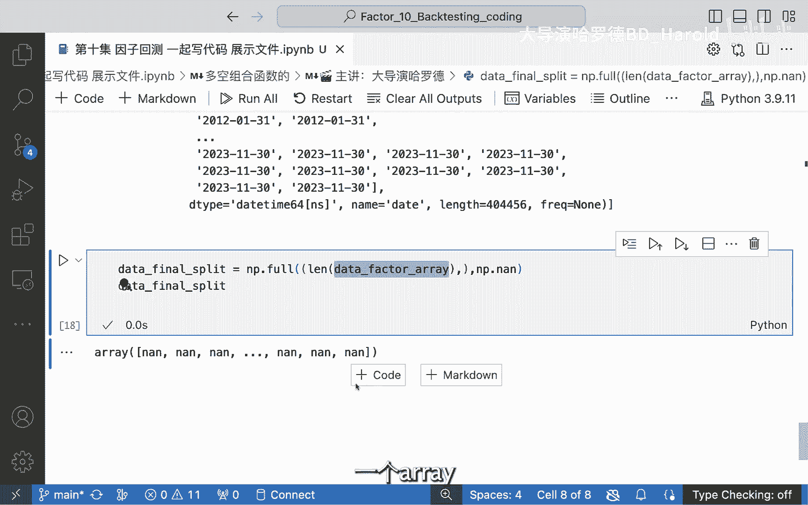

# 因子实战：10.2：使用NumPy实现因子分组

在本节课程中，我们将学习如何使用NumPy数组来编写一个函数，实现将因子值按日期分组并排序，最终为每个数据点分配组别编号的核心逻辑。我们将从获取数据开始，逐步构建分组函数，并处理其中的关键步骤。

## 概述

上一节我们介绍了因子分组的基本概念和目标。本节中，我们来看看如何用具体的Python和NumPy代码来实现这一过程。我们的核心目标是：输入一个包含日期、股票代码和因子值的数据集，输出一个新增了“组别”列的数据集，该列标识每个股票在每个日期下，其因子值所处的分组（例如1到5组）。

## 数据准备与目标确认

首先，我们需要从原始数据中提取出因子相关的部分。

```python
data = data.loc[:, ['factor']]
```

执行上述操作后，我们得到一个只包含因子值的数据集。我们的目标是新增一个“group”列，该列能根据因子值的大小，在每个日期内将股票分成五组。例如，因子值最小的20%股票为第一组，接下来的20%为第二组，以此类推。

如果我们能计算出这个“group”列，就可以利用数据透视（stack/unstack）操作，将数据变回我们需要的格式。

## 构建分组函数

为了实现分组，我们需要定义一个函数。这个函数的输入是数据，输出是包含组别信息的数据。

以下是定义函数的核心步骤：

1.  **按日期分组**：因为分组是在每个独立的交易日内进行的，所以我们必须按日期（‘date’）对数据进行分组。
2.  **计算分位数**：在每个日期内，我们需要找到因子值的20%、40%、60%、80%分位数，作为划分五组的边界。
3.  **分配组别**：根据每个股票的因子值落在哪个分位数区间，为其分配1到5的组别编号。

## 代码实现详解

现在，我们开始一步步编写这个函数。

首先，我们需要获取因子值的数组，并确保顺序与原始数据一致。

```python
data_factor_array = data['factor'].values
```

`data_factor_array` 包含了所有因子值。但仅仅有这个数组还不够，因为我们丢失了每个值对应的日期和股票信息。我们不能弄乱这个对应关系。

接下来，我们需要获取按日期分组的信息。我们使用Pandas的`groupby`功能。

```python
groups = data.index.get_level_values('date')
```

这里，`data.index`是一个多层索引（MultiIndex），包含‘date’和‘asset’（股票）。`get_level_values(‘date’)`可以取出所有日期值。`groups`变量将用于后续循环，对每个日期单独进行处理。

然后，我们初始化一个与`data_factor_array`长度相同的空数组，用于存放最终的分组结果。

```python
import numpy as np
data_final_split = np.full(data_factor_array.shape[0], np.nan)
```

`np.full`函数创建了一个形状与因子数组相同、但全部用`np.nan`（空值）填充的数组。我们稍后将用具体的组别编号（1-5）替换这些空值。

## 核心循环：按日期分组计算

以下是函数内部最关键的循环部分。我们将遍历每个唯一的日期，对该日期下的因子值进行分组。

```python
# 获取所有不重复的日期
unique_dates = np.unique(groups)

for date in unique_dates:
    # 1. 找到当前日期对应的数据索引位置
    date_mask = (groups == date)
    # 2. 提取当前日期下的所有因子值
    day_factors = data_factor_array[date_mask]
    # 3. 计算20%、40%、60%、80%分位数
    percentiles = np.percentile(day_factors, [20, 40, 60, 80])
    # 4. 根据分位数边界，为每个因子值分配组别 (1-5)
    #    使用np.digitize函数，它将值映射到分位数区间对应的编号
    day_groups = np.digitize(day_factors, percentiles) + 1
    # 5. 将计算好的组别填回最终结果数组的对应位置
    data_final_split[date_mask] = day_groups
```

**代码解释**：
*   `date_mask`是一个布尔数组，标记出原始数据中属于当前`date`的所有位置。
*   `day_factors`是当前日期下所有股票的因子值。
*   `np.percentile`计算所需的分位数边界。
*   `np.digitize(day_factors, percentiles)`将每个因子值根据分位数边界进行分类，返回0到4的编号（0表示小于最小边界，4表示大于等于最大边界）。我们`+1`是为了得到1到5的组别编号。
*   最后，将计算出的`day_groups`赋值给`data_final_split`数组中对应`date_mask`为True的位置。

## 函数封装与结果返回

将以上步骤封装进一个函数，并返回结果。

```python
def split_factor_into_groups(data):
    """
    将因子数据按日期分成5组。
    参数:
        data: DataFrame，索引为多层索引(date, asset)，包含‘factor’列。
    返回:
        一个与输入数据长度相同的数组，包含每个数据点对应的组别(1-5)。
    """
    data_factor_array = data['factor'].values
    groups = data.index.get_level_values('date')
    unique_dates = np.unique(groups)

    data_final_split = np.full(data_factor_array.shape[0], np.nan)

    for date in unique_dates:
        date_mask = (groups == date)
        day_factors = data_factor_array[date_mask]

        if len(day_factors) > 0: # 避免某天无数据的边缘情况
            percentiles = np.percentile(day_factors, [20, 40, 60, 80])
            day_groups = np.digitize(day_factors, percentiles) + 1
            data_final_split[date_mask] = day_groups

    return data_final_split
```

函数最后返回`data_final_split`数组。我们可以将这个数组作为新列添加到原始数据中：

```python
data['group'] = split_factor_into_groups(data)
```



## 总结


本节课中，我们一起学习了如何使用NumPy实现因子分组的核心逻辑。我们从明确分组目标开始，逐步完成了数据提取、日期分组、分位数计算以及组别分配的全过程。关键点在于理解**按日期分组**的必要性，以及熟练运用`np.percentile`和`np.digitize`这两个函数来高效地计算边界和分类。通过本节的代码实践，你应该能够掌握将理论上的分组方法转化为实际可运行代码的能力。在下一节，我们将探讨如何验证分组结果的有效性。