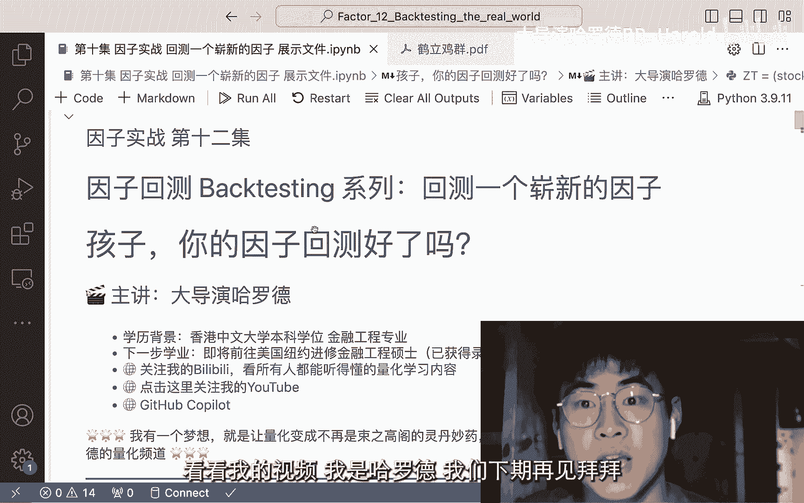

# 因子实战：11：构建涨跌停注意力因子


## 概述
在本节课中，我们将学习如何从一篇学术论文中获取灵感，并动手实现一个全新的量化因子。这个因子基于中国A股市场的涨跌停现象，旨在捕捉“注意力效应”对股票未来收益的影响。我们将使用Python读取数据、计算因子值，并最终将其整理成可用于回测的格式。

上一节我们介绍了如何将股票根据因子值分为五组进行回测。本节中，我们来看看如何从零开始，创造并计算一个全新的因子。

## 从论文到因子：核心思路
许多量化策略的灵感来源于学术论文或研究报告。本节课我们要实现的因子，其核心思想来源于一篇名为《Crows Among Chickens: The General Attention-Grabbing Effect of Daily Price Limits in Chinese Stock Market》（鹤立鸡群：涨跌停板在中国股市中的普遍注意力吸引效应）的论文。

该论文从行为金融学的角度提出了一个假设：投资者的注意力是有限的。当一只股票出现涨跌停时，它会像“鹤立鸡群”一样吸引市场大量的注意力。过度的关注可能导致该股票被高估（Overvalued），而缺乏关注的股票则可能被低估（Undervalued）。因此，一个可能的策略是做空近期受到过度关注的股票（即出现涨跌停的股票），同时买入关注度较低的股票。

我们的任务就是将这个逻辑转化为一个具体的、可计算的因子值。

## 因子定义与计算步骤
我们需要计算一个名为“涨跌停股票占比”的因子。对于每一个交易日，我们计算当日出现涨跌停的股票数量占全部股票数量的比例。这个比例反映了市场整体“注意力焦点”的集中程度。

以下是计算该因子的具体步骤：

**第一步：准备数据**
我们需要两类数据：
1.  **股票行情数据**：包含每只股票每日的开盘价和收盘价。
2.  **股票列表数据**：用于确定每个交易日有哪些股票在交易。

**第二步：计算每日涨跌停股票数量**
首先，我们根据开盘价和收盘价计算每只股票每日的涨跌幅。
```python
# 假设 stock_close 和 stock_open 都是 DataFrame，索引为日期，列为股票代码
daily_return = (stock_close - stock_open) / stock_open
```
接着，我们判断哪些股票达到了涨跌停。A股市场的涨跌停限制一般为10%，但在实际计算中，由于价格最小变动单位等因素，我们通常使用9%作为阈值。
```python
# 判断是否涨跌停（涨停 >= 0.09 或 跌停 <= -0.09）
limit_hit = (daily_return >= 0.09) | (daily_return <= -0.09)
```
然后，我们统计每个交易日出现涨跌停的股票数量。
```python
# 统计每日涨跌停股票数量，limit_hit 是一个布尔值的 DataFrame
# sum(axis=1) 对每一行（即每一天）的 True 值进行求和
num_limit_hit_stocks = limit_hit.sum(axis=1)
```

**第三步：计算每日交易的股票总数**
我们需要知道每天市场上有多少只股票在交易，以计算比例。
```python
# 统计每日有效股票数量（非空值）
num_total_stocks = stock_close.count(axis=1)
```

**第四步：计算因子值**
最终的因子值就是每日涨跌停股票数量与总股票数量的比值。
```python
# 计算涨跌停股票占比因子
attention_factor = num_limit_hit_stocks / num_total_stocks
# 处理可能存在的除零错误或无效值
attention_factor = attention_factor.replace([np.inf, -np.inf], np.nan).fillna(0)
```

## 代码实现要点
在具体编程实现时，有以下几个关键点需要注意：

1.  **数据对齐**：确保开盘价、收盘价等数据的索引（日期）和列（股票代码）完全对齐，否则计算会出错。
2.  **缺失值处理**：股票可能停牌，导致某些日期没有价格数据。在计算涨跌幅和统计数量时，需要妥善处理这些`NaN`值。`DataFrame`的`.count()`方法默认会忽略`NaN`。
3.  **阈值选择**：使用9%而非10%作为涨跌停判断阈值，更符合实际交易情况，能捕捉到那些“触及”涨跌停但未 exactly 达到10%的股票。
4.  **结果格式**：计算得到的`attention_factor`是一个`Series`，索引为日期，值为当日的因子值。这符合我们因子回测框架对输入数据格式的要求（每个截面期一个值）。

## 总结
本节课中我们一起学习了如何将一个论文中的金融学想法落地实现为一个具体的量化因子。我们以“涨跌停注意力因子”为例，详细讲解了从理解论文逻辑、定义因子计算公式，到使用Python进行数据处理的完整流程。



这个过程的核心在于**将抽象的逻辑转化为精确的数学公式和代码指令**。我们得到的因子值——每日涨跌停股票比例，可以接下来输入到我们之前构建好的回测框架中，检验其是否能带来超额收益。这便完成了从理论灵感（论文）到实践检验（回测）的量化研究闭环。在接下来的课程中，我们就可以将这个新生成的因子放入回测系统，观察它的历史表现。