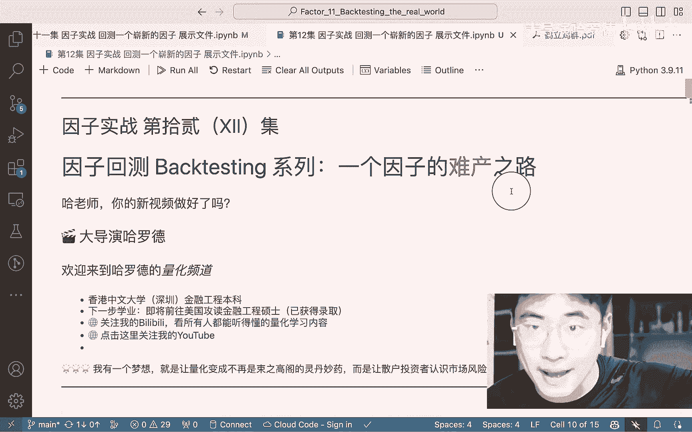

# 量化因子实战：12：一个因子的难产之路


在本节课中，我们将学习如何从一篇学术论文出发，完整地复现并回测一个全新的量化因子。我们将以“鹤立鸡群因子”为例，展示从理论理解、数据准备、因子构建到最终回测的完整流程。通过这个过程，你将体会到量化因子研究的实际挑战与核心思维。

## 课程回顾与目标

上一节我们介绍了如何从论文中提取核心观点并构建初步的因子。本节中，我们将深入探讨如何完善这个因子，并完成整个回测流程。

我们的核心目标是复现论文中的关键因子——**价格涨跌停溢出效应贝塔**，并检验其选股有效性。这个因子源于行为金融学理论，认为投资者的注意力是有限的，当市场出现大量涨跌停股票时，注意力会被吸引，从而影响相关股票的定价。

## 因子构建的逻辑演进

我们首先回顾了上节课构建的初步因子：**每日涨跌停股票比例**。其计算公式如下：

**`涨跌停比例 = (涨停股票数 + 跌停股票数) / 当日总股票数`**

在代码中，我们通过判断涨跌幅是否超过9%来定义涨跌停：

```python
# 判断涨停的条件
if (close_price - open_price) / open_price >= 0.09:
    is_limit_up = True
# 判断跌停的条件
if (open_price - close_price) / open_price >= 0.09:
    is_limit_down = True
```

然而，仅凭这个日频因子直接构建选股策略存在明显问题。例如，设想一个简单的策略：当涨跌停比例高时买入股票A，比例低时买入股票B。这引入了过高的个股特异性风险，不符合量化投资通过分散化降低风险的核心原则。

因此，我们需要更系统的方法来度量每只股票对市场整体涨跌停现象的敏感度。这正是原论文的核心贡献。

## 核心因子：价格涨跌停贝塔

论文通过一个回归模型来捕捉股票收益对涨跌停比例的敏感度，即我们想要得到的最终因子——**价格涨跌停贝塔**。

以下是构建该因子的回归方程：

**`R_i,d = α_i + β_i^APL * APL_d + β_i^MKT * MKT_d + β_i^SMB * SMB_d + β_i^HML * HML_d + ε_i,d`**

**公式解读：**
*   **`R_i,d`**：股票 `i` 在第 `d` 日的收益率。
*   **`APL_d`**：第 `d` 日的涨跌停比例因子（我们已构建）。
*   **`MKT_d`, `SMB_d`, `HML_d`**：Fama-French三因子，分别代表市场风险溢价、市值因子和账面市值比因子。用于控制已知的系统性风险。
*   **`β_i^APL`**：**这就是我们最终需要的因子值**。它表示在控制了其他常见风险因子后，股票 `i` 的收益对市场整体涨跌停比例的敏感程度。

论文的假设是，`β_i^APL` 绝对值越大的股票，其收益越容易受到市场极端情绪（涨跌停潮）的影响。根据行为金融学理论，这种“注意力驱动”的交易可能导致短期定价偏差，从而为长期Alpha提供可能。

## 因子回测的实施步骤

理解了理论模型后，我们需要将其转化为可执行的代码。以下是实现的核心步骤概述：

1.  **数据准备**：需要准备股票日收益率数据、已计算好的日频 `APL` 因子数据、以及Fama-French三因子数据。
2.  **滚动回归**：对每只股票，在**每个月度**区间内，用该月所有交易日的数据运行上述回归方程。目的是估计出该股票在这个月的 `β_i^APL`。
3.  **因子值提取**：每个月末，我们得到每只股票的一个新因子值，即该月估计出的 `β_i^APL`。将其取绝对值，得到**价格涨跌停敏感度因子**。
4.  **因子回测**：将这个月度更新的因子值，输入到我们之前课程中构建好的因子回测框架中。框架会执行以下操作：
    *   每月根据因子值对股票进行排序分组（例如分为5组）。
    *   计算每组股票在下个月的收益。
    *   分析因子的信息系数、分组收益曲线等，以评估其选股能力。

以下是步骤2和3的代码逻辑示意：

```python
# 伪代码：月度滚动回归提取因子
factor_values = {} # 存储最终因子值
for stock in all_stocks:
    for month_end in trading_months:
        # 获取本月数据
        month_data = get_data(stock, month_start, month_end)
        returns = month_data[‘daily_return’]
        APL = month_data[‘APL_factor’]
        MKT = month_data[‘MKT_factor’]
        SMB = month_data[‘SMB_factor’]
        HML = month_data[‘HML_factor’]

        # 执行线性回归
        import statsmodels.api as sm
        X = sm.add_constant(pd.DataFrame({‘APL‘: APL, ‘MKT‘: MKT, ‘SMB‘: SMB, ‘HML‘: HML}))
        model = sm.OLS(returns, X).fit()

        # 提取APL因子的系数（贝塔值）
        beta_apl = model.params[‘APL‘]
        # 存储该股票本月末的因子值（取绝对值）
        factor_values[(stock, month_end)] = abs(beta_apl)
```

## 回测结果与思考

将生成的因子进行回测后，我们观察到一个有启示性的结果：**对涨跌停敏感度最高的一组股票，长期收益倾向于落后于敏感度最低的一组**。

这与行为金融学的解释一致：过度关注涨跌停导致对相关股票的短期过度交易，推高其价格，随后出现回调。因此，做多低敏感度组合、做空高敏感度组合的对冲策略可能产生正向Alpha。

这个案例展示了量化研究的典型路径：
1.  **理论驱动**：从行为金融学（注意力配置）出发提出假设。
2.  **量化建模**：将理论转化为可检验的数学模型（回归方程）。
3.  **数据验证**：利用历史数据进行回测，验证因子的有效性。
4.  **实践应用**：将有效因子纳入多因子模型或构建具体策略。

## 总结与下期预告

本节课中，我们一起学习了如何将一篇学术论文中的核心思想，逐步转化为一个可回测的量化因子。我们经历了从原始数据构建、理论模型理解、到最终因子生成和回测分析的完整“因子难产”过程。关键在于理解每个步骤背后的金融逻辑，而不仅仅是编写代码。

**核心收获**：量化因子研究是理论、数据与编程的结合。成功的因子往往建立在扎实的经济学或行为学逻辑之上，并通过严谨的统计方法进行验证。

下节课，我们将视角转向**宏观择时**。我们将探讨如何利用宏观经济指标（如发电量、PMI等）来构建择时信号，判断市场整体的入场或离场时机。这与个股选股因子形成互补，帮助你构建更全面的量化投资框架。



