# 量化因子实战：13：宏观择时策略 🧮

在本节课中，我们将学习如何构建一个基于宏观数据的择时策略。我们将探讨如何利用发电量、贷款余额等宏观经济指标，来判断特定行业或宽基指数的未来走势，并通过量化回测来验证这些想法的有效性。

## 概述


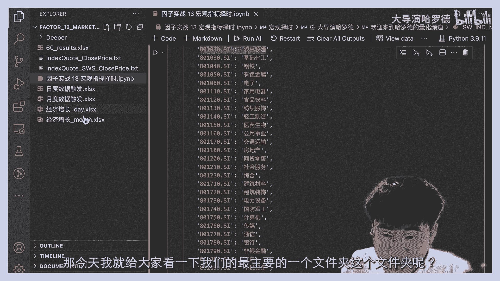

宏观择时策略的核心思想是，利用宏观经济数据的变化来预测市场或特定资产未来的涨跌方向。与基于个股基本面的“微观择时”不同，宏观因子对所有股票的影响是相同的，这使得我们可以用同一套因子去测试多个不同的标的物，效率更高。本节课，我们将以“发电量”和“国债利差”等宏观指标为例，构建一个简单的择时模型，并对其效果进行回测分析。

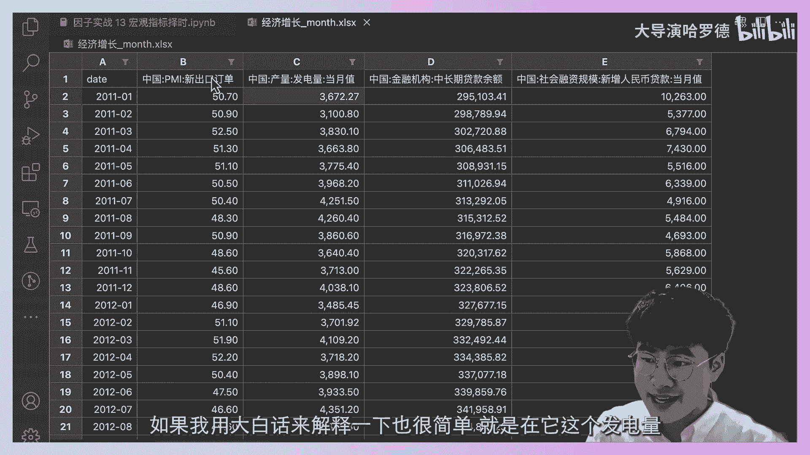

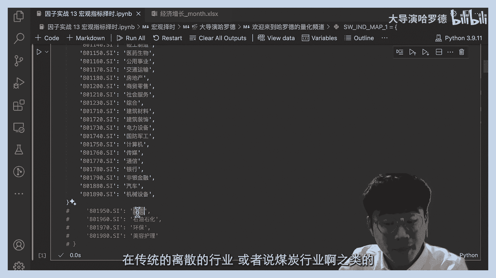

## 数据准备 📊

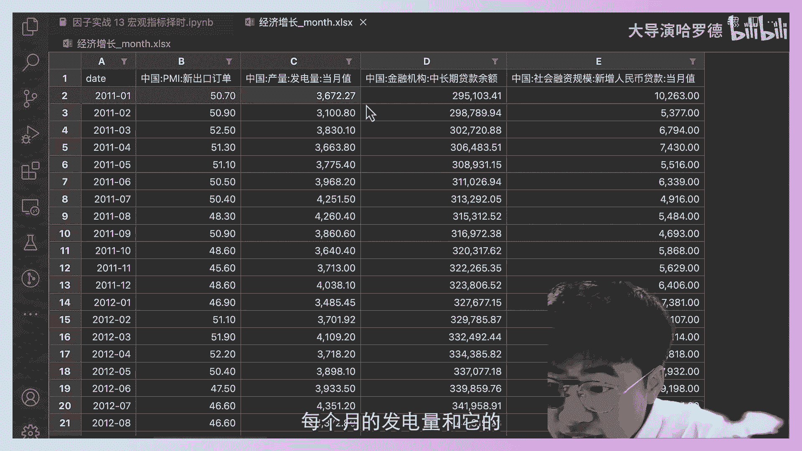

上一节我们介绍了宏观择时的基本概念，本节中我们来看看具体需要哪些数据。

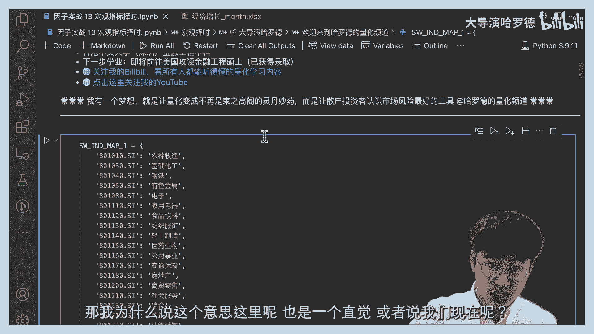

我们的数据主要分为两类：**标的物价格数据**和**宏观因子数据**。

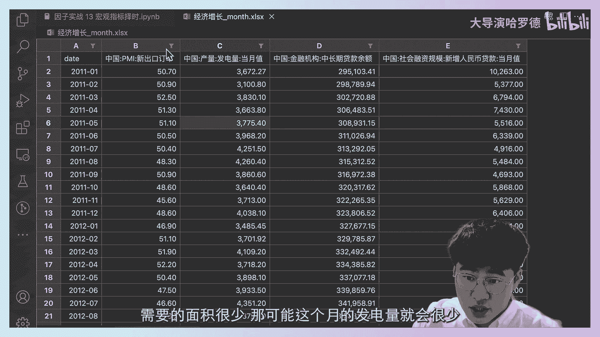

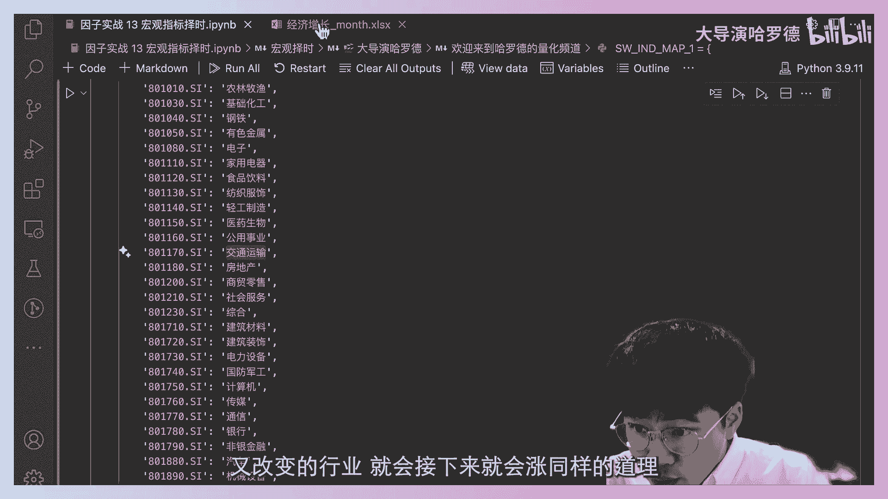

*   **标的物**：我们将在两类资产上进行测试。
    *   **宽基指数**：例如沪深300、中证500、创业板指，代表整体市场。
    *   **行业指数**：例如煤炭、钢铁、食品饮料等行业指数，代表特定板块。

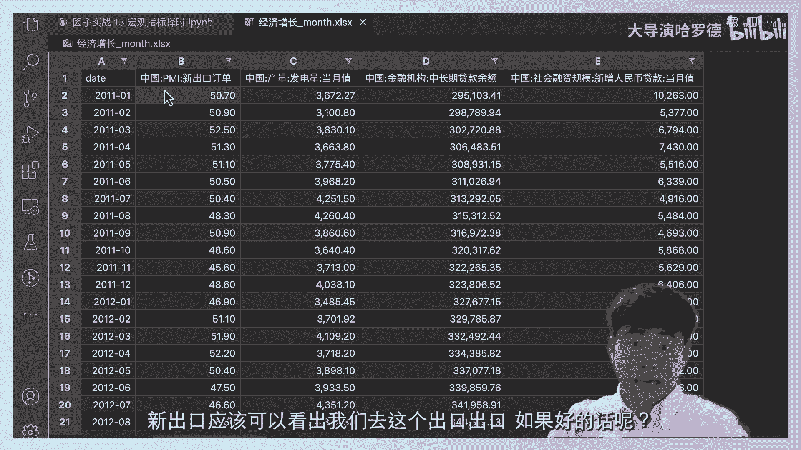

*   **宏观因子**：我们从Wind等数据平台获取了月度频率的宏观指标。
    *   **发电量**：反映工业生产和经济活跃度。
    *   **中长期贷款余额**：反映社会融资需求和投资热度。
    *   **新出口订单**：反映外部需求对制造业的影响。
    *   **国债利差（日频）**：即10年期国债收益率与1月期国债收益率的差值，常被视为市场对未来经济信心的指标。

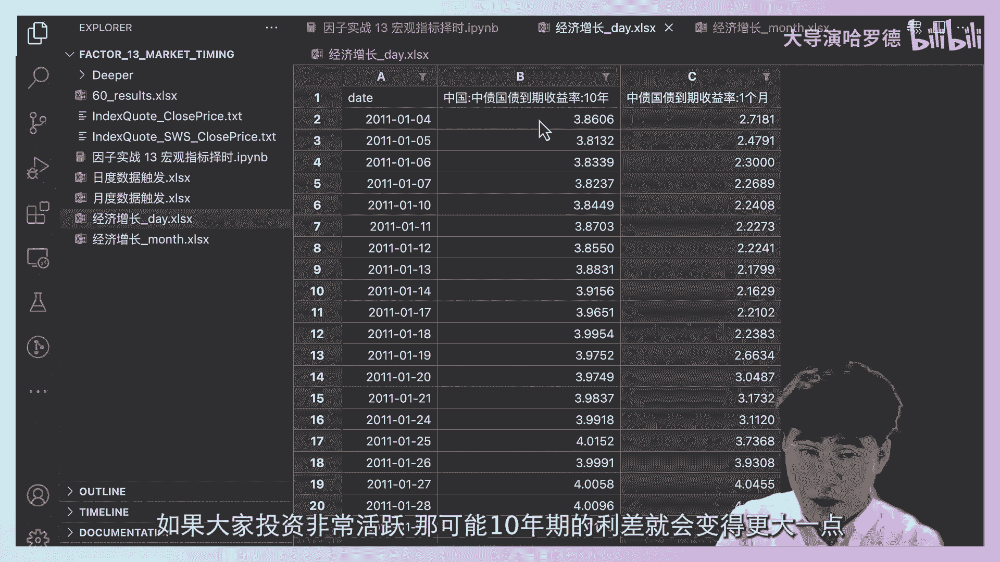

以下是读取并初步处理数据的代码示例：

```python
# 读取日频的国债利差数据
df_daily = pd.read_csv(‘treasury_spread_daily.csv’)
# 计算利差
df_daily[‘spread’] = df_daily[‘yield_10y’] - df_daily[‘yield_1m’]
df_daily.set_index(‘date’, inplace=True)

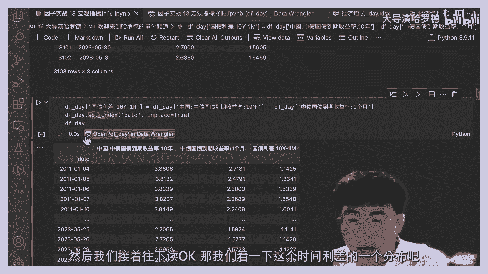

# 读取月频的宏观数据（如发电量）
df_monthly = pd.read_csv(‘macro_data_monthly.csv’)
df_monthly.set_index(‘date’, inplace=True)
```

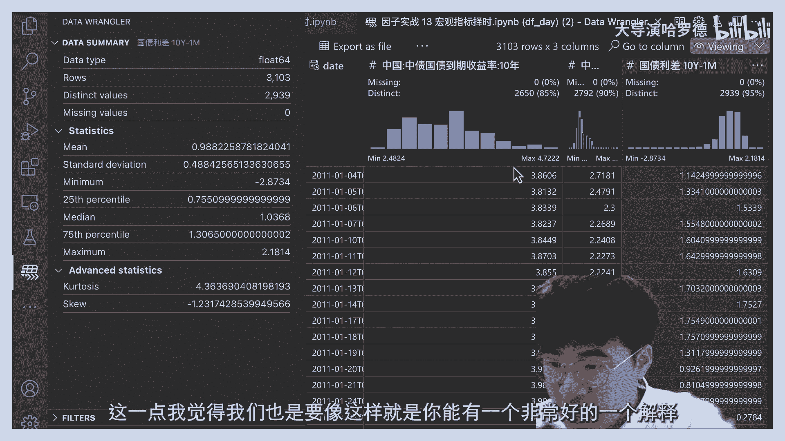

初步查看数据分布，有助于我们理解其统计特性。例如，国债利差在某些时期可能出现倒挂（长期利率低于短期利率），这本身就是一个值得关注的信号。

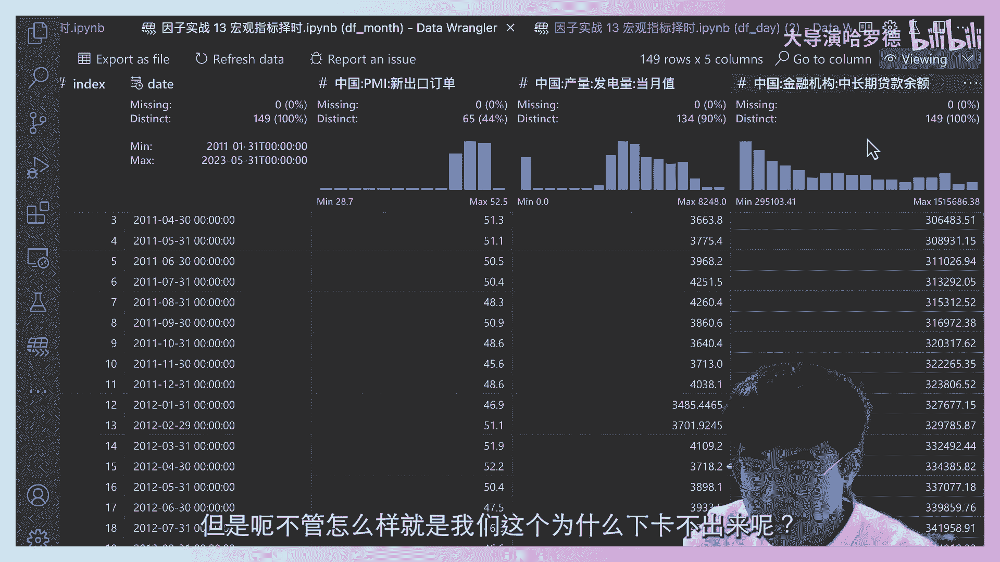

## 策略逻辑：信号生成 ⚙️

有了数据之后，我们需要制定规则，将原始的宏观数据转化为可以指导交易的“信号”。

核心问题是：如何定义“买入”或“卖出”的信号？我们介绍两种常见方法：

1.  **阈值法**：设定一个固定的分位数（例如历史数据的90%分位点）。当因子值超过该阈值时，产生看多信号。
2.  **滚动窗口法**：这是本节课采用的方法。它动态地计算一个滚动窗口内（例如过去60个月）因子值的中位数。将当前因子值与这个滚动中位数进行比较。

我们选择滚动窗口法的主要原因是，它更能适应不同时期宏观数据的整体水平变化，避免因长期趋势导致的阈值失效问题。

具体的信号生成逻辑如下：
*   设定一个滚动窗口大小 `window_size`（例如60个月）。
*   在每个时间点（月末），计算过去 `window_size` 个月内该因子值的中位数 `rolling_median`。
*   比较当前因子值 `current_value` 与 `rolling_median`：
    *   如果 `current_value > rolling_median`，则生成看多信号 **1**。
    *   如果 `current_value <= rolling_median`，则生成看空（或观望）信号 **0**。

这个逻辑可以用以下函数实现：

```python
def generate_signal(data_series, window_size):
    # 计算滚动中位数
    rolling_median = data_series.rolling(window=window_size).median()
    # 生成信号：当前值大于滚动中位数则为1，否则为0
    signal = (data_series > rolling_median).astype(int)
    return signal
```

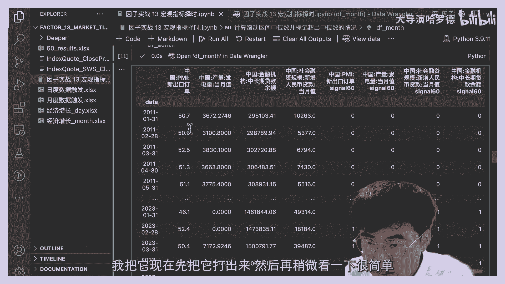

## 策略回测与评估 📈

信号生成后，我们需要在历史数据上检验其预测能力。评估标准主要有两个：

1.  **胜率**：在所有发出信号（信号为1）的时间点，观察资产在未来一段持有期（例如20个交易日或60个交易日）后的价格是否高于当前价格。价格上涨记为“赢”，反之为“输”。胜率 = 赢的次数 / 总信号次数。
2.  **盈亏比与策略收益**：更严谨的评估需要构建完整的投资策略。例如，当信号为1时，我们买入（或做多）该资产；当信号为0时，我们卖出（或做空）该资产。然后计算这个策略在整个回测区间内的累计收益（PNL）。盈亏比则衡量平均盈利与平均亏损的比例。

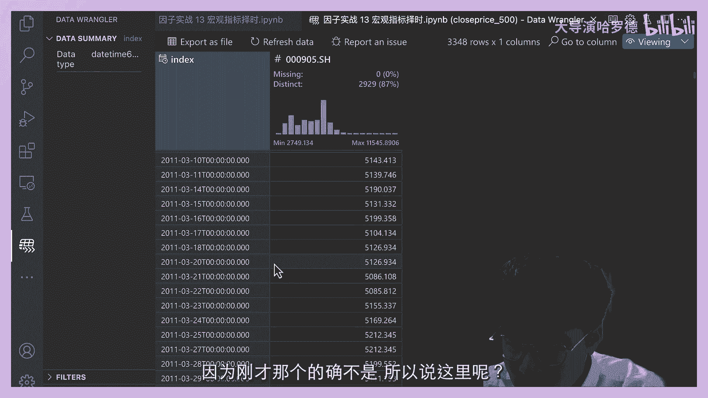

以下是计算胜率的简化逻辑框架：

```python
def calculate_win_rate(price_data, signal_series, hold_period):
    win_count = 0
    total_signal = 0
    for i in range(len(signal_series) - hold_period):
        if signal_series[i] == 1:  # 发出看多信号
            total_signal += 1
            # 检查持有期后的价格是否上涨
            if price_data[i + hold_period] > price_data[i]:
                win_count += 1
    win_rate = win_count / total_signal if total_signal > 0 else 0
    return win_rate, total_signal
```

将我们的宏观因子（如发电量）信号应用于不同的行业指数（如煤炭、食品饮料）进行回测，可以得到一个胜率表格。例如，我们可能发现“新出口订单”因子在“食品饮料”行业上，发出信号后60日的胜率高达90%。

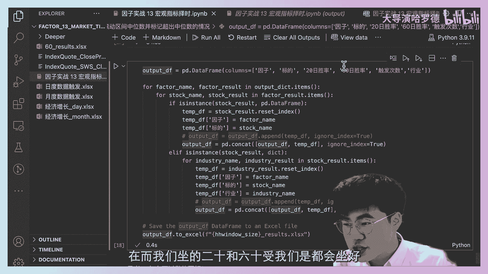

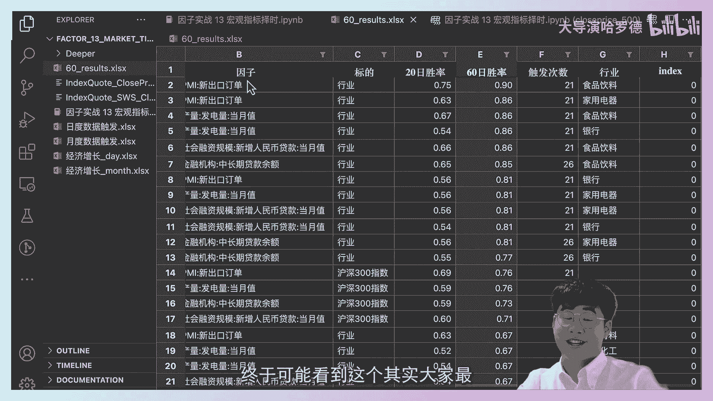

## 结果分析与策略优化 💡

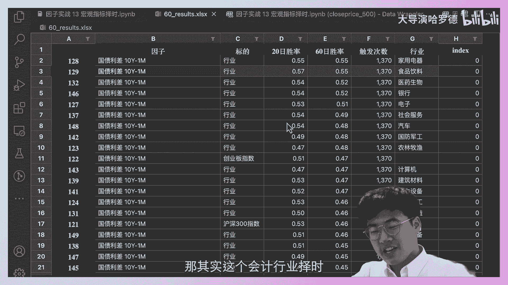

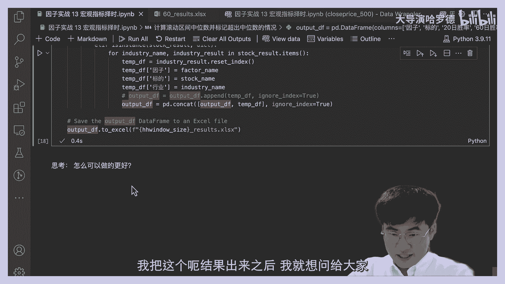

看到诸如90%的高胜率结果时，我们需要保持理性，进行深入分析：

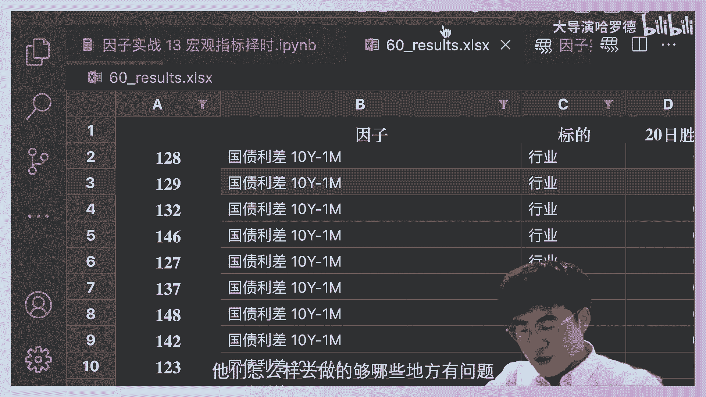

*   **统计显著性**：高胜率是否具有统计意义？如果信号触发总次数很少（例如只有20次），那么一次结果的偏差就可能对胜率产生巨大影响。我们需要更多的样本数据来支撑结论。
*   **盈亏比**：胜率高不代表一定能赚钱。如果盈利时只赚一点，亏损时却亏很多，那么高胜率策略最终也可能是负收益。必须结合盈亏比和夏普比率等指标综合评估。
*   **过拟合风险**：我们使用的参数（如60个月的滚动窗口）是否在历史数据上过度优化？需要在样本外数据或更长的历史周期中进行验证。

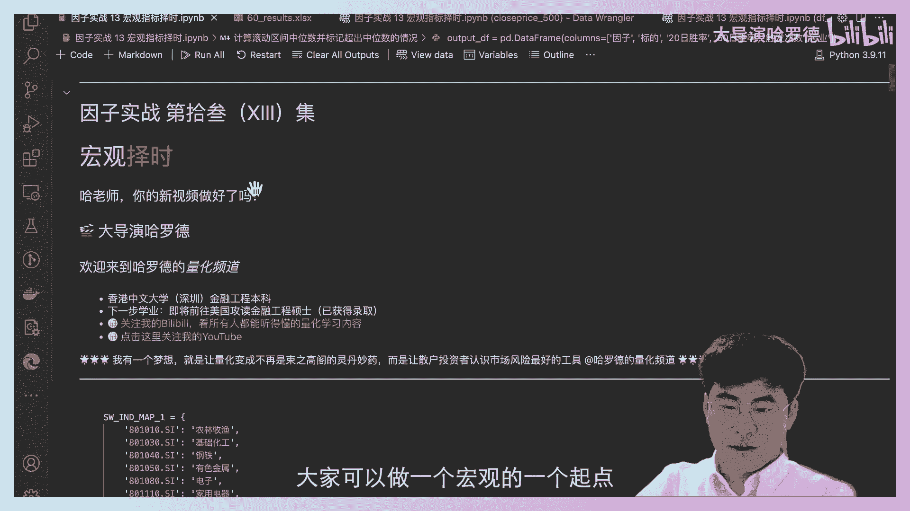


因此，一个健壮的宏观择时策略研究，不应止步于简单的胜率计算，而应：
1.  进行多因子组合测试。
2.  考虑不同的参数设置（参数敏感性分析）。
3.  在更长的历史区间或样本外数据上进行回测。
4.  最终构建包含仓位管理、止损止盈的完整交易策略进行收益评估。

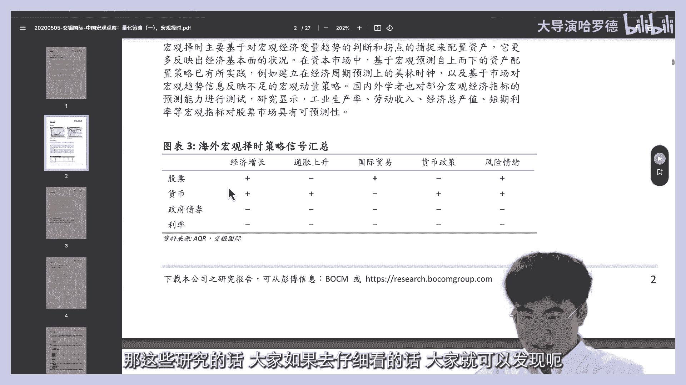

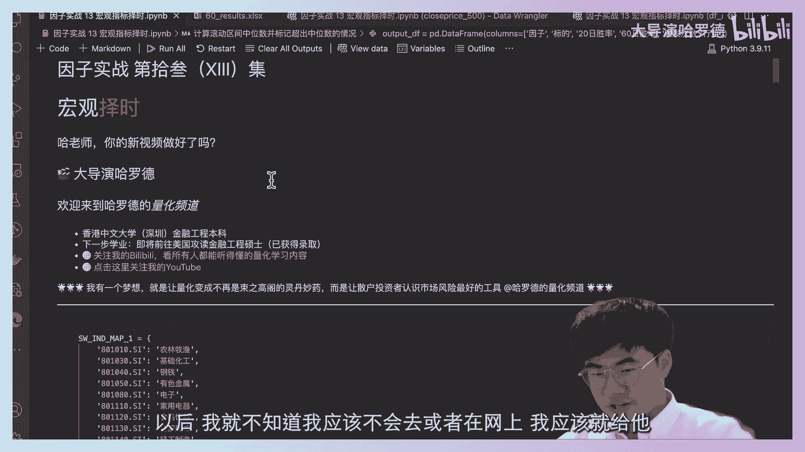

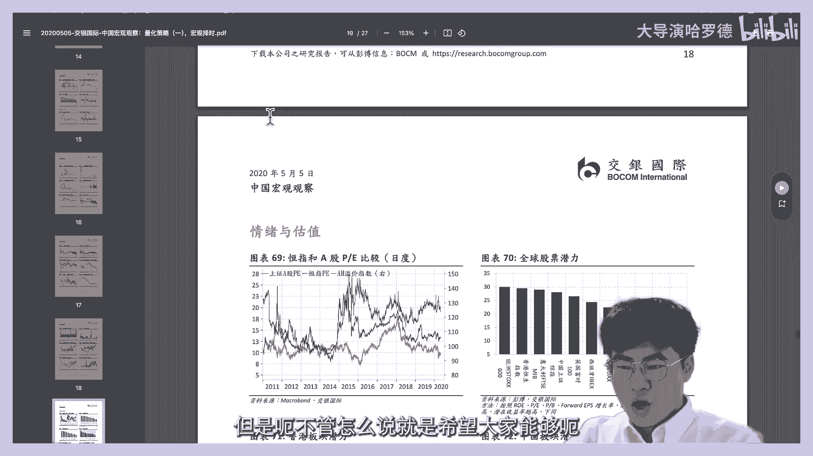

## 总结

本节课我们一起学习了宏观择时策略的构建流程。我们从**数据准备**开始，明确了标的物和宏观因子；然后设计了基于**滚动窗口中位数**的**信号生成**逻辑；接着通过计算**胜率**对策略进行了初步**回测评估**；最后，我们对结果进行了批判性**分析**，指出了高胜率背后可能存在的陷阱，并提出了**优化方向**。

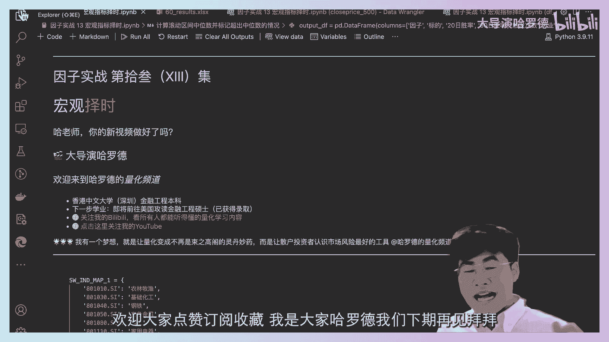

宏观择时是一个广阔且有趣的领域，它将宏观经济洞察与量化技术相结合。希望本教程能为你提供一个清晰的起点，鼓励你利用公开数据，亲自验证那些“摸着暖气片买煤炭”式的市场直觉，并用量化的方法将其转化为理性的投资决策参考。