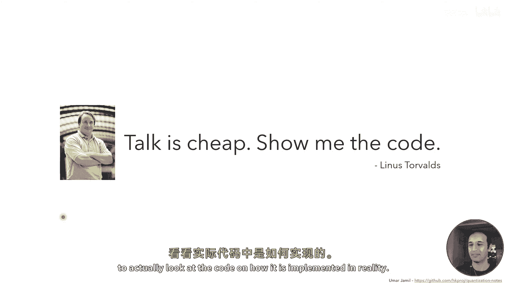
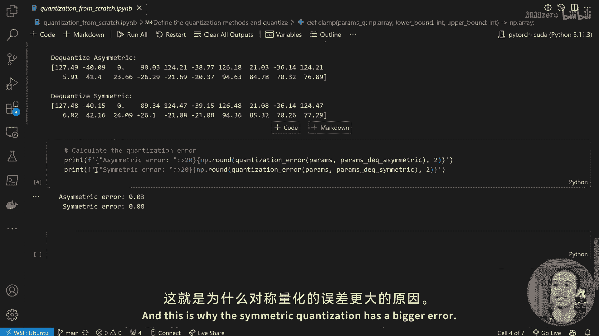
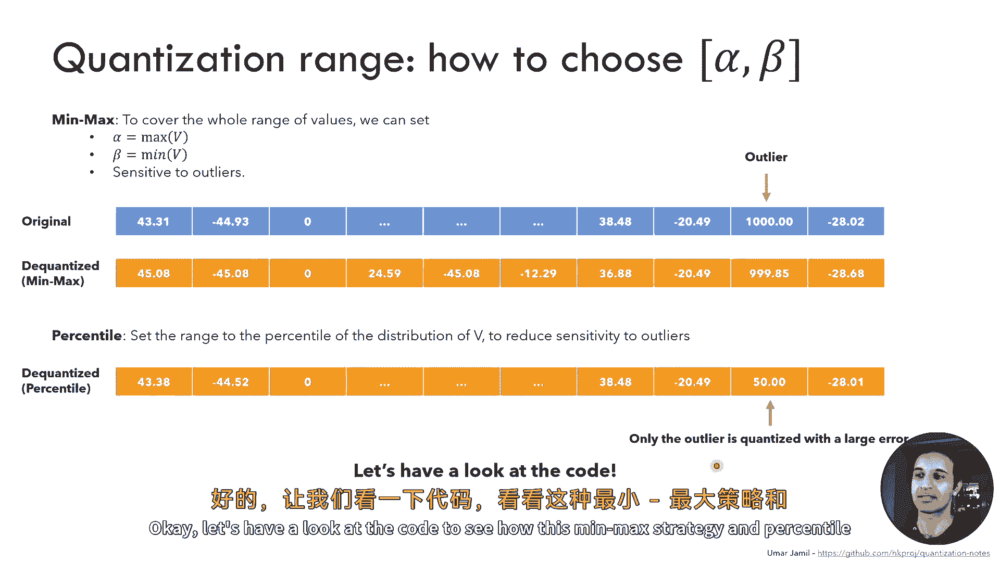
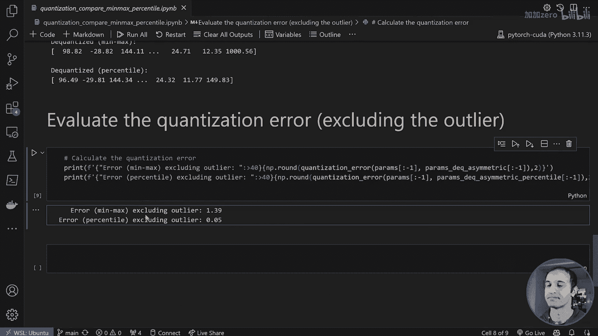
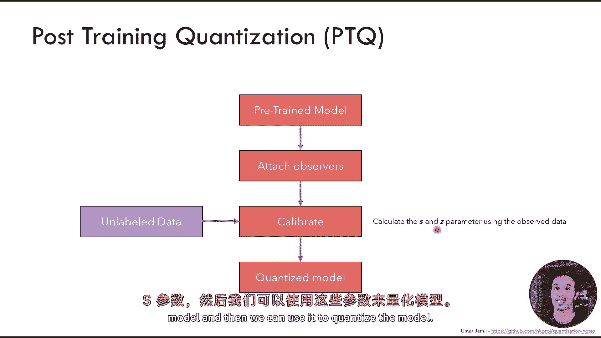
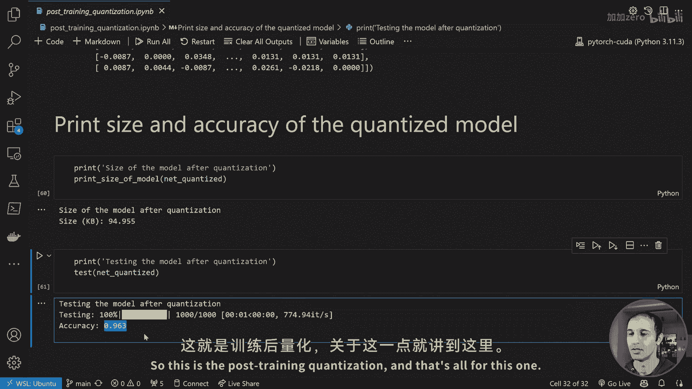
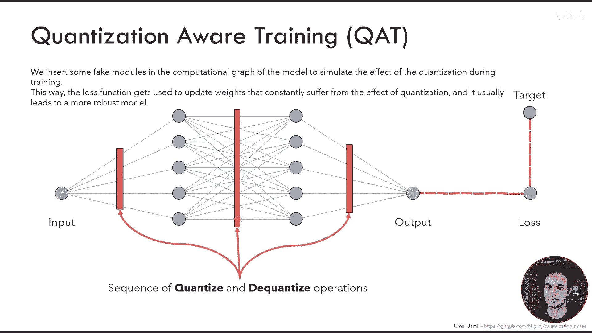
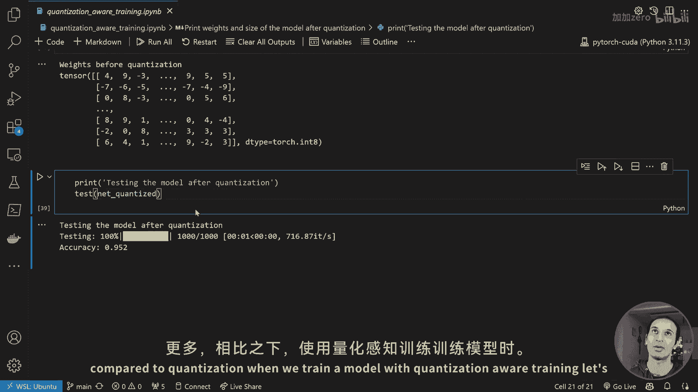

# 基于PyTorch的量化技术详解：P1：量化基础入门 🚀

在本节课中，我们将要学习神经网络量化的核心概念。量化是一种旨在减少模型存储空间和加速推理过程的技术，通过将模型参数和计算从浮点数转换为整数来实现。我们将从量化是什么、为什么需要它开始，逐步深入到其数学原理、不同类型，并通过PyTorch代码实践来巩固理解。

---

## 什么是量化？为何需要量化？🤔

量化旨在解决一个核心问题：现代深度神经网络通常包含数百万甚至数十亿个参数。例如，一个拥有70亿参数的模型，如果每个参数使用32位浮点数存储，仅存储参数就需要28GB的磁盘空间。在推理时，还需要将所有参数加载到内存（如CPU的RAM或GPU的显存）中，这对于标准PC或智能手机等设备来说是一个巨大的负担。

此外，与整数运算相比，计算机处理浮点运算的速度较慢。量化通过将浮点数转换为整数，可以显著减少表示每个参数所需的比特数，从而压缩模型大小并加速计算。

**请注意**：量化不仅仅是简单地将浮点数四舍五入到最近的整数，我们将在后续看到其具体工作原理。

量化的主要优势包括：
*   **减少内存消耗**：模型可以被压缩到更小的尺寸。
*   **减少推理时间**：使用更简单的数据类型（如整数）进行计算更快。
*   **降低能耗**：这对于移动设备至关重要。

---

## 硬件中的数字表示 💻

计算机使用固定数量的比特来表示任何数据。一个由 `n` 比特组成的位串可以表示最多 `2^n` 个不同的数字。例如，3比特可以表示从0到7的8个数字。

在大多数CPU中，整数使用**二进制补码**表示。这意味着数字的第一位表示符号（0为正，1为负），其余位表示数值的绝对值（正数）或其补码（负数）。使用二进制补码是为了确保0有唯一的表示。

你可能好奇Python如何能处理远超64位的大整数。Python使用了**大数运算**，它将数字以 `2^30` 为基数的数组形式存储，从而减少了存储大数所需的“数字”个数。这是由CPython解释器实现的，而非CPU硬件直接支持。

---

## 浮点数的表示

十进制数包含了基数的负幂次。例如，数字 `85.625` 可以表示为各个数字乘以10的幂次之和，其中小数部分对应10的负幂次。

标准的 **IEEE 754** 格式定义了32位浮点数的表示方法。它将32位字符串分为三部分：
1.  **符号位 (1 bit)**：0表示正数。
2.  **指数位 (8 bits)**：表示数字的量级。
3.  **尾数位 (23 bits)**：表示数字的小数部分。

将位串转换为实际值的公式为：
`值 = (-1)^符号位 * 2^(指数 - 127) * (1 + 尾数部分对应的分数值)`

大多数现代GPU也支持16位浮点数（半精度），但这会降低精度，因为用于表示小数部分和指数的比特数更少。

---

## 神经网络层面的量化 🧠

上一节我们介绍了数字在硬件中的表示，本节中我们来看看量化如何应用于神经网络。

一个神经网络通常由输入、若干层（如线性层）和输出组成。训练过程涉及前向传播、计算损失和反向传播更新参数。

以线性层为例，其操作为：`输出 = 输入 * 权重 + 偏置`。权重和偏置通常由浮点数表示。

**量化的目标**是将输入、权重和偏置张量量化为整数，从而用更快的整数运算执行所有操作。得到整数输出后，再将其**反量化**为浮点数，并输入到下一层。理想情况下，下一层不应察觉到前一层的量化操作，从而在保持模型精度的同时，减少内存占用并加速计算。

量化带来的主要好处是，在大多数硬件上整数运算比浮点运算快得多。此外，许多嵌入式设备可能根本不支持浮点运算，因此必须使用整数运算。

---

## 量化类型：对称与非对称 ⚖️

现在我们已经了解了量化的目标，接下来深入探讨两种主要的量化类型。

假设我们有一个原始张量，其值分布在某个范围内。量化的目标是将这个原始范围映射到一个由整数构成的新范围（例如，使用8比特时，范围为0到255）。

以下是两种主要的量化策略：

### 非对称量化
*   **目标**：将原始范围 `[β, α]`（β为最小值，α为最大值）映射到整数范围 `[0, 2^n - 1]`。
*   **量化公式**：`Q(x) = clamp(round(x / S) + Z, 0, 2^n - 1)`
    *   `S` 是缩放因子：`S = (α - β) / (2^n - 1)`
    *   `Z` 是零点偏移：`Z = round(-β / S)`
*   **反量化公式**：`x' = S * (Q(x) - Z)`
*   **特点**：最大值映射到255，最小值映射到0。原始值0被映射到`Z`。

### 对称量化
*   **目标**：将原始范围 `[-α, α]`（α为绝对值的最大值）映射到对称的整数范围 `[-(2^(n-1)-1), 2^(n-1)-1]`（例如8比特时为 `[-127, 127]`）。
*   **量化公式**：`Q(x) = clamp(round(x / S), -(2^(n-1)-1), 2^(n-1)-1)`
    *   `S = α / (2^(n-1) - 1)`
*   **反量化公式**：`x' = S * Q(x)`
*   **特点**：原始值0始终被映射到量化后的0，这对于某些运算（如填充）非常有用。

两种方法都会引入误差，因为我们将一个可能很大的范围（32比特）压缩到一个更小的范围（如8比特）。我们的目标是最小化这种误差。

选择量化的比特数时需注意硬件优化。CPU/GPU通常对8、16、32、64位操作有专门优化，选择非常规比特数（如11位）可能无法获得硬件加速。

---

## 量化范围选择策略 🎯

上一节我们介绍了对称和非对称量化的基本公式，其中关键参数α和β（即范围）的选择至关重要。本节我们来看看几种不同的范围选择策略及其影响。

### Min-Max 策略
*   **方法**：直接选择张量中的最大值作为α，最小值作为β。
*   **缺点**：对**异常值**非常敏感。一个异常值会“撑大”整个范围，导致其他正常值的量化区间被压缩，量化误差增大。

### 分位数策略
*   **方法**：不直接使用最大值和最小值，而是使用一个高百分位数（如99.99%）作为α，一个低百分位数（如0.01%）作为β。
*   **优点**：可以排除异常值的影响，使量化范围更贴合大多数数据的分布，从而显著降低整体量化误差。只有异常值本身的误差会很大。

### 均方误差最小化策略
*   **方法**：通过网格搜索等方式，选择能使原始张量与反量化后张量之间**均方误差最小**的α和β。
*   **应用**：这是一种更精细的优化策略。

### 交叉熵最小化策略
*   **方法**：选择能使原始分布与反量化后分布之间**交叉熵最小**的α和β。
*   **应用**：特别适用于语言模型最后一层的概率分布输出，其目标是保持概率分布的相对顺序（即最大的token概率在量化后仍然最大）。

### 量化粒度
对于卷积层，其包含多个滤波器（通道）。如果所有通道使用同一套α和β，可能造成某些通道的范围利用率低下。
*   **逐通道量化**：为每个通道单独计算α和β。这种方式能实现更高质量的量化，减少精度损失。

---

## 训练后量化 🔧

训练后量化是指在一个**已经训练好的模型**上应用量化。我们不需要原始的带标签训练数据，只需要一些无标签的校准数据来运行推理，以收集各层激活值的统计信息（如最小值和最大值）。

以下是实施步骤：
1.  **准备预训练模型**：加载一个已训练好的模型。
2.  **插入观察器**：在模型各层插入特殊的“观察器”模块。这些观察器在推理过程中会记录流过该层数据的统计信息（如Min/Max）。
3.  **校准**：使用一部分校准数据（如测试集）在模型上运行推理。观察器在此期间收集统计信息。
4.  **转换模型**：利用收集到的统计信息（用于计算各层的`S`和`Z`），将模型转换为真正的量化模型。此时，线性层被替换为量化线性层，权重变为8位整数。
5.  **评估**：评估量化后模型的精度和大小。

**优点**：流程简单快捷，无需重新训练。
**潜在缺点**：与原始模型相比，精度可能会有一定下降，尤其是模型较小或对精度要求极高时。

在PyTorch中，可以使用 `torch.ao.quantization` 模块方便地实现上述流程。

---

## 量化感知训练 🧪

上一节我们学习了如何在训练后量化模型，但精度损失有时难以避免。本节介绍一种更高级的技术——**量化感知训练**，它在训练阶段就模拟量化效应，使模型对量化更加鲁棒。

量化感知训练的核心思想是：在训练过程的**前向传播**中，模拟量化引入的误差，让模型在优化损失函数时，学会适应这种误差。

**具体做法**：
1.  在模型的计算图中，在各层之间插入**伪量化**操作（即量化和立即反量化）。
2.  正常进行训练。在前向传播时，数据会经过这些伪量化节点，引入量化噪声。
3.  反向传播时，由于量化操作本身不可微，需要使用**直通估计器**来近似梯度：对于在量化范围内的输入，梯度设为1；对于超出范围的输入，梯度设为0。
4.  训练完成后，模型权重已经适应了量化噪声。此时，可以像训练后量化一样，使用校准数据收集统计信息，并最终转换为量化模型。

**为何有效？**
想象损失函数曲面。标准训练可能使模型收敛到一个“尖锐”的局部最优点。量化导致的权重微小变化可能使其跌出最优点，造成精度大幅下降。量化感知训练则引导模型收敛到一个更“平坦”的局部最优点，这样即使量化后权重有所扰动，损失（即精度）也不会发生剧烈变化。

**优点**：通常能比训练后量化获得更高的最终精度。
**缺点**：需要重新训练或微调模型，时间成本更高。

在PyTorch中，可以通过在定义模型时使用 `torch.ao.quantization.QuantStub()` 和 `DeQuantStub()`，并为各层配置 `qconfig` 来启动量化感知训练。

---

## GPU如何加速量化计算 ⚡

了解量化如何加速计算，需要窥探硬件层面。GPU使用称为**乘积累加**的专用硬件单元来加速矩阵运算。

在进行量化矩阵乘法 `X * W + B` 时：
1.  `X` 和 `W` 是8位整数矩阵。
2.  GPU的MAC单元并行加载`X`的一行和`W`的一列的小块数据（例如4个元素）。
3.  执行对应元素的乘法（两个8位数相乘，结果可能为16位）。
4.  将这些乘积与一个初始化为偏置`B`的**累加器**相加。累加器通常使用更高位宽（如32位）来避免溢出。
5.  最终结果存储在累加器中，然后可以缩放或处理以得到输出。

正是这种对低位宽整数运算的硬件级优化，使得量化能带来显著的推理速度提升。

---

## 总结 📚

本节课中我们一起学习了神经网络量化的基础知识。我们从量化解决的核心问题（模型大、计算慢）出发，探讨了数字在硬件中的表示方式。然后，我们深入研究了量化的两种基本类型：**非对称量化**和**对称量化**，并学习了它们的数学公式。

接着，我们探讨了如何选择量化范围，包括**Min-Max**、**分位数**等策略，以及**逐通道量化**的概念。我们实践了两种主要的量化应用方式：无需重新训练的**训练后量化**，以及能提升鲁棒性的**量化感知训练**。最后，我们简要了解了GPU如何利用硬件单元加速量化计算。

量化是部署高效、轻量级模型的关键技术。掌握这些基础知识，是进一步学习更高级量化算法（如GPTQ、AWQ）的坚实基础。