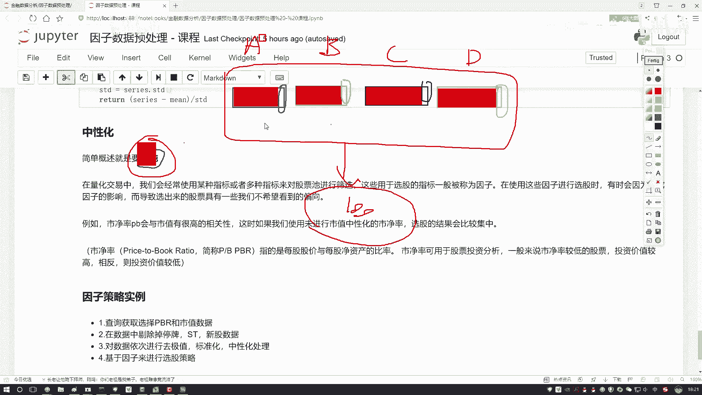
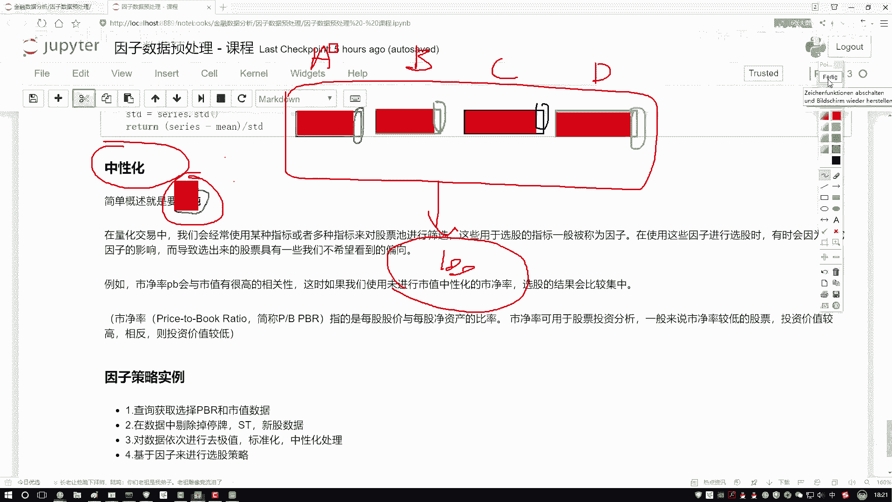
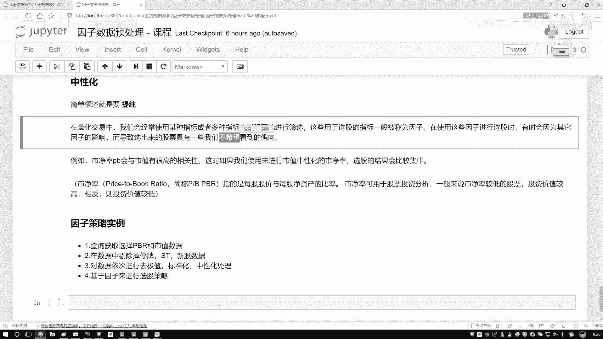
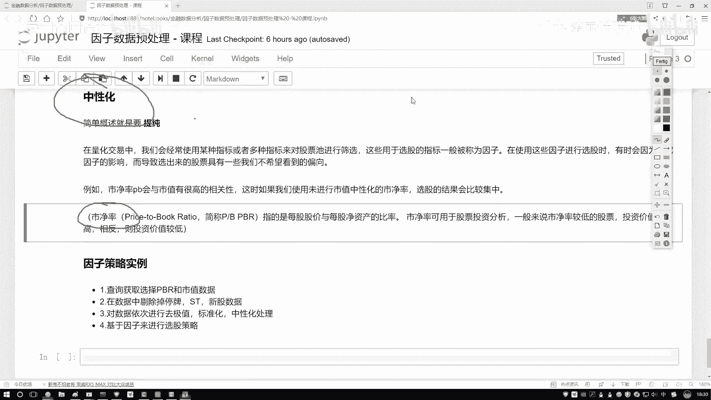
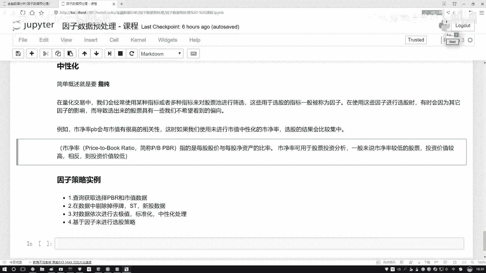

# 量化交易入门：P33：中性化处理方法通俗解释

在本节课中，我们将要学习量化交易中的一个重要概念——**因子中性化**。我们将通过一个简单的例子来理解它的目的和意义，并了解其基本计算方法。

## 概述：什么是中性化？

中性化的核心目的是**提纯**。

为了理解“提纯”的含义，我们先来看一个例子。假设我们设计了一个选股策略，其中使用了四个不同的因子：A、B、C、D。理论上，这四个因子应该从不同角度帮助我们筛选出不同的股票。

然而，在实际操作中，无论我们如何调整这四个因子的组合，最终选出的股票池总是高度相似。为什么会这样？

原因可能在于，这四个因子虽然名义上不同，但其内部绝大部分的“成分”是相同的。例如：
*   因子A（比如市净率）的数值可能绝大部分与**市值**相关。
*   因子B、C、D的数值也可能绝大部分与**市值**相关。

这样一来，无论我们使用哪个因子，最终起决定性作用的似乎都是“市值”这个共同因素。我们无法看到每个因子自身独特的、有价值的信息。这就好比从四个性格相似的人身上，很难总结出他们各自鲜明的个性。

因此，**中性化**要做的事情，就是从每个因子中，剔除掉这些共性的、无差异的影响（如市值的影响），从而“提纯”出该因子自身独特的、有价值的信息部分。这个过程就叫做中性化。

## 量化交易中的中性化

在量化交易中，我们经常使用多个指标（因子）对股票池进行筛选，以决定买入或卖出哪些股票。

在使用因子选股的过程中，有时会因为某些共同因素的影响（例如，多个因子都隐含了市值的影响），导致选出的股票具有我们不希望看到的倾向性，例如股票过于集中在某个风格或行业，缺乏多样性。

如果不进行中性化处理，选股结果可能会比较集中，无法充分体现不同因子带来的差异性。

## 以市净率为例

我们以**市净率（PB Ratio）** 这个常用因子为例。它的计算公式是：
`市净率 = 每股股价 / 每股净资产`
其中，**每股净资产** = （公司总资产 - 公司总负债） / 总股数，它代表了公司账面上属于股东的纯净价值。

在投资指导中，通常认为市净率较低的股票，其估值可能更低，未来的上涨空间相对更大，投资风险可能更低。



然而，市净率这个因子本身很容易受到公司**市值**大小的影响。如果不加处理直接使用，选股结果可能会严重偏向于某一特定市值范围的股票。因此，我们需要对市净率因子进行中性化处理，剔除市值的影响，从而得到纯粹的、反映股价与净资产关系的“提纯”因子。



## 中性化的计算方法

上一节我们介绍了中性化的概念和目的，本节中我们来看看其核心的计算思路。由于在本地Notebook中通常无法直接获取实时、完整的股票因子数据，我们稍后将在量化平台中进行代码演示。这里先介绍其数学原理。

中性化处理通常通过回归分析来实现。基本步骤如下：



1.  **建立回归模型**：将被处理的因子（如市净率）作为因变量（Y），将需要剔除的影响因素（如市值）作为自变量（X），建立线性回归模型。
    `Y = α + β * X + ε`
    其中，`Y`是原始因子值，`X`是中性化目标（如市值），`α`是截距项，`β`是回归系数，`ε`是残差。

2.  **计算残差**：进行回归后，得到的残差项 `ε` 就是中性化后的因子值。
    `ε = Y - (α + β * X)`
    这个残差代表了原始因子值中，无法被市值（X）所解释的部分，即我们“提纯”出来的、与市值无关的独特信息。

以下是该过程的简化代码逻辑描述：
```python
# 假设 df 是一个包含股票代码、市净率(pb)和市值(mv)的DataFrame
import statsmodels.api as sm

# 为回归添加常数项（截距）
X = sm.add_constant(df[‘mv’])  # 自变量：市值
y = df[‘pb’]                   # 因变量：市净率

# 执行普通最小二乘(OLS)回归
model = sm.OLS(y, X).fit()

# 计算残差，即为中性化后的市净率因子
df[‘pb_neutral’] = model.resid
```
通过以上操作，`pb_neutral` 列中的值就是去除了市值影响后的、纯粹的市净率因子，可以用于更有效的选股。

## 总结



本节课中我们一起学习了**因子中性化**的处理方法。
*   我们首先理解了中性化的目的是**提纯**，即从因子中剔除共性影响（如市值），提取其独特信息。
*   接着，我们了解了在量化选股中，不做中性化可能导致选股结果有偏、缺乏多样性的问题。
*   最后，我们掌握了中性化通过**线性回归**计算残差的基本原理和步骤。



中性化是构建稳健量化策略、避免因子失效的关键步骤之一。在接下来的实践中，我们将在量化平台上获取真实数据，并完成具体的代码操作。