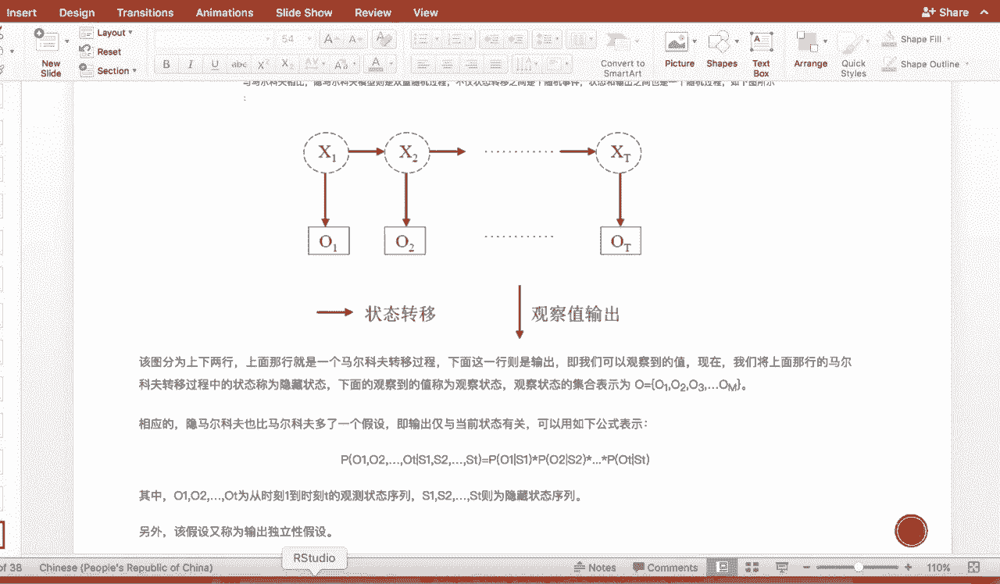
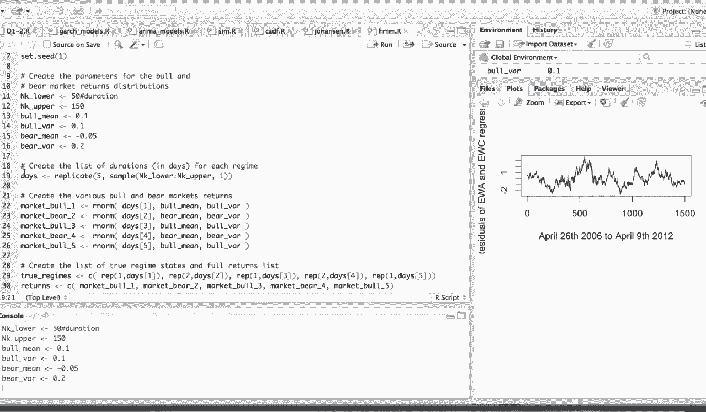
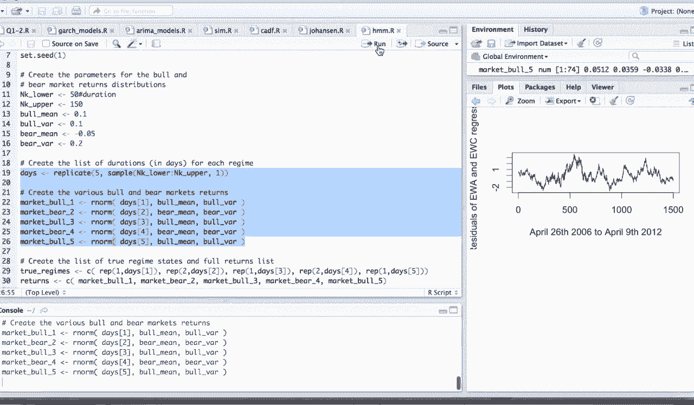
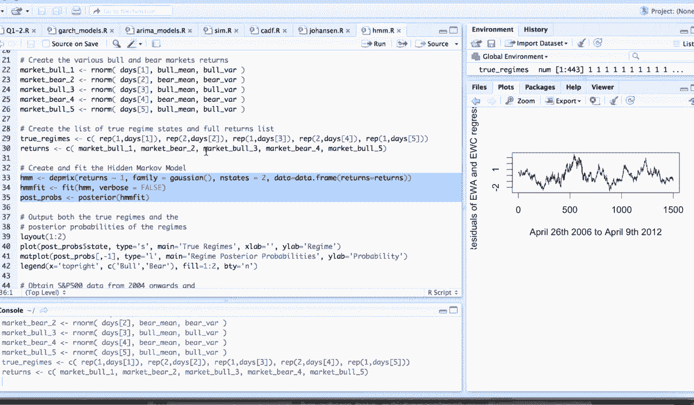
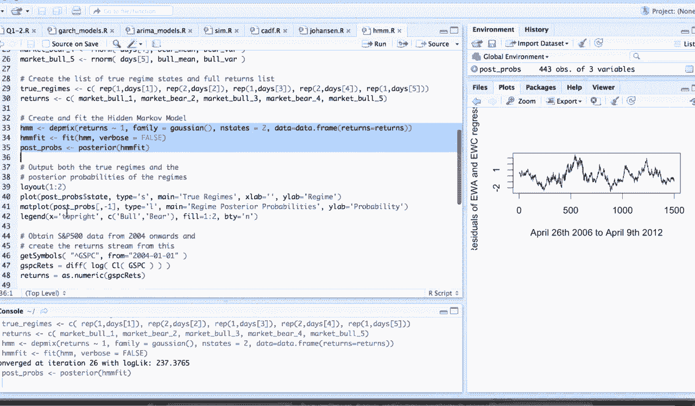
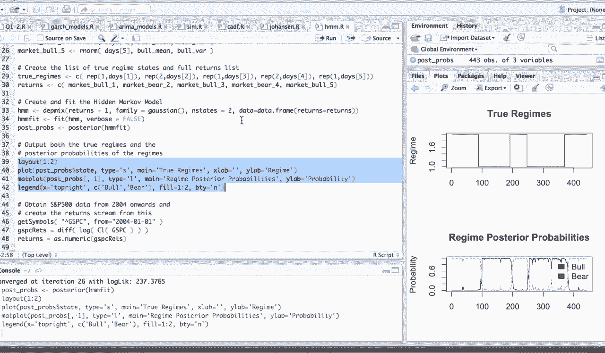
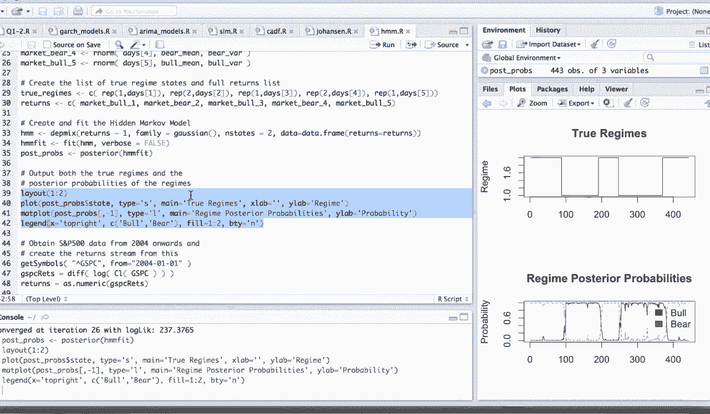
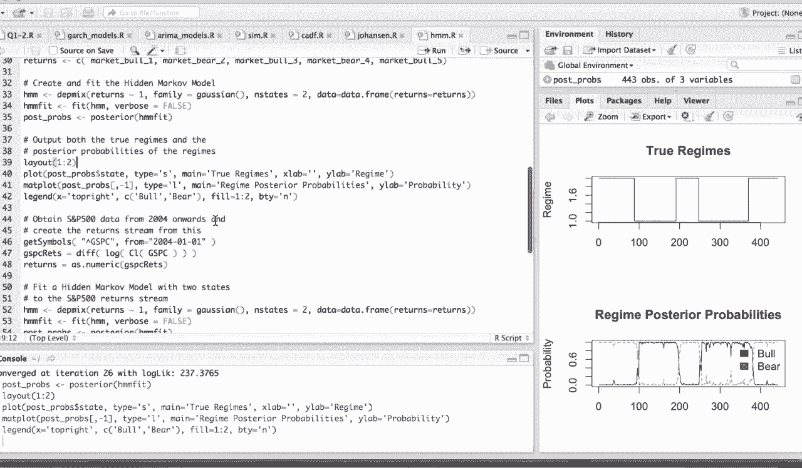
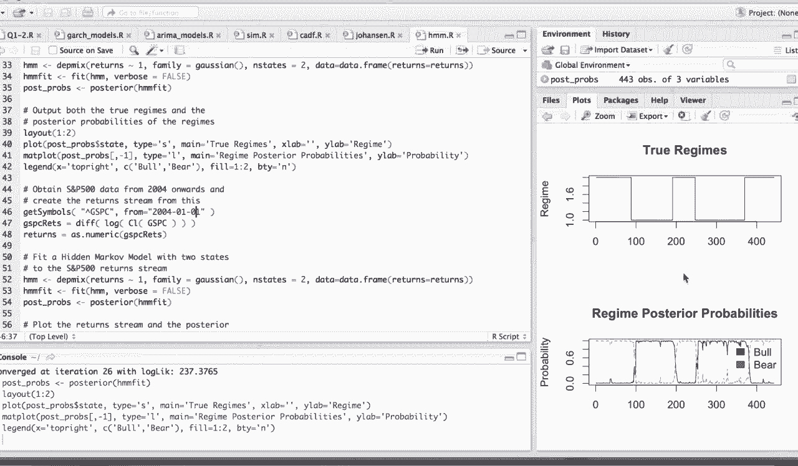
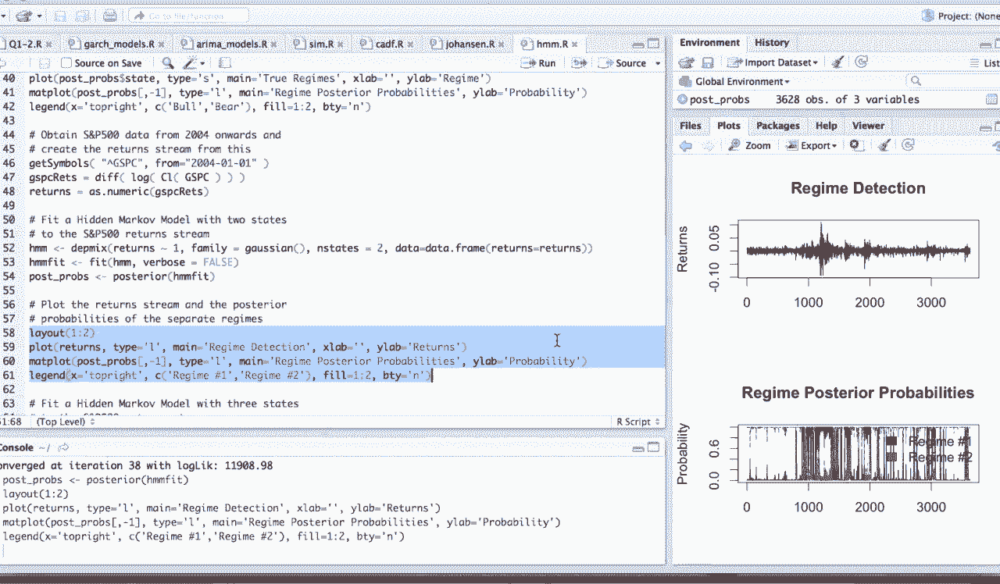

# 量化交易实战：P12：金融时间序列-II-隐马尔可夫模型 🎲

在本节课中，我们将要学习隐马尔可夫模型（Hidden Markov Model, HMM）的基本概念及其在金融时间序列分析中的应用，特别是如何用它来识别市场的牛熊状态。


上一节我们介绍了卡尔曼滤波，本节中我们来看看另一种强大的状态空间模型——隐马尔可夫模型。

## 隐马尔可夫模型概述

隐马尔可夫模型是一种统计模型，它假设系统存在一个我们无法直接观测的内部“隐藏状态”。这个隐藏状态按照马尔可夫性质进行演化，而系统在每一步会对外产生一个我们能观测到的“观测值”。

在卡尔曼滤波的介绍中，我们已经简要提及过它。它本质上描述了一个从**隐藏状态**到**观测状态**的转换过程。


我们真正想要得到的是内部的 **`hidden state`**。这个隐藏状态在一个黑箱内部进行跳转，每一步跳转都有一个概率。例如，在时间 `t` 的状态 `X_t` 完全由前一个时间 `t-1` 的状态 `X_{t-1}` 和状态转移概率 `P(X_t | X_{t-1})` 决定，与更早的历史状态无关。这就是马尔可夫模型的核心假设。

在每一步状态跳转后，系统会对外产生一个**观测值** `Y_t`。我们站在黑箱外部，只能看到这些观测值。无论是使用隐马尔可夫模型还是卡尔曼滤波，我们的目标都是推断内部黑箱中的隐藏状态 `X_t` 是如何转换的。


例如，在我们之前提到的配对交易模型中，我们真正感兴趣的是对冲比率 `β` 和超额收益 `α`，我们将它们建模为动态更新的隐藏状态。而外部的观测值就是两支股票的价格，我们通过回归分析得到它们。


## 模型的两个重要假设

我们的隐马尔可夫模型有两个重要的基本假设。

以下是这两个假设的具体内容：



1.  **无后效性（马尔可夫性）**：系统在 `t` 时刻的状态只与 `t-1` 时刻的状态相关，与更早的历史状态无关。这也称为无记忆性。我们在上一部分已经介绍过这个例子。
    

2.  **齐次性**：状态转移的概率与时间无关。也就是说，从状态 `i` 转移到状态 `j` 的概率 `P_{ij}` 在任何时间点 `t` 都是相同的。这有助于简化模型，因为我们不需要估计每个时间点上的不同转移概率。
    

## 金融应用：识别市场状态

隐马尔可夫模型内部如何进行预测的理论比较复杂。本节我们来看一个在金融上的具体应用例子。之前我们已经用Python实现过卡尔曼滤波，这里我们介绍如何使用R语言进行隐马尔可夫建模。

这个应用非常有趣。有时我们感兴趣的是预测下一步的价格，但有时交易者更在乎的是判断当前市场整体是处于“牛市”还是“熊市”状态。通过学习历史股价路径，如果能检测出当前的市场状态，对我们整个交易的宏观策略有非常好的长期指导意义。

对于一条市场时间序列来说，它是上下波动震荡的图形。我们如何用机器而非人眼来检测当前大致处于牛市还是熊市呢？隐马尔可夫模型就能帮我们做这件事。

在模型中，**隐藏状态**就是我们关心的“牛”或“熊”，而**外部观测值**就是表现出来的股价或收益率。我们的目标是检测一整条时间序列下来，每一个时间点被划分成“熊市”或“牛市”的概率是多少。通常，如果被划分为“熊市”的概率高于0.5（或者对于风险厌恶者，可能设定为0.7以上），我们就认为该时点处于熊市，否则为牛市。

## 实战演示

我们先看一个机器模拟数据的例子。



以下是使用R语言进行隐马尔可夫模型分析的步骤和代码：



1.  **安装并加载必要的R包**：我们需要 `depmixS4` 包来进行HMM建模，以及 `quantmod` 包来获取金融数据。
    ```r
    install.packages(“depmixS4”)
    install.packages(“quantmod”)
    library(depmixS4)
    library(quantmod)
    ```

2.  **定义市场状态**：我们将市场状态模拟为“熊市”和“牛市”。假设熊市时，收益率均值为负且波动（方差）较大；牛市时，收益率均值为正且波动相对较小。
    





3.  **生成模拟数据**：我们模拟生成一段在熊市和牛市之间交替的时间序列，共5个阶段。
    
    ```r
    # 模拟收益率数据
    set.seed(1)
    returns <- c(rnorm(100, mean=-0.01, sd=0.05), # 熊市段1
                 rnorm(100, mean=0.02, sd=0.03),  # 牛市段1
                 rnorm(100, mean=-0.01, sd=0.05), # 熊市段2
                 rnorm(100, mean=0.02, sd=0.03),  # 牛市段2
                 rnorm(100, mean=-0.01, sd=0.05)) # 熊市段3
    ```

4.  **拟合隐马尔可夫模型**：使用 `depmix` 函数指定模型（假设有两个隐藏状态），并用 `fit` 函数进行拟合。
    ```r
    # 创建并拟合HMM模型（2个状态）
    hmm_model <- depmix(returns ~ 1, family = gaussian(), nstates = 2, data=data.frame(returns=returns))
    hmm_fit <- fit(hmm_model)
    ```



5.  **输出并可视化状态识别结果**：提取模型推断出的每个时点最可能的状态（后验概率）。
    
    
    ```r
    # 获取后验状态概率
    posterior_probs <- posterior(hmm_fit)
    # 查看前几行
    head(posterior_probs)
    # 绘制真实状态与模型推断状态的对比（模拟数据已知真实状态）
    plot(returns, type=“l”, main=“模拟收益率与HMM识别状态”)
    # 假设State1为熊市，State2为牛市，根据后验概率上色
    points(which(posterior_probs$state==1), returns[posterior_probs$state==1], col=“red”, pch=19, cex=0.5)
    points(which(posterior_probs$state==2), returns[posterior_probs$state==2], col=“green”, pch=19, cex=0.5)
    ```
    在模拟数据中，因为我们加入了噪声，序列不是完美的梯形，而是震荡上升和下降的过程。从结果图中可以看到，模型识别出的状态（红色和绿色点）与预设的熊牛交替段落匹配得很好，说明估计效果良好。
    
    


## 应用于真实市场数据



接下来，我们看看如何将HMM应用于真实的标普500指数数据。

以下是使用HMM分析标普500指数数据的步骤：



1.  **获取并处理数据**：获取标普500指数数据，并计算其对数收益率以使数据更平稳。
    
    ```r
    # 获取标普500指数数据
    getSymbols(“^GSPC”, from=“2020-01-01”, to=“2023-01-01”)
    # 计算对数收益率
    sp500_returns <- diff(log(Cl(GSPC)))[-1]
    ```

2.  **拟合HMM模型**：使用与模拟数据相同的步骤对真实收益率数据拟合两状态HMM。
    ```r
    # 拟合HMM模型
    hmm_real <- depmix(sp500_returns ~ 1, family = gaussian(), nstates = 2, data=data.frame(ret=as.numeric(sp500_returns)))
    hmm_fit_real <- fit(hmm_real)
    posterior_real <- posterior(hmm_fit_real)
    ```

3.  **分析状态识别结果**：由于没有真实状态标签，我们通过观察后验概率来解读。通常，波动率特别高的时期，被识别为“熊市”状态（假设为状态1）的概率会更大。
    ```r
    # 绘制收益率和状态概率
    par(mfrow=c(2,1))
    plot(index(sp500_returns), as.numeric(sp500_returns), type=“l”, main=“S&P 500 Log Returns”, xlab=“Date”, ylab=“Return”)
    plot(index(sp500_returns), posterior_real$S1, type=“l”, col=“black”, main=“HMM State Probabilities”, xlab=“Date”, ylab=“Probability”, ylim=c(0,1))
    lines(index(sp500_returns), posterior_real$S2, type=“l”, col=“red”)
    legend(“topright”, legend=c(“State 1 (Bear?)”, “State 2 (Bull?)”), col=c(“black”, “red”), lty=1)
    ```
    从输出图中我们可以看到模型检测出的两个状态。例如，黑色线条（状态1）的概率在波动剧烈时期较高，我们可以将其解释为“熊市”；红色线条（状态2）则对应“牛市”。红黑线条的概率值越接近0或1，说明模型对当前时点的状态分类越确信，分类效果越好。
    

## 总结

本节课中我们一起学习了隐马尔可夫模型的核心思想及其在量化交易中的一个重要应用——市场状态识别。


我们首先回顾了HMM的基本框架，它由隐藏状态和观测状态构成，并遵循无后效性和齐次性两个关键假设。接着，我们通过一个生动的例子说明了如何将市场的“牛”、“熊”状态视为隐藏状态，将股价或收益率视为观测状态。最后，我们分别使用模拟数据和真实的标普500指数数据，演示了如何用R语言实现HMM模型来识别市场的潜在状态。这种方法为理解市场动态和制定宏观交易策略提供了一个有力的数据驱动工具。