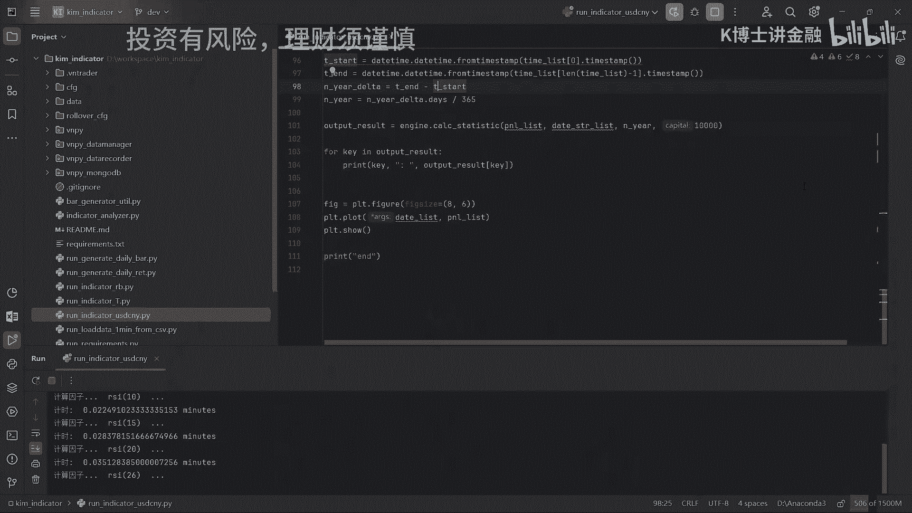
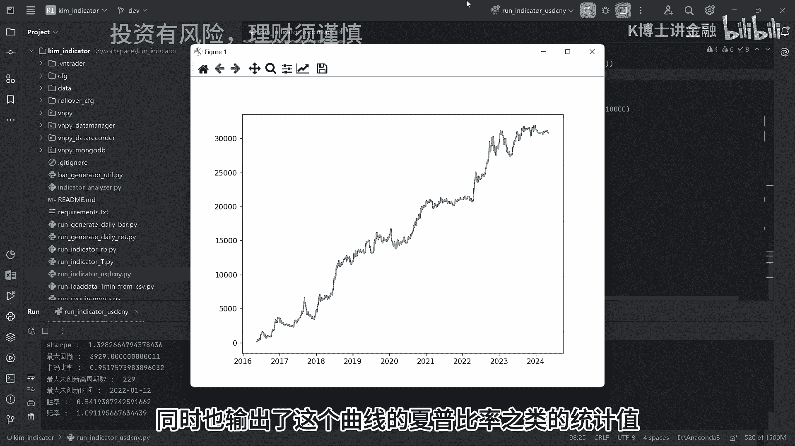
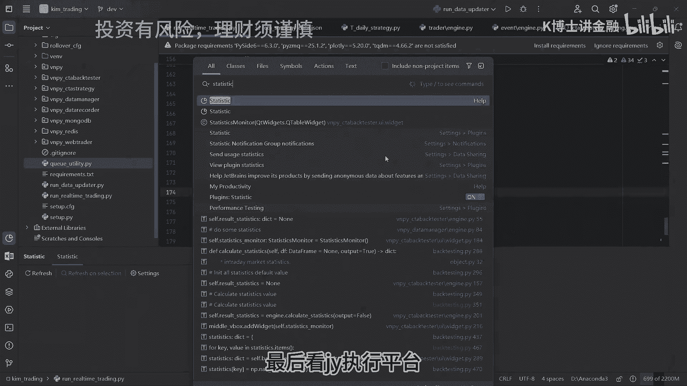

# 量化交易系统开发：P1：专业量化系统的代码量解析 📊

在本节课中，我们将通过分析一套实战的专业量化交易系统源码，来了解其整体架构、功能模块以及核心的代码量。这对于想要自行开发类似系统的程序员来说，是一个重要的参考。

## 系统概述与架构

上一节我们介绍了课程目标，本节中我们来看看这套系统的整体构成。该系统由三个独立的Python工程组成，均采用无界面、纯命令行的设计风格。系统使用MongoDB作为时序数据库，交易频率为日频。

以下是三个核心工程及其功能：

*   **回测平台**：用于策略的回测、因子的挖掘与优化。回测功能与因子挖掘功能集成在一起。
*   **实时因子计算平台**：需部署在服务器上，负责实时抓取数据并计算日频因子。
*   **交易执行模块**：基于实时因子计算平台输出的信号，自动执行交易。常说的订单执行算法就位于此模块中。该模块基于`VN.PY`框架进行了二次开发。



## 功能演示与代码统计

### 回测平台演示



我们启动回测平台，对一个策略进行回测。系统会输出该策略的收益曲线（PNL Curve）以及包括夏普比率在内的各项统计指标。


### 实时交易程序演示

接下来，我们启动基于`VN.PY`的交易执行程序。程序会连接交易接口（如CCTP），并初始化行情和交易服务器。由于当前未部署具体策略，系统处于空转监听状态。

```bash
主引擎成功连接CCTP接口
行情服务器连接成功
交易服务器连接成功
合约信息全部抓取成功
CCTA策略全部启动
开始监听bar队列
```

> **注意**：真正的实盘交易代码正在生产环境运行，涉及真实资金，因此不在此进行演示。

### 各模块代码量统计

我们使用PyCharm的统计插件来查看各工程的源代码行数（仅统计.py文件）。

以下是统计结果：



*   **回测平台**：4，307 行代码。
*   **实时因子计算平台**：5，680 行代码。
*   **交易执行模块**：11，291 行代码。


将三个工程的代码行数相加，得到总代码量约为 **21，278 行**。

## 代码量分析与开发启示

上一节我们统计了具体的代码行数，本节中我们来分析其意义并探讨开发工作量。

一个2万行代码量的项目，通常属于中型偏小的规模。代码量与编程语言密切相关，Python语言以简洁著称，实现相同功能所需的代码行数通常远少于Java等语言。例如，在国外对冲基金中，一套用Java编写的完整系统代码量可能达到7万行。

此外，当前系统为无界面（Headless）设计，部署在Linux服务器上运行。如果增加图形用户界面（GUI），代码量很可能需要翻倍。

单纯从开发实现的角度看，对于一个经验丰富的程序员，完成一个2万行代码量的系统，**工作量大约在一到两个月**。

然而，必须认识到，代码实现只是基础。一套能稳定盈利的交易系统的核心在于**稳健的策略**。策略研发过程中，绝大部分时间都消耗在回测平台上进行因子的挖掘、测试与优化。

在量化私募工作中，研究员大部分精力也投入于此。在这个过程中，我们通常在现有代码框架上，添加模型代码和调整参数，这部分新增代码量可能很小，但背后需要大量的**数据分析**和**思考时间**。

这部分工作的耗时因人而异。在有经验者指导且自身具备足够基础的情况下，可能在一两个月内快速上手。如果完全靠自己摸索，则可能遇到许多预料之外的困难。

## 总结

本节课中我们一起学习了专业量化交易系统的典型架构，并通过实例统计了其代码量（约2.1万行）。我们了解到，系统的核心由回测、因子计算和交易执行三大模块构成。虽然从纯编码角度看，开发这样一个系统的工作量是可估量的，但构建盈利系统的真正挑战和主要时间投入在于策略的研发与优化过程。


关于如何上手量化交易，或想进一步了解前面展示的代码系统，可以进行后续咨询。