# Python三剑客：P9：DataFrame基础入门 📊


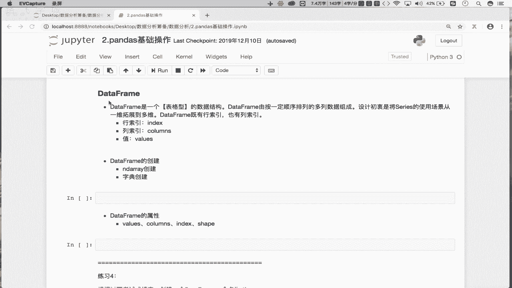

在本节课中，我们将要学习Pandas库中的核心数据结构——DataFrame。我们将了解它是什么、如何创建它，以及它的一些基本属性。DataFrame是进行数据分析的基石，理解它将为你后续的学习打下坚实的基础。

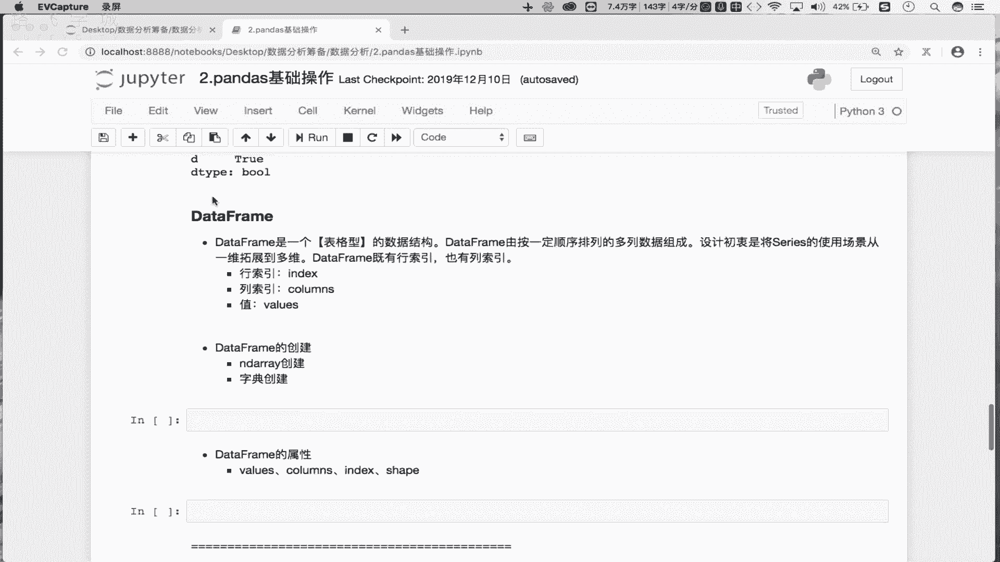

## 从Series到DataFrame


在上一节我们介绍了Series，它是一种一维的数据结构。本节中我们来看看由Series组成的DataFrame。

通过上节课的演示我们知道，一个Series表示一列数据，是一个一维结构。如果有多个Series组合在一起，就会形成多列。多列数据组合在一起，就形成了一个表格型的数据结构。

表格型的数据结构是二维的，因为它有行和列。因此，DataFrame是一个二维的表格型数据结构。它的设计初衷是将Series的使用场景从一维拓展到二维。

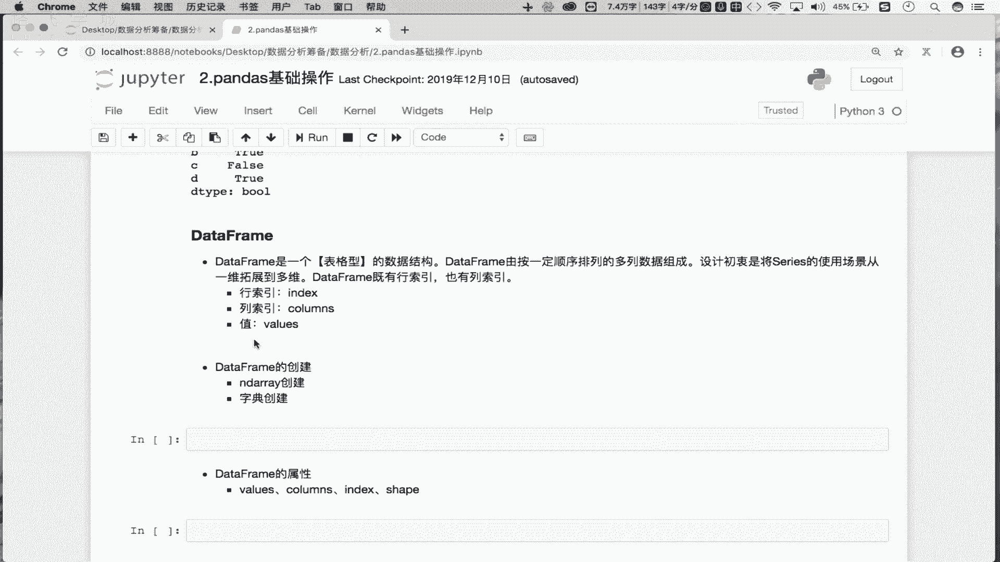

DataFrame由三个核心部分组成：
*   **行索引 (Index)**
*   **列索引 (Columns)**
*   **行列索引所对应的值 (Values)**

你可以把DataFrame完全想象成MySQL数据库中的一张表，它们都是由行和列组成的表格。


## 创建DataFrame 🛠️

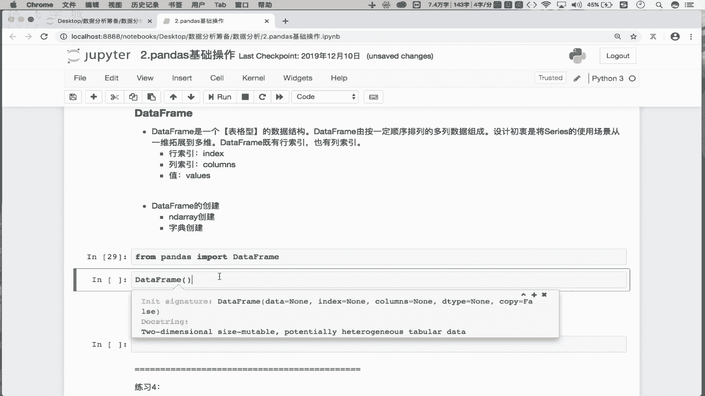

了解了DataFrame是什么之后，我们来看看如何创建它。首先需要从pandas库中导入DataFrame类。

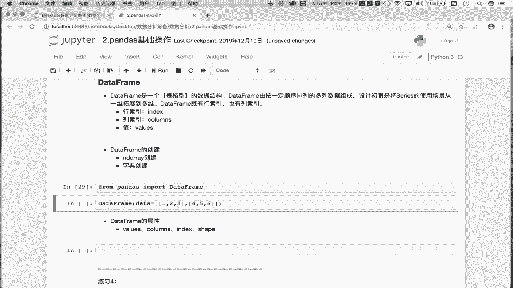


```python
from pandas import DataFrame
```

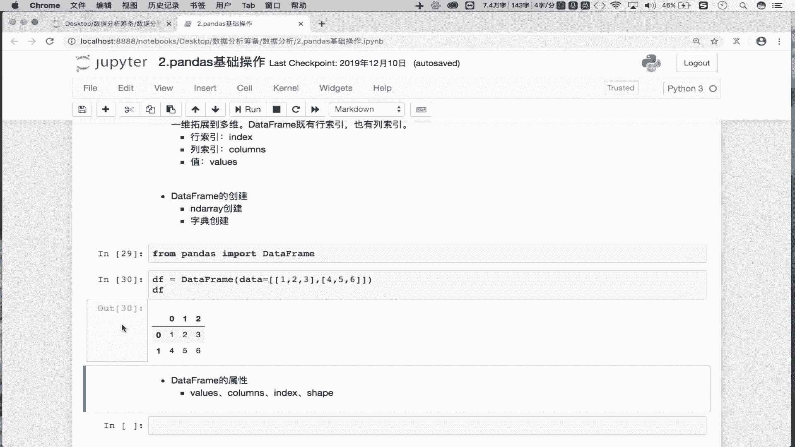

以下是几种创建DataFrame的常用方法。

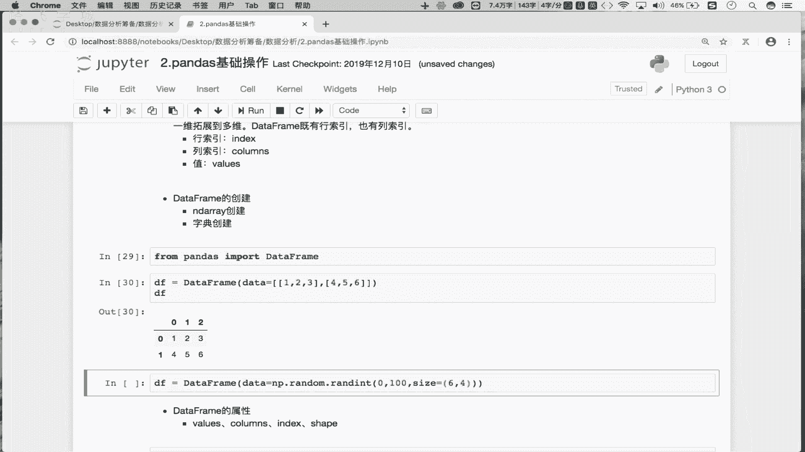


### 使用二维列表创建

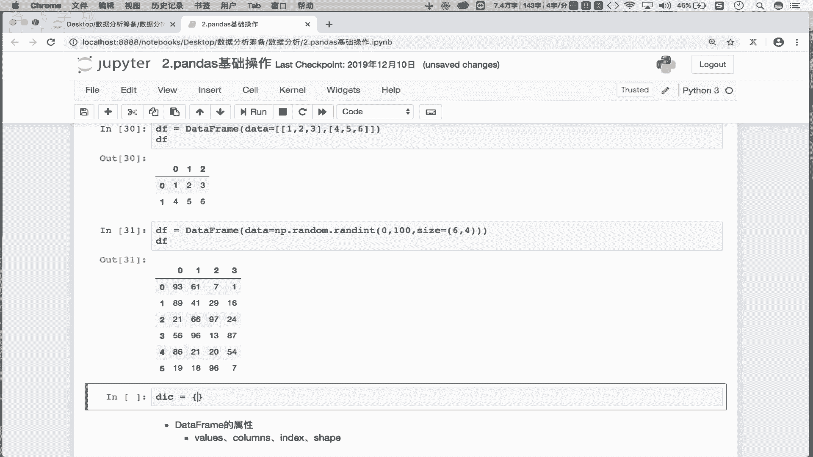

第一种方式是调用DataFrame的构造方法，并传入一个二维列表作为数据源(`data`)。


```python
df1 = DataFrame(data=[[1, 2, 3], [4, 5, 6]])
print(df1)
```
这段代码会创建一个两行三列的DataFrame。

### 使用NumPy数组创建

第二种方式是使用NumPy数组作为数据源。


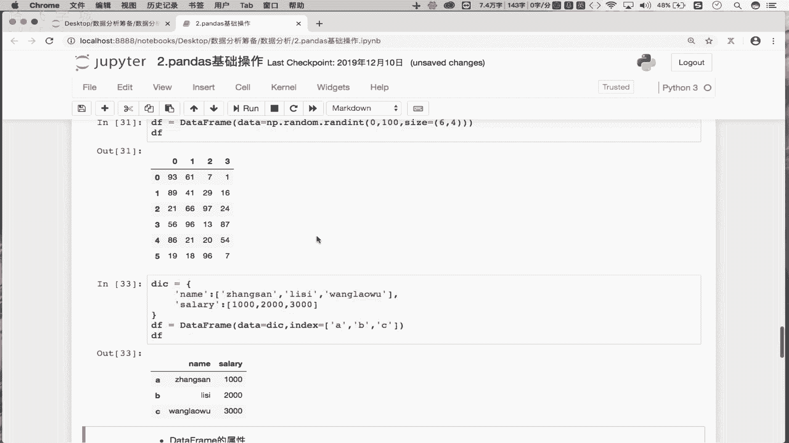


```python
import numpy as np
data_array = np.random.randint(0, 100, size=(6, 4))
df2 = DataFrame(data=data_array)
print(df2)
```
这段代码会创建一个六行四列、数据为随机整数的DataFrame。

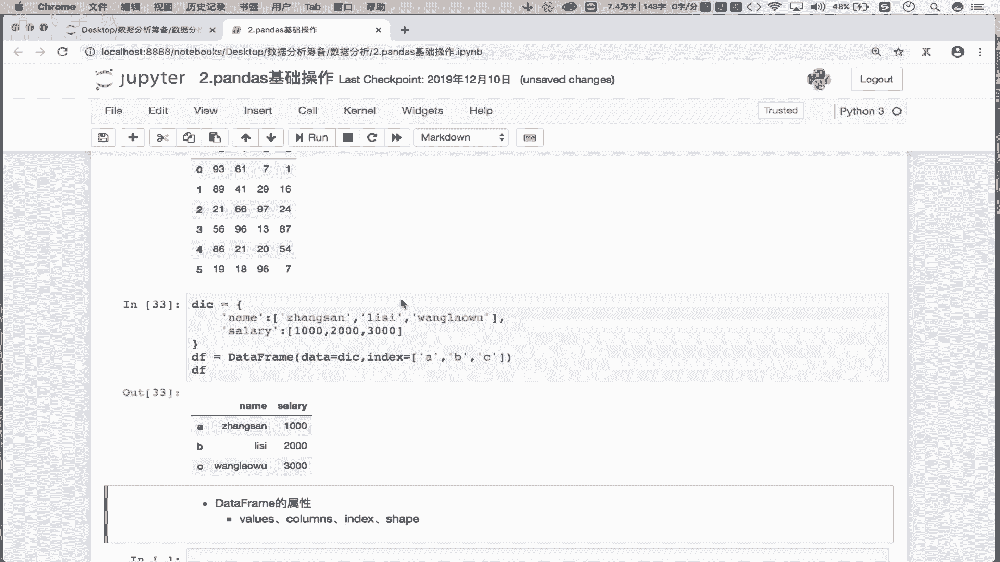

### 使用字典创建（最常用）


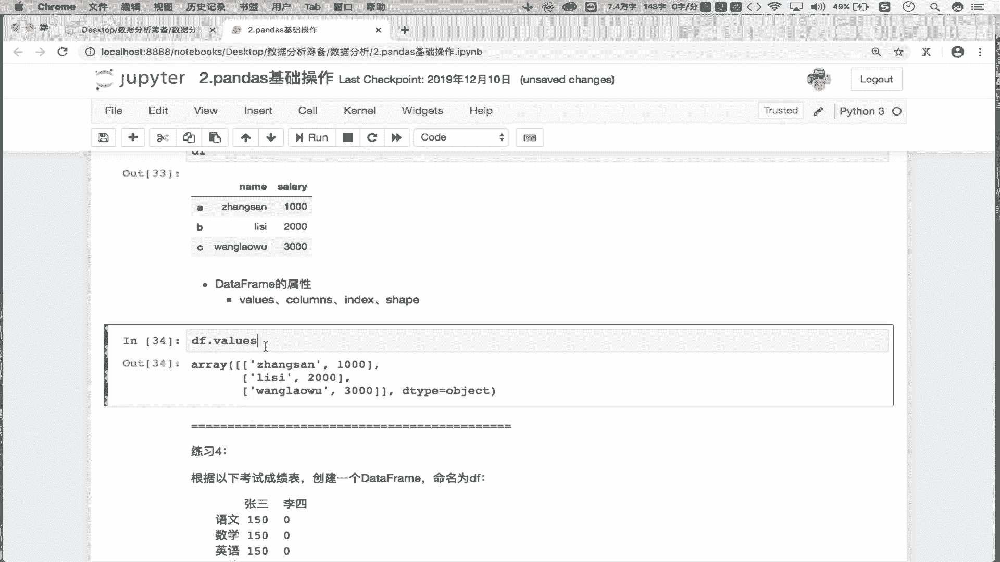

第三种，也是最灵活的方式，是使用字典作为数据源。字典的键(`key`)会自动成为DataFrame的列索引。

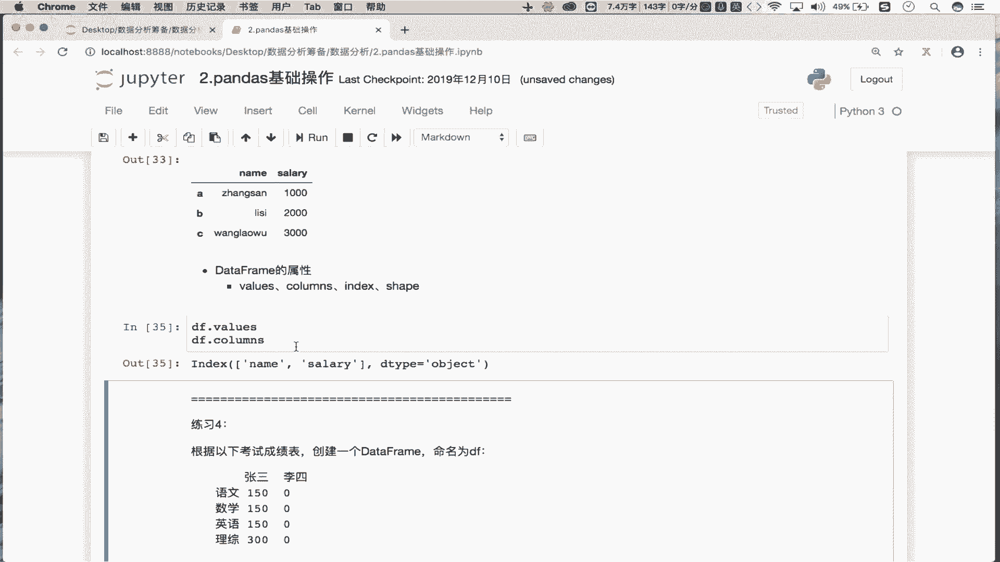

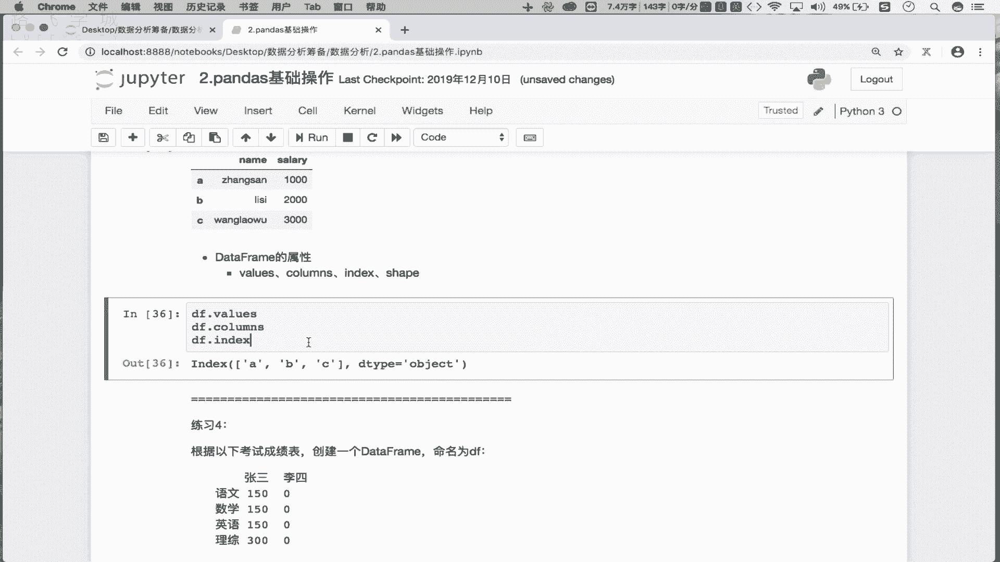

```python
dic = {
    ‘name‘: [‘张三‘, ‘李四‘, ‘王老五‘],
    ‘salary‘: [1000, 2000, 3000]
}
df3 = DataFrame(data=dic)
print(df3)
```
此时，行索引是默认的隐式索引(0,1,2)。我们可以通过`index`参数指定显示的行索引。

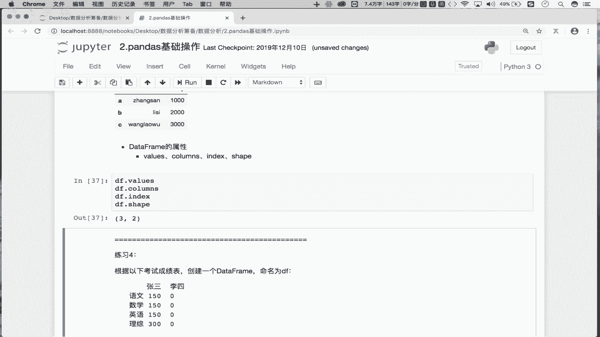


```python
df3 = DataFrame(data=dic, index=[‘A‘, ‘B‘, ‘C‘])
print(df3)
```
现在，这个DataFrame就拥有了显示的行索引(‘A‘,‘B‘,‘C‘)和列索引(‘name‘,‘salary‘)。


## DataFrame的常用属性 📋

创建好DataFrame后，我们可以通过一些属性来查看其基本信息。

以下是几个关键属性：
*   `df.values`: 返回DataFrame存储的二维数据，是一个NumPy数组。
*   `df.columns`: 返回列索引。
*   `df.index`: 返回行索引。
*   `df.shape`: 返回DataFrame的形状，即(行数， 列数)。


需要注意的是，**不能直接使用`df.dtype`查看整个DataFrame的数据类型**。因为DataFrame的不同列可以存储不同类型的数据（例如一列是字符串，另一列是整数）。我们只能单独查看某一列或某一行的数据类型，而取出的单列或单行是一个Series，Series是可以查看数据类型的。

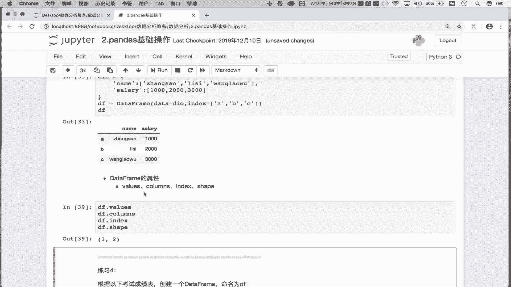


## 实践练习 ✍️


现在，让我们通过一个练习来巩固所学知识。我们需要创建如下所示的DataFrame：

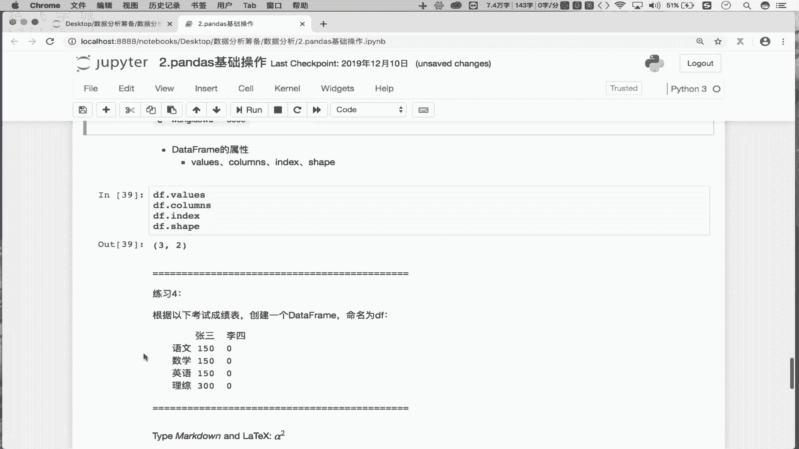


|       | 张三 | 李四 |
| :---- | :--- | :--- |
| 语文  | 150  | 0    |
| 数学  | 150  | 0    |
| 英语  | 150  | 0    |
| 理综  | 150  | 0    |

根据我们学到的知识，使用字典创建是最便捷的方法。


```python
# 定义字典，key将成为列名
score_dict = {
    ‘张三‘: [150, 150, 150, 150],
    ‘李四‘: [0, 0, 0, 0]
}
# 创建DataFrame，并指定行索引
df_exercise = DataFrame(data=score_dict, index=[‘语文‘, ‘数学‘, ‘英语‘, ‘理综‘])
print(df_exercise)
```

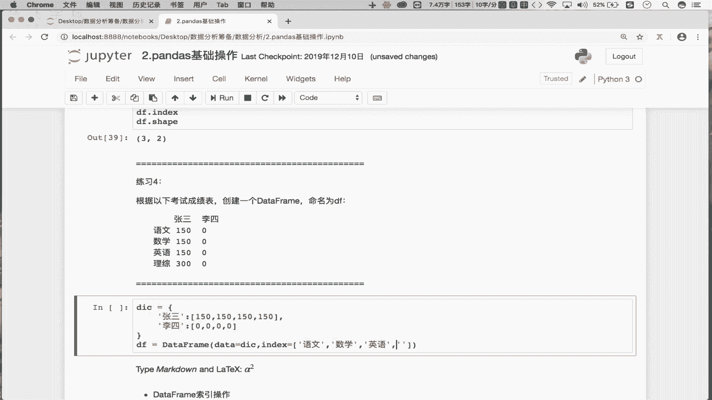

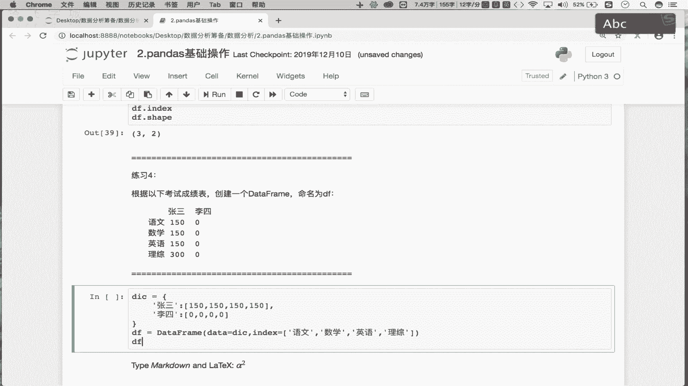

## 总结


本节课中我们一起学习了Pandas的核心——DataFrame。
*   我们首先明确了**DataFrame是一个二维的表格型数据结构**，由行索引、列索引和值组成。
*   接着，我们掌握了三种创建DataFrame的方法：**使用二维列表、NumPy数组和字典**，其中字典方式最为灵活。
*   然后，我们了解了如何通过`.values`、`.columns`、`.index`、`.shape`等属性来查看DataFrame的基本信息。
*   最后，我们通过一个练习综合运用了创建DataFrame的技巧。


理解并熟练创建DataFrame，是后续进行数据选取、清洗和分析的第一步。在接下来的课程中，我们将学习如何操作DataFrame中的数据。