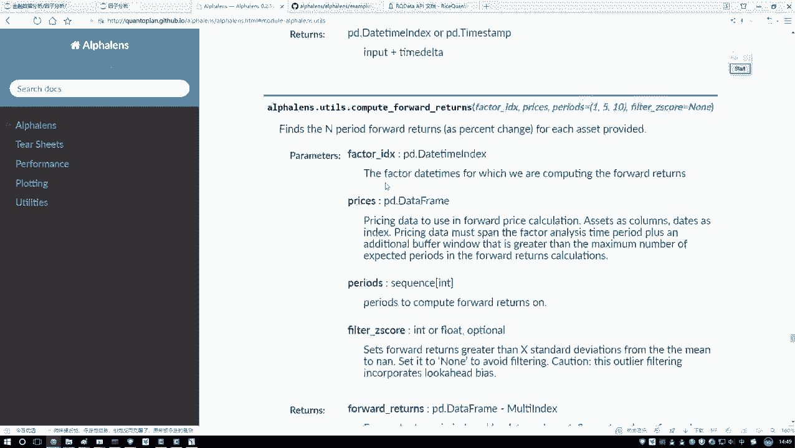
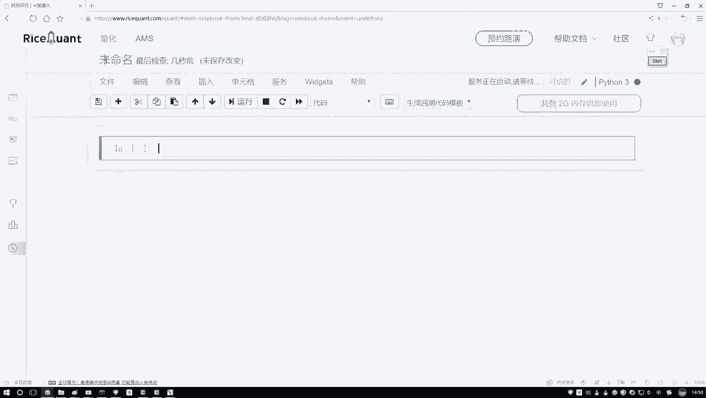
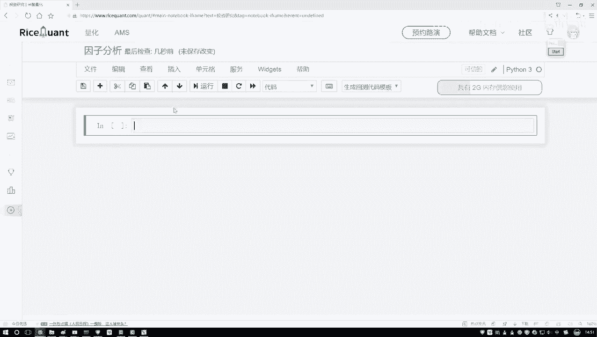

# Python机器学习与量化交易：P40：Alphalens工具包介绍

在本节课中，我们将要学习一个名为Alphalens的强大工具包。这个工具包专门用于因子分析，能够帮助我们高效地计算各种量化指标并生成分析图表，从而省去大量手动编写代码的工作。

上一节我们介绍了因子分析的基本概念，本节中我们来看看如何利用现成的工具来简化这一过程。

## 工具包简介与获取

Alphalens是一个专门用于金融因子分析的Python工具包。它的核心功能是帮助我们计算因子的信息系数（IC值）等关键指标，并自动生成一系列分析图表。

以下是关于Alphalens的基本信息：
*   **GitHub仓库**：你可以通过其GitHub页面查看源代码和详细说明。
*   **官方文档**：工具包提供了完善的使用文档和API说明，是深入学习的最佳资料。
*   **安装方法**：在本地环境安装非常简单，只需执行命令 `pip install alphalens` 即可。

如果你想在本地进行实验，可以按照上述方法安装。不过，在本课程中，我们将直接使用已经预装了Alphalens的量化交易平台，这样可以直接获取所需数据，更加方便。

## 学习资源与示例

学习新工具最有效的方法是查阅官方资料。Alphalens的官方文档中包含了丰富的示例（Examples），这些示例详细演示了工具包的基本使用方法。

我课程中讲解的内容和案例，主要也是参考并总结了这些官方示例。如果你希望深入掌握Alphalens，强烈建议课后仔细阅读这些示例和API文档。对于只需完成课程任务的同学，跟随我准备的案例进行操作即可。

## 平台研究环境介绍

由于因子分析需要获取大量的股票数据，在个人电脑上操作较为麻烦。因此，我们将在一个在线的量化交易平台中完成代码编写。

上一节我们了解了工具本身，本节中我们来看看在哪里使用它。在该平台中，除了创建策略和回测的功能外，还有一个名为“投资研究”的模块。

以下是进入研究环境的步骤：
1.  登录量化交易平台。
2.  在左侧功能栏中找到并点击“投资研究”。
3.  点击“新建”按钮，创建一个新的Python 3研究环境。

这个环境类似于Jupyter Notebook，但它运行在平台的服务器上，可以直接调用平台的数据接口。接下来，我们就在这个环境中进行因子分析的代码编写。我会将完整的代码提供给大家，你可以直接上传或参照视频手动输入。

本节课中我们一起学习了Alphalens工具包的作用、获取方式以及如何在量化平台的研究环境中使用它。该工具能极大简化因子分析的计算和可视化流程，是我们后续进行有效因子评价的得力助手。