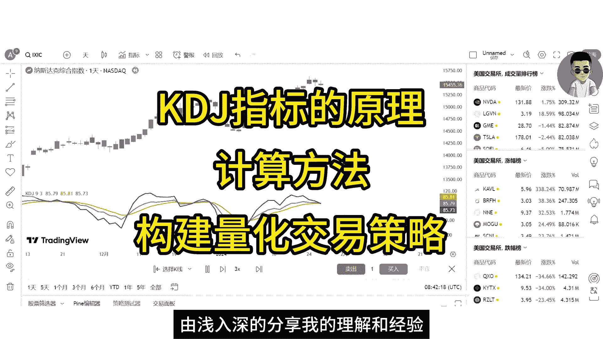
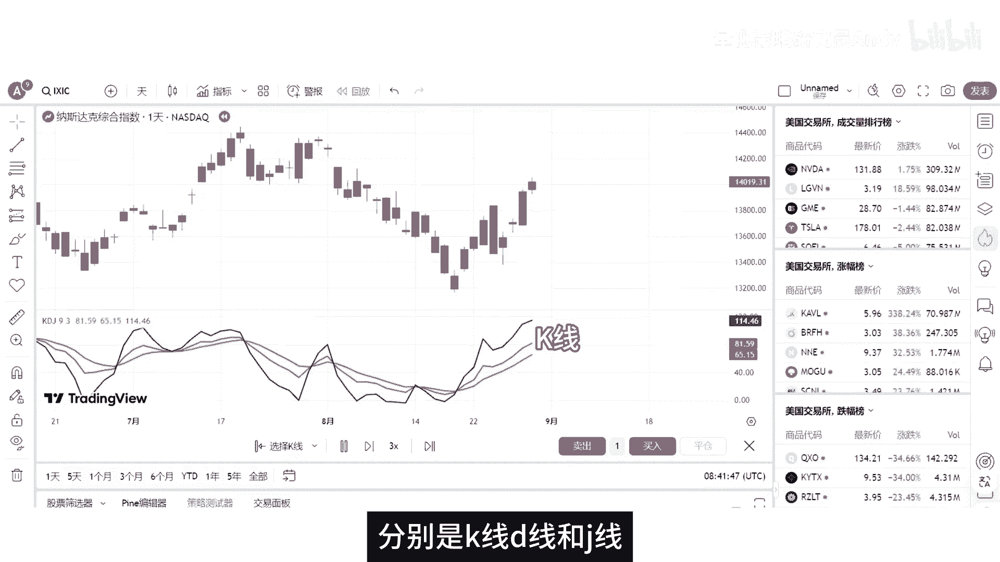
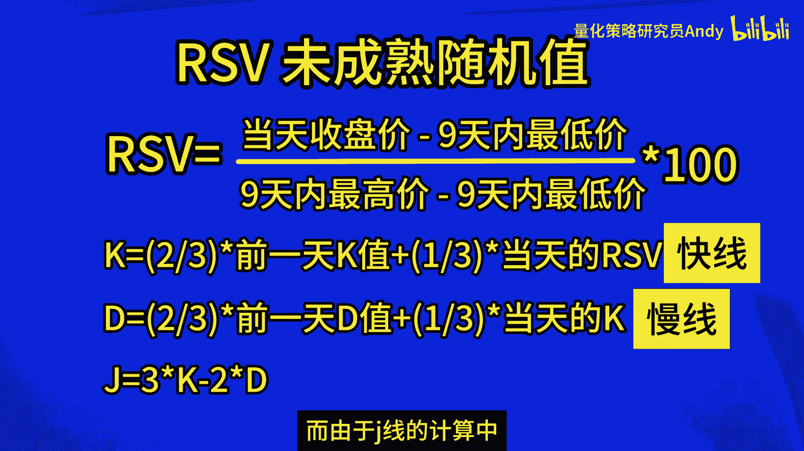
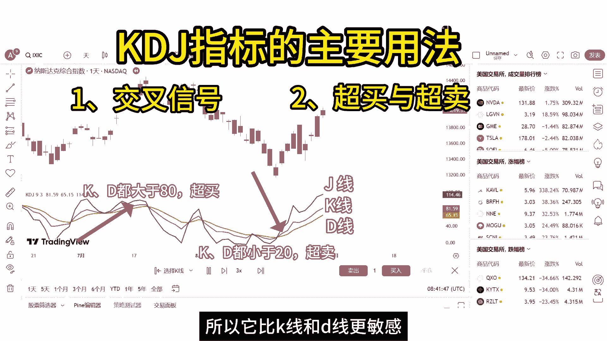
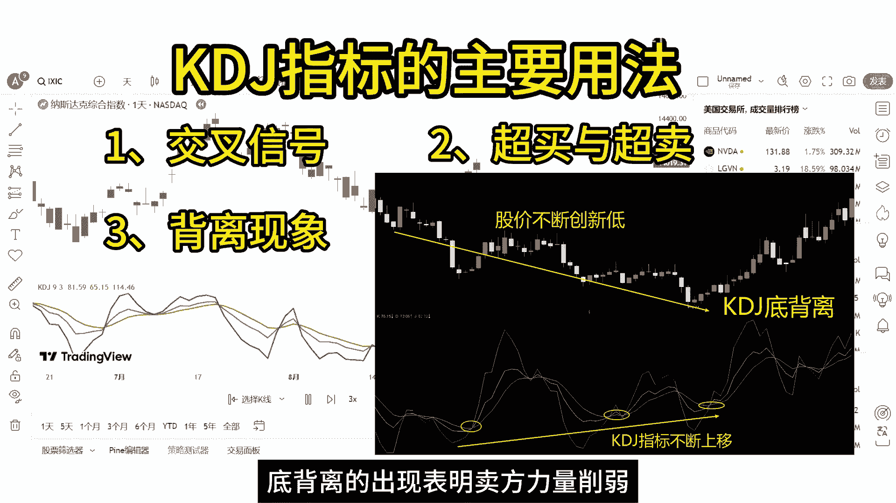
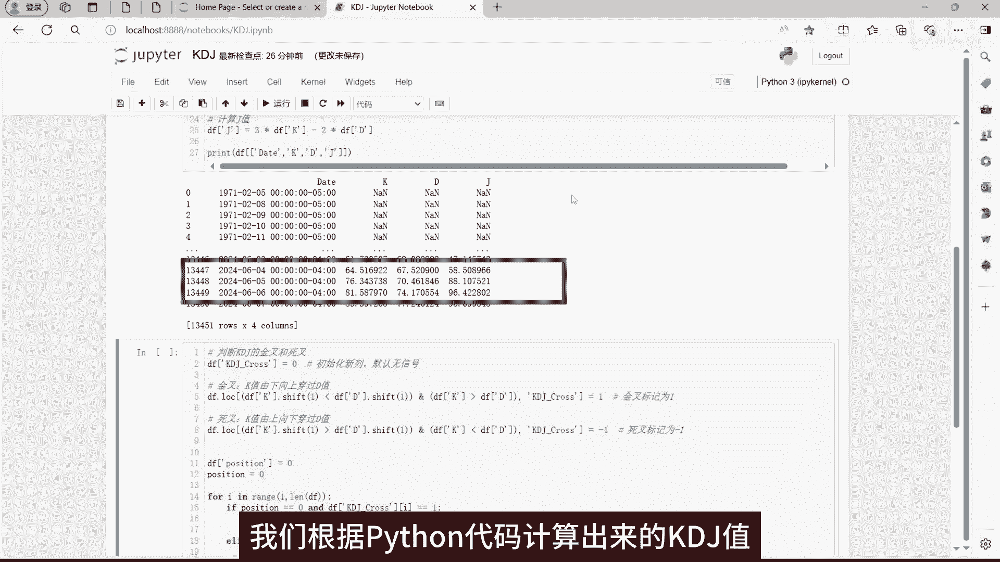
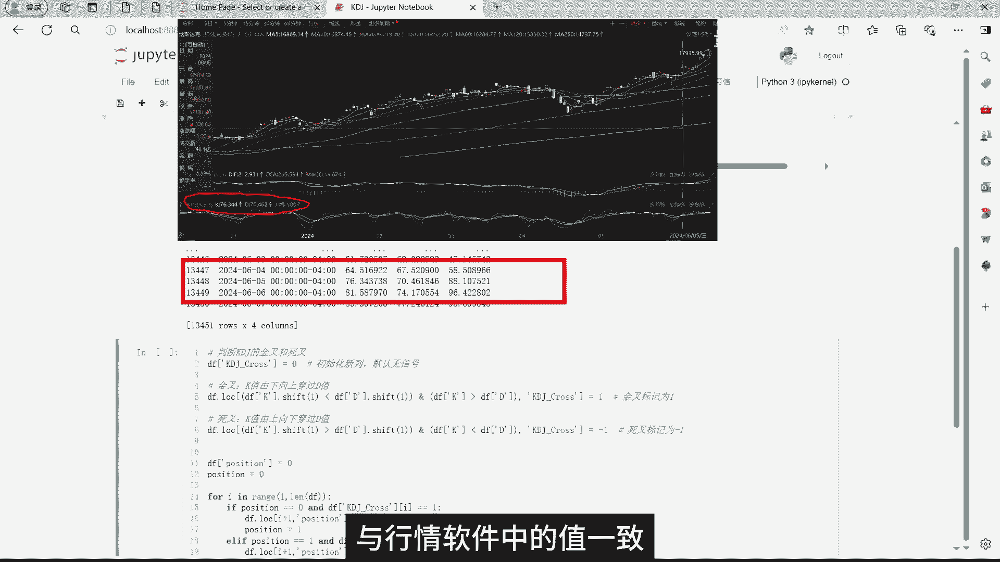
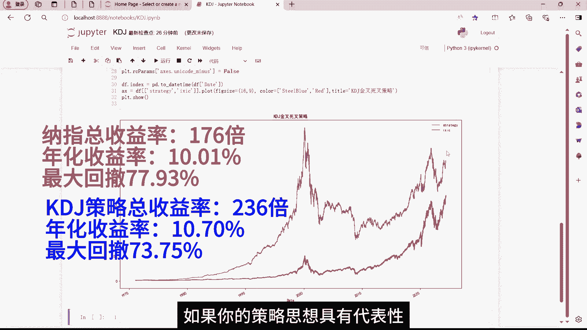

# 技术分析入门：1：KDJ指标原理与验证 🧮

在本节课中，我们将要学习技术分析中常用的KDJ指标。我们将从它的基本原理和计算方法开始，然后通过Python编程构建一个简单的交易策略，并用量化回测的方法来验证其历史表现。

## 概述

在金融投资领域，KDJ指标是一种流行的技术分析工具。市场上有一种常见的说法：当KDJ指标出现“金叉”时买入，未来股价可能上涨；当出现“死叉”时卖出，未来股价可能下跌。本教程将探讨这种说法的可靠性，并通过数据回测进行验证。



---

## KDJ指标的基本概念 📊


上一节我们介绍了本课程的目标，本节中我们来看看KDJ指标到底是什么。



KDJ指标，又称随机指标，最早由乔治·莱恩博士在1950年代提出，最初用于期货市场，后来被广泛应用于股票市场的中短期趋势分析。

KDJ指标由三条线组成：
*   **K线**：常被称为“快线”。
*   **D线**：常被称为“慢线”。
*   **J线**：对市场变化反应最迅速，可称为“超快线”。

这三条线共同构成了反映价格波动趋势的完整指标。

---

## KDJ指标的计算方法 🧮

了解了KDJ的构成后，本节中我们将深入其核心，学习它的具体计算步骤。计算KDJ指标首先需要计算一个基础值——RSV。



以下是计算KDJ值的具体步骤：

1.  **计算未成熟随机值（RSV）**
    RSV是KDJ计算的基础，它反映了当前收盘价在最近一个周期内的相对位置。
    **公式**：`RSV = (当日收盘价 - 最近N日最低价) / (最近N日最高价 - 最近N日最低价) * 100`
    通常，周期N取9天。RSV的值在0到100之间。RSV接近100表示价格接近周期高点（可能超买），接近0表示价格接近周期低点（可能超卖）。

2.  **计算K值**
    K值是对RSV进行平滑处理（指数移动平均）后得到的。
    **公式**：`当日K值 = 2/3 * 前一日K值 + 1/3 * 当日RSV`
    在编程中，这通常等价于对RSV序列进行`period=3`的指数移动平均（EMA）。

3.  **计算D值**
    D值是对K值进行再次平滑处理得到的。
    **公式**：`当日D值 = 2/3 * 前一日D值 + 1/3 * 当日K值`
    在编程中，这通常等价于对K值序列进行`period=3`的指数移动平均（EMA）。

4.  **计算J值**
    J值反映了K值与D值的乖离程度，波动最为剧烈。
    **公式**：`J值 = 3 * 当日K值 - 2 * 当日D值`

---



## KDJ指标的常见用法 ⚙️

掌握了计算方法后，本节中我们来看看在实际分析中如何运用KDJ指标。



以下是KDJ指标的三种主要用法：

*   **交叉信号**
    *   **金叉**：当K线从下方向上穿越D线时，通常被视为**买入信号**。
    *   **死叉**：当K线从上方向下穿越D线时，通常被视为**卖出信号**。

*   **超买与超卖**
    *   **超买区**：当K值和D值都大于80时，市场可能处于超买状态，价格存在回调风险。
    *   **超卖区**：当K值和D值都小于20时，市场可能处于超卖状态，价格存在反弹机会。
    *   J线由于更敏感，其值超过100或低于0时，也可作为超买/超卖的参考。

*   **背离现象**
    *   **顶背离**：当股价创出新高，但KDJ指标的高点却比前一次低。这通常预示上涨趋势可能即将反转。
    *   **底背离**：当股价创出新低，但KDJ指标的低点却比前一次高。这通常预示下跌趋势可能即将结束，反弹临近。

---

## 用Python验证KDJ策略的有效性 💻

理论需要实践检验。上一节我们介绍了KDJ的各种用法，本节中我们将使用Python，对最简单的“金叉买入、死叉卖出”策略进行历史回测，验证其有效性。



以下是使用Python实现并回测KDJ策略的关键步骤：



1.  **获取数据与计算KDJ**
    首先，我们需要获取标的（如纳斯达克指数）的历史价格数据，并按照前述公式计算K值、D值和J值。
    ```python
    # 示例代码结构
    import pandas as pd
    # 假设df包含‘High‘, ‘Low‘, ‘Close‘列
    low_list = df[‘Low‘].rolling(window=9).min()
    high_list = df[‘High‘].rolling(window=9).max()
    rsv = (df[‘Close‘] - low_list) / (high_list - low_list) * 100
    df[‘K‘] = rsv.ewm(span=2, adjust=False).mean()  # 等价于3日EMA
    df[‘D‘] = df[‘K‘].ewm(span=2, adjust=False).mean()
    df[‘J‘] = 3 * df[‘K‘] - 2 * df[‘D‘]
    ```

2.  **生成交易信号**
    根据K线与D线的交叉来定义买入和卖出信号。
    ```python
    # 判断金叉（K上穿D）和死叉（K下穿D）
    df[‘KDJ_Cross‘] = 0
    df.loc[ (df[‘K‘].shift(1) < df[‘D‘].shift(1)) & (df[‘K‘] > df[‘D‘]), ‘KDJ_Cross‘ ] = 1  # 金叉
    df.loc[ (df[‘K‘].shift(1) > df[‘D‘].shift(1)) & (df[‘K‘] < df[‘D‘]), ‘KDJ_Cross‘ ] = -1 # 死叉
    ```

3.  **策略回测与结果分析**
    根据交易信号模拟买卖，计算策略收益率、年化收益、最大回撤等关键指标，并与基准（如单纯持有指数）进行对比。
    *   **回测结果示例（基于纳斯达克指数历史数据）**：
        *   **基准（买入持有）**：总收益约176倍，年化收益率10.01%，最大回撤77.93%。
        *   **简单KDJ金叉死叉策略**：总收益约236倍，年化收益率10.07%，最大回撤73.75%。

    从数据可以看出，这个简单的KDJ策略虽然总收益略高于基准，但年化收益率提升微乎其微，且在市场大幅下跌时（如2000年、2008年）依然会遭遇巨大回撤，并未产生显著的超额收益或更好的风险控制。

---

## 总结与优化思路 💡

本节课中我们一起学习了KDJ指标的原理、计算方法和基本应用，并通过Python回测验证了简单“金叉死叉”策略的历史表现。

总结来说，KDJ指标作为一个经典的技术分析工具，能够直观地反映市场的超买超卖状态和短期动量。然而，我们的回测表明，将其最简单的用法（金叉买、死叉卖）作为一个独立的交易策略，其效果有限，并不能稳定地战胜市场。



这引出了量化交易中的一个重要理念：**单一指标的策略往往不够稳健**。如果你对KDJ指标感兴趣，可以尝试从以下方向优化策略：
*   **调整参数**：修改计算RSV的周期（默认9）或平滑参数（默认3）。
*   **结合其他信号**：例如，只在超卖区关注金叉，或在超买区关注死叉。
*   **识别背离**：尝试编程识别顶背离和底背离，作为更强烈的反转信号。
*   **多指标共振**：将KDJ与移动平均线、MACD、RSI等其他技术指标结合使用，形成交易信号过滤器。

希望本教程能帮助你理解KDJ指标，并迈出量化策略研究的第一步。