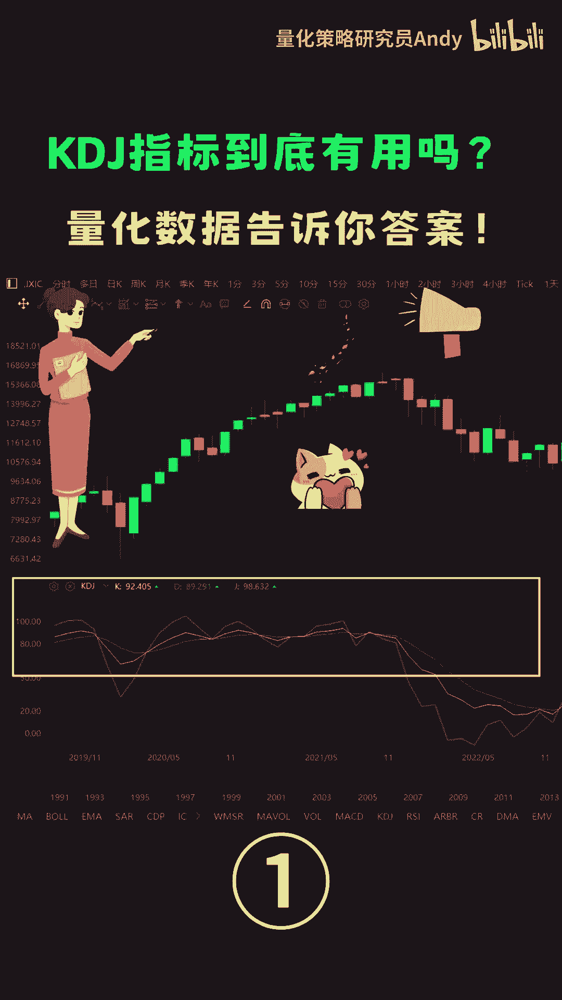
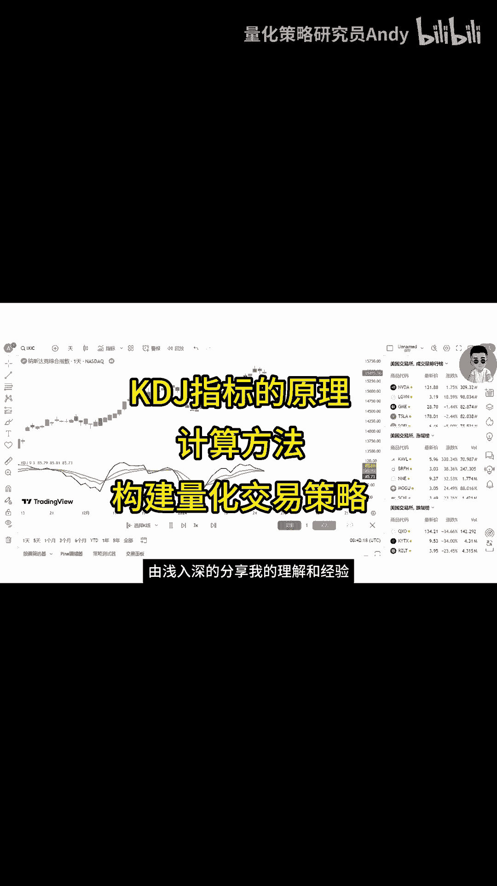

# 量化交易入门：P1：KDJ指标实战量化验证 🧪

在本节课中，我们将要学习如何用量化的方法，客观地验证一个广为人知的技术分析指标——KDJ指标的有效性。我们将从指标的基本原理开始，逐步深入到计算方法和策略构建，最终通过历史数据回测来检验其表现。

## 什么是KDJ指标？📊

KDJ指标是技术分析中常用的超买超卖型指标，尤其在短线交易中备受青睐。它通过计算特定周期内的价格位置，来反映市场的动量与转折点。

上一节我们介绍了KDJ指标的背景，本节中我们来看看它的核心计算逻辑。

### KDJ指标的计算原理

KDJ指标的计算基于随机波动理论，主要涉及三个值：K值、D值和J值。其核心是计算未成熟随机值RSV。

以下是计算KDJ值的关键步骤：

1.  **计算未成熟随机值RSV**：
    *   RSV衡量了当前收盘价在最近N个周期内价格区间中的相对位置。
    *   公式为：**`RSV = (当前收盘价 - N日内最低价) / (N日内最高价 - N日内最低价) * 100`**

2.  **计算K值与D值**：
    *   K值是RSV的平滑处理，通常使用移动平均。
    *   D值又是K值的平滑处理，可以理解为K值的移动平均线。
    *   常见的计算公式为：
        *   **`当日K值 = 2/3 * 前一日K值 + 1/3 * 当日RSV`**
        *   **`当日D值 = 2/3 * 前一日D值 + 1/3 * 当日K值`**

3.  **计算J值**：
    *   J值反映了K值与D值的偏离程度，其计算公式为：
        *   **`J值 = 3 * 当日K值 - 2 * 当日D值`**

## 如何用KDJ指标构建交易策略？⚙️

理解了KDJ的计算方法后，我们就可以将其转化为具体的交易规则。市场中最常见的用法是基于“金叉”和“死叉”信号。

上一节我们介绍了KDJ的计算方法，本节中我们来看看如何将其转化为具体的买卖信号。

以下是基于KDJ指标构建简单策略的两种核心信号：

*   **买入信号（金叉）**：当K线自下而上穿越D线时，被视为买入信号，预示着价格可能上涨。
*   **卖出信号（死叉）**：当K线自上而下穿越D线时，被视为卖出信号，预示着价格可能下跌。

## 量化验证：数据会告诉我们什么？📈

主观的分析结论需要客观的数据来检验。我们将上述策略规则转化为计算机可以执行的量化模型，并在历史数据上进行回测，以评估其真实表现。

以下是量化验证的基本流程：

1.  **数据准备**：获取标的资产（如股票指数、个股）的历史价格数据（开盘价、最高价、最低价、收盘价）。
2.  **指标计算**：根据公式，在历史数据上逐日计算KDJ指标的K值、D值和J值。
3.  **信号生成**：根据K值与D值的交叉情况，在每一个交易日末生成“买入”、“卖出”或“持有”的信号。
4.  **策略回测**：模拟按照这些信号进行交易，计算策略的累计收益率、胜率、最大回撤等关键绩效指标。
5.  **分析比较**：将策略的收益表现与简单买入并持有基准（如大盘指数）进行对比，判断策略是否有效。

通过这一系列步骤，我们可以用具体的盈亏数据，而非主观感觉，来回答“KDJ指标的金叉/死叉信号是否可靠”这个问题。

## 总结与展望 🎯

本节课中我们一起学习了KDJ指标的基本原理、计算方法以及如何将其构建成一个可量化的交易策略。我们了解到，任何技术分析方法都需要经过严格的历史数据检验，才能评估其在实际交易中的有效性。

量化分析为我们提供了一种客观、系统化的工具，去验证各种市场观点和策略想法。在接下来的课程中，我们可以进一步探索如何优化KDJ策略的参数，或者将其与其他指标结合，以构建更稳健的交易系统。