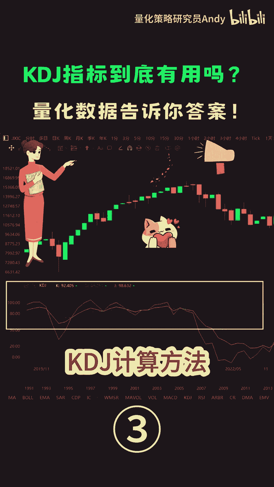
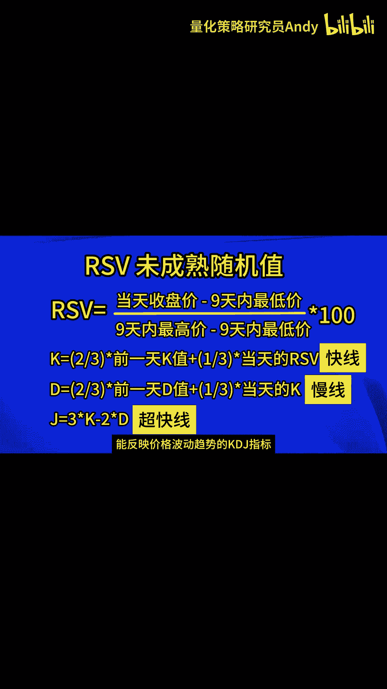

# 技术分析入门：P1：KDJ指标的计算方法 📊

在本节课中，我们将要学习技术分析中一个常用的动量指标——KDJ指标。我们将重点解析其核心构成部分（K值、D值和J值）的计算方法，理解每一步计算背后的逻辑，从而为后续的实际应用打下坚实基础。

## 概述

KDJ指标，又称随机指标，是一种用于研判股票、期货等金融市场中短期趋势的技术分析工具。它通过比较特定周期内收盘价与价格波动范围的关系，来反映市场的超买或超卖状态。理解其计算过程是掌握该指标的第一步。

## KDJ指标的核心计算步骤

KDJ指标的计算基于三个核心数值：K值、D值和J值。其计算过程是递进的，首先需要计算出一个名为RSV的原始值。

### 计算未成熟随机值（RSV）

RSV是KDJ计算的基础，它衡量了当前收盘价在最近N个周期内价格区间中的相对位置。以下是其计算公式：

**RSV = (当前收盘价 - N日内最低价) / (N日内最高价 - N日内最低价) * 100**

这个公式的结果是一个介于0到100之间的百分比值。RSV值越高，表明收盘价越接近周期内的最高价，买方力量可能越强；反之则越接近最低价，卖方力量可能越强。

### 计算K值与D值

得到RSV后，我们并不能直接使用它，因为其波动可能过于剧烈。因此，我们需要对RSV进行平滑处理，从而得到K值和D值。这是一种指数移动平均的思想。

*   **K值（快线）**：K值是对RSV进行第一次平滑处理的结果。其计算公式体现了当前RSV与历史K值的加权平均。
    `当日K值 = (2/3) * 前一日K值 + (1/3) * 当日RSV`
    通常，为了计算方便，公式中的系数也常表述为：`当日K值 = 前一日K值 * 2/3 + 当日RSV * 1/3`。K线对价格变动的反应速度比D线快。

*   **D值（慢线）**：D值是对K值进行第二次平滑处理的结果，这使得它的走势比K线更加平缓。
    `当日D值 = (2/3) * 前一日D值 + (1/3) * 当日K值`
    同样，也可写为：`当日D值 = 前一日D值 * 2/3 + 当日K值 * 1/3`。D线是K线的慢速移动平均。

> **计算初始化**：在首次计算时，如果没有前一天的K值和D值，通常会用当日的RSV值来替代。

### 计算J值

J值是KDJ指标中的辅助线，其计算基于K值和D值。J值的波动幅度最大，对市场变化的反应也最为灵敏，可以视为“超快线”。

`当日J值 = 3 * 当日K值 - 2 * 当日D值`

从公式可以看出，J值实际上是K值与D值的一个加权差值。由于K值被赋予了3倍的正权重，而D值被赋予了2倍的负权重，这使得J线能够更快地反映出K线与D线之间的背离，提前预示价格可能的变化。

## 指标线的含义与联动

上一节我们详细介绍了每个数值的计算方法，本节中我们来看看这些计算出的线条在实际图表中代表了什么，以及它们如何相互作用。

*   **K线与D线的关系**：K线是快线，D线是慢线。这类似于移动平均线系统中快慢线的关系。当K线自下而上穿越D线时，常被视为买入信号（金叉）；反之，当K线自上而下穿越D线时，则被视为卖出信号（死叉）。

*   **J线的作用**：J线由于波动剧烈，其主要作用是发出预警。当J值大于100时，表示市场可能处于“超买”状态，价格有回调风险；当J值小于0时，表示市场可能处于“超卖”状态，价格有反弹可能。同时，观察J线与K、D线的背离，也能提供重要的趋势转折线索。

总的来说，随机指标KDJ是以最高价、最低价及收盘价为基本数据进行计算得出的。K值、D值和J值分别在指标的坐标上形成一个点，连接无数个这样的点位，就形成完整的、动态的KDJ指标曲线，供交易者分析使用。

## 总结

本节课中，我们一起学习了KDJ指标的核心计算方法。我们从基础的RSV计算开始，逐步推导出经过平滑处理的K值和D值，最后得到反应最灵敏的J值。理解这些计算步骤，能帮助我们更深刻地把握KDJ指标揭示的市场动力与潜在转折点，而不仅仅是机械地观察金叉和死叉。在接下来的课程中，我们将探讨如何具体应用KDJ指标来制定交易策略。