# 数据分析之量化案例：P10：day03-01 股票数据预处理 📊

在本节课中，我们将学习如何使用Python进行股票数据的获取与预处理。我们将通过一个实际案例，巩固DataFrame的基础操作，并体验金融量化分析的初步流程。

上一节我们介绍了DataFrame的基础操作，本节中我们来看看如何将这些操作应用于真实的股票数据分析。

## 数据获取与本地存储 📥

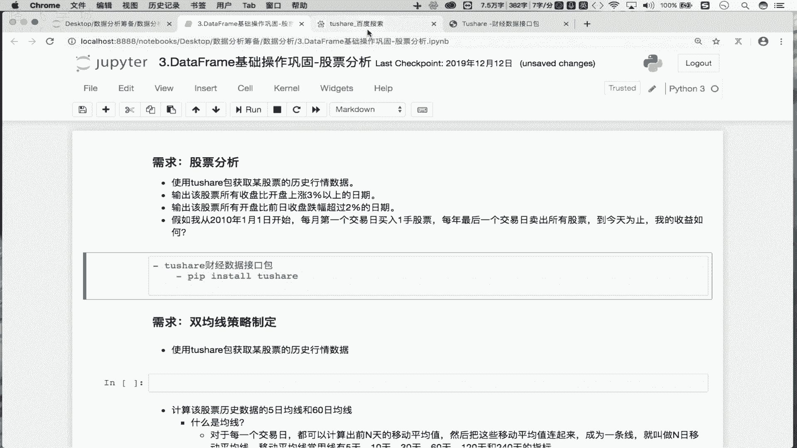

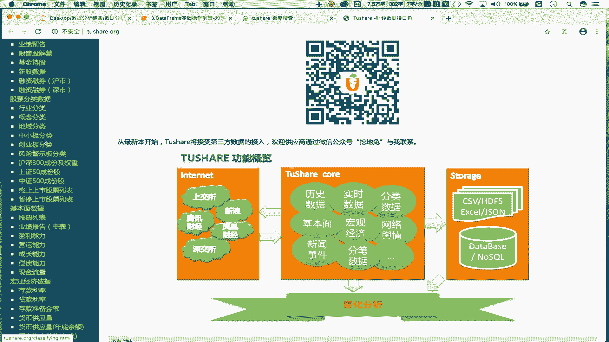

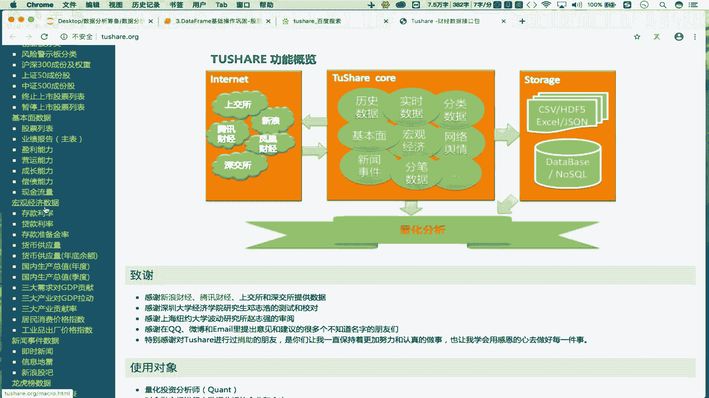

首先，我们需要获取股票的历史行情数据。这里我们使用`tushare`这个财经数据接口包。

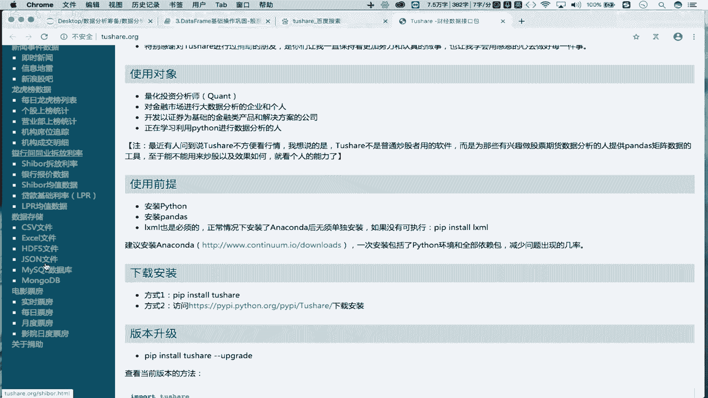

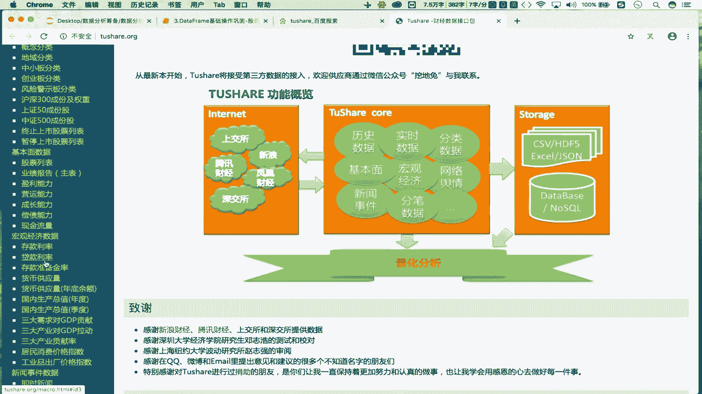

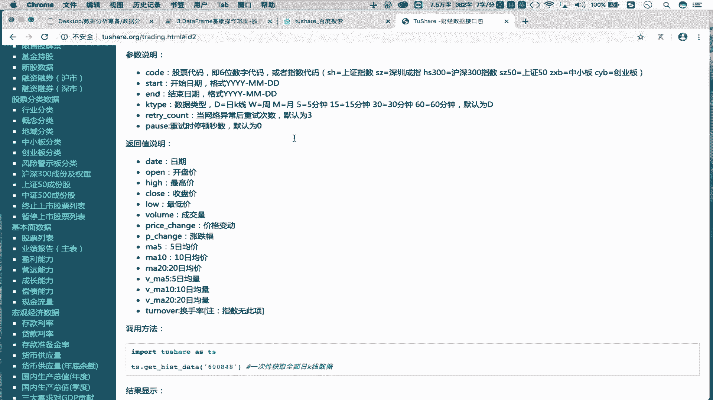

**步骤概述：**
1.  安装`tushare`包。
2.  使用`tushare`获取指定股票的历史数据。
3.  将获取的数据存储到本地文件。

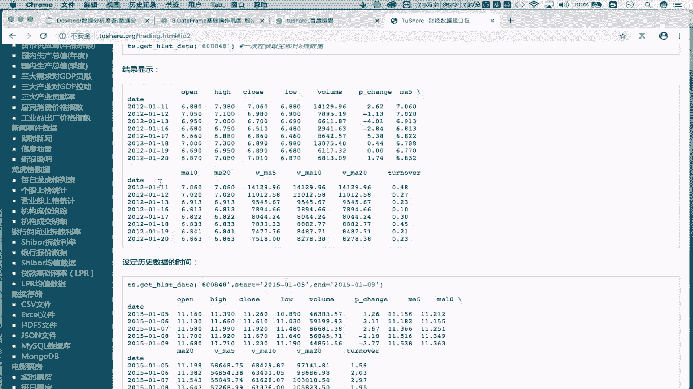

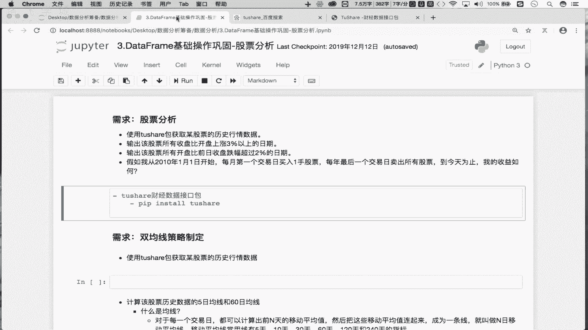

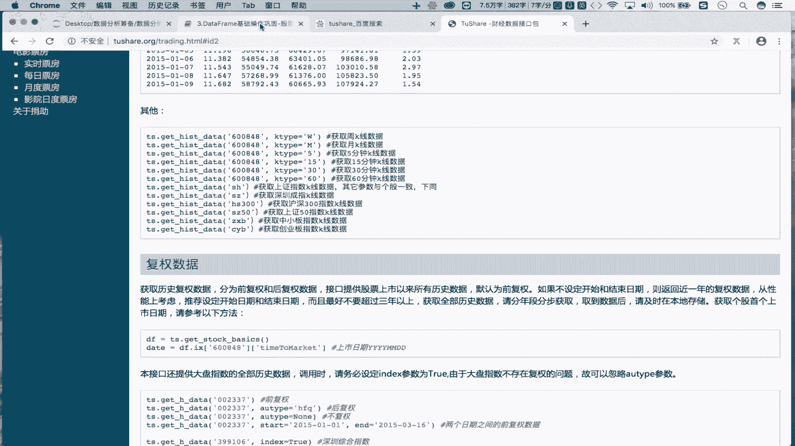

**具体操作：**

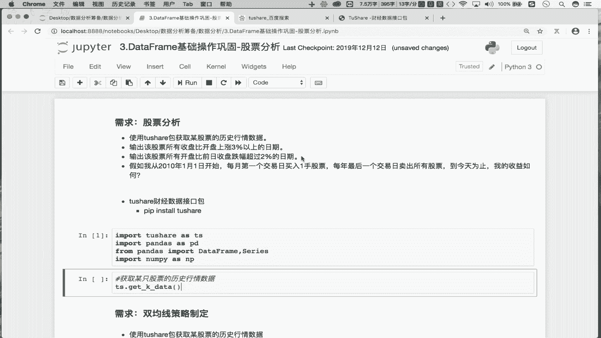

1.  **安装tushare包**
    在命令行或终端中执行以下命令进行安装：
    ```bash
    pip install tushare
    ```

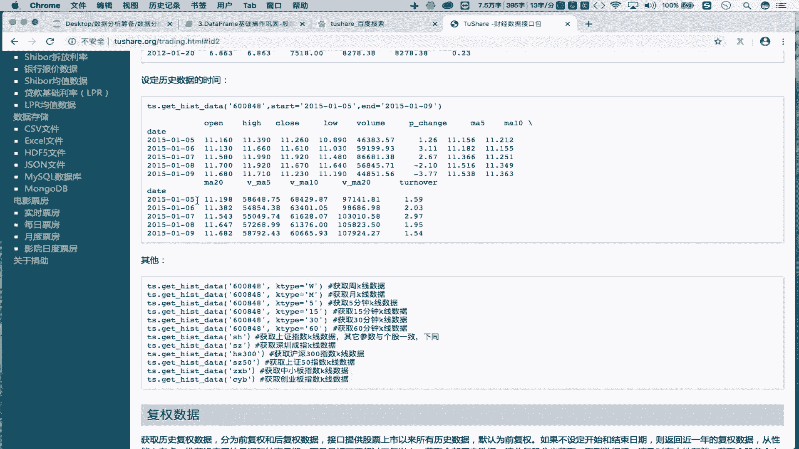

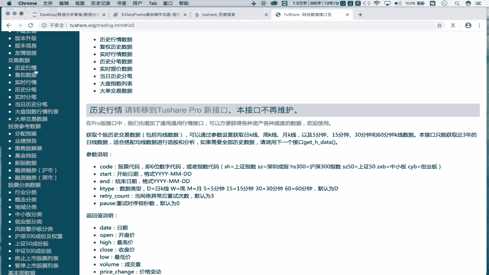

2.  **导入必要模块并获取数据**
    在Python脚本或Jupyter Notebook中，导入模块并获取股票数据（例如，股票代码为`600519`的贵州茅台）。
    ```python
    import tushare as ts
    import pandas as pd
    import numpy as np
    from pandas import DataFrame, Series

    # 获取股票历史数据
    df = ts.get_k_data(code='600519', start='2000-01-01')
    print(df.head())
    ```
    代码说明：
    *   `ts.get_k_data()`: 用于获取股票K线数据。
    *   `code`: 参数为股票代码。
    *   `start`: 参数为开始日期。不指定`end`参数则默认获取到最近一个交易日的数据。

3.  **将数据存储到本地**
    为了避免每次分析都从网络获取数据，我们可以将数据保存到本地的CSV文件中。
    ```python
    # 将DataFrame数据保存为CSV文件
    df.to_csv('maotai.csv')
    ```

## 数据读取与预处理 🧹

数据保存后，我们可以从本地文件读取，并进行清洗和整理，使其更适合分析。

上一节我们完成了数据的获取与存储，本节中我们来看看如何读取并预处理这些数据。

**步骤概述：**
1.  从本地CSV文件读取数据。
2.  删除无用的列。
3.  转换日期列的数据类型。
4.  将日期列设置为行索引。

**具体操作：**

1.  **读取本地数据**
    ```python
    # 从CSV文件读取数据到DataFrame
    df = pd.read_csv('maotai.csv')
    print(df.head())
    ```

2.  **删除无用列**
    读取的CSV文件通常会自动生成一个索引列（`Unnamed: 0`），这列数据对于分析没有意义，可以删除。
    ```python
    # 删除名为 ‘Unnamed: 0’ 的列
    # axis=1 表示操作列，inplace=True 表示直接修改原DataFrame
    df.drop(labels='Unnamed: 0', axis=1, inplace=True)
    print(df.head())
    ```

3.  **查看数据信息与转换日期类型**
    使用`info()`方法查看各列数据类型，会发现`date`列是对象（`object`）类型，即字符串。我们需要将其转换为时间序列类型以便进行时间相关的分析。
    ```python
    # 查看DataFrame的详细信息，包括每列数据类型
    print(df.info())

    # 将‘date’列转换为datetime类型
    df['date'] = pd.to_datetime(df['date'])
    # 再次查看，确认类型已转换
    print(df.info())
    ```

4.  **设置日期为行索引**
    在时间序列分析中，将日期作为行索引是非常方便的做法。
    ```python
    # 将‘date’列设置为行索引
    df.set_index('date', inplace=True)
    print(df.head())
    ```

## 核心操作总结 📝

以下是本案例中涉及的核心DataFrame操作列表：

*   **数据获取与保存**：使用`tushare.get_k_data()`获取数据，使用`DataFrame.to_csv()`保存数据。
*   **数据读取**：使用`pd.read_csv()`从文件读取数据。
*   **列操作**：使用`DataFrame.drop()`删除指定列。
*   **信息查看**：使用`DataFrame.info()`查看数据概况和数据类型。
*   **类型转换**：使用`pd.to_datetime()`将字符串列转换为时间序列。
*   **索引设置**：使用`DataFrame.set_index()`将指定列设置为行索引。

## 课程总结 🎯

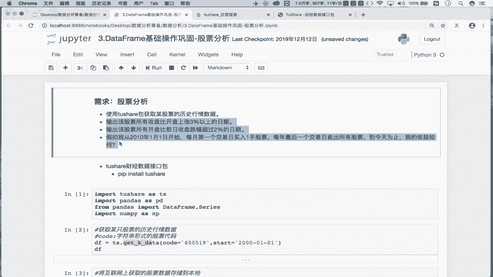

本节课中我们一起学习了股票数据预处理的全过程。我们从安装`tushare`包开始，通过网络获取了真实的股票历史行情数据，并将其保存到本地。接着，我们读取本地数据，并执行了删除冗余列、转换日期数据类型以及设置日期索引等关键预处理步骤。这个过程不仅巩固了DataFrame的基础操作，也展示了金融量化分析中数据准备阶段的典型工作流。预处理后的规整数据，为我们后续进行更深入的策略分析（例如下一节的双均线策略）打下了坚实的基础。