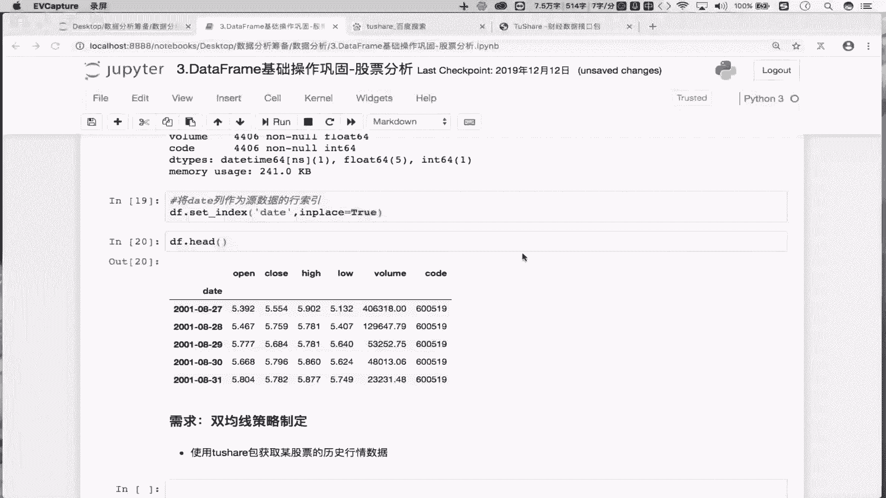
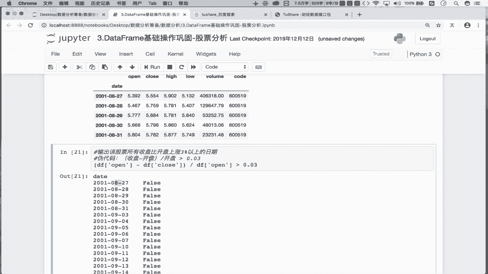
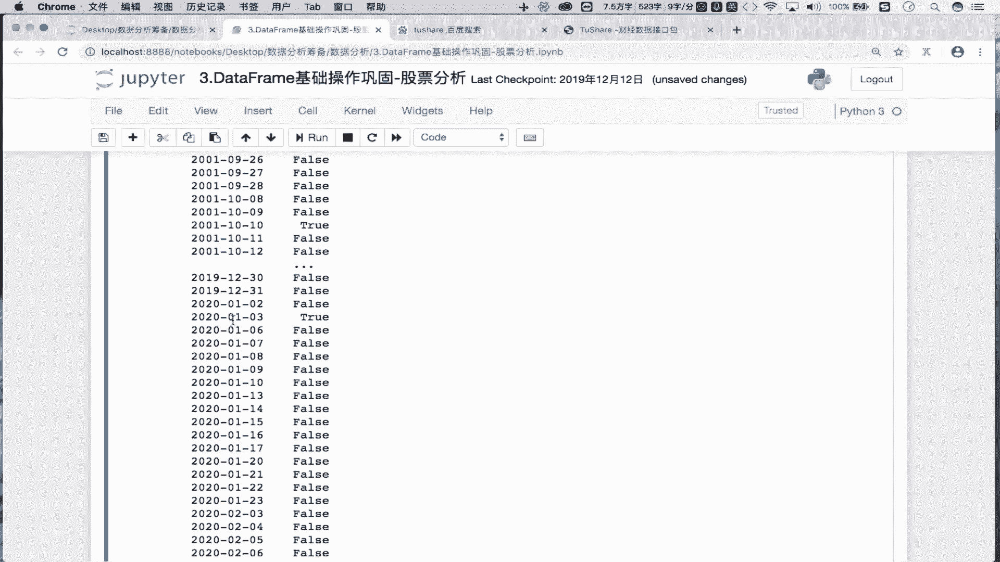
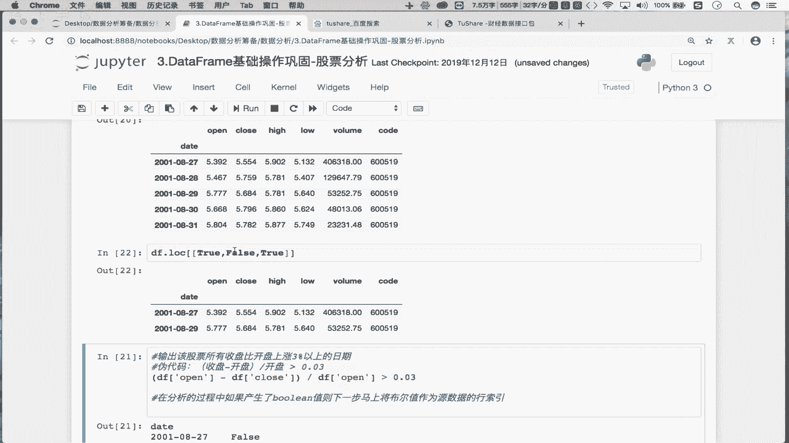
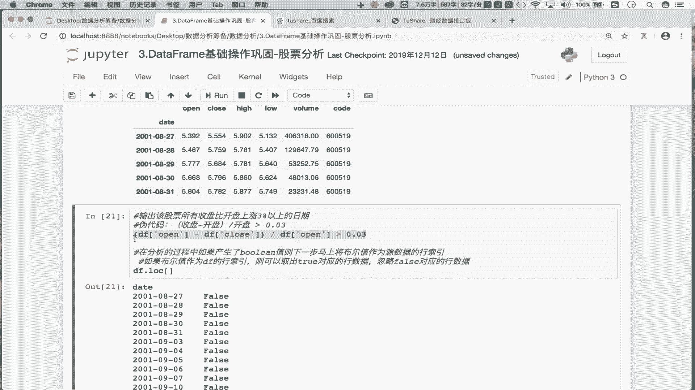
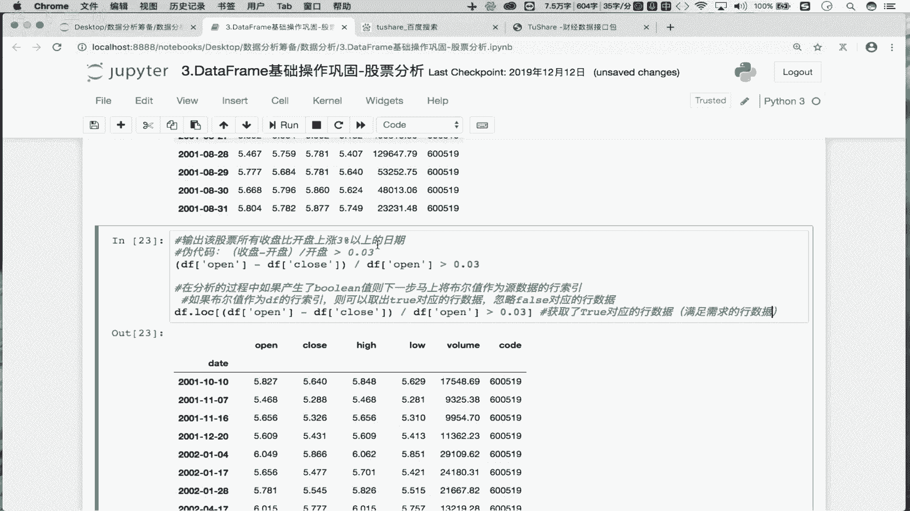
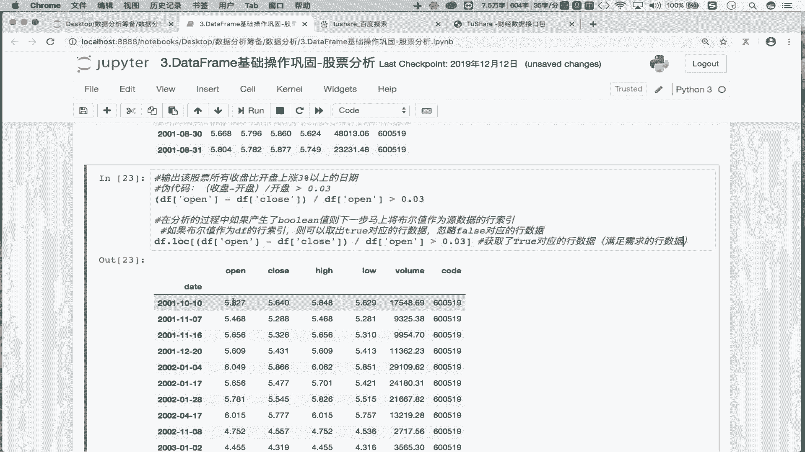
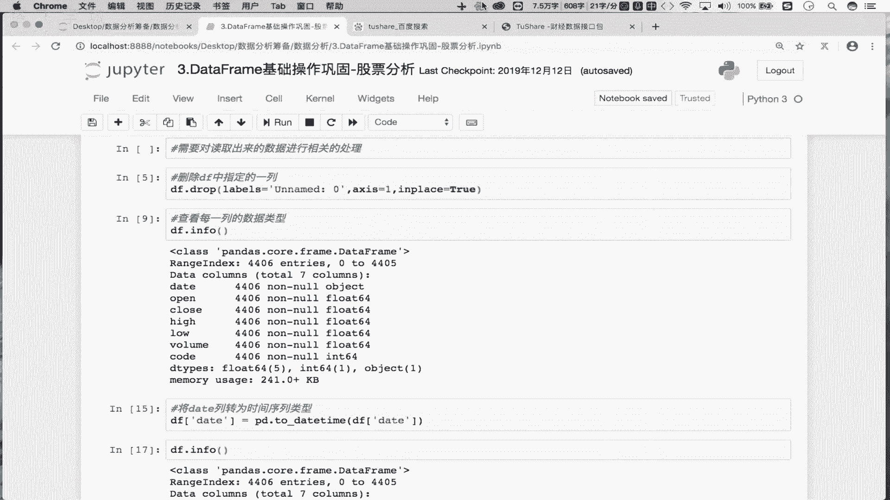

# 数据分析之量化案例：P11：day03-02 捕获股票上涨的日期 📈




在本节课中，我们将学习如何从股票历史交易数据中，找出所有收盘价比开盘价上涨超过3%的日期。我们将使用Pandas库来处理数据，并学习一个利用布尔值筛选数据的核心技巧。


上一节我们介绍了如何对股票历史交易数据进行预处理，包括将日期列转换为时间序列并设置为行索引。本节中我们来看看如何利用处理好的数据，实现一个具体的分析需求。


## 需求分析

我们的目标是找出目标股票（例如茅台）所有“收盘价比开盘价上涨3%”的日期。这类分析有助于我们总结股票的上涨规律，例如发现某些月份上涨概率较高，为未来的投资决策提供参考。


## 核心逻辑与公式


要判断收盘价是否比开盘价上涨超过3%，我们需要计算每日的涨幅百分比，并进行逻辑判断。其核心公式如下：

**公式：** `(收盘价 - 开盘价) / 开盘价 > 0.03`

这个公式计算的是当日涨幅，当结果大于0.03（即3%）时，即满足我们的条件。


## 实现步骤





以下是实现该需求的具体步骤，我们将使用Pandas的Series进行向量化计算。


### 步骤一：计算布尔条件序列

首先，我们从DataFrame `df` 中取出开盘价（`open`）和收盘价（`close`）两列数据，它们都是Pandas Series。然后，根据上述公式进行计算和比较，得到一个布尔值序列。


**代码：**
```python
condition_series = (df[‘close’] - df[‘open’]) / df[‘open’] > 0.03
```
执行这段代码后，`condition_series` 是一个与原始数据行数相同的Series，其中`True`表示该日期满足“上涨超过3%”的条件，`False`则表示不满足。

### 步骤二：利用布尔值筛选数据


我们得到了一个布尔序列，下一步就是利用它来筛选出满足条件的原始数据行。这里我们将应用一个重要的Pandas技巧：




**经验：** 在数据分析中，如果产生了一组布尔值，可以立即将这组布尔值作为原始DataFrame的行索引，来取出`True`对应的行数据。


具体操作是，将布尔序列放入DataFrame的`loc`索引器中。

**代码：**
```python
filtered_df = df.loc[condition_series]
```
执行后，`filtered_df` 是一个新的DataFrame，它只包含了`condition_series`中值为`True`的那些行，即所有上涨超过3%的日子的完整数据。




### 步骤三：提取目标日期



我们的最终目标是日期，而不是整行数据。由于我们在预处理时已将日期设置为行索引（`index`），因此满足条件的日期就是筛选后DataFrame的索引。



**代码：**
```python
result_dates = filtered_df.index
```
这样，`result_dates` 就是我们需要找的所有满足条件的日期列表。


## 关键技巧总结


在本节实现过程中，我们学习并应用了一个关键技巧：
*   **布尔索引**：将布尔序列 `[True, False, True, ...]` 直接作为 `df.loc[]` 的参数，可以高效地筛选出条件为真的行。其原理是Pandas会保留布尔值为`True`位置对应的行，而忽略`False`对应的行。




本节课中我们一起学习了如何从股票数据中筛选特定涨跌幅的日期。我们首先明确了需求的计算公式，然后通过Pandas的向量化计算得到布尔条件序列，最后利用**布尔索引**这一高效技巧，一步到位地筛选出目标数据并提取日期。这个方法在数据分析中非常常用，请务必掌握并勤加练习。