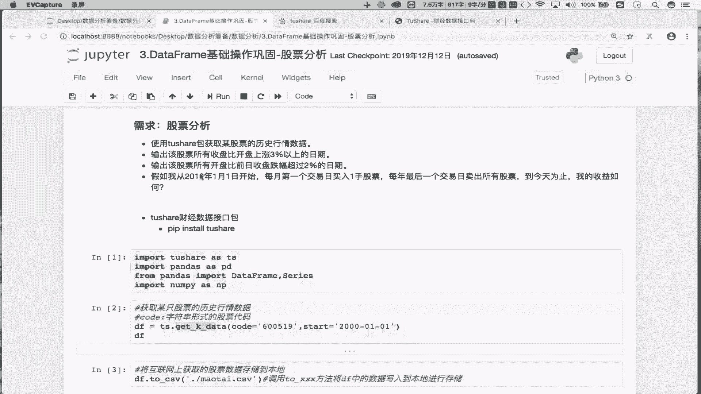
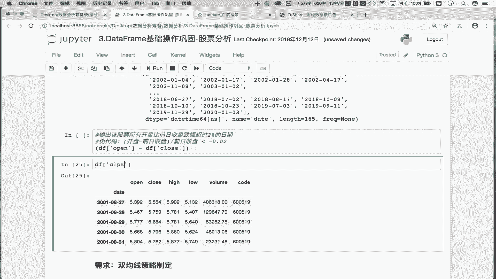
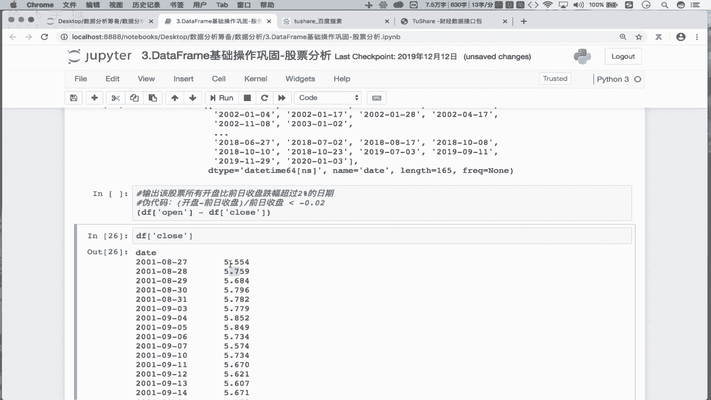
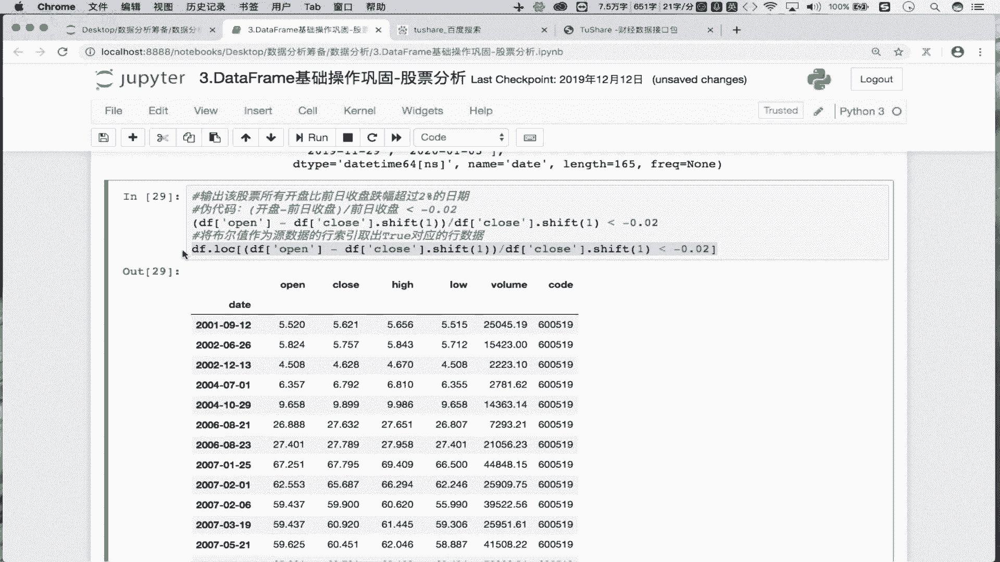
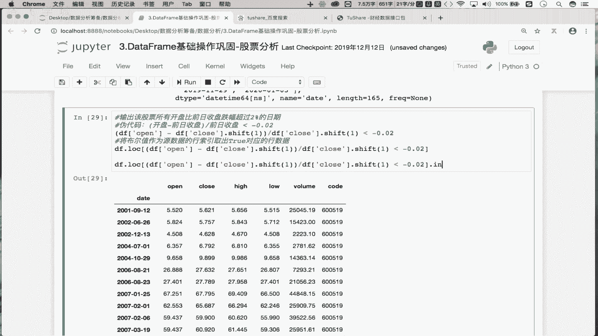
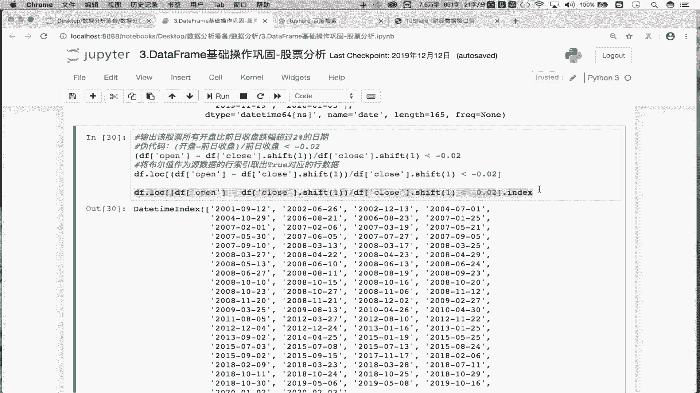
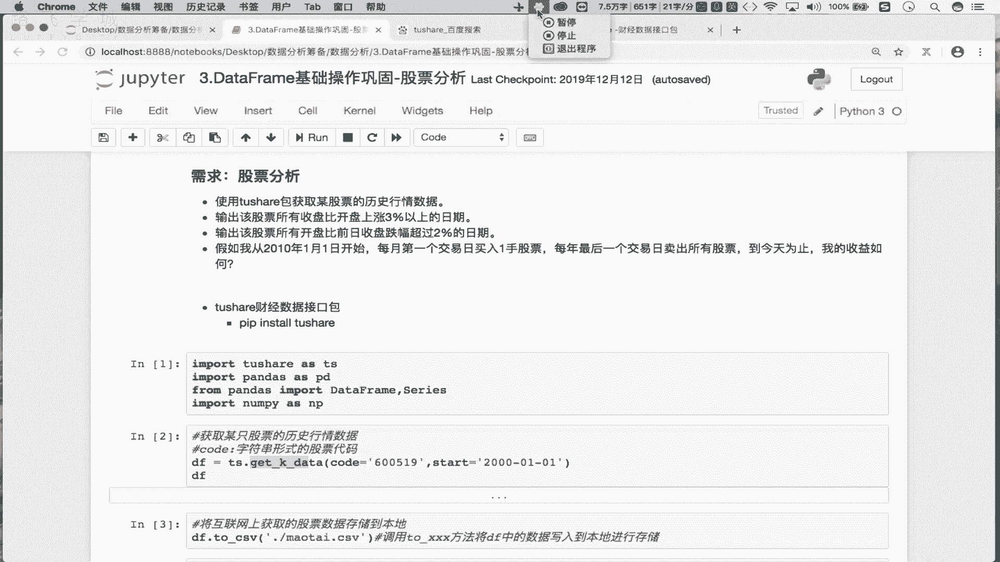

# Python金融量化数据分析：P12：day03-03 捕获股票跌幅的日期 📉



在本节课中，我们将要学习如何利用Python和Pandas库，从股票数据中筛选出开盘价较前一日收盘价跌幅超过2%的日期。这是一个非常实用的量化分析技巧，可以帮助我们快速识别市场中的异常波动。


上一节我们介绍了如何计算股票的涨跌幅，本节中我们来看看如何应用类似逻辑，结合数据移位操作，来捕获特定的价格变动模式。


## 需求分析

我们的目标是：找到目标股票所有“开盘价比前一日收盘价跌幅超过2%”的日期。

理解这个需求的关键在于“前一日收盘价”。例如，对于某一天的开盘价，我们需要与之比较的是**上一个交易日**的收盘价，而不是当天的收盘价。

## 核心思路与伪代码

要实现这个需求，我们可以分解为以下步骤：


1.  **计算前一日收盘价序列**：将收盘价序列整体向下移动一位，这样每个位置上的值就变成了前一日的收盘价。
2.  **计算涨跌幅**：使用公式 `(当日开盘价 - 前一日收盘价) / 前一日收盘价`。
3.  **筛选条件**：判断上述计算结果是否 `小于 -0.02`（即跌幅超过2%）。
4.  **提取日期**：将满足条件的布尔索引应用于原始数据，并提取对应的日期。


用伪代码表示核心判断逻辑如下：
```
(open - close.shift(1)) / close.shift(1) < -0.02
```

## 分步代码实现

以下是实现该需求的详细步骤和代码。

首先，我们需要获取“前一日收盘价”。在Pandas中，可以使用 `.shift(1)` 方法将 `close` 序列整体下移一行。

```python
# 假设 df 是包含 ‘open‘, ‘close‘ 列的DataFrame
pre_close = df[‘close‘].shift(1)
```

接下来，我们计算开盘价相对于前一日收盘价的涨跌幅。



```python
price_change_pct = (df[‘open‘] - pre_close) / pre_close
```



然后，我们根据跌幅超过2%的条件创建一个布尔序列。


```python
condition = price_change_pct < -0.02
```


这个布尔序列中，`True` 值对应的行就是满足我们需求的数据行。我们可以用它来索引原始DataFrame。

```python
result_df = df.loc[condition]
```


最后，我们只需要提取这些行的索引（通常是日期），即可得到跌幅超过2%的日期列表。


```python
drop_dates = result_df.index
```

## 代码整合与优化


上述分步过程可以整合为一行简洁的代码，其逻辑完全等价：



```python
drop_dates = df.loc[(df[‘open‘] - df[‘close‘].shift(1)) / df[‘close‘].shift(1) < -0.02].index
```



这行代码依次执行了：
1.  `df[‘close‘].shift(1)`：计算前一日收盘价。
2.  `(df[‘open‘] - df[‘close‘].shift(1)) / df[‘close‘].shift(1)`：计算开盘价相对于前一日收盘价的涨跌幅。
3.  `... < -0.02`：生成布尔掩码，标记跌幅超过2%的行。
4.  `df.loc[...]`：用布尔掩码筛选出符合条件的行数据。
5.  `.index`：从筛选结果中提取日期索引。

对于初学者，建议从分步编写开始，理解每一步的结果，再尝试写成一行。这有助于清晰地理解整个数据流和处理逻辑。



## 总结


本节课中我们一起学习了如何捕获股票跌幅超过特定阈值的日期。我们掌握了两个关键技能：
1.  使用 `.shift()` 方法获取时间序列的前期数据，这是处理此类“与前一期比较”问题的核心。
2.  利用布尔索引高效地筛选DataFrame中满足复杂条件的数据行，并提取所需信息。



通过这个案例，你将能够举一反三，实现诸如“涨幅超过X%”、“收盘价突破N日均线”等各种常见的量化筛选需求。