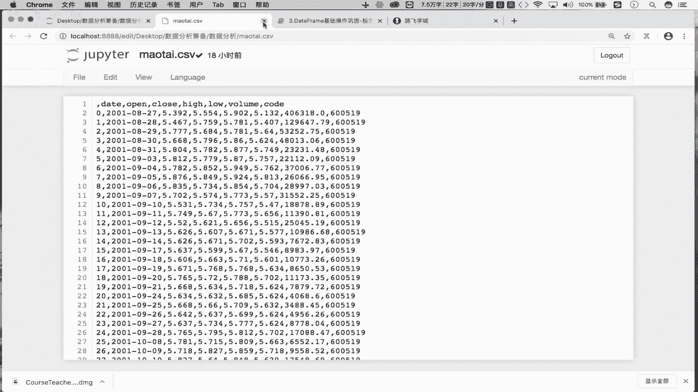
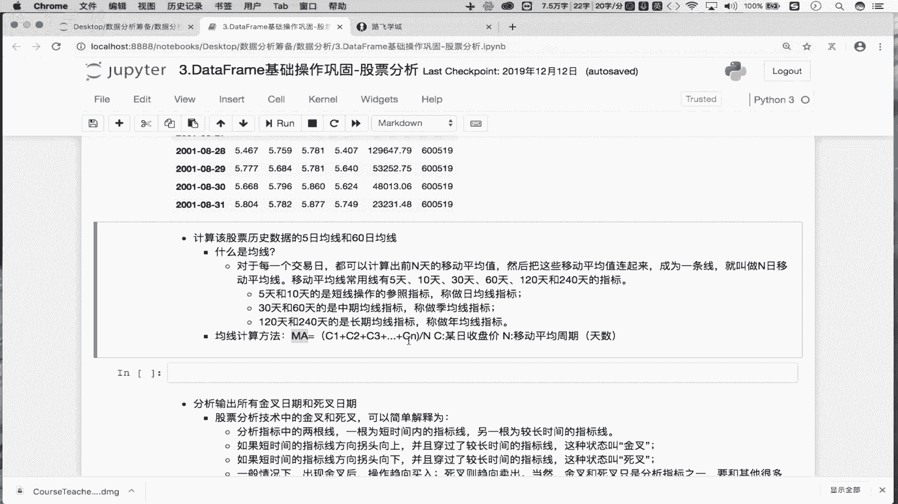
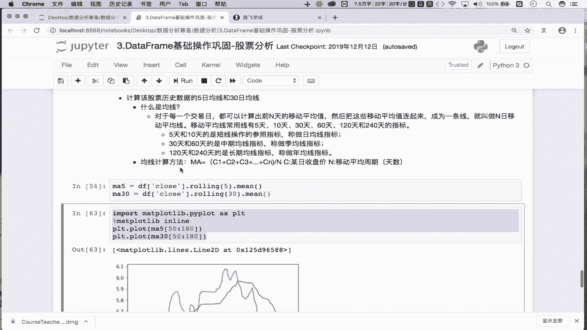

# 数据分析之量化案例：P14：Day04-1. 双均线策略-均线的计算分析 📈


在本节课中，我们将学习金融量化分析中的双均线策略。我们将从获取股票历史数据开始，逐步计算并理解5日和30日移动平均线（均线）的概念与计算方法。

## 数据获取与处理

上一节我们介绍了量化分析的基本流程。本节中，我们首先需要获取并准备用于分析的历史股票数据。

使用 `pandas` 库读取本地存储的股票历史行情数据文件。

```python
import pandas as pd

# 读取CSV文件中的数据
df = pd.read_csv('./茅台.csv')
```


读取的数据中包含一个无用的索引列，需要将其删除。



```python
# 删除名为 ‘Unnamed: 0’ 的无用列
df = df.drop(labels='Unnamed: 0', axis=1)
```

接下来，将数据中的日期列转换为时间序列格式，并设置为数据框的行索引，以便进行时间序列分析。

```python
# 将‘date’列转换为时间序列格式
df['date'] = pd.to_datetime(df['date'])
# 将‘date’列设置为行索引
df.set_index('date', inplace=True)
```

至此，我们已经完成了数据的读取和基本处理，数据框 `df` 的行索引现在是时间序列，包含了股票的历史行情数据。

## 均线概念与计算



数据准备就绪后，我们进入核心环节：计算移动平均线。首先，我们来理解什么是均线。

在股票分析中，对于每一个交易日，都可以计算出前N天收盘价的移动平均值。将这些移动平均值连接起来形成的线，就称为N日移动平均线，简称均线。常用的均线有5日、10日、30日、60日等。其中，5日和10日均线被视为短期均线。

均线的计算公式如下：
**MA = (C1 + C2 + C3 + ... + CN) / N**
其中，`MA` 代表移动平均值，`C1` 到 `CN` 代表连续N个交易日的收盘价。

为了更直观地理解，假设有连续8天的收盘价。计算5日均线时，首先计算第1到第5天收盘价的平均值（记为X1），然后计算第2到第6天收盘价的平均值（X2），接着是第3到第7天（X3），最后是第4到第8天（X4）。将X1, X2, X3, X4这四个点连接起来，就得到了5日均线。


下面，我们基于准备好的数据来计算5日和30日移动平均线。

以下是计算步骤：
首先，从数据框中提取收盘价序列，然后使用 `rolling` 函数配合 `mean` 方法来计算移动平均值。

```python
# 计算5日移动平均线（MA5）
ma5 = df['close'].rolling(5).mean()
# 计算30日移动平均线（MA30）
ma30 = df['close'].rolling(30).mean()
```

在 `ma5` 序列中，前4个值为 `NaN`，因为至少需要5个数据点才能计算第一个5日均值。从第5个值开始，才是有效的移动平均值。`ma30` 同理，前29个值为 `NaN`。这些移动平均值的序列，就是构成均线的点。

## 均线可视化

计算出移动平均值后，我们可以将其可视化，以观察均线的形态和交叉情况。这里我们使用 `matplotlib` 库进行简单的绘图。

```python
import matplotlib.pyplot as plt
# 确保图表在Notebook内显示
%matplotlib inline

# 绘制5日均线
plt.plot(ma5[50:80], label='MA5')
# 绘制30日均线
plt.plot(ma30[50:80], label='MA30')
plt.legend() # 显示图例
plt.show()
```

通过图表，我们可以清晰地看到5日均线和30日均线的走势。短期均线（MA5）波动更为频繁，而长期均线（MA30）则相对平滑。两条线的交叉点通常是技术分析中关注的重要信号。

## 总结



本节课中我们一起学习了双均线策略的基础部分——均线的计算与分析。我们首先获取并处理了股票历史数据，然后详细解释了移动平均线的概念，并使用 `pandas` 的 `rolling` 方法计算出了5日和30日移动平均线。最后，我们通过可视化初步观察了均线的形态。理解并计算均线是构建和验证双均线交易策略的第一步。在接下来的课程中，我们将基于这些均线来制定具体的交易信号。