# 数据分析之量化案例：P15：双均线策略-金叉&死叉 📈

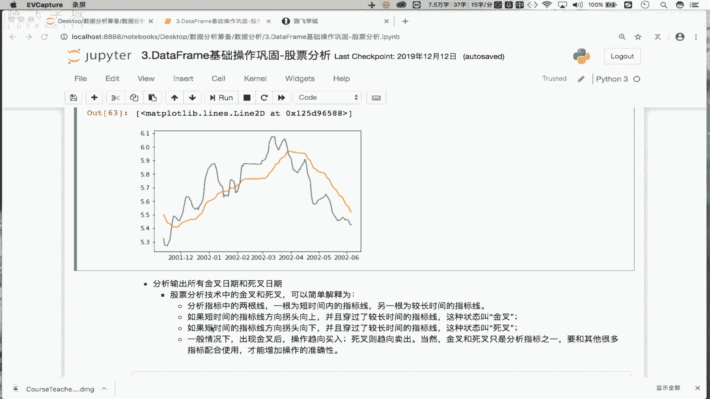

在本节课中，我们将要学习双均线策略中的核心概念：金叉与死叉。我们将通过分析短期均线（MA5）与长期均线（MA30）的关系，来识别股票买卖的关键信号点，并最终通过Python代码找出所有金叉和死叉发生的具体日期。

## 核心概念：金叉与死叉


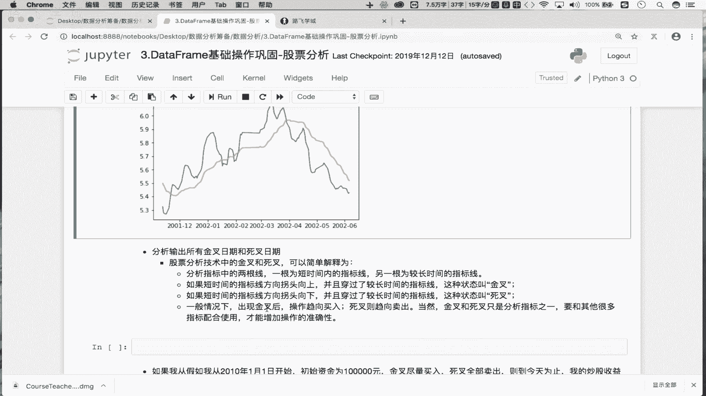


上一节我们介绍了如何计算并绘制移动平均线。本节中我们来看看如何利用这两条均线生成交易信号。

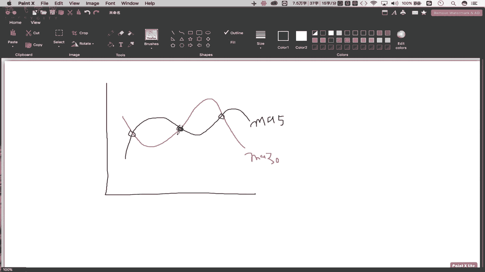

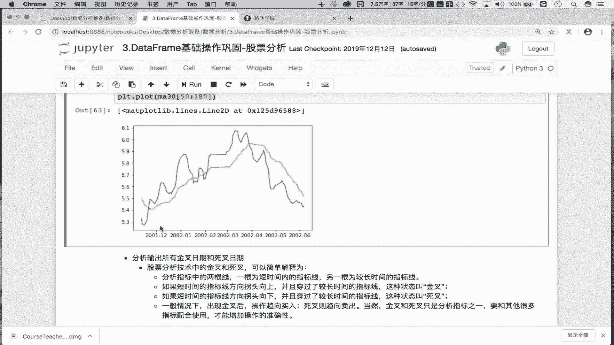

在股票技术分析中，金叉和死叉是双均线策略的核心。它们描述的是短期均线与长期均线交叉时的状态。
*   **金叉**：指短期均线（如MA5）由下方向上穿过长期均线（如MA30）。这通常被视为一个**买入信号**。
*   **死叉**：指短期均线由上方向下穿过长期均线。这通常被视为一个**卖出信号**。

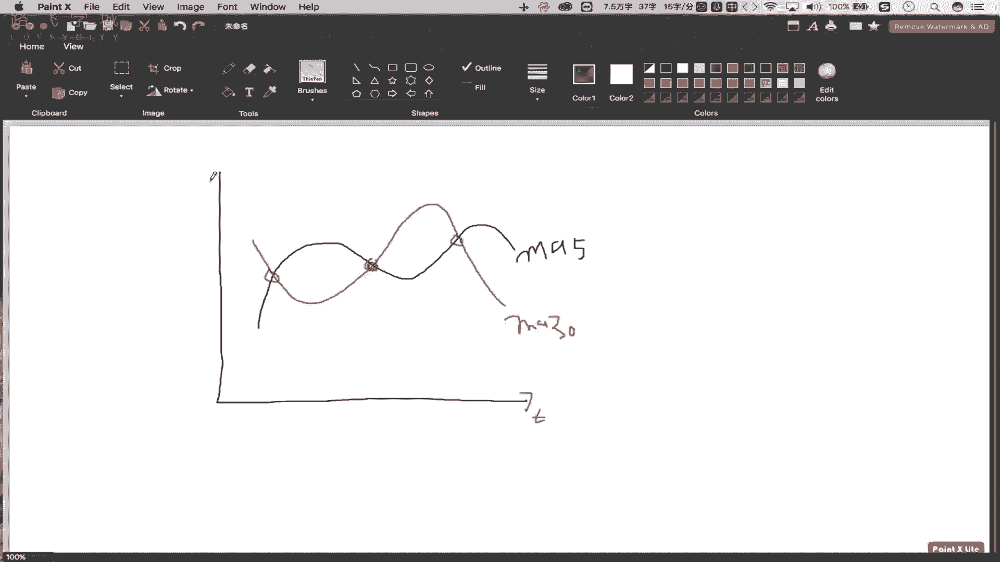


我们可以通过一个简单的坐标系来理解：
*   **X轴**：表示时间（T）。
*   **Y轴**：表示计算出的移动平均值。
*   当代表MA5的曲线从下方（MA5 < MA30）上穿至上方（MA5 > MA30）时，交叉点附近即为**金叉**。
*   当代表MA5的曲线从上方（MA5 > MA30）下穿至下方（MA5 < MA30）时，交叉点附近即为**死叉**。

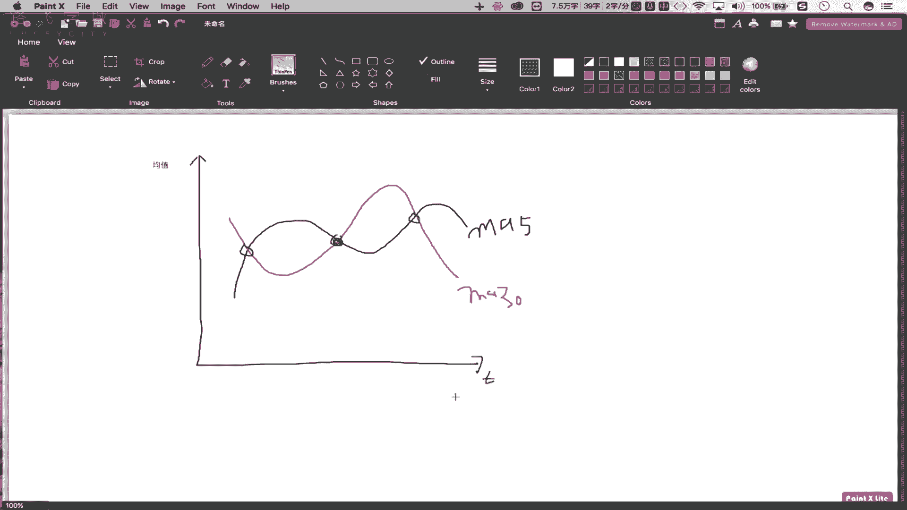

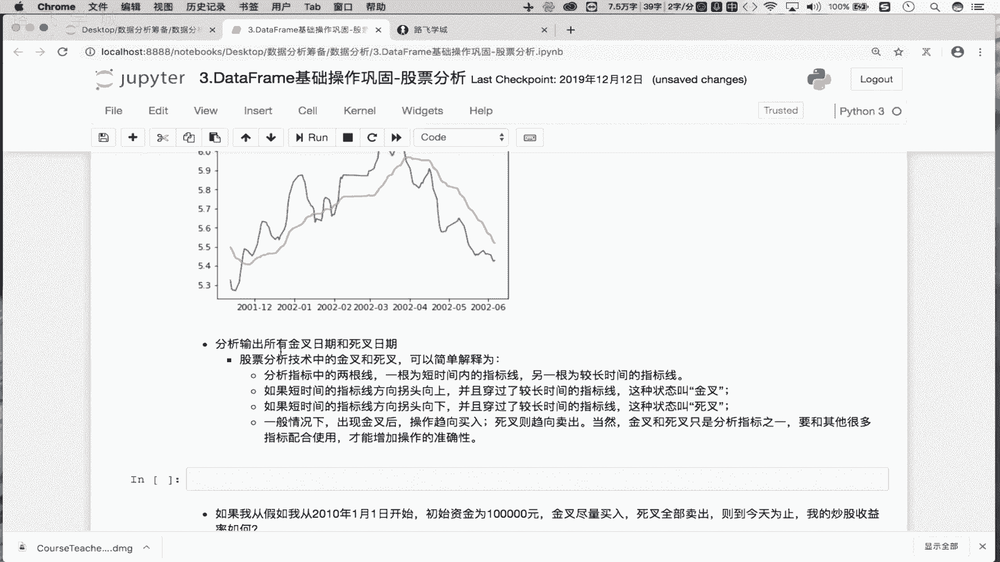

我们的目标就是通过程序，自动找出这些交叉点所对应的日期。

## 寻找交叉点的逻辑分析

要找到金叉和死叉的日期，本质上是找到MA5与MA30大小关系发生变化的转折点。

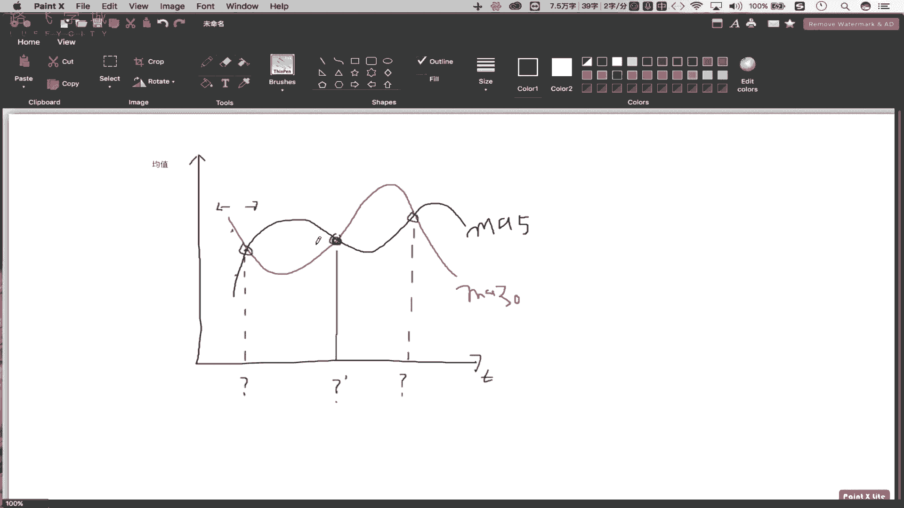

观察交叉点前后的规律：
*   在**金叉点**左侧，`MA5 < MA30`；在其右侧，`MA5 > MA30`。转折点处满足 `MA5 == MA30`。
*   在**死叉点**左侧，`MA5 > MA30`；在其右侧，`MA5 < MA30`。转折点处同样满足 `MA5 == MA30`。

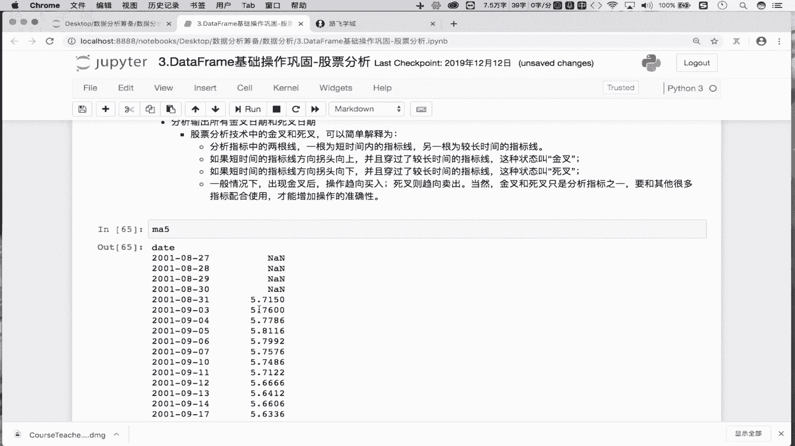


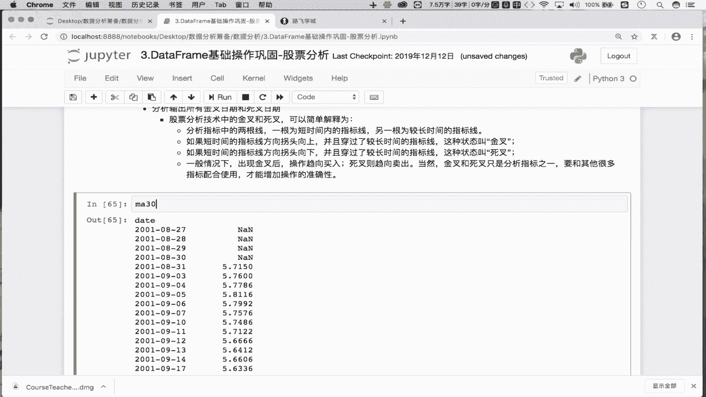

因此，我们可以通过比较`MA5`和`MA30`这两个序列（Series）的大小关系，并寻找其布尔值（True/False）发生变化的点位，来定位金叉和死叉。


以下是实现这一逻辑的关键步骤：

首先，我们需要确保用于比较的两个数据序列长度和索引一致。由于移动平均计算会产生空值（NaN），我们先进行切片处理。

```python
# 统一数据起始点，从第30个数据开始（保证MA30没有空值）
ma5 = df[‘MA5’][30:]
ma30 = df[‘MA30’][30:]
df = df[30:] # 原数据也同步切片
```

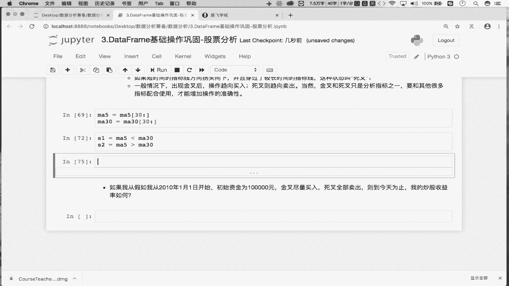

接着，我们创建两个布尔序列，分别代表`MA5 < MA30`和`MA5 > MA30`的条件。

```python
# 条件序列：MA5 < MA30
s1 = ma5 < ma30
# 条件序列：MA5 > MA30 (即 s1 的相反情况)
s2 = ma5 > ma30
```


序列`s1`中的`True`表示`MA5 < MA30`，`False`表示`MA5 > MA30`。金叉和死叉就隐藏在`s1`值从`True`变`False`或从`False`变`True`的过渡点上。
*   `s1`值从 **True 过渡到 False** 的位置对应 **金叉**。
*   `s1`值从 **False 过渡到 True** 的位置对应 **死叉**。

## 定位金叉与死叉的算法

我们不能手动在几千个布尔值中寻找变化点，需要用算法实现。这里利用**移位（shift）**和**逻辑运算**来捕捉这种变化。

**寻找死叉日期：**
死叉对应`s1`从`False`过渡到`True`。我们可以通过`s1 & (s2.shift(1))`这个条件来捕捉。
`s2.shift(1)`表示将`s2`序列整体向下移动一位。这样，当`s1`当前为`True`且前一位的`s2`为`True`（即前一位`MA5 > MA30`）时，逻辑与的结果为`True`，正好标识了“前`MA5 > MA30`，今`MA5 < MA30`”的死叉点。


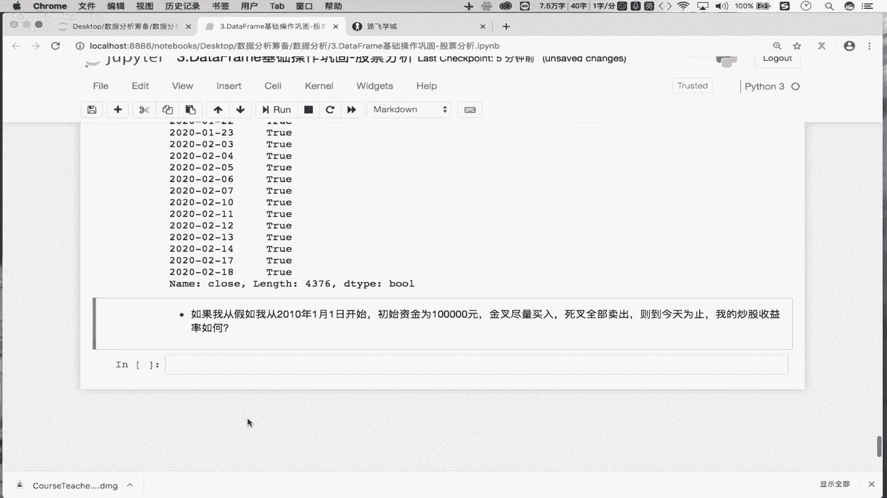

```python
# 判定死叉的条件
death_cross_condition = s1 & s2.shift(1)
# 获取死叉对应的行数据，其索引即为日期
death_dates = df.loc[death_cross_condition].index
```

**寻找金叉日期：**
金叉对应`s1`从`True`过渡到`False`。我们可以通过`~(s1 | s2.shift(1))`这个条件来捕捉。
`s1 | s2.shift(1)`会标识出“前`MA5 > MA30`或今`MA5 < MA30`”的位置。对这个结果取反（`~`），得到`True`的位置就是“前`MA5 < MA30`且今`MA5 > MA30`”的金叉点。

```python
# 判定金叉的条件
golden_cross_condition = ~(s1 | s2.shift(1))
# 获取金叉对应的行数据，其索引即为日期
golden_dates = df.loc[golden_cross_condition].index
```

## 代码实现与结果

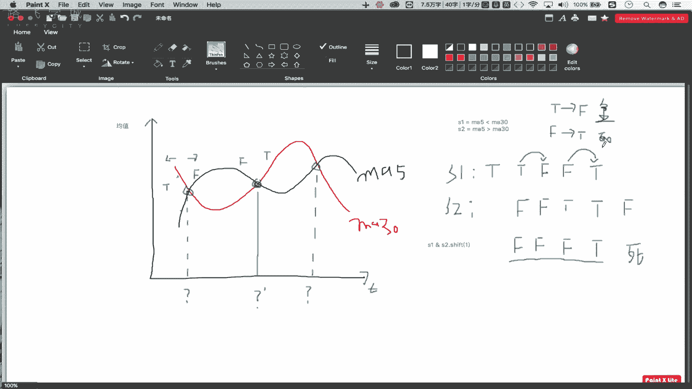

将以上步骤整合，即可得到完整的代码，用于输出所有金叉和死叉的日期。

```python
# 1. 数据准备：切片以保证数据对齐
ma5 = df[‘MA5’][30:]
ma30 = df[‘MA30’][30:]
df = df[30:]

# 2. 创建布尔条件序列
s1 = ma5 < ma30  # MA5 < MA30
s2 = ma5 > ma30  # MA5 > MA30

# 3. 计算死叉日期
death_condition = s1 & s2.shift(1)
death_dates = df.loc[death_condition].index
print(“死叉日期：”)
print(death_dates)

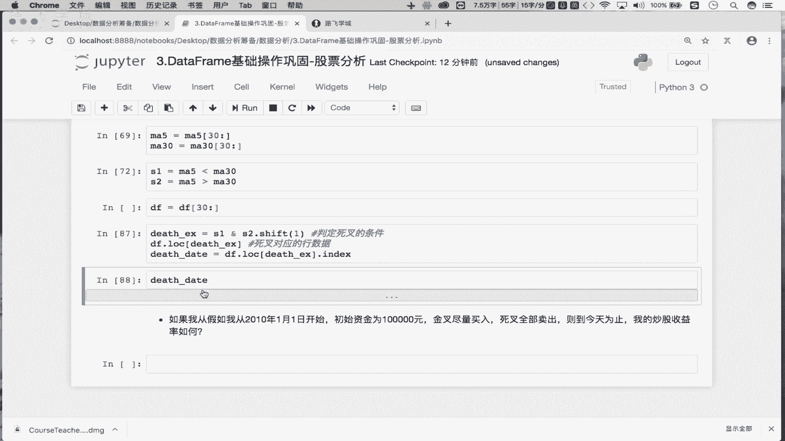

# 4. 计算金叉日期
golden_condition = ~(s1 | s2.shift(1))
golden_dates = df.loc[golden_condition].index
print(“\n金叉日期：”)
print(golden_dates)
```

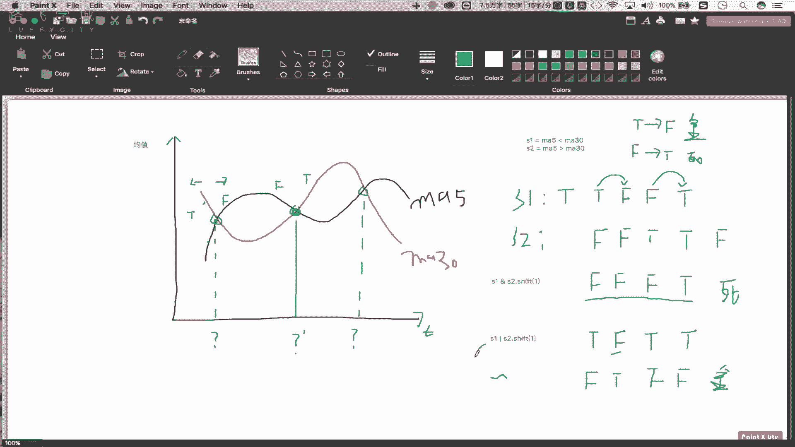

运行这段代码，程序就会打印出在历史数据中识别出的所有金叉和死叉的发生日期。

## 总结 🎯

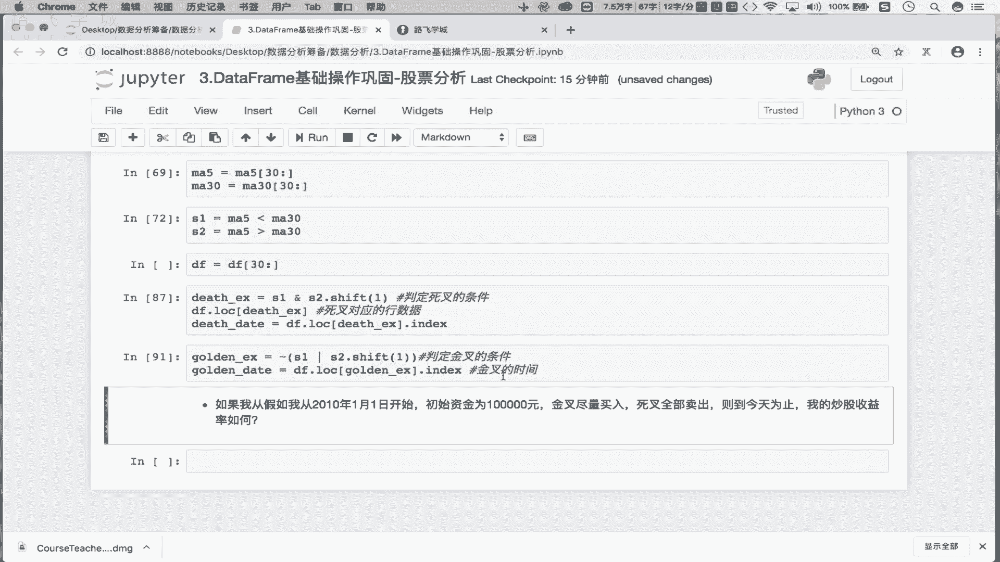

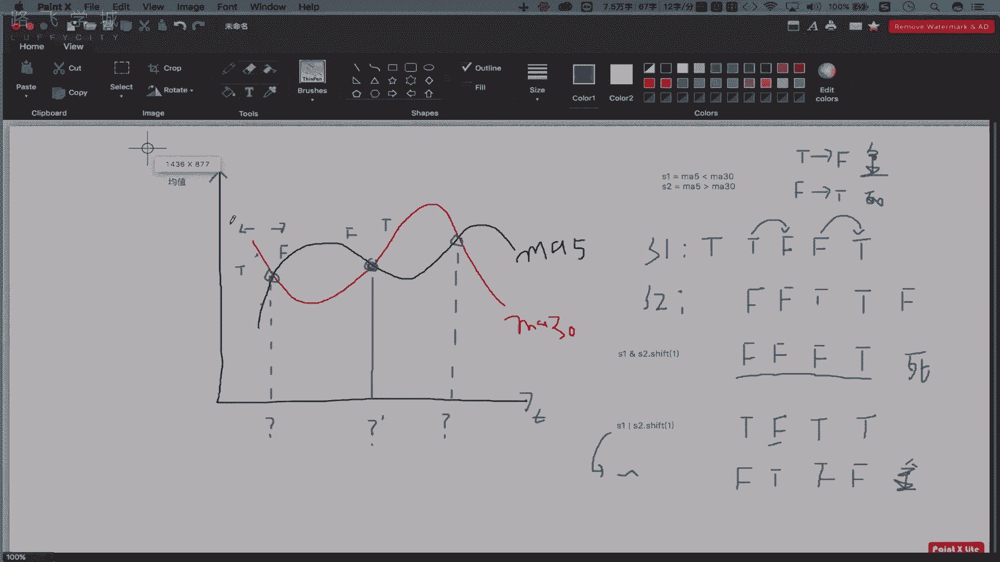

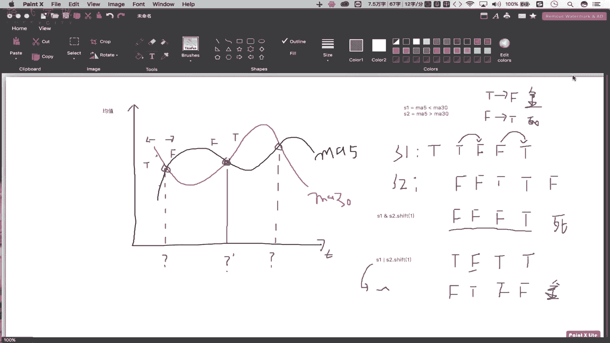

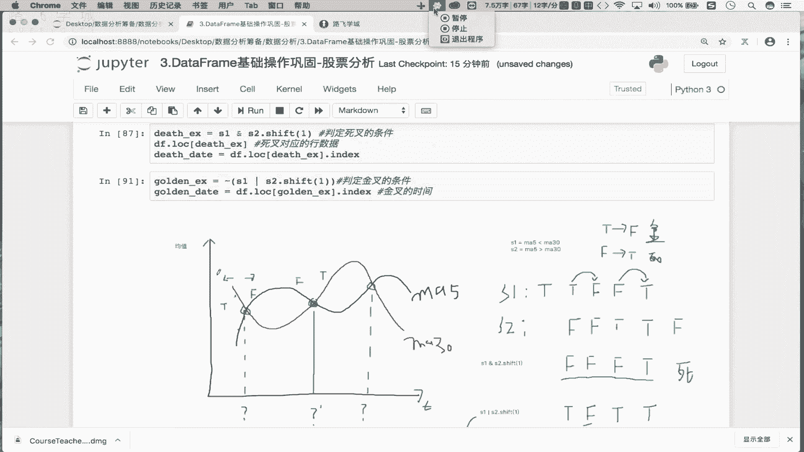

本节课中我们一起学习了双均线策略的关键环节。我们首先明确了**金叉**（买入信号）和**死叉**（卖出信号）的定义。然后，通过分析均线交叉前后`MA5`与`MA30`的大小关系变化，推导出利用布尔序列和移位操作来定位这些交叉点的算法。最后，我们使用`df.loc[condition]`结合`.index`的方法，提取出了具体的交叉日期。掌握这一方法，就为后续基于双均线策略进行回测和模拟交易打下了坚实的基础。